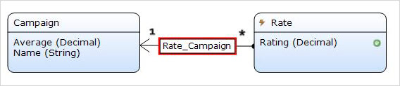

## 1 Introduction

The [Star Rating](https://appstore.home.mendix.com/link/app/54611/) widget enables rating an object with stars or custom icons.

### 1.1 Features

* Rate an object with stars
* Display average rating
* Display rating in whole and half stars
* Execute a microflow when the rate is changed
* Configurable star colors
* Flexible number of stars
* Support for mobile touch events

## 2 Configuration

### 2.1 Customizing the Rating Icon

In order to overwrite the default star icon, add these classes to your project theme and replace the content with your preferred glyphicon:

```
 .rating-flag [class*="widget-star-rating-full"]:before {
  content: "\e034"; /* flag icon */ 
 }
.rating-flag .widget-star-rating-empty:before {
  content: "\e034"; /* flag icon */
 }
```
The `rating-flag` class should be added to the widget configuration on the **Common** tab.

### 2.2 Configuring the Security

Security is a mandatory feature for ratings. This is an example configuration:



For the **Campaign** entity access rules, a **User** should only be able to read the average attribute:


For the **Rate** entity access rules, the **User** should be able to only write their own rating:


When creating a new rating, its important to use the current user's previous rating as the initial rate value. Use the [Rate Me](https://modelshare.mendix.com/models/d7ece331-49d4-4464-a2e2-ea75528a0367/rate-me) microflow for the custom rate-me button.

The calculation of the average rate is done by adding a [Calculate Average Rate](https://modelshare.mendix.com/models/d27114b6-e2fb-4d79-aa39-8c60a6477ca8/calculate-average-rate) microflow to the after-commit and after-delete event handlers in the domain model.

## 3 Developing This App Store Component

To contribute to the development of this widget, follow these steps:

1. Install the following:
	* [Git](https://git-scm.com/book/en/v2/Getting-Started-Installing-Git)
	* [npm](https://www.npmjs.com/)
	* [webpack-cli](https://www.npmjs.com/package/webpack-cli)
	* [grunt-cli](https://github.com/gruntjs/grunt-cli)
	* [karma-cli](https://www.npmjs.com/package/karma-cli)
2. Fork and clone the [mendixlabs/star-rating]( https://github.com/mendixlabs/star-rating) repository. The code is in Typescript.
3. Set up the development environment by running `npm install`.
4. Create a folder named *dist* in the project root.
5. Create a Mendix test project in the *dist* folder and rename its root folder to *dist/MxTestProject*, or get the test project from [mendixlabs/star-rating](https://github.com/mendixlabs/star-rating/releases/latest). Changes to the widget code will be automatically pushed to this test project.
6. To automatically compile, bundle, and push code changes to the running test project, run `grunt`.
7. To run the project unit tests with code coverage (results can be found at `dist/testresults/coverage/index.html`), run: `npm test`.
8. Run the unit test continuously during development via `karma start`.

We are actively maintaining this widget. Please report any issues or suggestions for improvement at [mendixlabs/star-rating](https://github.com/mendixlabs/star-rating/issues).
