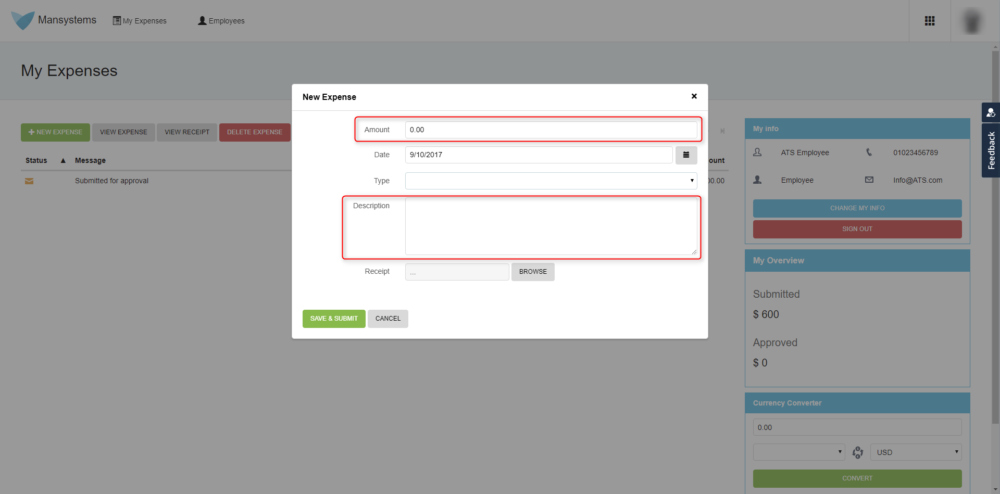
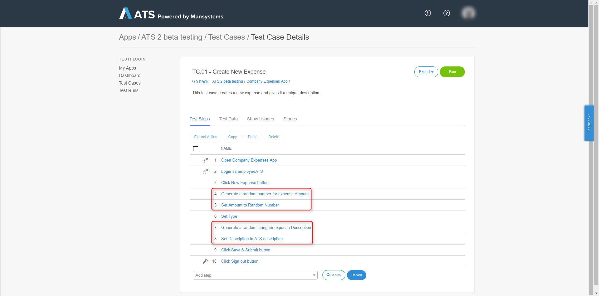
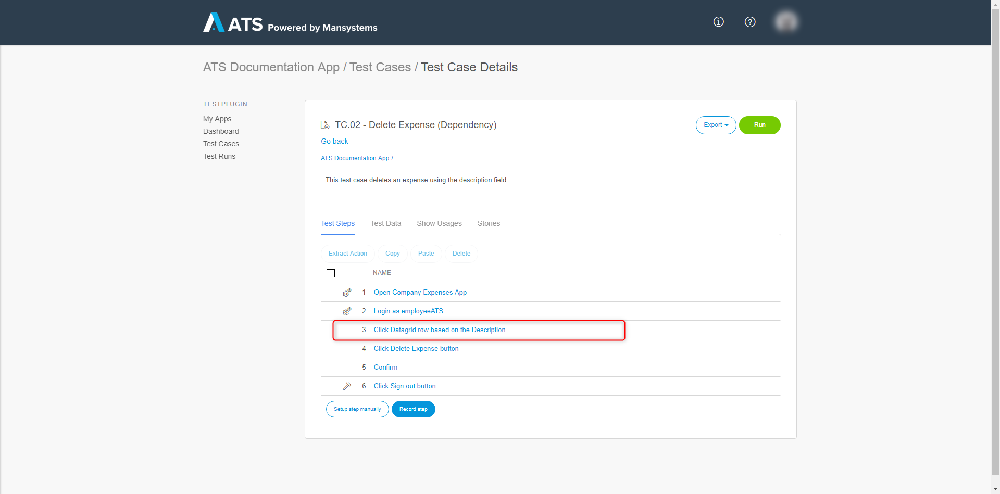
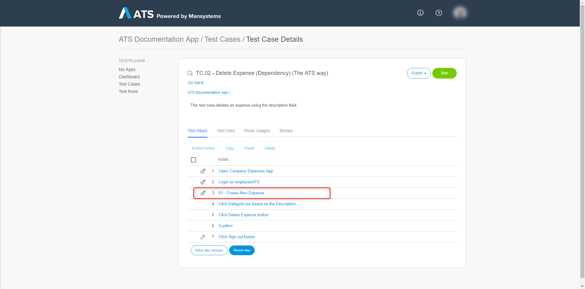
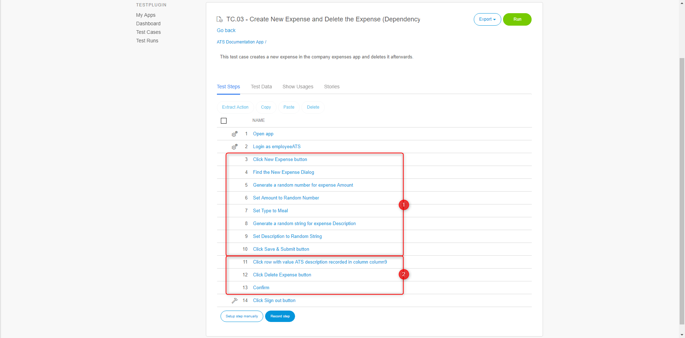
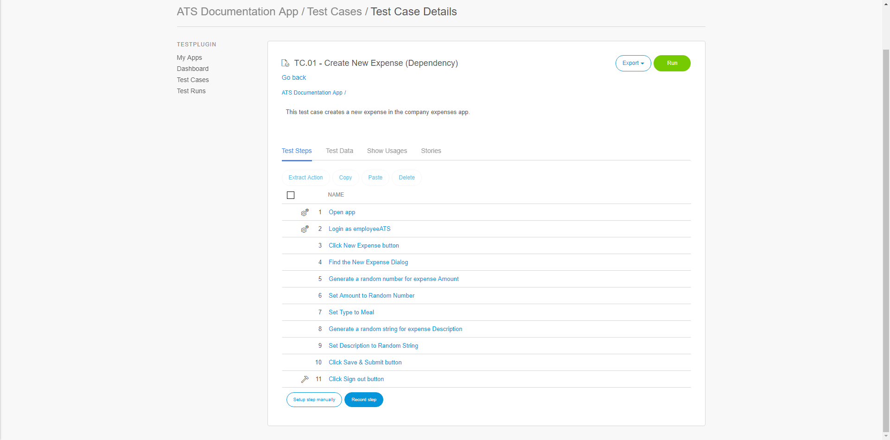
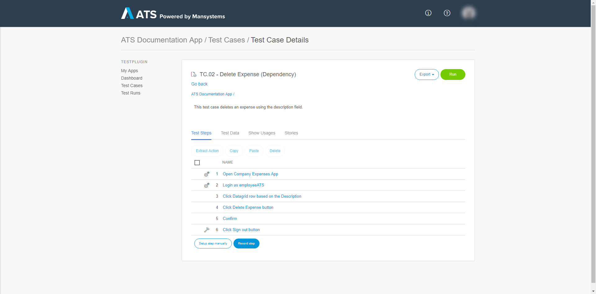
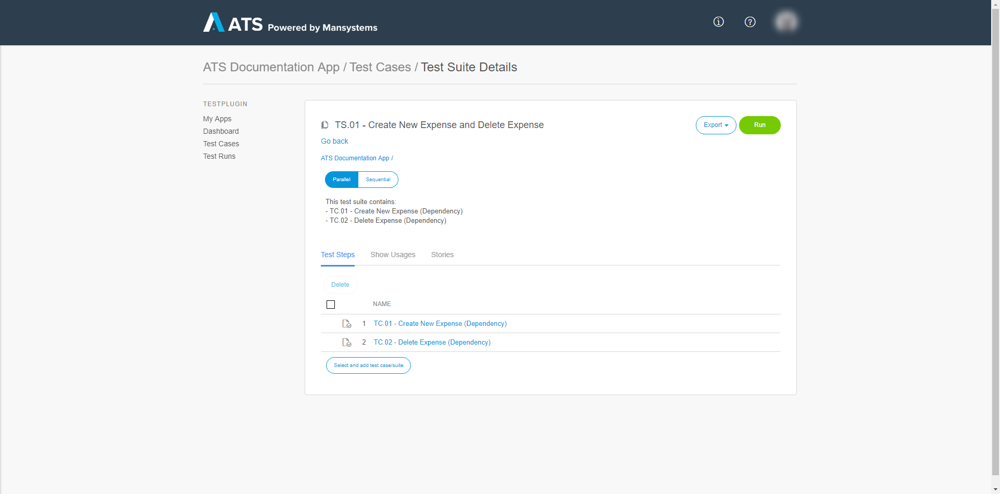
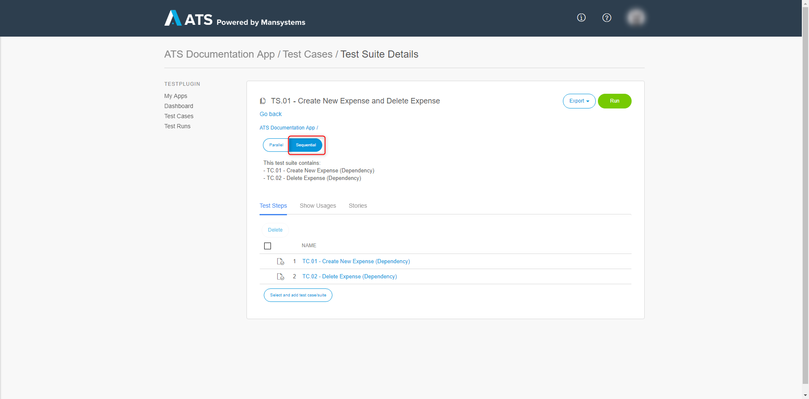

This document describes what a test case dependency is  and explains the best way of handling test case dependencies within ATS.

## 1 What Is a Test Case Dependency?

A test case dependency exists in a situation where the behavior or outcome of one test case depends on the preceding execution or result of another test case.

Here are two examples to explain the definition. 

### 1.1 Example 1

You have a test case that creates a new expense in the company expenses app. It creates the new expense using a random number in the **Amount** field and a random string for the **Description** field. 

These are the fields in the app:

This is the **TC.01 - Create New Expense** screen:

The test case creates a new expense with values that you don't know upfront. ATS does not allow for the sharing of values between test cases, meaning, it does not allow for any dependencies between test cases. 

You have another test case that deletes an expense using the description of that expense. 

This is the **TC.02 - Delete Expense** screen:

As you see, TC.02 - Delete Expense cannot delete the expense from TC.01 - Create New Expense, because the description is a randomly generated value.

### 1.2 Example 2

To get to a functionality, you have to walk through four different pages. This is also a test case dependency, caused by the GUI. 

## 2 Why You Must Not Use Test Case Dependencies

This chapter explains why you must not use dependencies between test cases by defining the impact on your tests. The criteria for a good test case is used. The first example of the first chapter is used, in which there are the TC.01 - Create New Expense and TC.02 - Delete Expense test cases, but TC.02 can only be executed after TC.01.

| Aspect       | Consequence of Having Dependencies |
| :----------- | :--------------------------------- |
| Availability | * If TC.01 is broken or in maintenance, TC.02 is not available.  * You also have to run TC.01 first. |
| Speed        | * TC.02 can only run after TC.01 has finished.  * TC.01 and TC.02 cannot run parallel. |
| Reliability  | * If TC.01 is unreliable, then TC.02 is also unreliable.   * If you change TC.01, this may affect TC.02. |
| Precision,   Understandability,   Analyzability,   Lack of ambiguity | * If TC.02 fails, you must test TC.01 and TC.02 for bugs.  * If TC.02 fails, the problem may be in TC.01 or TC.02. |

As you see, this does not line up with testing standards; therefore, you must not use it. For this same reason, ATS does not allow data sharing between test cases. In the next section, different options are explained.

## 3 Handling Test Case Dependencies

### 3.1 Course of Action

The previous section explains the reasons for not using test case dependencies. You must only accept a dependency if you have a very good reason. When it comes to test case dependencies, follow these steps.

1. Try to avoid them.
2. Try to get rid of them.
3. Minimize them.
4. Manage them.

### 3.2 How to Deal with Test Case Dependencies

Assuming you want to test a function that depends on a previous execution, like in the TC.01 and TC.02 example, you have three options. The first two options also cover data dependency.

The TC.01 and TC.02 example is used to explain the options.

1. Option 1 is the preferred choice.
2. Option 2 only applies if you have a very long setup routine and the scenarios to test are simple.
3. You must only use option 3 if 1 and 2 are not possible.

#### 3.2.1 Option 1 - Separate Test Cases without Direct Dependency

You create two separate test cases. Example, one test case that creates a new expense and one test case that deletes a new expense.

First, create the test case that creates a new expense, "TC.01 - Create New Expense". Now combine these steps and use that action as a _setup_ step in the "TC.02 - Delete Expense" test case. 

_TC.01 - Create New Expense as setup_

Conclusion:

| Positive       | Negative |
| :------------ | :--------------------------------- |
| No dependence between the test cases, they can run in any order and parallel. | Functional Dependency, if you cannot create an expense you cannot delete it. |
| Use of Combined Actions for better maintainability. | Execution time of TC.02 is raised, it has to perform extra steps. |
| When the functionality of TC.01 is broken, the result of TC.02 is not Executed. |

Against the good test case criteria:

| Aspect       | Result                             |
| :----------- | :--------------------------------- |
| Availability | * If TC.01 is broken or in maintenance, TC.02 is still available.   * You don't have to run TC.01 first. |
| Speed        | * TC.02 can run at the same time as TC.01 and also parallel. |
| Reliability  | * If TC.01 is unreliable, it has no effect on TC.02.   * If you change TC.01 this does not effect TC.02. |
| Precision,   Understandability,   Analyzability,   Lack of ambiguity | * If TC.02 fails, you don't have to check TC.01.  * If TC.02 fails, the problem can only be in TC.02. |

Option 1 is the best option.

#### 3.2.2 Option 2 - Multiple Scenarios in One Test Case

This option only applies if you have a very long setup routine and the scenarios are very short. 

Example, you have a scenario to create a new expense and you have a scenario to delete an expense. You can combine these scenarios into one test case.

_The two scenarios_

Against the good test case criteria:

| Aspect       | Result                             |
| :----------- | :--------------------------------- |
| Availability | * There is no dependency to other test cases. But if one of the scenarios within the test case fails, the other scenarios won't be executed. |
| Speed        | * No parallelization possible because there’s only one test case. But you save the time of having the same setup procedure in multiple test cases. |
| Reliability  | * The more scenarios you put into a single test case less reliable your outcomes will be because there can be side-effects between the scenarios. |
| Precision,   Understandability,   Analyzability,   Lack of ambiguity | * If the test case fails you always need to check the test log to find out which scenario the cause of this failure is. |

#### 3.2.3 Option 3 - Separate Test Cases with Dependency

Option 3 is the last option and you must only use this option if option 1 and option 2 don't work. It doesn't work for data sharing between test cases. 

Create two separate test cases and combine them in a test suite. Make sure there is no data dependency.

_TC.01 - Create New Expense_

_TC.02 - Delete Expense_

_TS.01 - Create New Expense and Delete Expense_

Because TC.02 depends on the result of TC.01, ATS must execute TC.01 first. To ensure ATS does so, set the execution type to **Sequential**. 

ATS now executes the contents of the test suite based on the order they are in.

The consequences of option 3 are the same as in chapter 2.
