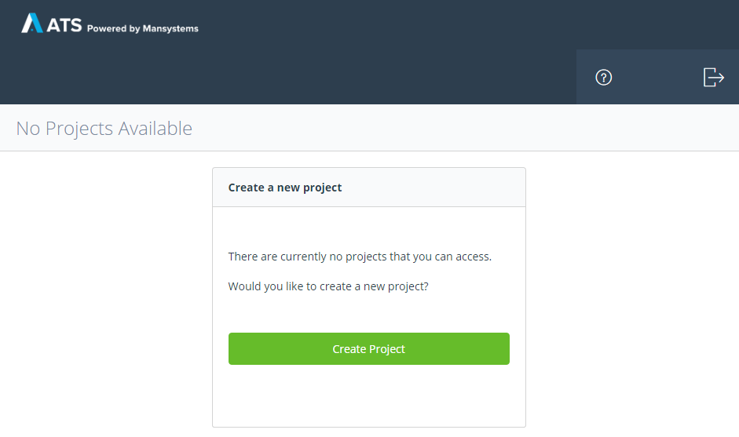
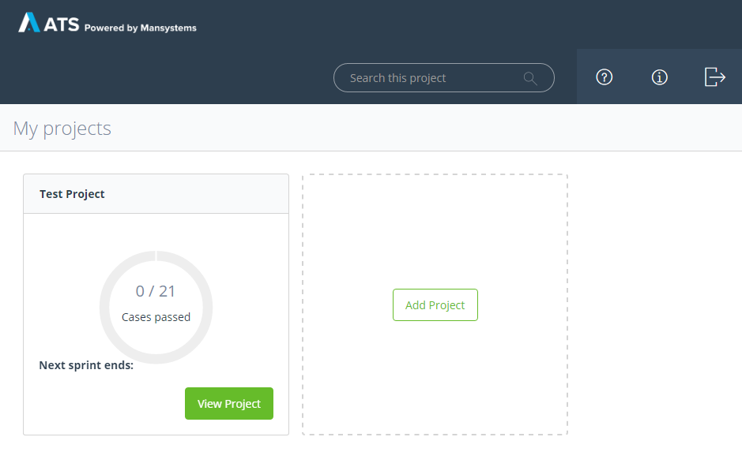
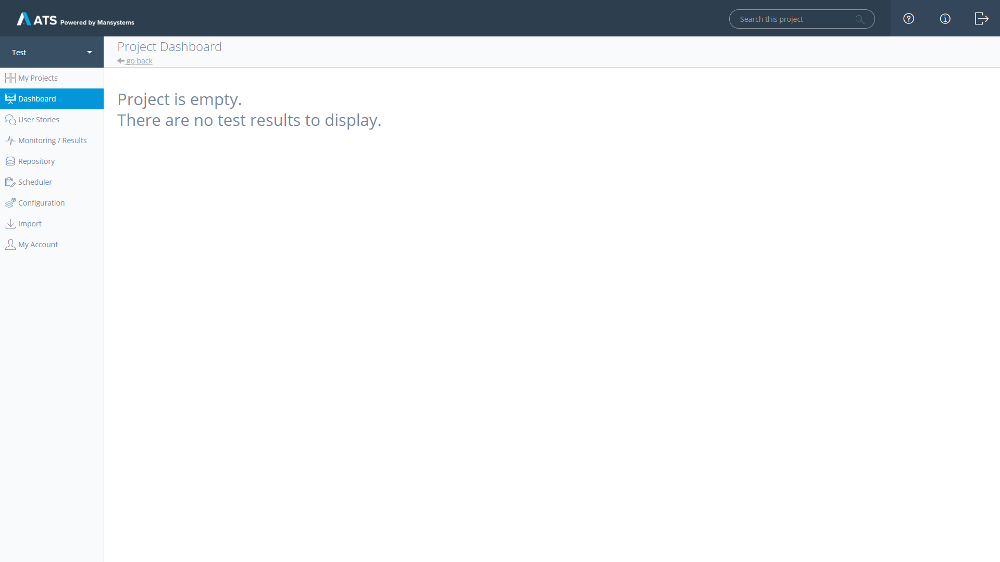
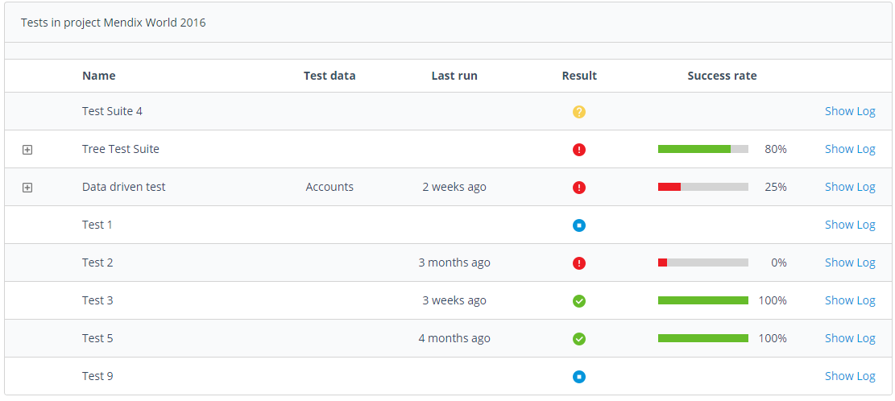
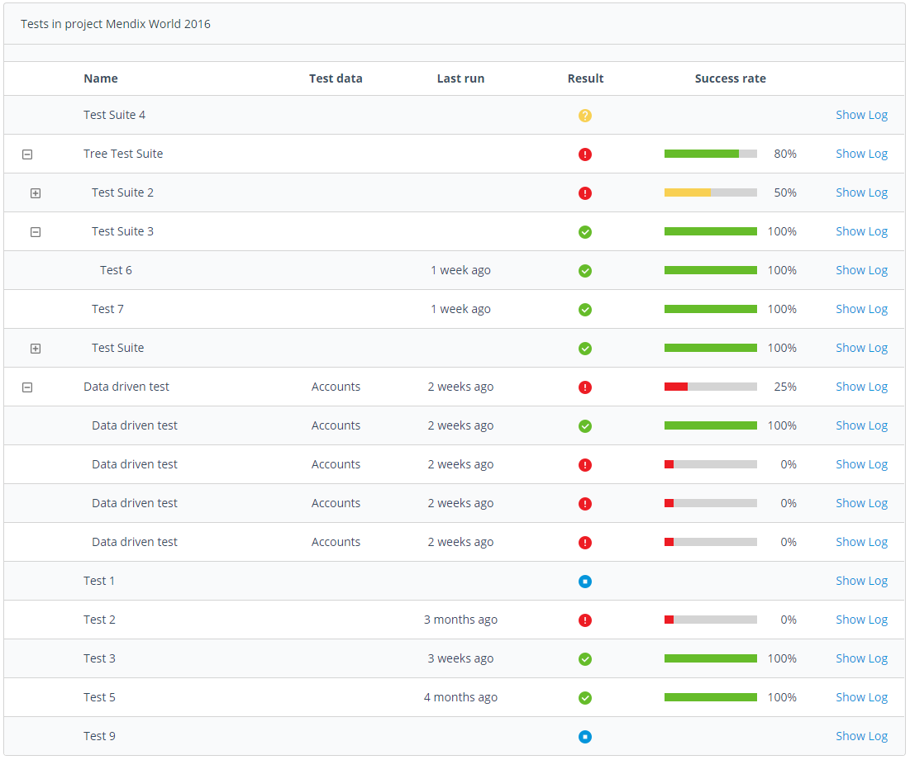
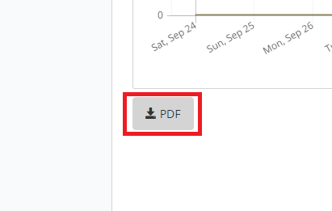

## 1 ATS Start Page

When you log in to the Application Test Suite (ATS) as a user you see the _My Projects_ page. If there are no projects on your account yet, you are prompted to create a new Project. For project creation see the ReferenceGuide_Projects page of the documentation.

If you already have active projects you can see directly how many test cases have passed in every project. You can now view a specific project or create a new one.

## 2 ATS Dashboard

When you open an empty project for the first time, the dashboard will look like this:

If you already have some active test cases in your **ATS project**, the dashboard will give you a summarized overview of the current state of your project at a glance.

The dashboard can be divided into four parts:
* Current state chart
* 7-Day history
* Test case treeview
* PDF export

The **current state chart** will show you the total number of test cases in your project. Furthermore, it will present you the state of your test cases as numeral and as percentage.

The **7-Day history chart** reflects the state of your test cases over the past seven days.

The **test case treeview** shows you detailed informations for all of your test cases and test suites. You can see the passed time since the latest execution, its result and the success rate. For test suites, the success rate is calculated using the results of all containing test cases. For data driven tests, the success rate is calculated on basis of the execution results of all records from the data set, they were executed with.

The data set (meaning, the data driven test was executed with) is displayed in the test data column.

You can open the latest execution log of a test case by pressing **Show Log**.  

If your **test suites** contain one or more test suites/cases you can open a test suite by pressing the *plus* in front of the test suite name. The test suite will expand and you will see all containing test suites/cases. For **data driven tests**, pressing the *plus* will show the executions for all records in the data set that they were executed with.  

You can export the current results of your test cases by pressing **PDF**. This will generate a detailed test report for your project as pdf document.  

## 3 Navigation

You can navigate your project using the navigation sidebar to the left of the screen.

Over the sidebar you can navigate to different pages of the ATS:

| Navigation Item             | Explanation                                                                                          |
| -------------------------- | ----------------------------------------------------------------------------------------------------|
| **Change current Project**  | At the top of the sidebar you can switch between projects which are available on your account        |
| **My Projects**             | This button will bring you back to the startpage.                                                    |
| **Dashboard**               | Gives an overview over the selected project                                                          |
| **User Stories**            | Shows the user stories of the Mendix sprintr project connected to your ATS project                   |
| **Monitoring / Results**    | Gives an overview over recent test runs and shows results                                            |
| **Repository**              | In the _Repository_ you can create new test cases, test suites and organize your objects in folders  |
| **Scheduler**               | On the _Scheduler_ page you can schedule test cases to run in regular intervals                      |
| **Configuration**           | Change project settings, add Selenium hubs and add applications to test                              |
| **Import**                  | Import new/updated actions, test cases or test suites into your project                              |
| **My Account**              | Change your username, email and password                                                             |

## 4 Different User Roles

ATS has a role concept that is applied on two different levels, the application and specific projects. There are two roles of users outside of projects:

**Administrators**

Administrators manage users and manage projects, see ReferenceGuide_Administration for more information

**Users**

Users work in projects, they create and run test cases

On the project level there are the roles of Project Administrator and Test Designer. The difference between the two is, that the Project Administrator can change the project settings and configure Selenium hbs and test applications. See [Configuration](../refguide/rg-version-1/configuration) for more info.
