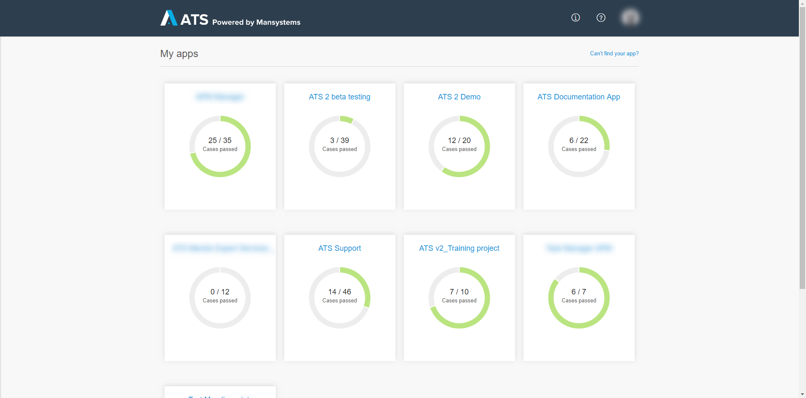
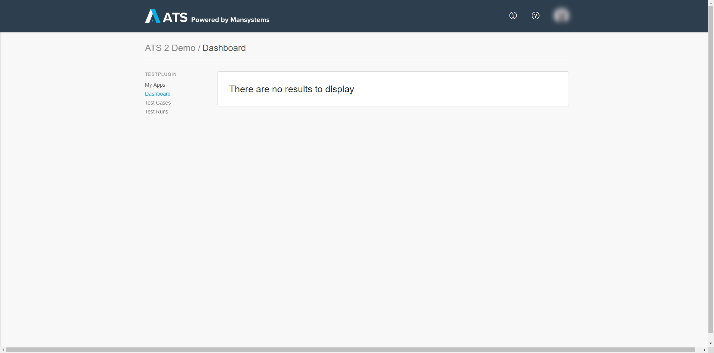
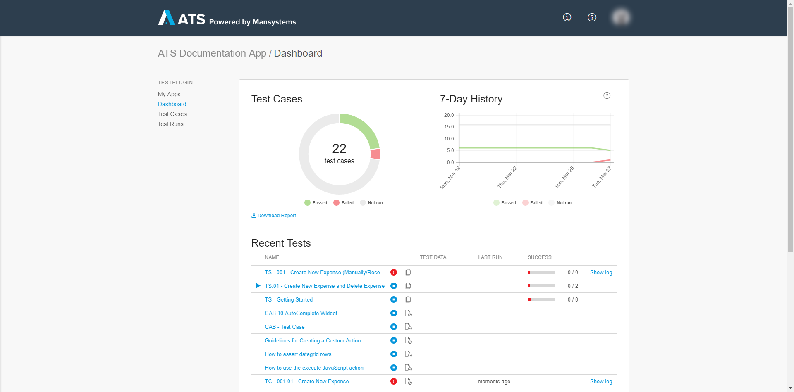
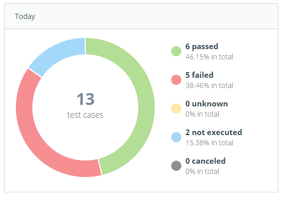
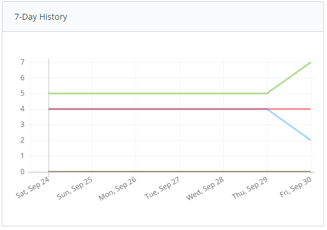
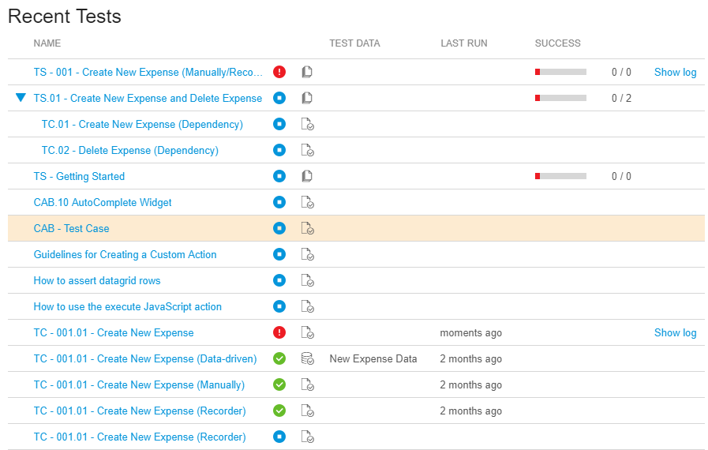
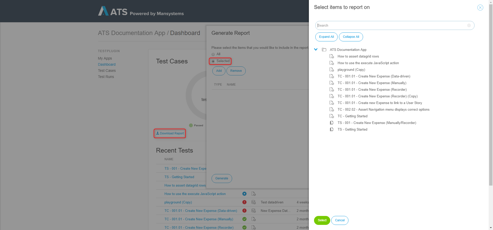
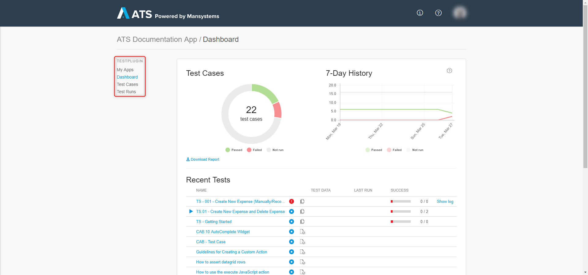

## 1 ATS Start Page

When you log in to the Application Test Suite (ATS) you see the **My apps** page. This page displays all the Mendix apps you are a member of and have an ATS license. Every member of the team in your app has access to ATS.

Each app has a doughnut chart that displays how many test cases inside that app are passed. This allows for a quick overview of the progress of your apps.

## 2 ATS Dashboard

When you open an app that does not contain any test cases the dashboard looks like this:

If you already have some active test cases in your **ATS app**, the dashboard will give you a summarized overview of the current state of your app at a glance.

The dashboard can be divided into four parts:
* Current state chart
* 7-Day history
* Test case treeview
* PDF export

The **current state chart** will show you the total number of test cases in your app. Furthermore, it will present you the state of your test cases as numeral.

The **7-Day history chart** reflects the state of your test cases over the past seven days.

The **Recent Tests** section shows you detailed information for all of your test cases and test suites. You can see the passed time since the latest execution and its result. For test suites, the success rate is calculated using the results of all containing test cases.

The data set (The data set used by a data driven test case) is displayed in the test data column.

You can open the latest execution log of a failed test case by pressing **Show Log**.

If your **test suites** contain one or more test suites/cases you can open a test suite by pressing the **arrow** in front of the test suite name. The test suite will expand and you will see all containing test suites/cases.

You can export the current results of your test cases by pressing **Download Report**. The **Generate Report** dialog box appears. Here you can either generate a report of the entire app or select specific folders to include in the report.

## 3 Navigation

You can navigate inside ATS using the menu on the left side of the screen.

Using the menu you can navigate to different pages inside ATS:

| Menu Item             | Explanation                                                                                          |
| -------------------------- | ----------------------------------------------------------------------------------------------------|
| **My Apps**             | This button will bring you back to the startpage.|
| **Dashboard**               | Gives an overview over the selected app.|
| **Test Cases**              | This page contains the **Repository**, the **Test Data** and the **Stories**. Here you can create new test cases, test suites and test data. You can also connect your user stories to your test cases.|
| **Test Runs**               | This page contains the **Jobs**, **Schedules** and **CI/CD Templates**. Here you can see the results of your test cases, create new schedules and create a CI/CD template for your test case/suite. |

## 4 Different User Roles

ATS has two different user role settings:

### 4.1 SCRUM Master

The SCRUM Master of your app can access the **Test Settings** from the profile menu. Here you can add your app environment URL for testing and add a Selenium Hub for executing your tests. This is the only difference with other roles.

### 4.2 Others

All other roles in your app have access to ATS. The only difference is that the SCRUM Master can access the **Test Settings** of your app.

For more information please read the [Reference Guide](../refguide/rg-version-2/rg-version-2)
