## 1 Introduction

This how-to explains step by step how to create an Unsupported Widget action for the Mendix switch widget. In a standard situation, the first step is checking if ATS supports the widget. 

In this how-to you assume that you must build your own action. 

This how-to applies to all widgets like a button if ATS needs to click the widget you can follow this how-to until step 5. Keep in mind that it might need some adjustments!

Step 6 and step 7 apply ‘logic’ to an action that has the ‘checkbox’ type if a widget has the ‘checkbox’ type you can follow these steps to apply ‘logic’.

**This how-to will teach you how to do the following:**
* Approach a widget that ATS must click.
* Create the custom action to click the widget.
* Add logic to your custom action.

## 2 Prerequisites

Before starting with this how-to, make sure you have the following prerequisites in place:

*  [Custom Action General Section](custom-action-general)

## 3 Define User Approach

First you define the user approach, how do you interact with the widget. Since you are creating an Unsupported Widget action, how you find the widget isn’t important, only how you interact with it.

1. You trigger the Mendix switch by clicking it. This changes its state from checked to unchecked:

_Switch unchecked_

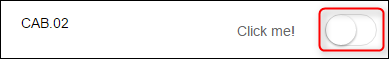

_Switch checked_

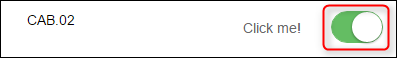

2. Next, you must determine where you must click it. 
After looking at the widget you find out that you must click the actual switch to activate it.

## 4 Create Action Structure

In the previous step, you wrote down the user approach for the Mendix Switch widget. Now you create this approach in ATS with actions. Create a new action for the next steps.

1. Next, you look for the element in the debugger ATS needs to click. ATS always clicks in the middle of an element, keep this in mind while looking for the element to click. 
You start by checking the parent element which is always the element with the `mx-name-` when building an unsupported widget action. If the widget does not have a `mx-name-`, look for the highest div element that is still referencing to the widget. 

The parent element of the switch widget has the `mx-name-switch1` in the debugger:

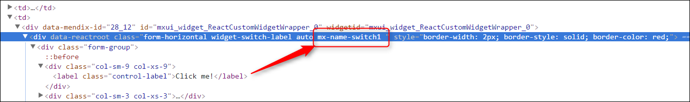

The debugger creates the border around the selected element in the app: 

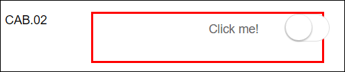

When selecting which element to find keep in mind that ATS clicks in the middle of an element. In this case, ATS does not click on the actual switch. This means you must use the _[Find Widget Child Node](../refguide-ats-1/find-widget-child-node)_ action. This action is a combination of the _[Find/Assert Widget](../refguide-ats-1/findassert-widget)_ and _[Find Element by Sizzle](../refguide-ats-1/find-element-by-sizzle)_ actions, combining the best of both. It’s an official Mendix action. It has all the internal processes and it uses a CSS/jQuery selector to find the child making it flexible.

2. Now you check the different child nodes to find the one you need. While doing this keep [the guidelines for creating a custom action](../bestpractices/guidelines-custom-action) in mind! It must be generic, pick an element or element class that’s always present because you “hard-code” it into your action. Also, make sure the element is visible for the end-user so that ATS can click on it.

After looking through the child nodes you find a child element that covers the switch and also looks generic.
 
The element in the debugger, the rectangle shows which class name we are going to use:

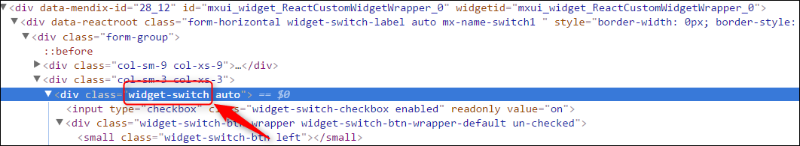

That element looks like this in the app:

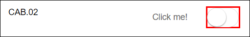

3. You use the class name to find the element because it’s the most constant. The ID of an element changes a lot. You cannot use the ID when building a sustainable custom action.
Use the class name selector in jQuery for finding specific elements.
The class name you must use is: `.widget-switch` and to make sure that it works you try it first in the debugger. 

4. You simulate what ATS does by using the debugger. Since you use the _Find Widget Child Node_ action you also use the `mx-name` in your code. You use jQuery to find out if ATS finds the right element. Enter the following code in the console of the debugger: `$( ‘.mx-name-switch1 .widget-switch’ )` 

You use DOTS here because in jQuery the dot stands for a class name selector.

When you enter this in the console it looks like this:

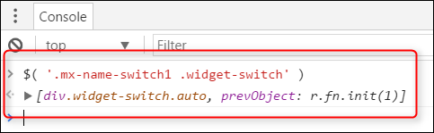

It can happen that the debugger does not return an element. Check if jQuery is available and if you constructed the code in the correct manner.
When you enter a selector in ATS you don’t use the `$( ‘….’ )` or `jQuery( ‘…..’ )`.

5. You enter the child node in the _Find Widget Child Node_ action:

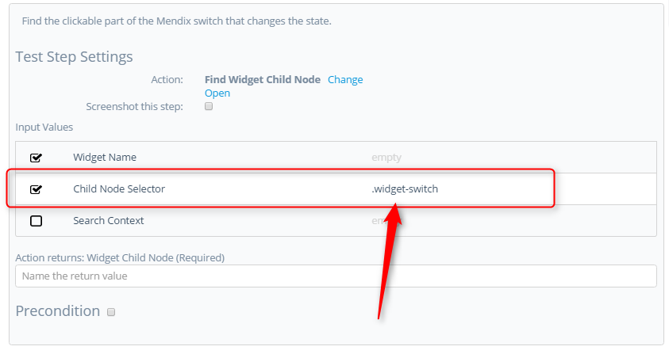

According to the guidelines for building a custom action, you must define the standard parameters. You only want to hard code the child node; the action user must have the possibility to select another switch by only entering the **Widget Name**. 

6. In this case, you have the required **Widget Name** and the optional **Search Context** parameters. Create both parameters in the settings tab.
_Widget Name Input Parameter_

_Search Context Input Parameter_

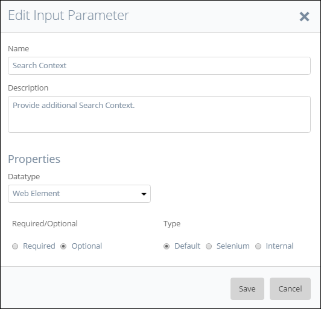

{}
Make sure you set the datatype correctly! The Search Context parameters expects a Web Element!  
{}

7. Next, you connect these parameters to the _Find Widget Child Node_ action:

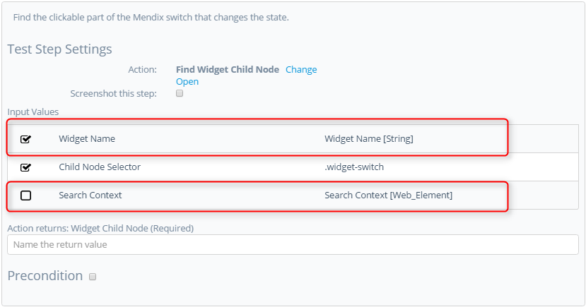

8. You also clarify the test step by filling in the description and possible output. In this case your action returns the Mendix switch:

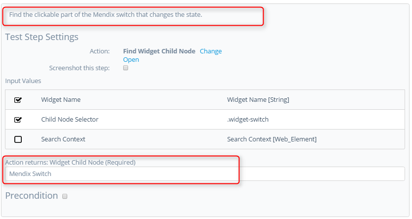

9. Next, you click the Mendix switch to change its state. You add the _[Click/Doubleclick](../refguide-ats-1/clickdoubleclick)_ action because this action is a Mendix action:

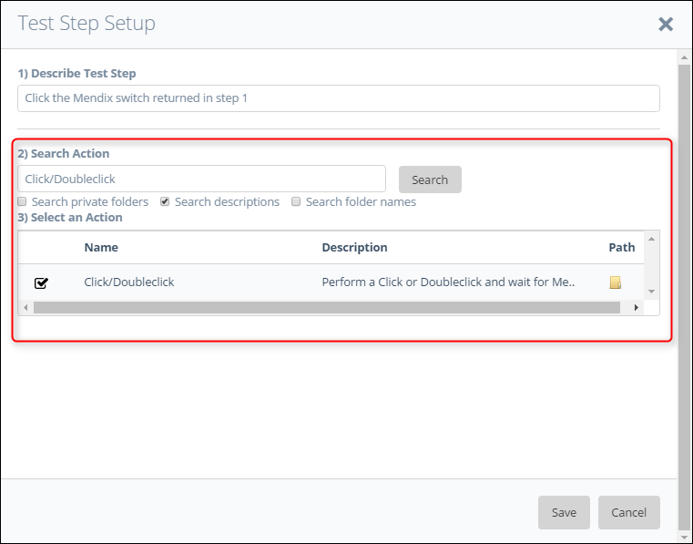

10. You connect the output of the first test steps to the _Click/Doubleclick_ action:

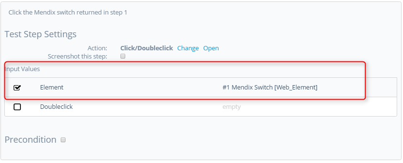

## 5 Last Check

Now check the following items:

*  Use of the ATS naming convention for parameters.
*  A clear description of test steps, input parameters, output parameters and action returns.
*  Interpunction usage in pieces of code (If used).
*  Use of datatypes on the different parameters to avoid errors.

After checking these items, you can run the test case that uses this action.

**Congratulations you created your own custom action!**
Now you created your own custom action for the Mendix Switch widget.

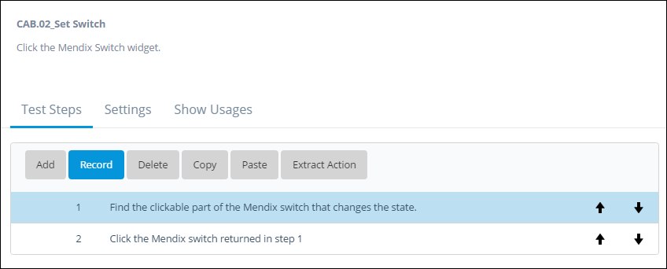

## 6 Add logic to make your action 'smarter'

You have an action that clicks the switch widget to alter its state, now you make it ‘smarter’. Now your action clicks the switch no matter its current state. Next, you add logic to set the switch to a specific state.

1. In the debugger, you see that the Mendix Switch has the input type `checkbox` you use this input element in combination with the action _Is Selected_ to get the current state of the widget, either “True” or “False”:

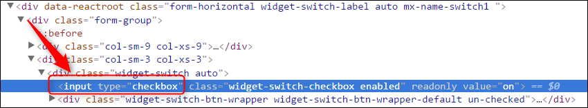

2. First, you check if ATS can find the input element. You do this by simulating what ATS does, the same way as before. Enter the following code in the console of the debugger: 
`$( ‘.mx-name-switch1 input’ )`:

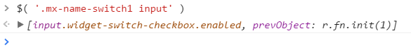

{}
It can happen that the debugger does not return an element. Check if jQuery is available and if you constructed the code in the correct manner.  
{}

When you use an elements DOM name, the selector looks like this: `input` or `div`

3. Next, you add another _Find Widget Child Node_ action to find the input element. Make it step 1. Enter `input` in the child node selector parameter. As said before you don’t use the full selector. Keep the guidelines in mind and give a proper description of the test step and its output:

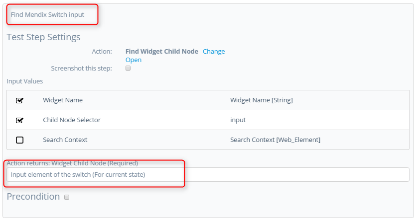

You use this input element to get the current state of the switch: “True for checked” and “False for unchecked”.

4. Next, add the _Is Selected_ action and make it the second test step, connect the output of step 1 that found the input element and of course give a proper description:

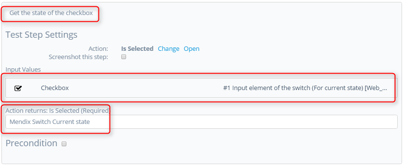

5. To use the output of the _Is Selected_ action, you need something to compare it to. The action user must provide the "True" or "False" statement used to set the action. Next, you create the input parameter for the wanted state:

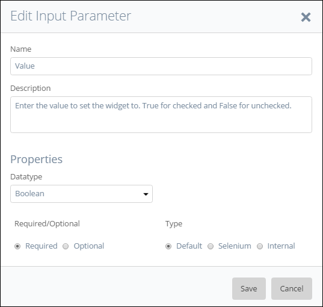

{}
Watch the datatype! It must be a Boolean here because the _Is Selected_ action also returns a Boolean, otherwise, you couldn’t compare them.
{}

6. Give a clear description so that the action user knows what information is required.

The logic you use is as follows: 
**Only click the switch if the value of the switch is NOT the same as the value entered by the user.**

A precondition on the _Click/Doubleclick_ action performs the logic. You use the _[Assert not equals](../refguide-ats-1/assert-not-equals)_ action as precondition.

Example, If I want to set the switch to unchecked I enter the value False. If the switch is already false then the values are equal and the precondition fails, resulting in ATS NOT executing the _Click/Doubleclick_ action and vice versa. 

7. Check the precondition box at test step 4, the _Click/Doubleclick_ action and select the _Assert not equals_ action. Next, connect the input parameter value and the output of step 2, the Mendix switch current state:

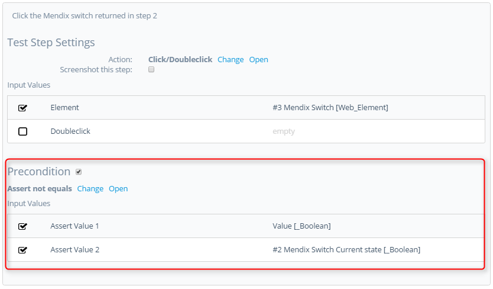

## 7 Final Check

Now check the following items:
*  Use of the ATS naming convention for parameters.
*  A clear description of test steps, input parameters, output parameters and action returns.
*  Interpunction usage in pieces of code (If used).
*  Use of datatypes on the different parameters to avoid errors.

After checking these items, you can run the test case that uses this action.

**Congratulations you’ve added logic to your custom action!**

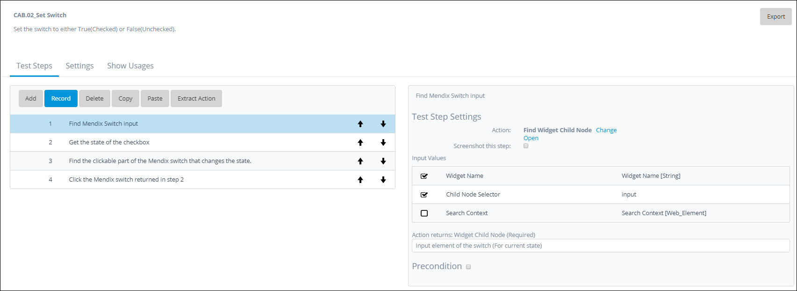

