## 1 Introduction

This how-to explains step by step how to create an Unsupported Widget action for the Textbox widget. In a standard situation, the first step is checking if ATS supports the widget. 

In this how-to you assume that you must build your own action.

This how-to applies to all widgets like a Text Box if ATS needs to enter text in a widget you can follow this how-to. Keep in mind that it might need some adjustments!

**This how-to will teach you how to do the following:**
* Approach a widget that ATS must enter text in.
* Create the custom action to enter text in the widget.

## 2 Prerequisites

Before starting with this how-to, make sure you have the following prerequisites in place:

*  [Custom Action General Section](custom-action-general)

## 3 Define User Approach

First you define the user approach, how do you interact with the widget. Since you are creating an Unsupported Widget action, how you find the widget isn’t important, only how you interact with it.

1. You interact with the widget by clicking the textbox and entering the text. The clicking part is something a user does to focus the textbox so they can enter text, after that you press enter or click somewhere to unfocus the textbox.

_Text Box focused_

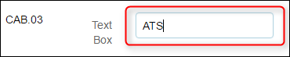

_Text Box unfocused_

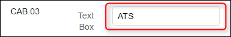

Now you know that you must focus, enter text and unfocus the widget. You perform these tasks on the `input` element that is available inside all input widgets. The `input` element with the type `text` makes it possible to type inside a widget.

## 4 Create Action Structure

In the previous step, you wrote down the user approach for the Textbox widget. Now you create this approach in ATS with actions.

1. You start by checking the parent element which is always the element with the `mx-name` when creating an unsupported widget action. If the widget does not have a `mx-name`, look for the highest div element that is still referencing to the widget. 
The parent element of the text box looks like this in the debugger:

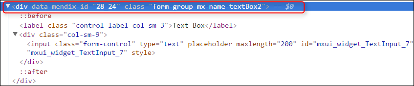

The debugger creates the border around the selected element in the app:

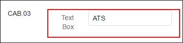

2. The parent element is not an `input` element. Find a child element that ATS can use to enter text in the widget. When you look at the parent element you see it has an `input` child element that ATS can use:

When you create a custom action for an unsupported widget action, you must use the _[Find Widget Child Node](../refguide-ats-1/find-widget-child-node)_ action. This action is a combination of the _[Find/Assert Widget](../refguide-ats-1/findassert-widget)_ and _[Find Element by Sizzle](../refguide-ats-1/find-element-by-sizzle)_ actions, combining the best of both. It’s an official Mendix action. It has all the internal processes and it uses a CSS/jQuery selector to find the child making it flexible. The selector for finding the input element is input. You use this selector in the “Find Widget Child Node” action to find an input element inside the text box widget.

Before you start creating the action you must know if ATS can find the `input` element within the text box widget. You use the debugger to simulate what ATS does. Since the _Find Widget Child Node_ action uses the `mx-name` to find the parent, you also must use the `mx-name` in your code.

3. You use jQuery to find out if ATS can find the element. Enter the following code in the console of the debugger: `$( ‘.mx-name-textBox2 input’ )`: 

You use DOTS here because in jQuery the dot stands for a class name selector.

When you enter this in the console it looks like this:

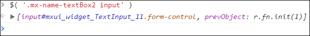

It can happen that the debugger does not return an element. Check if jQuery is available and if you constructed the code in the correct manner.
When you enter a selector in ATS you don’t use the `$( ‘….’ )` or `jQuery( ‘…..’ )`.

4. Next, you add the _Find Widget Child Node_ action to your action. Enter the child node selector: `input`, enter the test step description and output description:

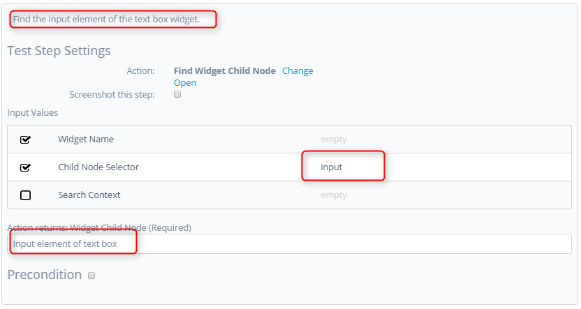

5. Test step 1 provides the `input` element that you need for the other steps. Next, add the _Focus and Clear Element Value_ action. Enter the output of step 1 as input and give a proper description:

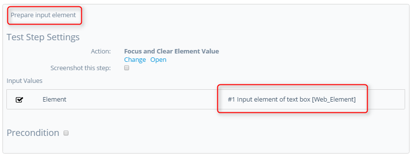

6. After focusing the `input` element, you enter the text. When entering text in an `input` element, you use the [_Send Keys_](../refguide-ats-1/send-keys) action. Add the action, connect the input element from step 1 and give a proper description:

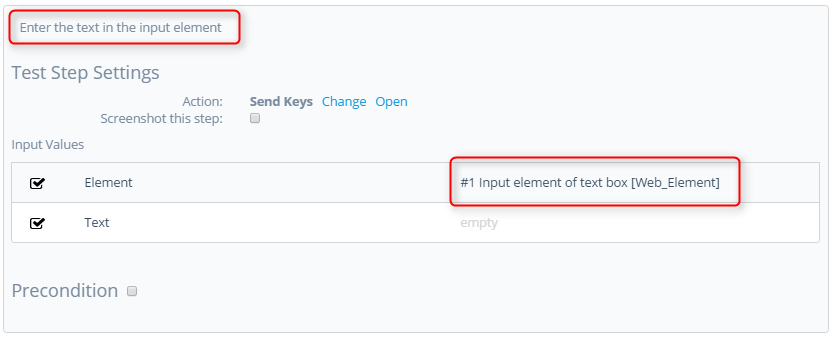

7. Now that you have entered the text, you can unfocus the `input` element. Add the _Unfocus WebElement_ action, connect the `input` element from step 1 and give a proper description:

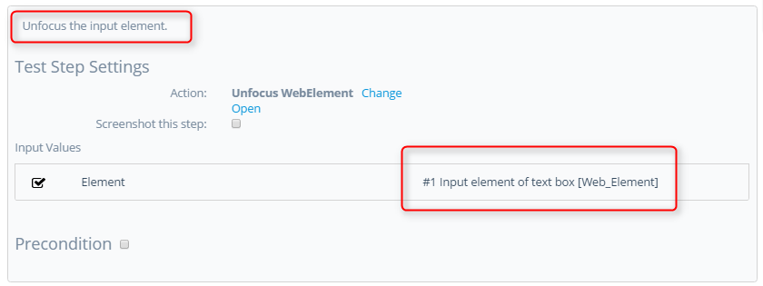

8. The last action you add is the [_Mendix Wait_](../refguide-ats-1/mendix-wait). You trigger a possible event in the widget by entering text, so you need to ensure ATS waits for all background processes to finish:

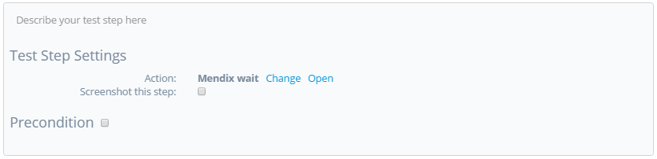

## 5 Action Parameters

Next, you add the action input parameters.
* Widget Name
* Value
* Search Context

{}
Keep the [guidelines for creating a custom action](../bestpractices/guidelines-custom-action) in mind while creating action parameters. 
{}

1. The Widget Name input parameter:

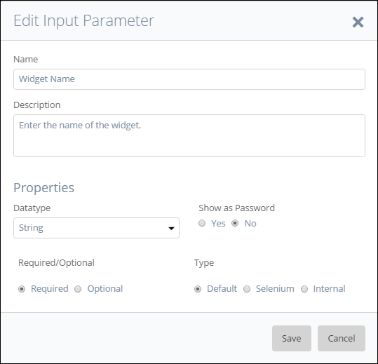

2. The Value input parameter:

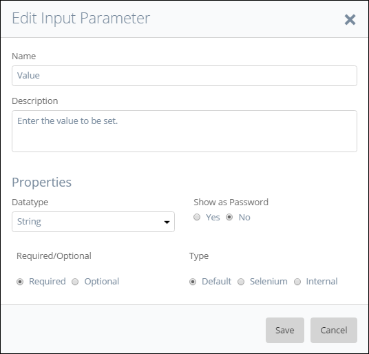

3. The Search Context input parameter:

For this custom action, you don’t need an output parameter.

4. Next, you connect the input parameters to the correct actions. Start with the Widget Name and Search Context parameters for the _Find Widget Child Node_ action:

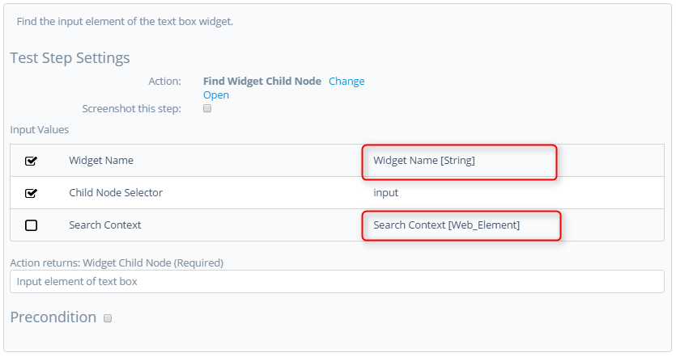

5. The last parameter to connect is the Value parameter. You connect this input parameter to the _Send Keys_ action:

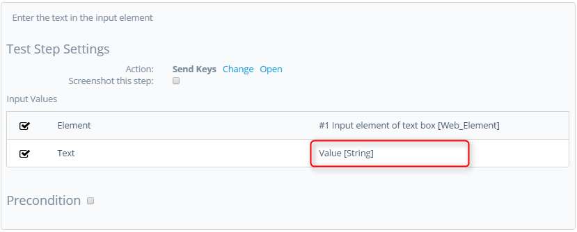

There is no need to add ‘Logic’ to this custom action. Its only entering text in a widget.

## 6 Final Check

Now check the following items:

*  Use of the ATS naming convention for parameters.
*  A clear description of test steps, input parameters, output parameters and action returns.
*  Interpunction usage in pieces of code (If used).
*  Use of datatypes on the different parameters to avoid errors.

After checking these items, you can run the test case that uses this action.

**Congratulations you created your own custom action!**

Now you created your own custom action for the Mendix TextBox widget.

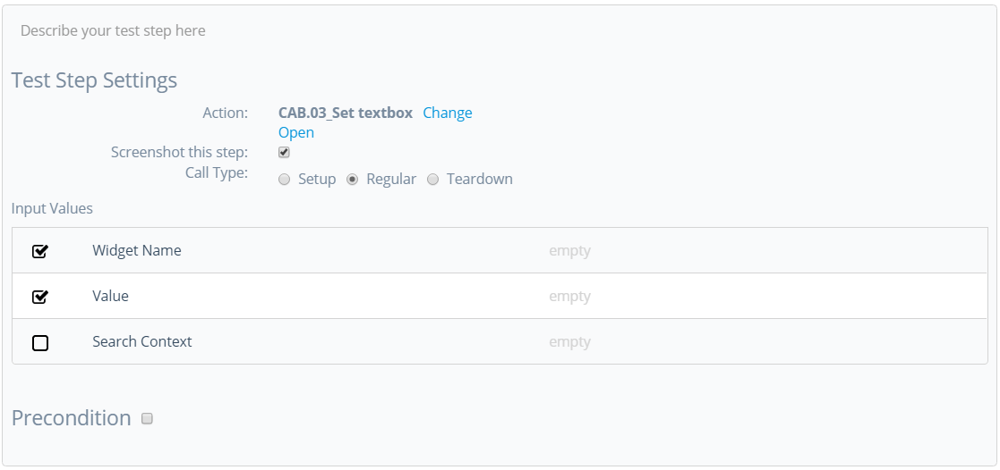