## 1 Introduction

This how-to explains step by step how to create an Unsupported Widget action for the Reference Selector widget. In a standard situation, the first step is checking if ATS supports the widget. 

In this how-to you assume that you must build your own action.

This how-to applies to all widgets like a reference selector, if the widget has a dropdown you can follow this how-to. Keep in mind that it might need some adjustments!

**This how-to will teach you how to do the following:**
* Approach a drop-down widget that ATS must set.
* Create the custom action to set the drop-down widget.

## 2 Prerequisites

Before starting with this how-to, make sure you have the following prerequisites in place:

*  [Custom Action General Section](custom-action-general)

## 3 Define User Approach

First you define the user approach, how do you interact with the widget. Since you are creating an Unsupported Widget action, how you find the widget isn’t important, only how you interact with it.

You  interact with the widget by clicking it to see the options and then click on the option you want. A user only clicks the widget to see the options it has.

_Reference Selector opened_

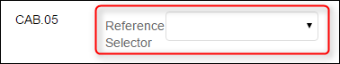

_Reference Selector unopened_

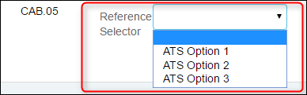

Most widgets that give options, like the reference selector and the dropdown, have a `select` element which displays the options.

## 4 Create Action Structure

In the previous step, you wrote down the user approach for the Reference Selector widget. Now you create this approach in ATS with actions.

You start by checking the parent element which is always the element with the mx-name when creating an unsupported widget action. If the widget does not have a `mx-name`, look for the highest `div` element that is still referencing to the widget.
The parent element of the reference selector looks like this in the debugger:

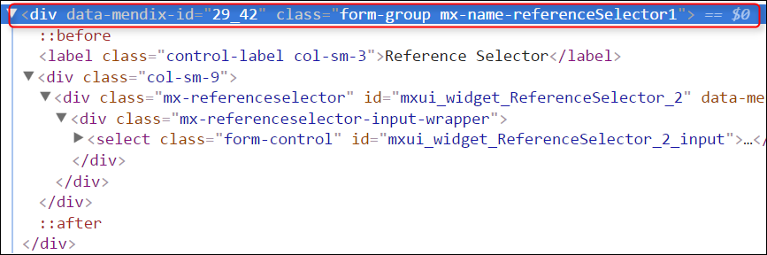

The debugger creates the border around the selected element in the app:

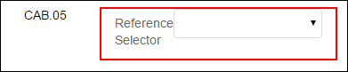

The parent element is not an `input` element. Find a child element that ATS can use to select an option. When you look at the parent element you see it has a `select` child element that ATS can use:

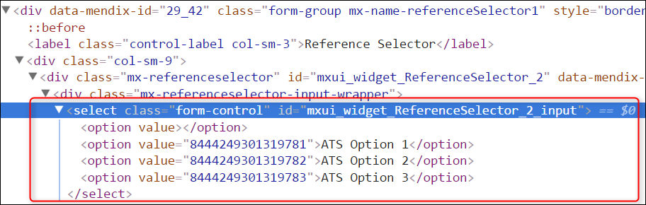

When you create a custom action for an unsupported widget action, you must use the _[Find Widget Child Node](../refguide-ats-1/find-widget-child-node)_ action. This action is a combination of the _[Find/Assert Widget](../refguide-ats-1/findassert-widget)_ and _[Find Element by Sizzle](../refguide-ats-1/find-element-by-sizzle)_ actions, combining the best of both. It’s an official Mendix action. It has all the internal processes and it uses a CSS/jQuery selector to find the child making it flexible. The selector for finding the select element is `select`. You use this selector in the _Find Widget Child Node_ action to find a select element inside the reference selector widget.

Before you start creating the action you need to know if ATS can find the select element within the reference selector widget. You use the debugger to simulate what ATS does. Since the _Find Widget Child Node_ action uses the `mx-name` to find the parent, you also must use the `mx-name` in your code.
You use jQuery to find out if ATS can find the element. Enter the following code in the console of the debugger: `$( ‘.mx-name-referenceSelector1 select’ )`:

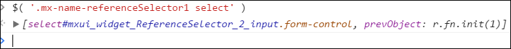

It can happen that the debugger does not return an element. Check if jQuery is available and if you constructed the code in the correct manner.
When you enter a selector in ATS you don’t use the `$( ‘….’ )` or `jQuery( ‘…..’ )`.

Next, you add the _Find Widget Child Node_ action to your action. Enter the child node selector: `select`, enter the test step description and output description:

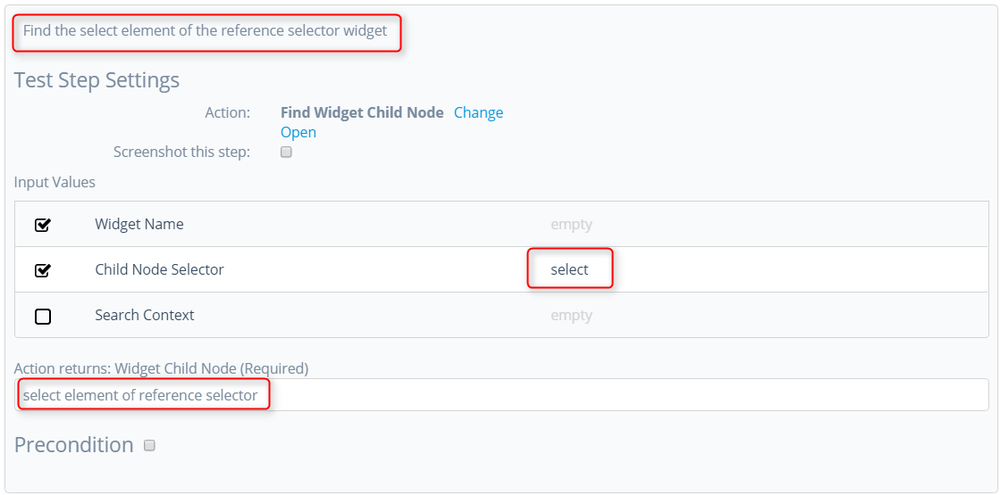

ATS has core actions for selecting an option from a select element. We use the _Select Option by Text_ action because you want to select the option based on text. Enter the output of test step 1 as input and give a proper description:

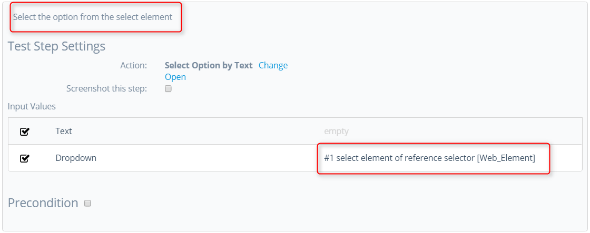

The _Select Option by Text_ action is a core action which triggers an event. Finish your custom action with a [_Mendix Wait_](../refguide-ats-1/mendix-wait) action:

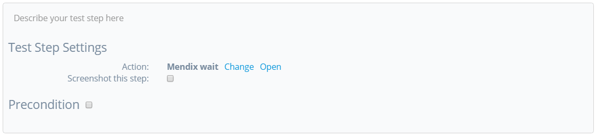

## 5 Action Parameters

Next, you add the action input parameters.
* Widget Name
* Value
* Search Context

{}
Keep the [guidelines for creating a custom action](../bestpractices/guidelines-custom-action) in mind while creating action parameters. 
{}

The Widget Name input parameter:

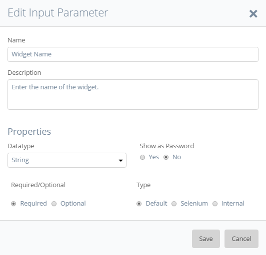

The Value input parameter:

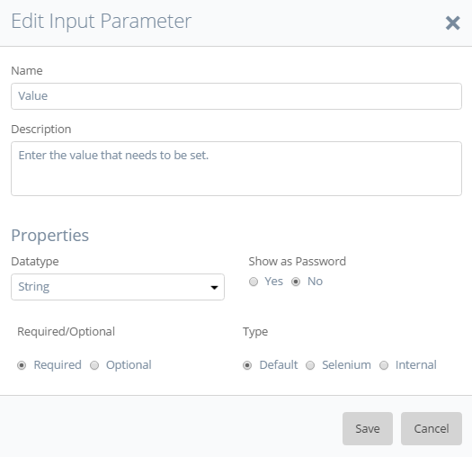

The Search Context input parameter:

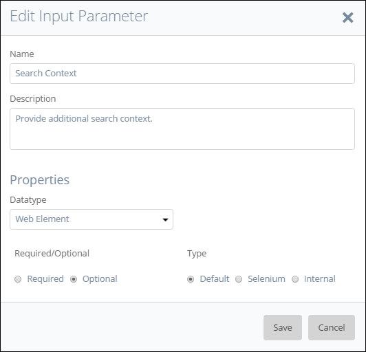

For this custom action, you don’t need an output parameter.

Next, you connect the input parameters to the right actions. Start with the Widget Name and Search Context input parameters for the _Find Widget Child Node_ action:

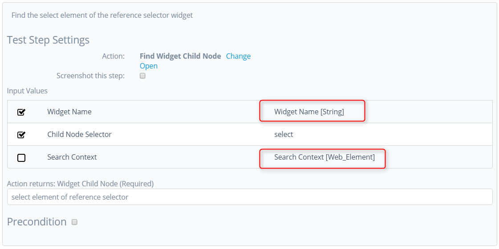

The last input parameter to connect is the Value parameter. Connect the input parameter to the _Select Option by Text_ action:

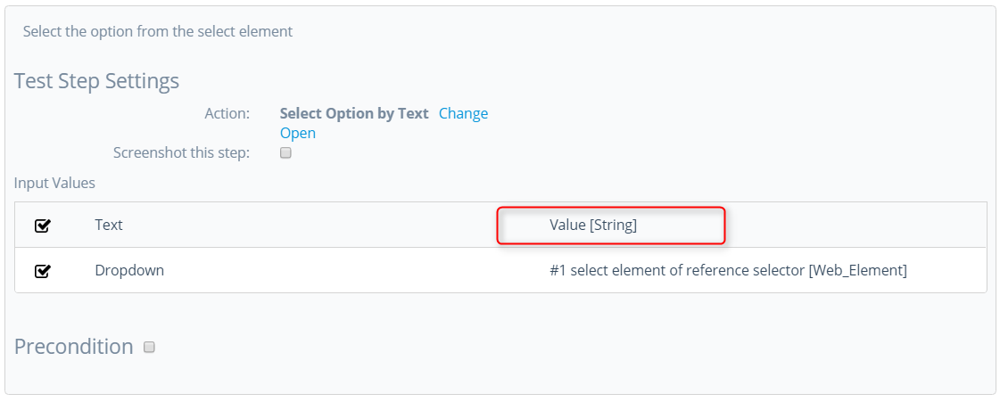

There is no need to add ‘Logic’ to this custom action since its only selecting an option in the widget.

## 6 Final Check

Now check the following items:

*  Use of the ATS naming convention for parameters.
*  A clear description of test steps, input parameters, output parameters and action returns.
*  Interpunction usage in pieces of code (If used).
*  Use of datatypes on the different parameters to avoid errors.

After checking these items, you can run the test case that uses this action.

**Congratulations you created your own custom action!**

Now you created your own custom action for the Mendix Reference Selector widget.

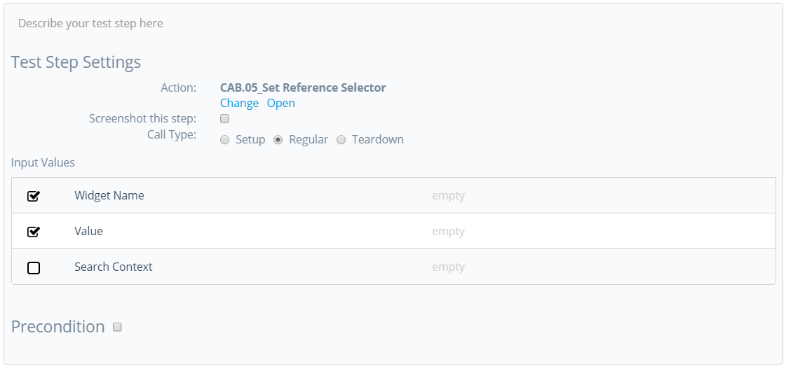