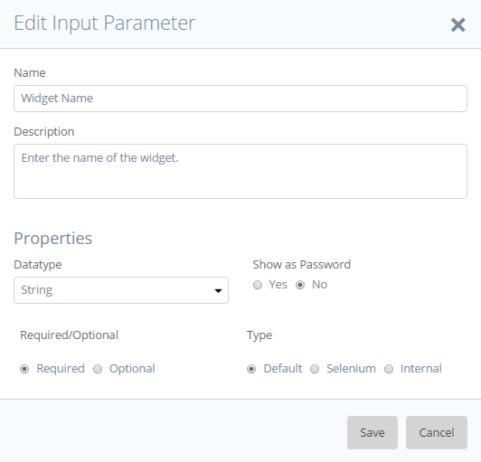
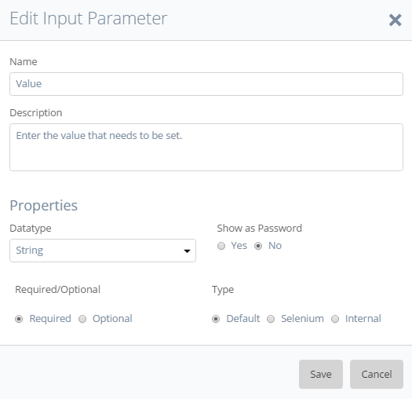

## 1 Introduction

This how-to explains step by step how to create an Unsupported Widget action for the Radio Buttons widget. In a standard situation, the first step is checking if ATS supports the widget. 

In this how-to you assume that you must build your own action.

This how-to applies to all widgets like a Radio Buttons, if you must click a child element based on text you can follow this how-to. Keep in mind that it might need some adjustments!

**This how-to will teach you how to do the following:**
* Approach a radio button option that ATS must click.
* Create the custom action to click the radio button option.

## 2 Prerequisites

Before starting with this how-to, make sure you have the following prerequisites in place:

*  [Custom Action General Section](custom-action-general)

## 3 Define User Approach

First you define the user approach, how do you interact with the widget. Since you are creating an Unsupported Widget action, how you find the widget isn’t important, only how you interact with it.

You select an option by clicking the radio button that contains the text. 

_No radio button selected_

_Radio button selected_

The radio button is an input element with the type radio.

## 4 Create Action Structure

In the previous step, you wrote down the user approach for the Radio Buttons widget. Now you create this approach in ATS with actions. 

You start by checking the parent element which is always the element with the `mx-name` when creating an unsupported widget action. If the widget does not have a `mx-name`, look for the highest `div` element that is still referencing to the widget.  
The parent element of the radio buttons looks like this in the debugger:

The debugger creates the border around the selected element in the app:

Inside the parent element you see different child elements. One of these child elements has the class name `radio` and inside each radio element you find a `label` element that contains the `input` element (radio button):

The `label` element is the element that displays the text and the `input` element is the radio button. You see this if you select either of them in the debugger.

_Label element_

_Input element_

When you create a custom action for an unsupported widget action, you must use the _[Find Widget Child Node](../refguide-ats-1/find-widget-child-node)_ action. This action is a combination of the _[Find/Assert Widget](../refguide-ats-1/findassert-widget)_ and _[Find Element by Sizzle](../refguide-ats-1/find-element-by-sizzle)_ actions, combining the best of both. It’s an official Mendix action. It has all the internal processes and it uses a CSS/jQuery selector to find the child making it flexible.

Each radio button is inside a `div` element with the classname `.radio`. Inside this element, there is a `label` element that contains a text value. Finally, there is an `input` element inside the `label` element. The selector looks like this: `.radio label:contains() input` 
Using the entire path makes your selector more accurate in the case there are other radio buttons widgets.
You use this selector in the _Find Widget Child Node_ action to find the right input element inside a label element within the radio button widget.

Before you start creating the action you must know if ATS can find the input element within the radio buttons widget. You use the debugger to simulate what ATS does. Since the _Find Widget Child Node_ action uses the mx-name to find the parent, you also must use the mx-name in your code.

You use jQuery to find out if ATS can find the element. Enter the following code in the console of the debugger: 
`$( ‘.mx-name-radioButtons1 .radio label:contains(“ATS Option 5”) input’ )`:

It can happen that the debugger does not return an element. Check if jQuery is available and if you constructed the code in the correct manner.
When you enter a selector in ATS you don’t use the `$( ‘….’ )` or `jQuery( ‘…..’ )`.

The action user must enter the text he wants ATS to click. You need a variable selector to achieve this. You create a variable selector by using the [_Concatenate String_](../refguide-ats-1/concatenate-string) action. The _Concatenate String_ action combines the different input strings into one string. The _Concatenate String_ action does not add spaces. You need to add spaces yourself.

Next, you add the _Concatenate String_ action. 
Leave the **String 2** input parameter empty! You connect an action input parameter here later.

Enter the selector: `.radio label:contains("") input`, give a proper test step description and describe the output:

Next, you add the _Find Widget Child Node_ action to your action. Connect the output string from step 1 to the child node selector input parameter. Enter the test step description and output description:

ATS must click the found radio button. You add the [_Click/Doubleclick_](../refguide-ats-1/clickdoubleclick) action. Connect the radio button from step 2 and give a description of the test step:

## 5 Action Parameters

Next, you add the action input parameters.
* Widget Name
* Value
* Search Context

{}
Keep the [guidelines for creating a custom action](../bestpractices/guidelines-custom-action) in mind while creating action parameters. 
{}

The Widget Name input parameter:

The Value input parameter:

The Search Context parameter:

For this custom action, you don’t need an output parameter.

Next, you connect the input parameters to the correct actions. Start with the Value input parameter. You connect this input parameter to the _Concatenate String_ action:

The last input parameters you connect are the Widget Name and Search Context input parameters for the _Find Widget Child Node_ action:

There is no need to add ‘Logic’ to this custom action. It only clicks a radio button.

## 6 Final Check

Now check the following items:

*  Use of the ATS naming convention for parameters.
*  A clear description of test steps, input parameters, output parameters and action returns.
*  Interpunction usage in pieces of code (If used).
*  Use of datatypes on the different parameters to avoid errors.

After checking these items, you can run the test case that uses this action.

**Congratulations you created your own custom action!**

Now you created your own custom action for the Mendix Radio Buttons widget.

