## 1 Introduction

This how-to explains step by step how to create an Unsupported Widget action for the AutoComplete widget. In a standard situation, the first step is checking if ATS supports the widget. 

In this how-to you assume that you must build your own action. 

This how-to applies to all widgets like an AutoComplete widget, if the widget has a dropdown/menu that pops up elsewhere you can follow this how-to. Keep in mind that it might need some adjustments!

**This how-to will teach you how to do the following:**
* Approach an AutoComplete option that ATS must click.
* Create the custom action to click the AutoComplete option.

## 2 Prerequisites

Before starting with this how-to, make sure you have the following prerequisites in place:

*  [Custom Action General Section](custom-action-general)

## 3 Define User Approach

First you define the user approach, how do you interact with the widget. Since you are creating an Unsupported Widget action, how you find the widget isn’t important, only how you interact with it.

You interact with the widget by clicking it. This opens the search field where you enter the text. Then you click the option that is the same as your text. 

_AutoComplete widget_

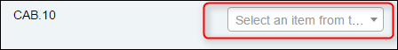

_AutoComplete widget clicked_

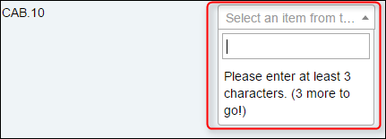

_AutoComplete widget with search_

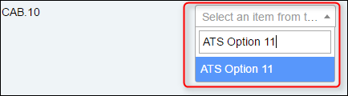

_AutoComplete widget filled in_

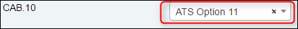

## 4 Action Structure

In the previous step, you wrote down the user approach for the Reference Selector widget. Now you create this approach in ATS with actions.

You start by checking the parent element which is always the element with the `mx-name` when creating an unsupported widget action. If the widget does not have a `mx-name`, look for the highest `div` element that is still referencing to the widget.
The parent element of the AutoComplete widget looks like this in the debugger:

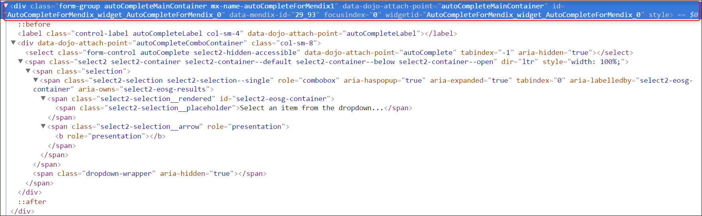

The debugger creates the border around the selected element in the app:

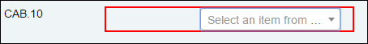

In a standard situation, you use the  _[Find Widget Child Node](../refguide-ats-1/find-widget-child-node)_ action while creating an unsupported widget action. 
In this case, you see that the drop down is not a child element of the Auto Complete widget. 
To find it, use the inspector in the top left corner of the debugger: 

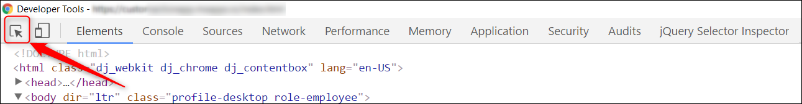

Click the search field in ATS while using the inspector, to see it in the debugger.

_Hovering above input element_

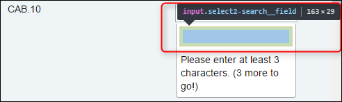

_Input element in the debugger_

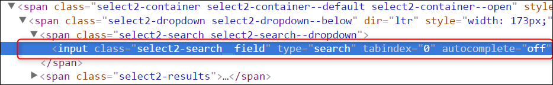

In the input element, you see that the autocomplete option is set to off. The widget can also autocomplete the entered text. You must cover this scenario later.

You use the [_Find/Assert Widget_](../refguide-ats-1/findassert-widget) action to find the AutoComplete widget. Now, add the _Find/Assert Widget_ action to your custom action, give a proper test step description and output description:

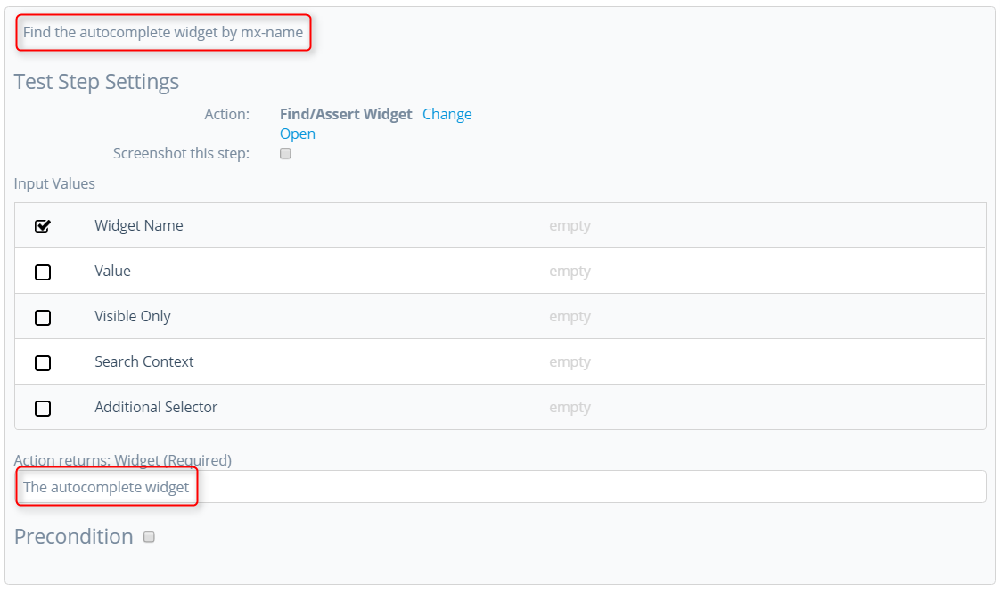

You create and connect the input parameters later.

Next, you must click the AutoComplete widget to open the dropdown menu. Add the [_Click/Doubleclick_](../refguide-ats-1/clickdoubleclick) action, describe the test step and connect the output of test step 1:

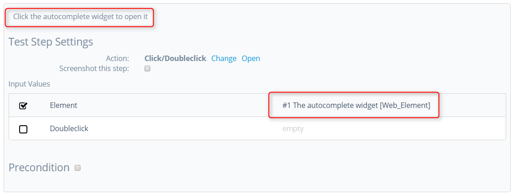

Now you check if the parent element of the dropdown has a `mx-name`. If you check the debugger you see that there is no `mx-name`:

If the parent element doesn’t have a `mx-name` then you use the [_Find Element by Sizzle_](../refguide-ats-1/find-element-by-sizzle) action. This action uses jQuery to find an element on the page. You use the same selectors as in the _Find Widget Child Node_ action. 

You must be sure that ATS picks the right `input` element. Use a generic class name to find the parent. Next, find the child that contains the input element and return the input element:

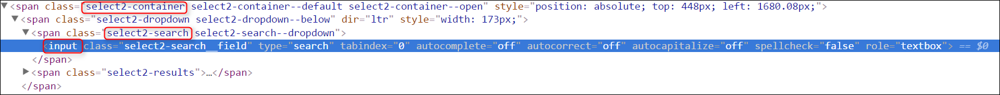

Before you create the action you must know if ATS finds the input element within the dropdown container. You use the debugger to simulate what ATS does.

You use jQuery to find out if ATS can find the element. Enter the following code in the console of the debugger: `$( ‘.select2-container .select2-search input’ )`:

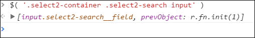

It can happen that the debugger does not return an element. Check if jQuery is available and if you constructed the code in the correct manner.
When you enter a selector in ATS you don’t use the `$( ‘….’ )` or `jQuery( ‘…..’ )`.

Next, you add the _Find Element by Sizzle_ action. You also must use a filter selector. To make sure ATS returns a visible element. The _Find Element by Sizzle_ action is a Core action. Enter the selector, the filter selector `:visible`, give a test step description and describe the output:

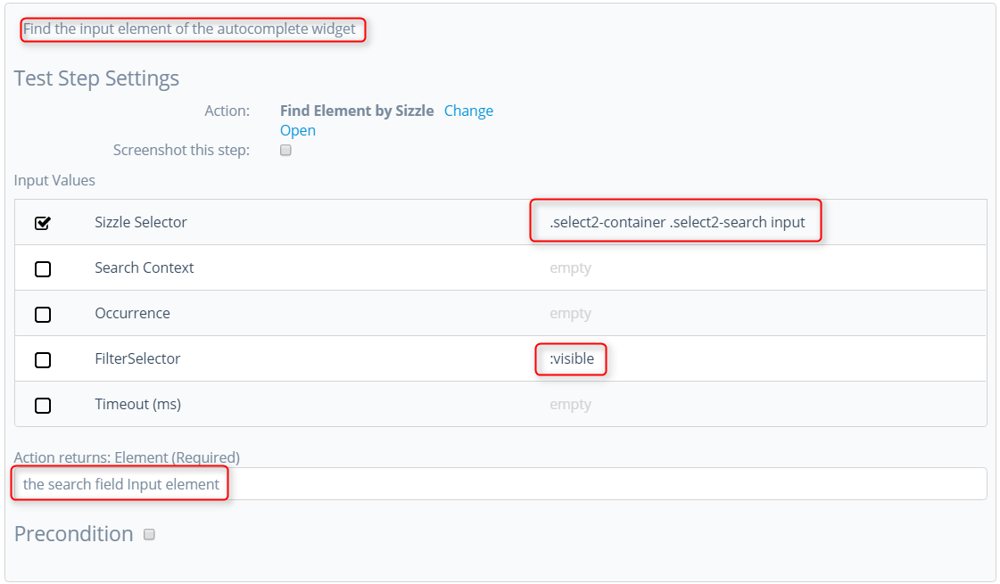

A filter selector is a jQuery selector that you use to filter the results.

You must focus the `input` element. Use the _Focus and Clear Element Value_ action. Add the action, provide the `input` element from test step 3 as input and give a proper test step description:

Next, you add the [_Send Keys_](../refguide-ats-1/send-keys) action to enter the value in the `input` element. Add the action, connect the `input` element from test step 3 as input and give a proper description:

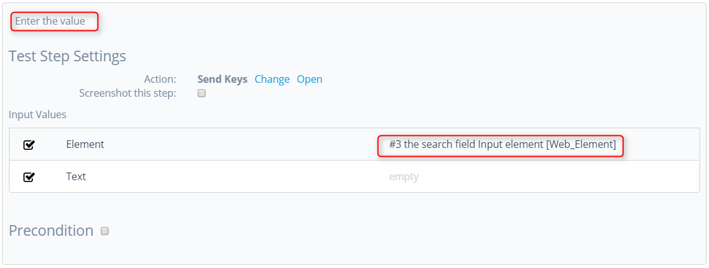

Now add a [_Mendix Wait_](../refguide-ats-1/mendix-wait) action to give the app time to perform activities:

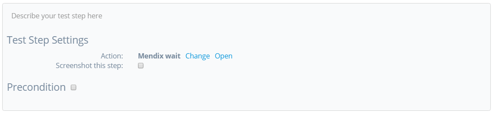

After entering the text in the search field an option appears that ATS must click. You need to find an element containing a specific text. The dropdown container does not have a `mx-name`. Use the _Find Element by Sizzle_ action again. First, you create the selector. Enter ATS Option 11 in the Autocomplete widget and open the debugger. We take the class name of the main results element and the class name of the element displaying the text. Also, use a `:contains` selector for the finding the element displaying the text: 

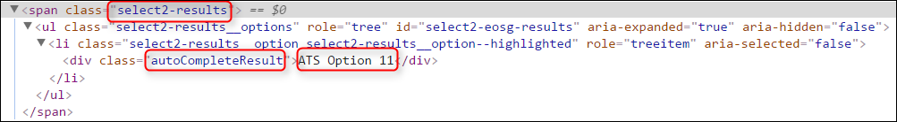

You use jQuery to find out if ATS can find the element. Enter the following code in the console of the debugger: 
`$( ‘.select2-results .autoCompleteResult:contains(“ATS Option 11”)’ )`:

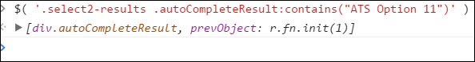

It can happen that the debugger does not return an element. Check if jQuery is available and if you constructed the code in the correct manner.
When you enter a selector in ATS you don’t use the `$( ‘….’ )` or `jQuery( ‘…..’ )`.

The action user must enter the text he wants ATS to click. You need a variable selector to achieve this. You create a variable selector by using the [_Concatenate String_](../refguide-ats-1/concatenate-string) action. The _Concatenate String_ action combines the different input strings into one string. The _Concatenate String_ action does not add spaces. You need to add spaces yourself.

Next, you add the _Concatenate String_ action. 
Leave the **String 2** input parameter empty! You connect an action input parameter here later. 

Enter the selector: `.select2-results .autoCompleteResult:containsExactCase(“”)`, give a proper test step description and describe the output:

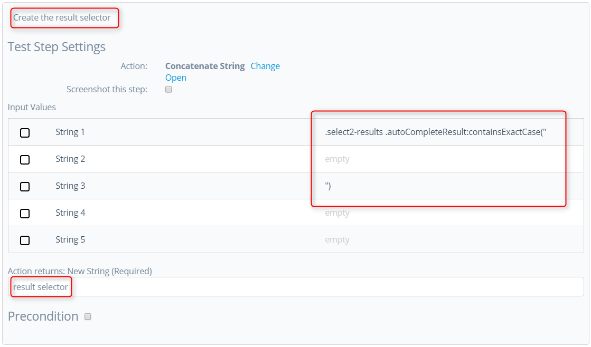

The `:containsExactCase` selector is a pseudo selector available in ATS. It is not an official jQuery selector and not available in standard jQuery. The difference is that the ExactCase selector is case sensitive.

Next, you add the _Find Element by Sizzle_ action. You also must use a filter selector to make sure ATS returns a visible element. The _Find Element by Sizzle_ action is a Core action. Connect the selector from step 7, enter the filter selector `:visible`, give a test step description and describe the output:

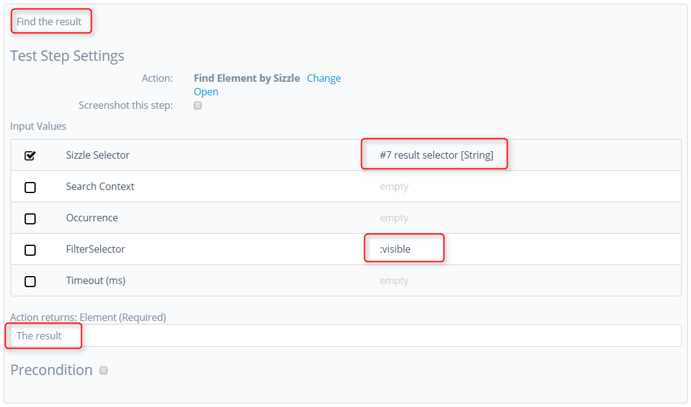

To make your action generic, it must also work in the situation that autocomplete is on. In this case, it is a necessity because the widget is not supported if the action does not cover all situations. 

Use the following ‘logic’:
_If the dropdown is present then you click the option, if the dropdown is not present the find and click are not executed._

Now click the precondition box in test step 8 and add the _Find Element by Sizzle_ action. Use the results element to verify if the dropdown is open. It is one of the class names you used earlier: `.select2-result`. Next, enter the `:visible` selector in the filter selector parameter. And last, set the timeout to 2000 milliseconds. 
The default timeout is 10 seconds. Setting the timeout to 2 seconds makes the precondition action faster if it fails. Only alter the timeout if it is a precondition, also keep in mind that 2 seconds is the minimum advised. The precondition will look like this:

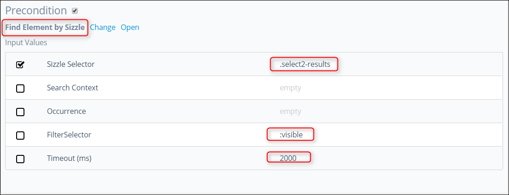

Next, add the _Click/Doubleclick_ action to click on the option found in test step 8. Enter the output from step 8 as input and give a proper description:

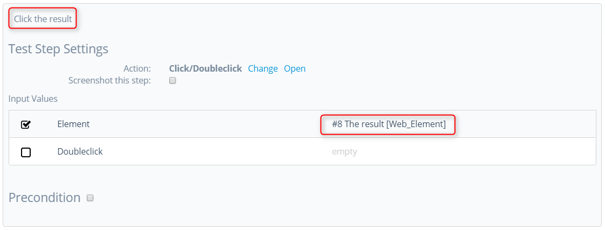

There is only one issue left, if test step 8 fails, test step 9 also fails. You must add a precondition to the _Click/Doubleclick_ action.

Use the following ‘logic’:
_If test step 8 fails or is not executed then don’t execute test step 9._

Click the precondition box at test step 9 and add the _Assert not null_ action, connect the output of test step 8. This way ATS only executes test step 9 if test step 8 was successful. It looks like this:

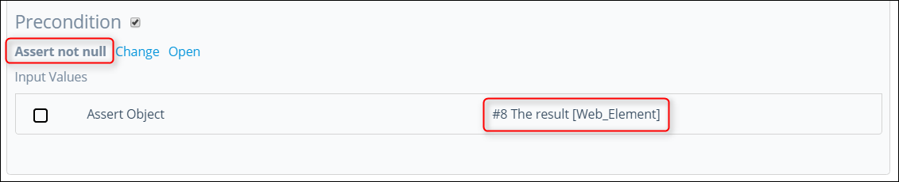

The action structure is now complete.

## 5 Action Parameters

Next, you add the action input parameters.
* Widget Name
* Value
* Search Context

{}
Keep the [guidelines for creating a custom action](../bestpractices/guidelines-custom-action) in mind while creating action parameters. 
{}

The Widget Name input parameter:

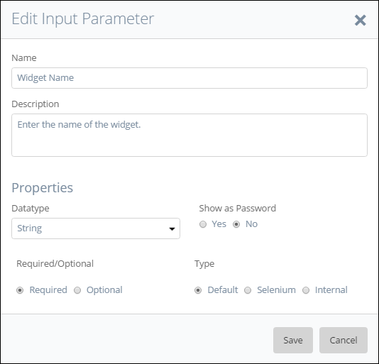

The Value input parameter:

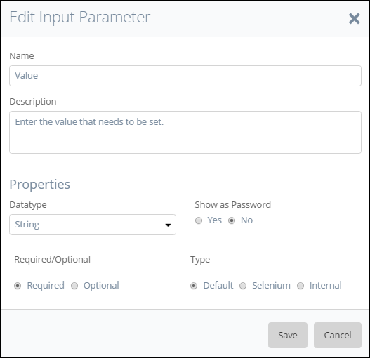

The Search Context input parameter:

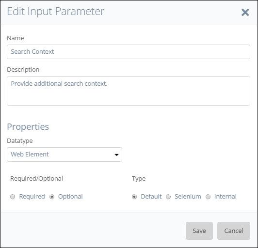

For this custom action, you don’t need an output parameter.

Next, you connect the input parameters to the correct actions. 

Start with the Widget Name and Search Context input parameters for the _Find/Assert Widget_ action:

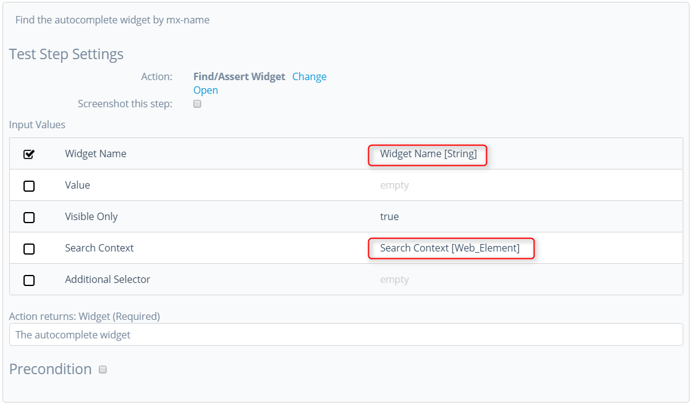

You connect the Value input parameter at test step 5. The _Send Keys_ action enters the text into the search field:

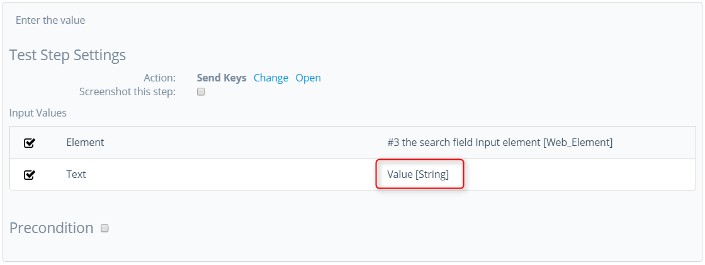

Last connect the Value input parameter at test step 7, to use in the selector for finding the option. You connect the Value input parameter to the _Concatenate String_ action:

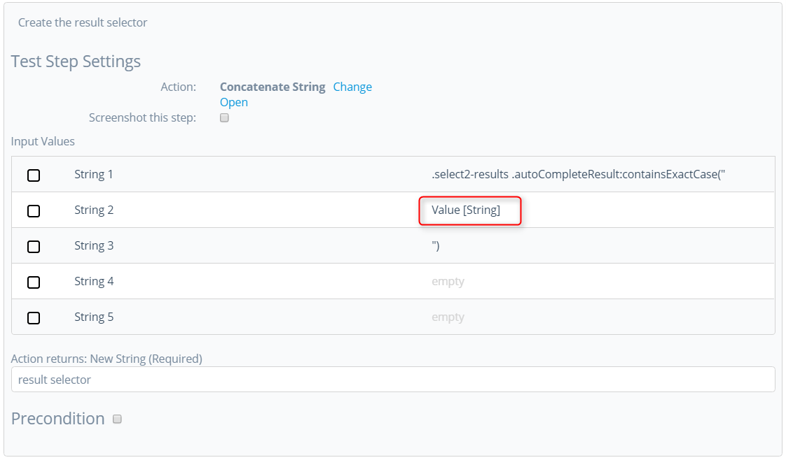

There is no need to add extra ‘Logic’ to this action. Its only selecting an option in the widget.

## 6 Final Check

Now check the following items:

*  Use of the ATS naming convention for parameters.
*  A clear description of test steps, input parameters, output parameters and action returns.
*  Interpunction usage in pieces of code (If used).
*  Use of datatypes on the different parameters to avoid errors.

After checking these items, you can run the test case that uses this action.

**Congratulations you created your own custom action!**

Now you created your own custom action for the AutoComplete widget.

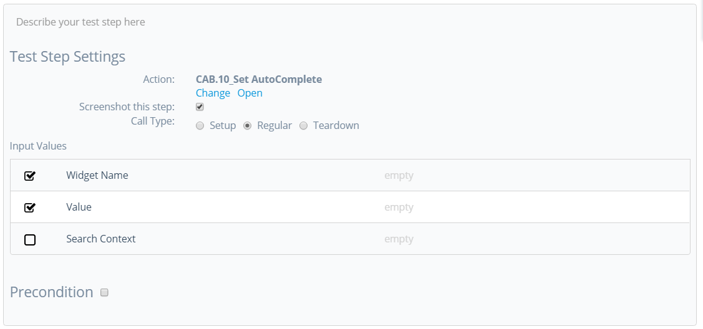