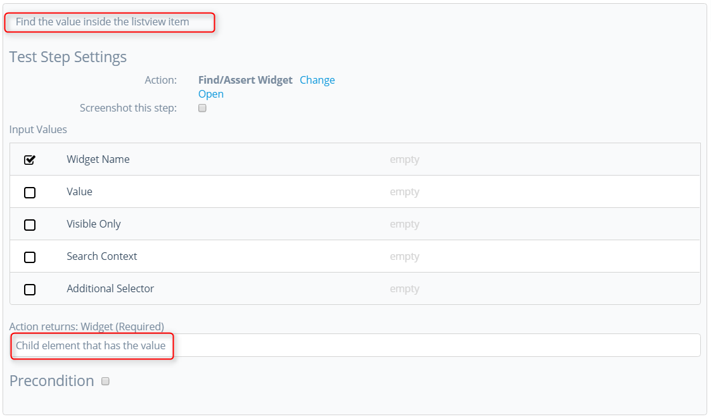
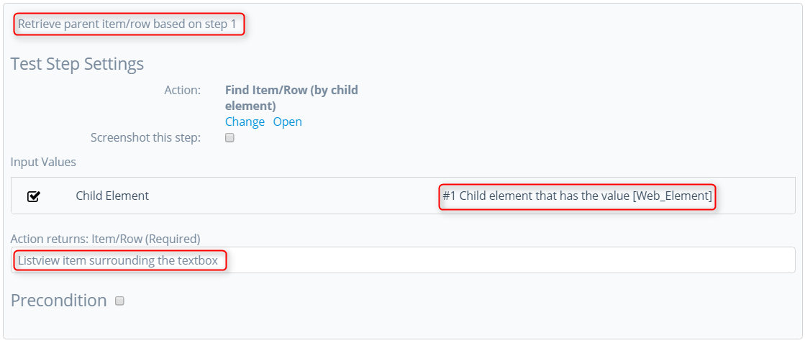
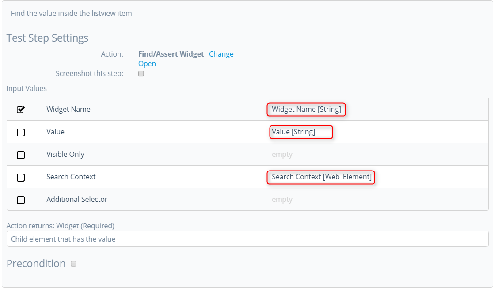
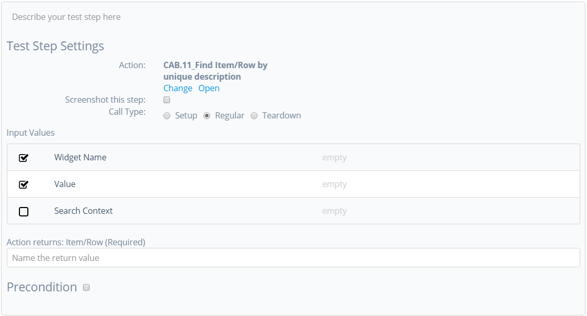

## 1 Introduction

This how-to explains step by step how to create a Search Context action. That returns an item/row based on a description inside that item/row. 

This how-to applies to all situations in which you must find an item/row using a unique text value inside. If you need to get an item/row by its child element you can follow this how-to. Keep in mind that it might need some adjustments!

**This how-to will teach you how to do the following:**
* Approach a situation where there are multiple widgets with the same `mx-name`.
* Create the custom action needed to return a Item/Row that is used to find the right widget.

## 2 Prerequisites

Before starting with this how-to, make sure you have the following prerequisites in place:

*  [Custom Action General Section](custom-action-general)

## 3 Define User Approach

First, you define the user approach, how do you find the widget. 
It is important to remember that you want to find an element that surrounds the widget. You use this element as Search Context for the action performing the event.

1. In this how-to, ATS must click this button:

However, there are multiple buttons on this page that have the same `mx-name`:

2. You use the recorder to see if there is a unique path to the button. In this case, if you click the button using the recorder, it uses `index-0` in the path:

 

The `index-0` is the `mx-name` of an item/row within a listview, templategrid etc. This is the unique element you use to find the button. 
The recorder uses `index-0` this is hard coded. The test case works, but as soon as you add an item to the grid, the test case breaks. 
To avoid this, you retrieve the item/row during the sessions, based on a text value. 

3. When you open the debugger, you see that the button is a child element of the listview item:

4. Now you found the unique element you want to retrieve. You cannot use the `mx-name` to find it. Then how do you find the element? 
You do this by looking for other unique elements within that listview item. There is a textbox inside the listview item that has a unique value. The textbox on itself has the `mx-name-textBox5` like in the other listview items. By adding the unique value to the search, you can find it. Combining the `mx-name` with the unique value ensures that the right element is found.

The text box as a child element of the listview item:

Summary:
-	ATS must find the textbox with the unique value.
-	Retrieve the parent listview item in session.
-	Return the listview item.

## 4 Action Structure

ATS has a Mendix action called [_Find Item/Row (by child element)_](../refguide-ats-1/find-itemrow-by-child) which finds the parent item/row of a widget. This action returns the listview item the element is currently in. The index number does not matter.

1. You use the [_Find/Assert Widget_](../refguide-ats-1/findassert-widget) action to find the textbox containing a specific value. Add the _Find/Assert Widget_ action, give a proper test step description and output description:

You create and connect the input parameters later.

2. Next, you use the _Find Item/Row (by child element)_ action to retrieve the listview item surrounding the textbox from test step 1. Add the action, give a proper test step description, output description and connect the output from test step 1:

3. The last step is you must return the found listview as an output parameter. To use the output parameter, you must add the [_Set the return value_](../refguide-ats-1/set-return-value) action and connect the output of test step 2. This action does not need any descriptions. The _Set Return Value_ action gives the connected input to the output parameter as a WebElement, because the item/row is a WebElement:

# 5 Action Parameters

Next, you add the action input and output parameters.

Input parameters:
* Widget Name
* Value
* Search Context

Output parameters:
* Item/Row

{}
Keep the [guidelines for creating a custom action](../bestpractices/guidelines-custom-action) in mind while creating action parameters. 
{}

1. The Widget Name input parameter:

2. The Value input parameter:

3. The Search Context input parameter:

4. The Item/Row output parameter:

5. Next, you connect the input parameters to the right actions. The input parameters are connected to the _Find/Assert Widget_ action:

There is no need to add ‘Logic’ to this custom action. Its only returning an item/row.

## 6 Final Check

Now check the following items:

*  Use of the ATS naming convention for parameters.
*  A clear description of test steps, input parameters, output parameters and action returns.
*  Interpunction usage in pieces of code (If used).
*  Use of datatypes on the different parameters to avoid errors.

After checking these items, you can run the test case that uses this action.

**Congratulations you created your own custom action!**

Now you created your own custom action to find an Item/Row by using a unique value.

