## 1 Introduction

This how-to explains how to create a test case, add test steps manually and add test steps using the ATS Recorder. A test case consists of test steps that contain actions. Each action performs a task, like clicking a button.

This how-to uses the company expenses app as an example. You create a test case that submits a new expense in the company expenses app. You create the same test case twice once manually and once with the ATS Recorder. 

**This how-to will teach you how to do the following:**
* Create a new test case
* Add test steps to your test case manually
* Add test steps using the ATS Recorder

## 2 Prerequisites

Before starting with this how-to, make sure you have the following prerequisites in place:

*  Completed [How to Get Started](getting-started)
*  Completed [How to Install the ATS Helper and ATS Recorder](install-ats-helper-recorder)

## 3 Create a Test Case

The following steps describe how to create a test case.

1.  Open your project in ATS and go to the **Repository**.
  
2.  Click **Add Test** inside the **Tests** tab.  
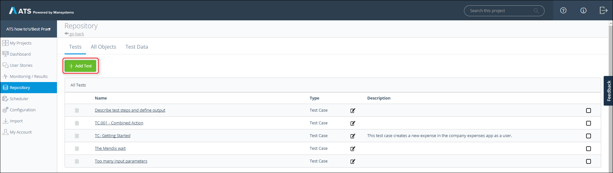
  
  You can also click **Add Item** inside the **All Objects** tab.  
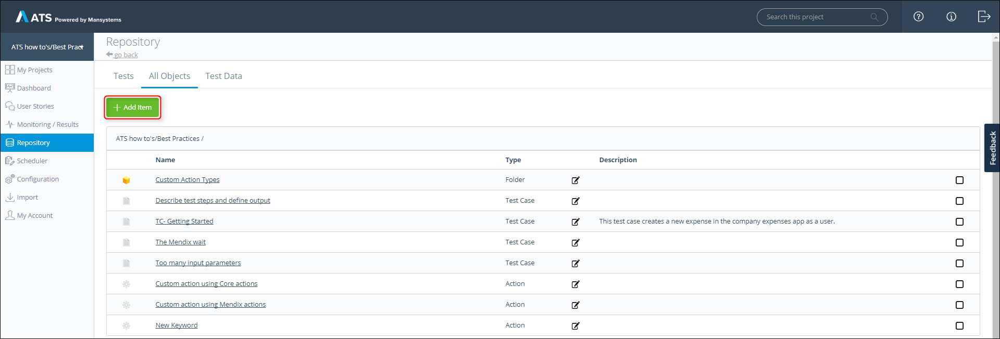
  
  Clicking either button opens the **Create new** pop-up dialog:    
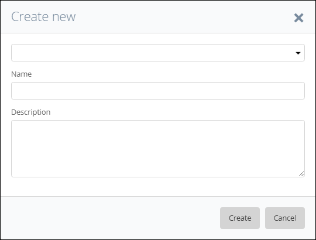
  
3.  Select **Test Case** in the drop-down menu.

4.  Enter a name in the **Name** field. For example, TC - 001.01 - Create new Expense (Manually)
    It is advisable to use a predefined naming structure.
    
5.  Enter a description in the **Description** field. For example, This test case creates a new expense in the company expenses app.
    It is advisable to give each test case a description of what it does.
    
6.  Click **Create**.

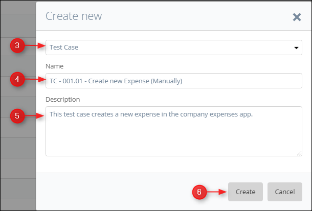

The **Test Case** page opens after you click **Create**. ATS displays the **Name** and **Description**  in the upper left corner of the **Test Case** page.

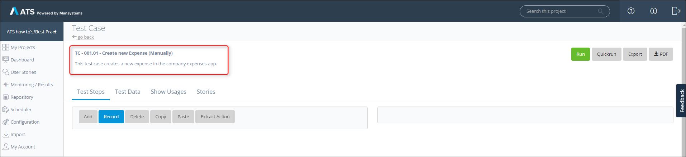

## 4 Add Test Steps manually

The following steps describe how to add test steps manually to your test case. You will add the steps necessary for creating a new expense in the company expenses app.

1.  Click **Add** on the **Test Case** page.

2.  The **Test Step Setup** pop-up dialog opens.

    The first step is opening the company expenses app. You do this by entering a URL in the browser. ATS does the same by using the _[Open Application](/refguide-ats-1/open-application)_ action.

3.  Enter a description of the test step in the **Describe Test Step** text box. For example: Open the company expenses app.

4.  Search for the _Open Application_ action in the **Search Action** text box.

    {}
    Use terms like _Find_, _Click_, _Set_, _Assert_ and _Get_ to find the right action. 
    {}

5.  Select the _Open Application_ action from the **Select an Action** datagrid. Choose the one for Mendix applications.

6.  Click **Save**.

  Now ATS adds the action to your test step.
7.  Double-click the input parameter **Application URL**.

  
8.  The **Edit Input Value** dialog box opens.
9.  Select **Global Constant**.
10.  Select **Application URL**.
11.  Click **Save**. 
 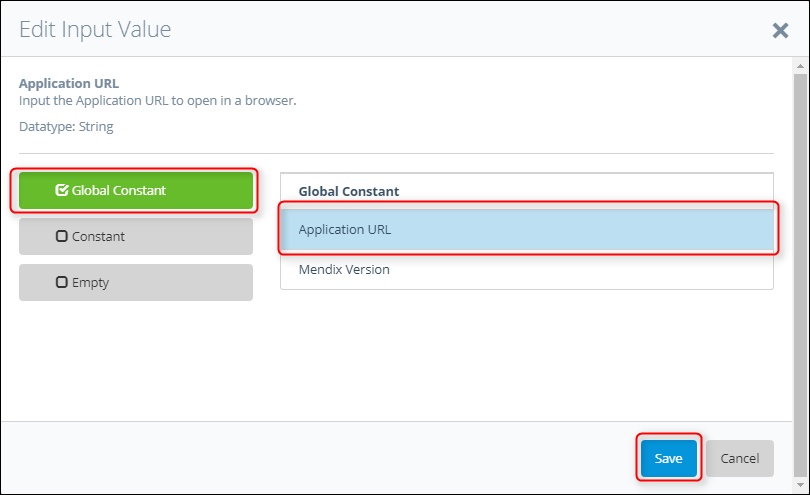

  ATS now uses the application URL you select in the **Run Configuration** application.
  
12.  After opening the application you must log in. ATS has a standard login action for logging in to a Mendix application that you must use, the _[Login](/refguide-ats-1/login)_ action. The login page of the company expenses app looks like this:
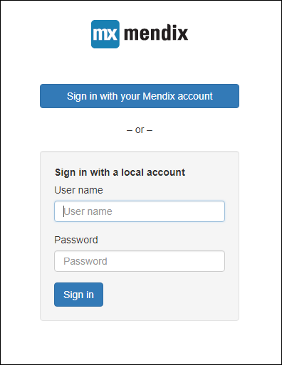

13. Inside your test case click **Add** again and add the _Login_ action.
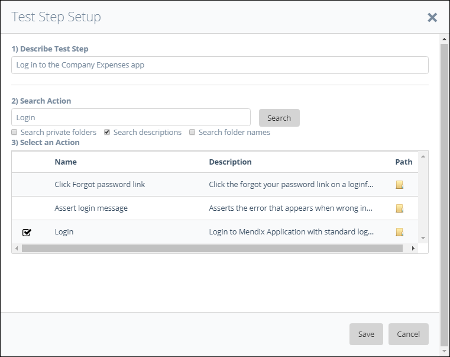

14.  Double-click the input parameter **Username** and add the username. 
15.  Double-click the input parameter **Password** and add the password.

16.  After logging in to the company expenses app the home page shows. To create a new expense you must click the **New Expense** button in the company expenses app. This means ATS must click the button. To get the information you need, open the ATS Helper and hover over the **New Expense** button while holding <kbd>Ctrl</kbd>. 
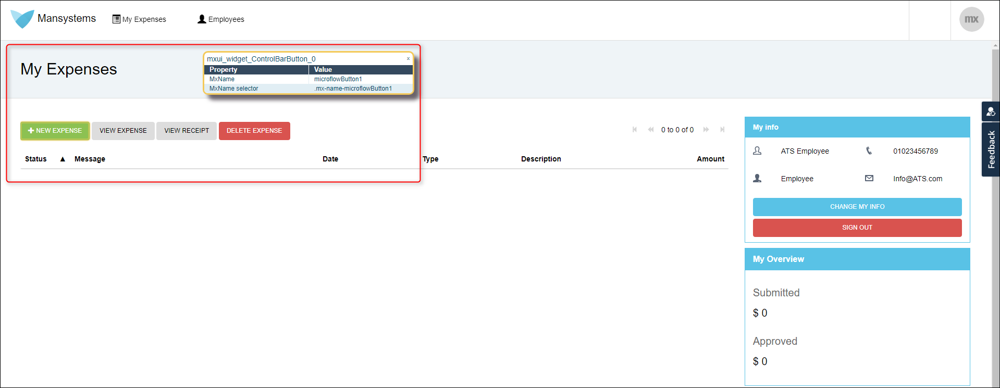

17.  ATS has an action that clicks a widget, the _[Click Widget](/refguide-ats-1/click-widget)_ action. Inside your test case click **Add** again and add the _Click Widget_ action.
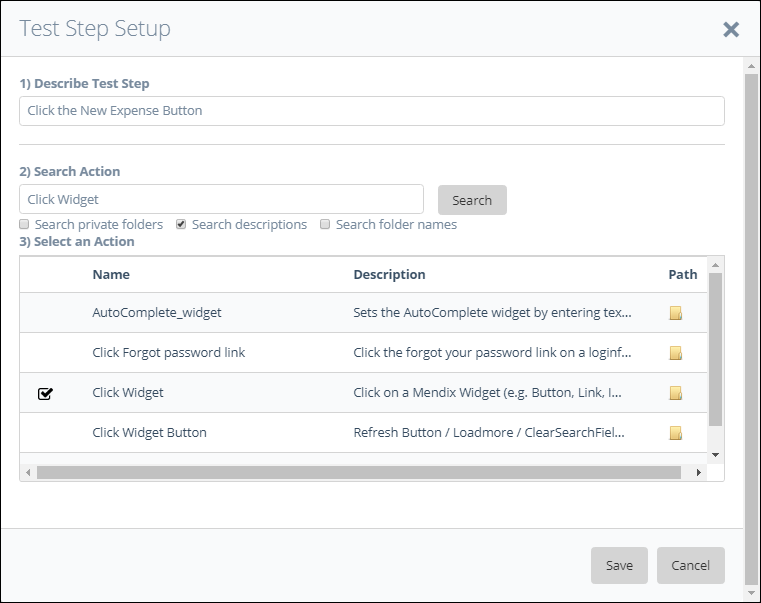

18.  Double-click the input parameter **Widget Name** and add the widget name displayed in the ATS Helper.
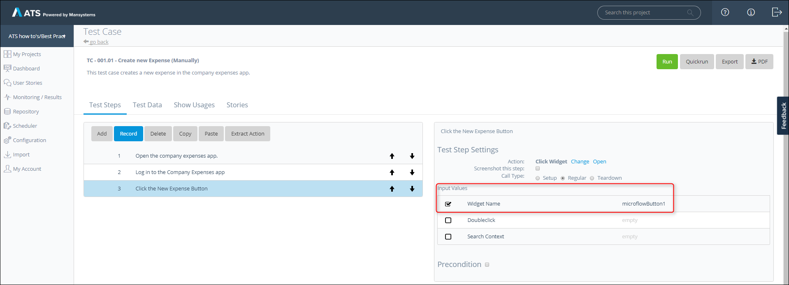

19.  After clicking the **New Expense** button in the company expenses app. A dialog box opens called **New Expense**.

20.  A user visually confirms that the dialog box appears. ATS has an action that finds and asserts a dialog box, the _[Find/Assert Dialog](/refguide-ats-1/findassert-dialog)_ action. Inside your test case click **Add** again and add the _Find/Assert Dialog_ action.

21.  Double-click the input parameter **Dialog Title** and add the title of the dialog box.
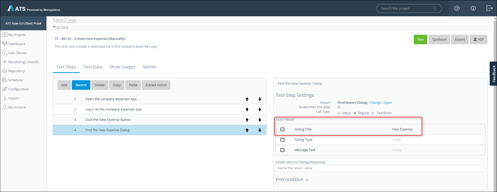

22.  To complete an expense you must enter an **Amount**, **Type**, **Description** and **Save & Submit** the expense.

23.  The **Amount** field is a Textbox widget, the **Type** field is a ReferenceSelector Widget and the **Description** field is a Textarea widget. ATS can interact with all these widgets using the _[Set Value](/refguide-ats-1/set-value)_ action. Inside your test case click **Add** and add the _Set Value_ action. Now select the test step with the _Set Value_ action, click **Copy** and click **Paste** two times. Now you have a test step for each field.

24.  Now use the ATS Helper on the **Amount** field in the company expenses app. Select test step 5 in your test case, fill in a test step description, enter the **Widget Name** and enter the **Value**.

25.  Now use the ATS Helper on the **Type** field in the company expenses app. Select test step 6 in your test case, fill in a test step description, enter the **Widget Name** and enter the **Value**.

26.  Now use the ATS Helper on the **Description** field in the company expenses app. Select test step 7 in your test case, fill in a test step description, enter the **Widget Name** and enter the **Value**.

27.  To submit the new expense you must click the **Save & Submit** button. 

28.  Inside your test case click **Add**, add the _Click Widget_ action, fill in a test step description and enter the **Widget Name**.

29.  Now you must confirm that the expense is successfully submitted. In the company expenses app, a submitted expense appears in the _[Find/Assert DataGrid Row](/refguide-ats-1/findassert-datagrid-row)_ action. Inside your test case click **Add** and add the _Find/Assert Datagrid Row_ action.
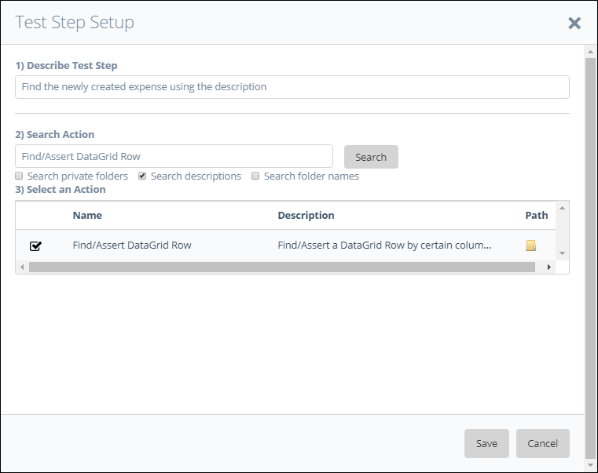

30.  Now use the ATS Helper to find the **Widget Name** of the datagrid in the company expenses app.

31.  Also use the ATS Helper to find the **Column Name** of the **Description** column.

32.  Now double-click the parameters and add the correct information. 
  * The **Widget Name** parameter and add the widget name. 
  * The **Column 1 Name** parameter and enter the column name.
  * The **Column 1 Value** parameter and enter the description.
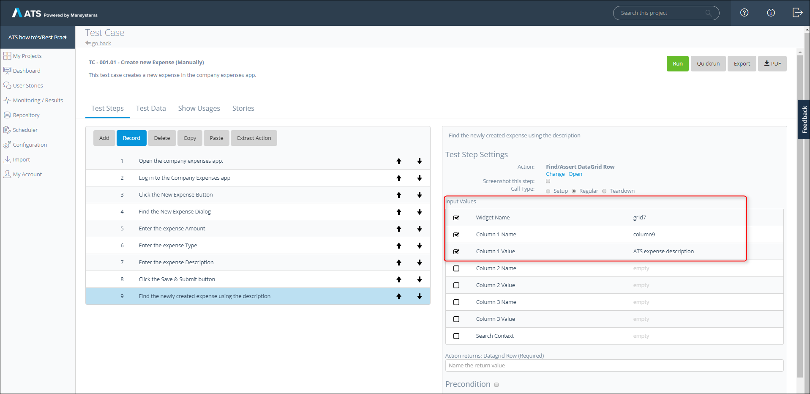

33. The last step of your test case is to end your user session by logging out. ATS has two ways to log out of your application.
  * ATS clicks the Logout button.
  * ATS uses the _[Logout](/refguide-ats-1/logout)_ action. 
   The _Logout_ action is a hard log out, meaning that no matter where ATS is inside your application it always logs out. 
   Inside your test case click **Add** and add the _Logout_ action.
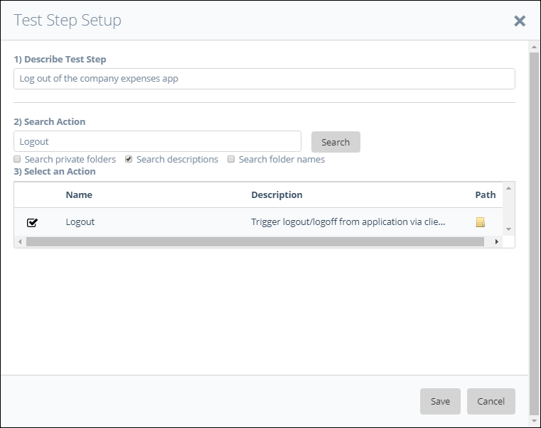

  Now you added all the test steps for your test case.
  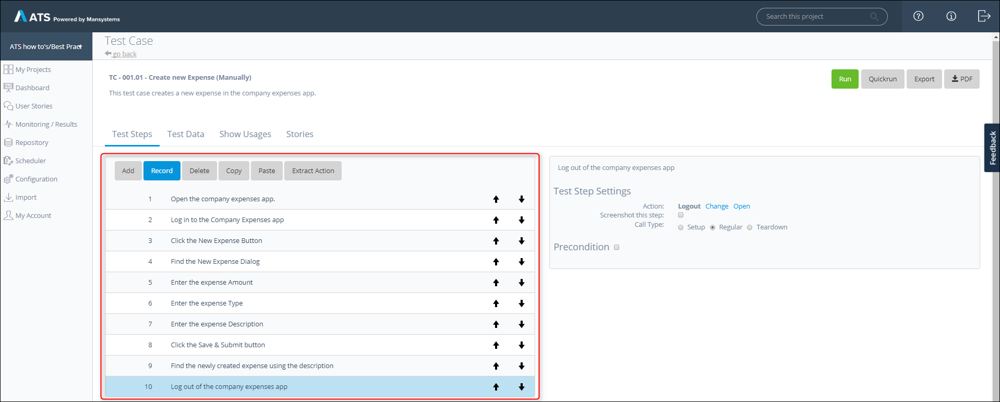
  
34. The last thing to do is to clarify to ATS what you are testing. This is done by setting the **Call Type** of your test steps.
  * **Setup** for all the steps that you must perform to get to the test situation.
  * **Regular** for all the steps that are part of your test situation.
  * **Teardown** for all steps that are necessary to clean up.
  
  Test step 1 and test step 2 must have the **Call Type:** **Setup**.
  Test step 3-9 must have the **Call Type:** **Regular**.
  Test step 10 must have the **Call Type:** **Teardown**.
  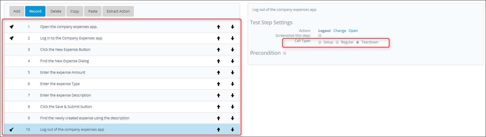
  
  You now created your test case manually.

## 5 Add Test Steps using the ATS Recorder

The following steps describe how to add test steps to your test case using the [ATS Recorder](/refguide-ats-1/recorder). You add the steps necessary for creating a new expense in the company expenses app. Create a new test case by following chapter 3 before starting with this chapter.

1.  Click **Record** on the **Test Case** page.

  This opens the **Recording Session** page.
  

2.  Now open a new page in your browser and enter the URL of your Mendix app. When you go back to ATS you see that ATS recorded the URL and the _Open Application_ action.

3.  Next go back to the company expenses app and enter your login credentials. 

4.  Click the **New Expense** button.

5.  Enter an expense amount in the **Amount** field.

6.  Enter an expense type in the **Type** field.

7. Enter an expense description in the **Description** field.

8.  Click the **Save & Submit** button.

9.  Inside the datagrid, click the description in the **Description** column of your expense to simulate an assert.
 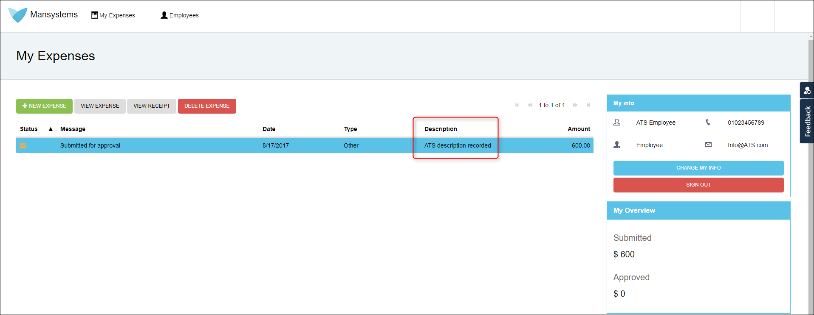

10.  Click the **Sign Out** button.

  On the **Recording Session** page you see that all the steps are recorded by ATS.
  
  
11.  Now click **Save** to save the test steps into your test case.

12.  Now you must set the input parameter **Application URL** of the _Open Application_ action to the **Global Constant**, **Application URL**.
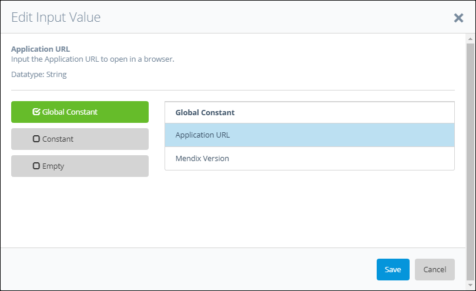

13.  Next, you must manually add the **New Expense** dialog box, you cannot record this. You must add the action between test step 3 and test step 4.
A user visually confirms that the dialog box appears. ATS has an action that finds and asserts a dialog box, the _[Find/Assert Dialog](/refguide-ats-1/findassert-dialog)_ action. Inside your test case click **Add** again and add the _Find/Assert Dialog_ action.

    {}
    You can also add actions manually between recording sessions. 
    {}

14.  Double-click the input parameter **Dialog Title** and add the title of the dialog box.

15.  For the log out you can choose to keep the recorded click on the **Sign Out** button or replace it with the **Logout** action.

16.  The last thing to do is to clarify to ATS what you are testing. This is done by setting the **Call Type** of your test steps.
  * **Setup** for all the steps that you must perform to get to the test situation.
  * **Regular** for all the steps that are part of your test situation.
  * **Teardown** for all steps that are necessary to clean up.
  
  Test step 1 and test step 2 must have the **Call Type:** **Setup**.
  Test step 3-9 must have the **Call Type:** **Regular**.
  Test step 10 must have the **Call Type:** **Teardown**.

  You now created your test case using the ATS Recorder.

   

