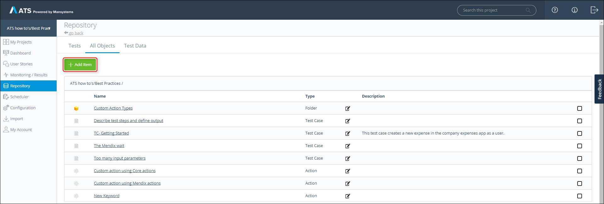
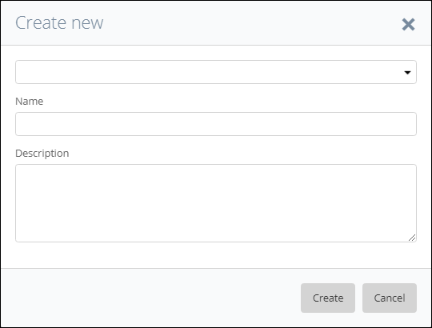
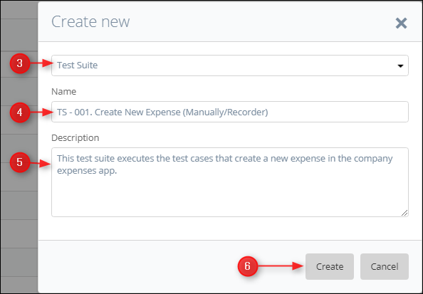
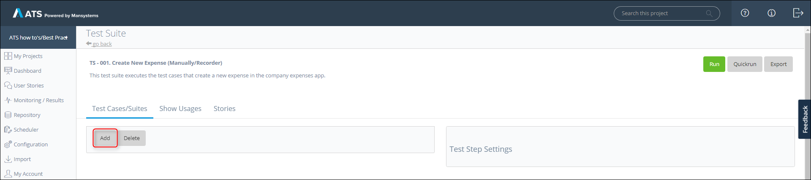
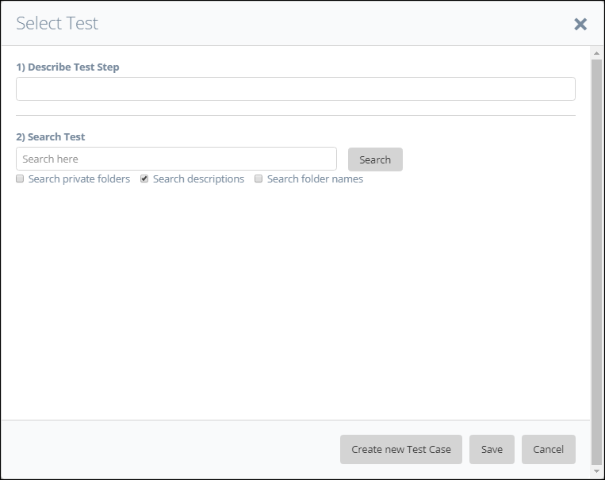
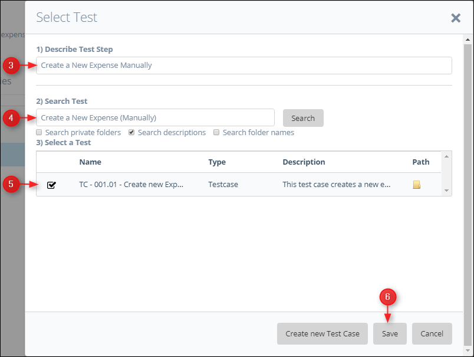

## 1 Introduction

This how-to describes how to create a test suite in ATS. A test suite enables the user to execute test cases and test suites in a specific order. You can add test steps to your test suite and link a test case or test suite to that test step. ATS executes the test steps in the same way as a test case.

This how-to uses the company expenses app as an example. You create a test suite and add the test cases you created in the how-to, [How to Create a Test Case](create-a-test-case). If you don't have them anymore, create two new test cases without any test steps to walk through this how-to. 

**This how-to will teach you  how to do the following:**
* Create a test suite
* Add test cases/test suites to a test suite

## 2 Prerequisites

Before starting with this how-to, make sure you have the following prerequisites in place:

* Completed [How to Get Started](getting-started)
* Completed [How to Create a Test Case](create-a-test-case)

## 3 Create a Test Suite

The following steps describe how to create a test suite.

1.  Open your project in ATS and go to the **Repository**.

2.  Click **Add Test** inside the **Tests** tab.
    
    

  You can also click **Add Item** inside the **All Objects** tab.
    
    

  Clicking either button opens the **Create new** pop-up dialog:
    
    

3.  Select **Test Suite** in the drop-down menu.
4.  Enter a name in the **Name** field.
    It is advisable to use a predefined naming structure.
    
5.  Enter a description in the **Description** field.
    It is advisable to give each test suite a description of what it does.
    
6.  Click **Create**.
    
    

The **Test Suite** page opens after you click **Create**. ATS displays the **Name** and **Description**  in the upper left corner of the **Test Suite** page. The **Test Suite** page looks like the **Test Case** page, but with fewer options:
    

    
## 4 Add existing Test Cases/Test Suites to a Test Suite

The following steps describe how to add a test case or test suite to a test suite.

1.  Click **Add** on the **Test Suite** page.
    
    

2.  The **Select Test** pop-up dialog opens:
    
    

  You can add an existing test case/test suite to the test suite or create a new test case and   add this to the test suite. 
  
 To add an existing test case/test suite execute the following steps:
3.  Enter a description of the test step in the **Describe Test Step** field.
4.  Use the **Search Test** field to search for a test case or test suite you want to add to your test suite.
5.  Select the test from the **Select a Test** datagrid. 
6.  Click **Save**.
    
    

Repeat this process for the Recorder test case to complete your test suite. You now completed the test suite, see the next chapter for information on how to add a new test case.

## 5 Add new Test Cases/Test Suites to a Test Suite
  To create a new test case execute the following steps:
7.  Click **Create a new Test Case** and follow the [How to Create a Test Case](create-a-test-case) how-to.
    

Now you created a test suite and added test cases. You can add as many test cases and test suites as you want. 

