## 1 Introduction

This how-to explains the basics of creating a custom action. You must complete this how-to before proceeding with the how to create a custom action how-to's.

**This how-to will teach you how to do the following:**
*  Create a Custom Action
*  Add Parameters 
*  Connect Parameters

## 2 Prerequisites

Before starting with this how-to, make sure you have the following prerequisites in place:

*  General knowledge of ATS.
*  Completed [How to Get Started](getting-started)
*  Completed [How to Create a Test Case](create-a-test-case)
*  Read [The Guidelines for Creating a Custom Action](/bestpractices/guidelines-custom-action)

## 3 Create a Custom Action

The following steps describe how to create a custom action. There are two ways of creating a custom action.

*  Using the **Add Item** button in the **Repository**.
*  Using the **Extract Action** button.

### 3.1 Using the **Add Item** button in the **Repository**
1.  Open your project in ATS and go to the **Repository**.

2.  Click **Add Item** in the **All Objects** tab.
    
    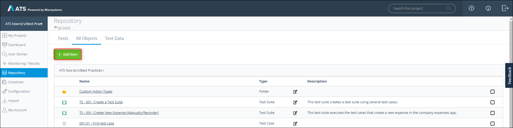

  This opens the **Create new** pop-up dialog.
    
    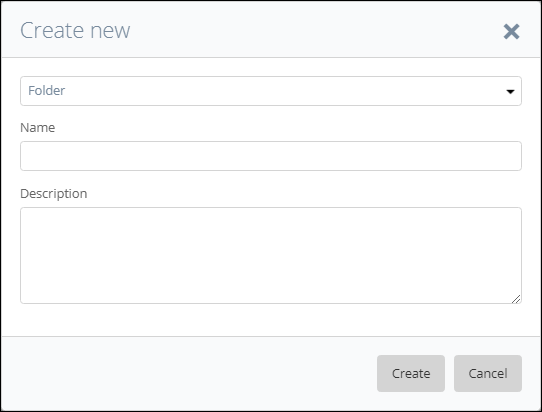

3.  Select **Action** in the drop-down menu.

4.  Enter a name in the **Name** field. For example, Set Drop-Down.
    It is advisable to use a name that tells you what the action does.
    
5.  Enter a description in the **Description** field. For example, This action sets the drop-down menu to a specific value.
    It is advisable to give each action a detailed description of what it does.

6.  Click **Create**.
    
    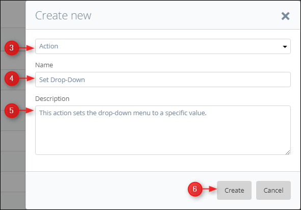

You now created a custom action from the repository.

### 3.2 Using the **Extract Action** button.
1.  Open your project in ATS and go to the **Repository**.

2.  Select a test case or action and open it.

3.  Select the test steps you want to combine in a custom action by holding <kbd>Ctrl</kbd> while clicking on the test steps.

4.  Click **Extract Action**
    
    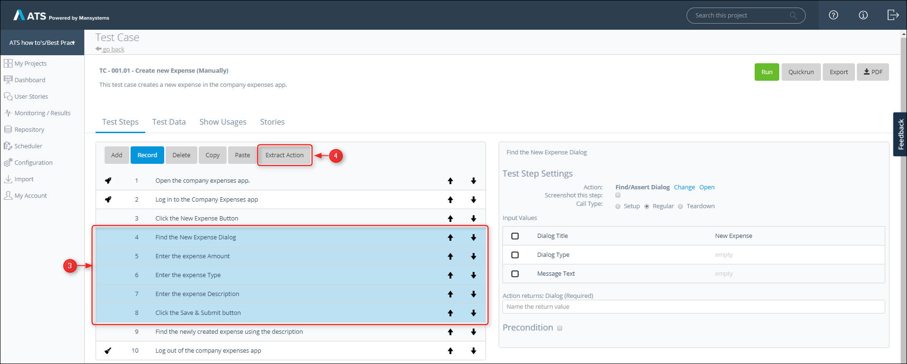

  The **Action - Set Details** dialog box opens.
5.  Enter a name in the **Name** field. For example, Set Drop-Down.
    It is advisable to use a name that tells you what the action does.
    
6.  Enter a description in the **Description** field. For example, This action sets the drop-down menu to a specific value.
    It is advisable to give each action a detailed description of what it does.
    
7.  Click **Close**.
    
    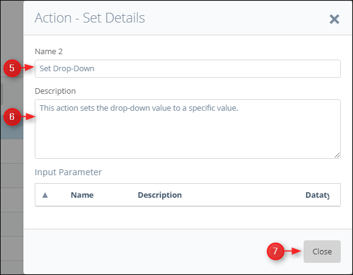

8.  Select the newly created action and click **Open**.
    
    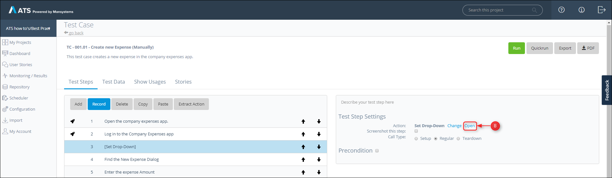

Both ways open the **Edit Action** page. The page works the same as the **Test Case** page, you can add test steps by clicking **Add** or **Record**.

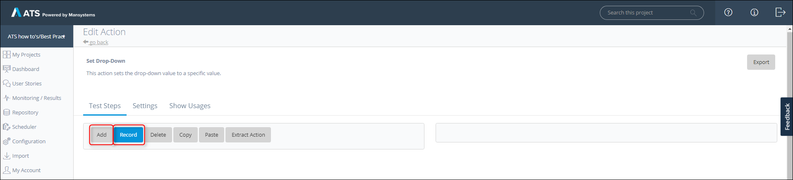

You now know how to create a custom action.

## 4 Add Parameters

The following steps describe how to add parameters to your custom action.

1.  Go to the **Edit Action** page of your action.

2.  Click the **Settings** tab.
    
    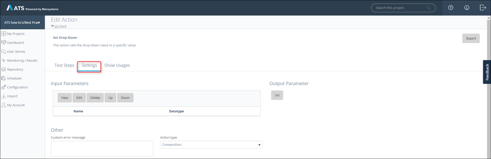

### 4.1 Add Input Parameters

1.  Click **New**.
    
    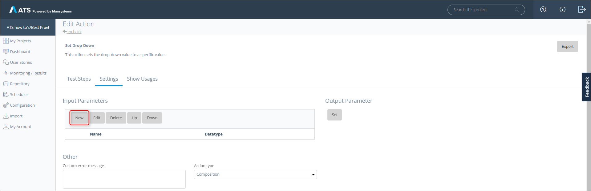

  The **Edit Input Parameter** dialog box opens.

2.  Enter a name in the **Name** field. For example, Widget Name.

  {}

  Use the ATS naming convention

  {}

3.  Enter a description in the **Description** field. For example, Enter the name of the widget.

  {}

  You must make sure everybody understands what information they must enter.

  {}
  
4.  Select a datatype from the **Datatype** drop-down menu. For example, _String_.

5.  Select a **Show as Password** option. This makes the parameter field unreadable, default setting is **No**.

6.  Select a **Required/Optional** option. For example, the **Widget Name** parameter is always required otherwise the action does not work.

7.  Leave the **Type** field to **Default**.

8.  Click **Save**.
    
    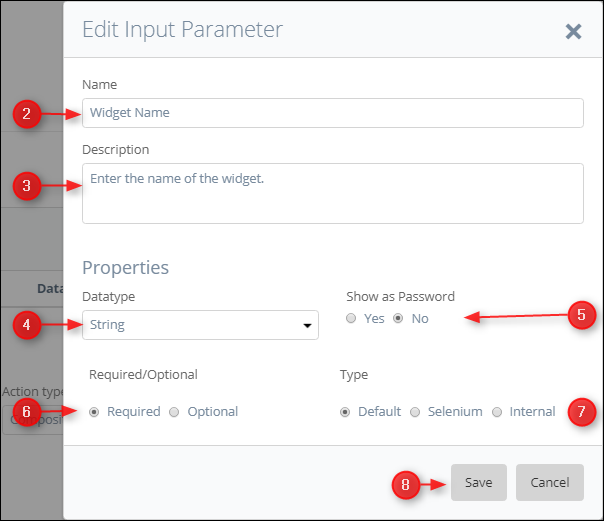

You created an input parameter. You can add as many input parameters as you need, but remember to keep the action simple.

### 4.2 Add an Output parameter

1.  Click **Set**.
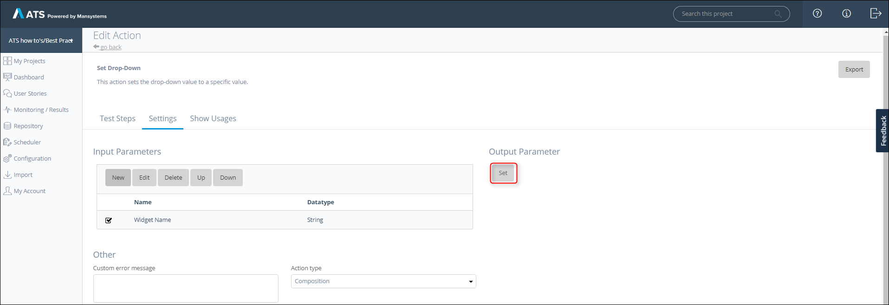

  This the different **Output Parameter** fields.

2.  Enter a name in the **Name** field. For example, Element.

  {}

  The user must know what the action returns, so be clear.

  {}
  
3.  Enter a description in the **Description** field. Use this field to give a more detailed description of what is returned.

4.  Select a datatype from the **Datatype** drop-down menu. For example, _Web Element_.

5.  Select a **Required/Optional** option. Only use **Optional** if the action still works if nothing is returned.
    
    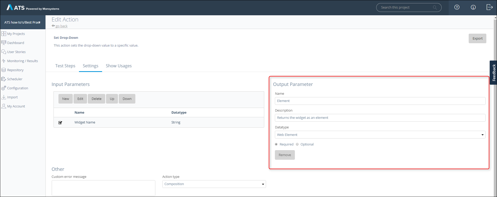

6.  The **Output Parameter** requires additional steps. Go to the **Test Steps** tab and click **Add**.

7.  Add the _[Find/Assert Widget](/refguide-ats-1/findassert-widget)_ action and the _[Set Return Value](/refguide-ats-1/set-return-value)_ action.
    
    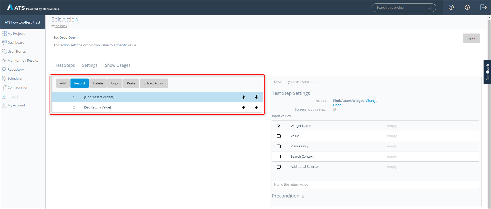

8.  For ATS to return the outcome of a test step as **Output Parameter** it needs to know what it must return. ATS returns the **Value** connected to the _Set Return Value_ action. Now connect the outcome of test step 1 to the _Set Return Value_ action.
    
    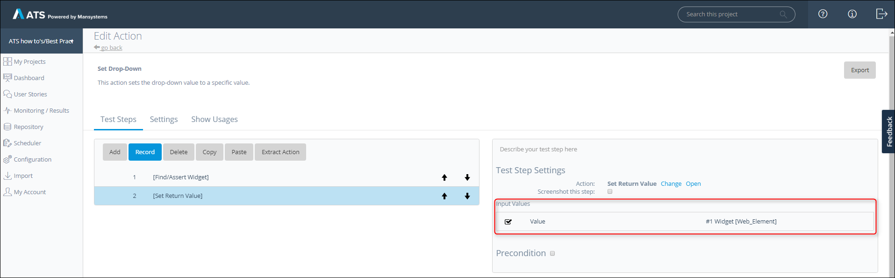

  ATS now returns the outcome of test step 1.
  
  {}

  Make sure the datatype of the **Output Parameter** corresponds with datatype of the connected outcome.

  {}

You now know how to add parameters to your custom action.

## 5 Connect the Input Parameters

The following steps describe how to connect the input parameter.

1.  Select the test step you want to connect an input parameter to.

2.  Open the **Edit Input Value** dialog box. 
    
    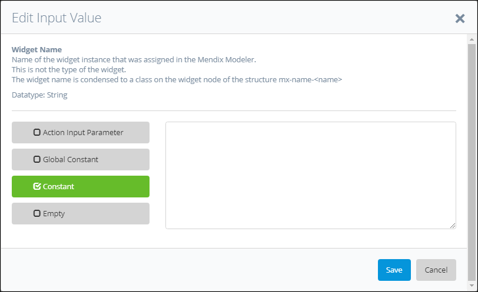

3.  Click **Action Input Parameter** and select the input parameter you want to connect.

4.  Click **Save**
    
    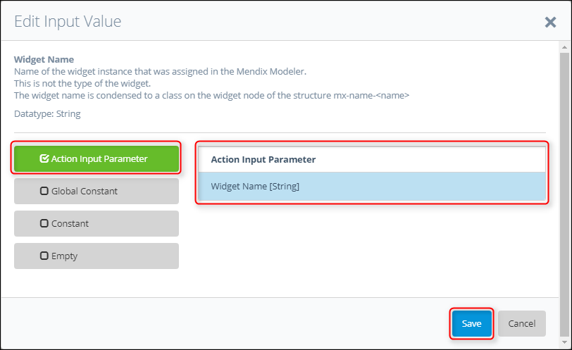

You now connected your input parameter.

 