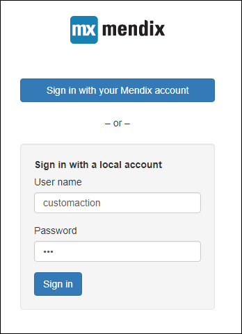
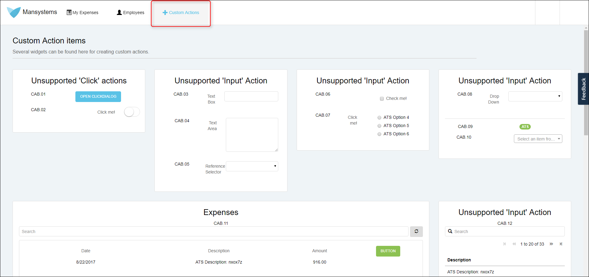

## 1 Introduction

This document explains how the Custom Action App works. All Custom Action how-to's are based on the Custom Action App. You can follow the how-to's in the Custom Action App for a better understanding.

## 3 The Login Information

The Custom Action App is a modified Company Expenses sample app. You need the following information to gain access.

| 
| :--- | :--- |
| **URL** | [Custom Action App](https://customactionapp.mxapps.io) |
| **Username** | customaction |
| **Password** | 123 |

_The login screen_

The app has only one account that has no log in limitations, meaning that every one can use this account to look inside the app.

Every night (GMT) the newly created expenses are deleted by ATS. The 30 initial expenses are considered Core Data and are also maintained by ATS.

## 4 The Main Page

When you log in for the first time you see the expense page. On this page, you can create new expenses or delete expenses. This page is used to create the How-To's for combined actions.

## 5 The Custom Action Page

Click on the **Custom Actions** tab to open up the page.

All How-To's for unsupported widget actions and search context actions are based on widgets that are available on this page. Each how-to has a title that corresponds with a widget on this page. For example, CAB.02 - Switch is based on the switch widget on this page. This allows you to follow the how-to directly in the app to get a better understanding of why and how. 

Also feel free to try and solve them yourselves, but don't forget to verify you did it in the correct manner. 
