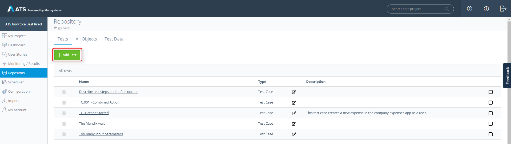
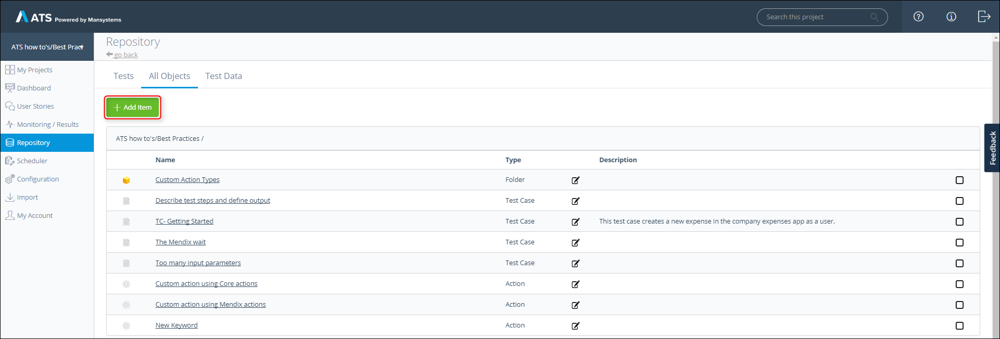
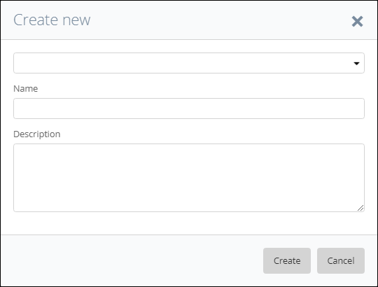
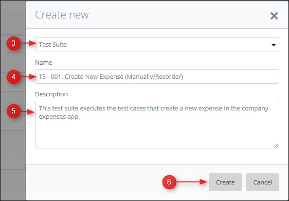
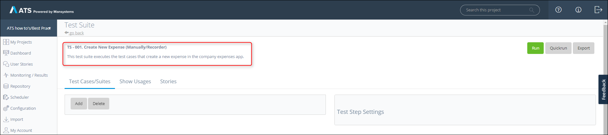
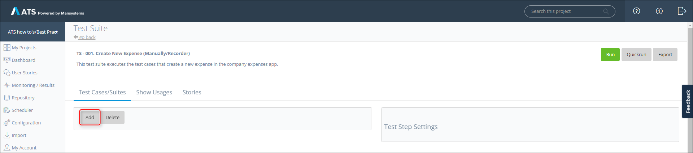
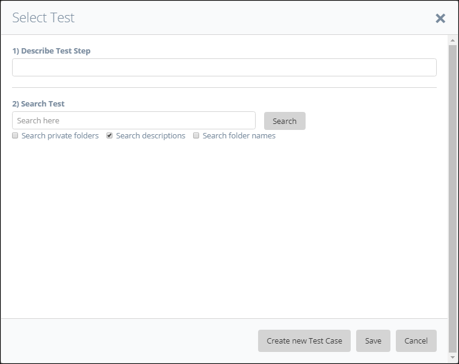
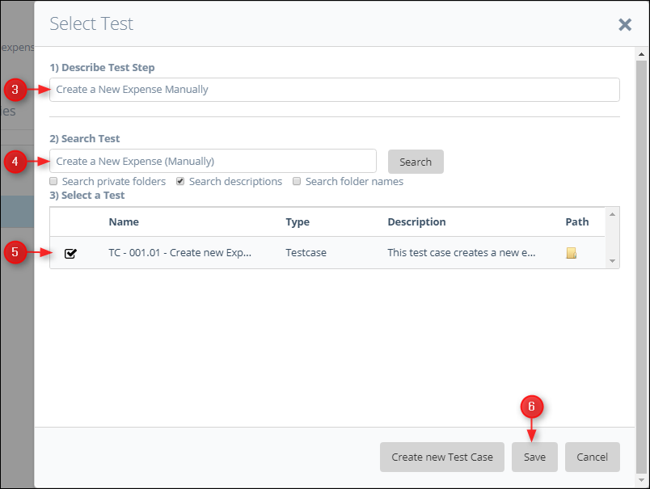
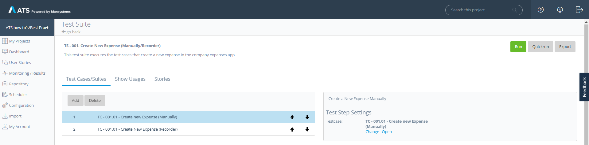
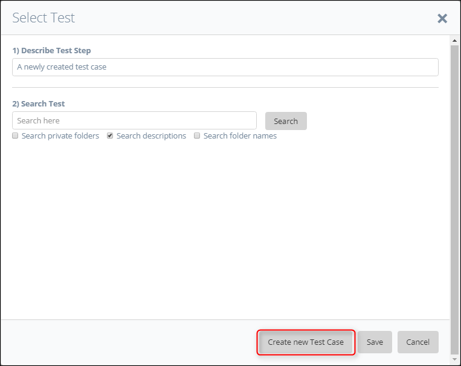

## 1 Introduction

A test suite enables the user to execute test cases and test suites in a specific order. You can add test steps to your test suite and link a test case or another test suite to that test step. ATS executes the test steps in the same way as a test case.

This how-to uses the Company Expenses app as an example. You will create a test suite and add the test cases you created in [How to Create a Test Case](create-a-test-case). If you don't have them anymore, create two new test cases without any test steps to walk through this how-to. 

**This how-to will teach you how to do the following:**

* Create a test suite
* Add test cases and test suites to a test suite

## 2 Prerequisites

Before starting this how-to, make sure you have completed the following prerequisites:

* Complete [How to Get Started](getting-started)
* Complete [How to Create a Test Case](create-a-test-case)

## 3 Create a Test Suite

To create a test suite, follow these steps:

1.  Open your project in ATS and go to the **Repository**.
2.  Click **Add Test** inside the **Tests** tab:
    
    

    You can also click **Add Item** inside the **All Objects** tab:
    
    

    Clicking either button opens the **Create new** dialog box:
    
    

3.  Select **Test Suite** in the drop-down menu.
4.  Enter a name in the **Name** field. It is advisable to use a predefined naming structure.
5.  Enter a description in the **Description** field. It is advisable to give each test suite a description of what it does.
6.  Click **Create**.
    
    

The **Test Suite** page opens after you click **Create**. ATS displays the **Name** and **Description** in the upper-left corner of the Test Suite page.

The **Test Suite** page looks like the **Test Case** page, but with fewer options:
    

    
## 4 Add Existing Test Cases and Test Suites to a Test Suite

To add a test case or another test suite to a test suite, follow these steps:

1.  Click **Add** on the **Test Suite** page.
    
    

2.  The **Select Test** pop-up dialog opens:
    
    

You can add an existing test case or test suite to the test suite, or you can create a new test case and add this to the test suite.
  
To add an existing test case or test suite, follow these steps:

1.  Enter a description of the test step in the **Describe Test Step** field.
2.  Use the **Search Test** field to search for the test case or test suite you want to add to your test suite.
3.  Select the test from the **Select a Test** data grid. 
4.  Click **Save**:
    
    

Repeat this process for the Recorder test case to complete your test suite.

You have now completed the test suite. In the next section, you will add a new test case.

## 5 Adding New Test Cases or Test Suites to a Test Suite

To create a new test case, click **Create a new Test Case**, and complete [How to Create a Test Case](create-a-test-case).
    

{}
You can add as many test cases and test suites as you want. 
{}

## 6 Next up

You now learned how to create a test suite. The next how-to is [How to Create Custom Actions](create-custom-actions) this how-to covers creating your own actions. You can also proceed with [Upload a file in your app using ATS](upload-file-using-ats-1). You find an overview of all the how-tos and the structure on the [ATS 1 How-To's](ht-version-1) page. We advise you to follow the predefined structure. 