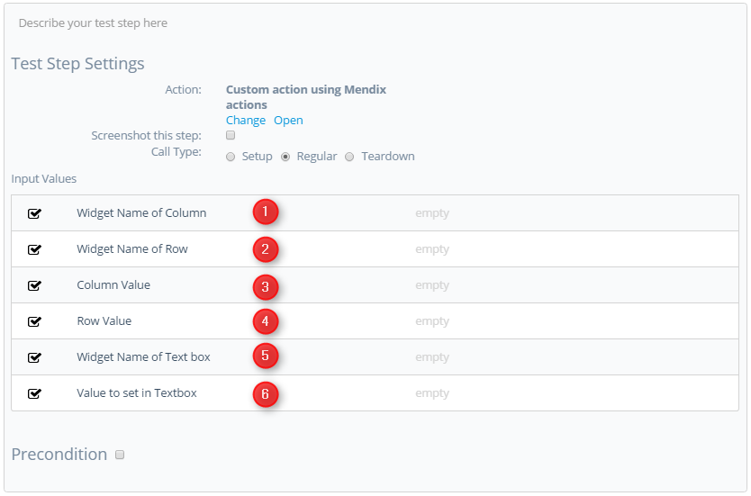
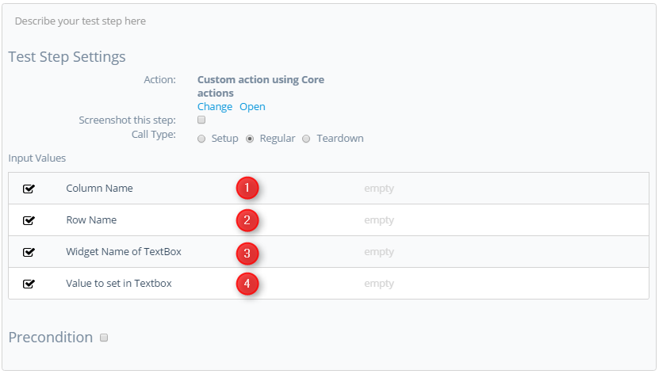
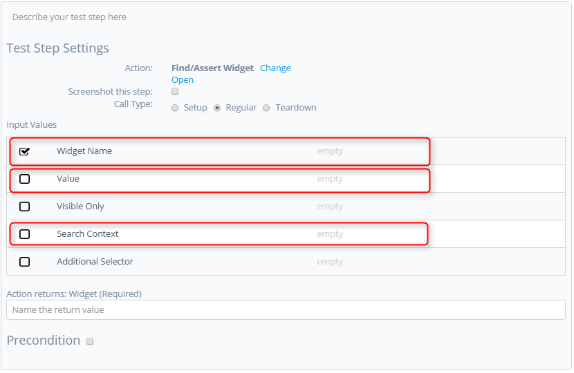
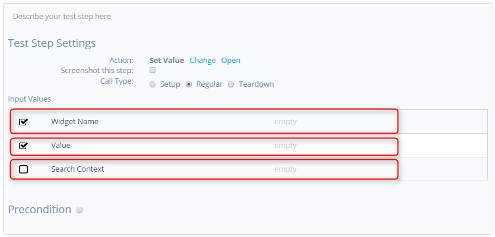

For a details on custom actions, please see [Custom Actions](/ats/refguide/rg-version-1/custom-actions) in the ATS Reference Guide 1.
 
These are the definitions of Mendix actions and Core actions:

* Mendix actions are a combination [Mendix actions](/ats/refguide/rg-version-1/mendix-actions) and [Mendix App Store widget actions](/ats/refguide/rg-version-1/mendix-appstore-widgets-actions)
* Core actions are a combination of [ATS Core actions](/ats/refguide/rg-version-1/ats-core-actions) and [Selenium actions](/ats/refguide/rg-version-1/selenium-actions)

{}

These are guidelines, not rules. It is possible that you will encounter situations in which the guidelines cannot be followed.

{}

## 1 Using Mendix Actions

Always try to use a Mendix action first. This table explains why you should use a Mendix action:

| Reason | Description |
| :--- | :--- |
| Automatic context | A Mendix action will automatically adjust to the Mendix Platform, ensuring that it will work correctly. | 
| Visibility checks | A Mendix action only searches for elements that are _visible_. |
| Browser support | A Mendix action always works in the supported browser. |
| Mendix support | A Mendix action always works on the latest version of Mendix. |
| Waiting for background processes | A Mendix action waits untill the Mendix app is finished rendering. This aspect is also covered by the [Mendix Wait](/ats/refguide/rg-version-1/mendix-wait) action.  |

However, there are reasons not to use the Mendix actions. For example, sometimes a custom action can get too complex using a Mendix action, because of the input parameters that are required. For example, when using a Mendix action, you have six input parameters:

But when you use a Core action, you have four input parameters: 

The difference is because of the required **Widget Name** input parameter in a Mendix action. When you use a Core action, this is not always required. So if you don't need the widget name, a Core action is a better solution. This is a valid reason to use the Core actions; otherwise, the custom action is not user-friendly.

## 2 Using Visual/Optical Components

Only use items that are visually present on the page, like the text inside a certain widget. Sometimes it seems easier to use an attribute or a certain class from a widget, but doing this right the first time will save you time in the future. Invest the time and use the visual components instead of taking the easy way out.

This is a visual component:

{}

This guideline focuses on how to find certain widgets.

{}

## 3 The User Approach

When building a custom action, always think about what the user does. In addition, keep in mind the things you do without performing an event, like reading a data grid, as these are important when building Search Context Actions.

Some examples of questions you should ask yourself are:

* How do I find the widget using visual components?
* How do I trigger an event? (Clicking, entering text, etc.)

Another example is with a check box. Do not set it using the JavaScript check function, but click it, because that's what a user would do. If you want to set the check box based on its current state, use the precondition and the click action. By doing this, you invest time in a more complex solution to save time later.

## 4 Building It Generically

When building an action for an unsupported widget, keep in mind that the action should work on the widget on every occasion. When a widget has two ways for entering information, use the most obvious one. For example, when using jQuery to find child nodes, make sure you use the generic aspects of the child node to specify it. Some class names are application-specific, and you cannot use them. You don’t want to have to rebuild this when you need it for another application.

This also applies to optional components in the class name. Some widgets have optional components that you can add. For example, when using a selector to find a child node, avoid using classes like glyphicon. These classes are most likely optional. Therefore, if the application doesn’t use the glyphicon option, your action will not work.

Try to find the generic aspect of the child node. In most cases, the `mx-name-` is unique; therefore, use the `mx-name-` of the widget to find the widget for the Mendix actions. When the `mx-name-` is available, use it!

This is the `mx-name` in the debugger:

{}

This guideline focuses on unsupported widget actions.

{}

## 5 Background Processes

When using core actions to trigger an event, always use a Mendix Wait action after triggering the event. The Mendix Wait action covers the Mendix app rendering process. The action waits until the application has finished its background processes, like communicating with the database. If the Mendix app no longer renders, then the action passes. This only works on Mendix applications, so when you need to cover a bit of HTML for logging in, the Mendix Wait will not work.

This is the Mendix Wait action:

For more information, please see [Mendix wait](/ats/refguide/rg-version-1/mendix-wait).

{}

This guideline does not apply to the Search Context action, since it does not trigger any events.

{}

## 6 Action Parameters

When defining action parameters, always use the ATS [naming conventions](/ats/refguide/rg-version-1/best-practices).

In addition, include the optional input parameters in the action parameters for an unsupported widget action.

In almost every situation, include the **Search Context** input parameter. When an AUT has a lot of snippets, `mx-names` are not unique. Use Search Context to specify in which element ATS should look.

These are some of the most used action parameters:

| Action parameter | Description | Required, Optional, or Both | Data Type |
| :--- | :--- | :--- | :--- |
| Widget Name | The mx-name of the widget. | Required | String |
| Value | The value that needs to be set or found inside a widget. | Both | String |
| Search Context | Provides the element in which ATS will look for the widget. | Optional | Web Element |
| Index | The index of the widget/item to find. | Optional | Integer |
| Column Name | The name of the column. | Both | String |
| Row Name | The name of the row. | Both | String |
| Widget | Returns the widget. | Required | Web Element |

These are the three most used action parameters:

Last but not least, give a description to the action parameters especially, when it requires specific information. You can also give a generic example of what the user should enter, making it more user-friendly.

{}

Follow the naming conventions. Only deviate when there is no standard name.

{}

## 7 Describing the Steps and Defining the Output

When you describe your test steps in ATS, delivering support and updating the action is a lot easier. This will refresh your memory, and it will make it easier to understand for other people.

In addition, describe the output of each test step to make it easier to understand the custom action. Another person should be able to understand what the action does by reading the description and output of the steps.

This is an example:

## 8 Data Type Awareness

Be aware of data types. All the action parameters require a certain data type, which means it will only accept or suggest that data type. For example, an input parameter that requires an integer will not accept `3.8`, because it only accepts whole numbers.

Set each action parameter to a certain parameter. A Search Context action most likely returns a web element. An unsupported widget action that gets the value of a label returns a string, and so on.

These are the different data types in ATS:

| Data Type | Description | Examples |
| :--- | :--- | :--- |
| String | A piece of text that can contain letters, numbers, spaces and other characters. | "ATS123", "Helloworld!" |
| Integer | A whole number. | 123, 4423 |
| Boolean | A truth value. | true, false |
| Date/Time | A point in time consisting of a date and a time component accurate up to the millisecond. | Tuesday 13 June 2017, 16:17:44 |
| Web Element | Represents a DOM element. | (*See the image below this table.*)|
| Undefined | Lets the user choose the data type. | Choose _String_ for "Helloworld!" |
| Enumeration | One of the values of the given enumeration. | Red, Green, Blue; Todo, Running, Done |
| Float | **The Float type is deprecated and should not be used.** | N/A |
| Currency | **The Currency type is deprecated and should not be used** | N/A |

The JavaScript actions have three different versions, based on the data types:

* [Execute Javascript Integer](/ats/refguide/rg-version-1/execute-javascript-integer)
* [Execute Javascript String](/ats/refguide/rg-version-1/execute-javascript-string)
* [Execute Javascript WebElement](/ats/refguide/rg-version-1/execute-javascript-webelement)

They all produce outputs based on their data type. This means that you cannot return a string inside the Execute Javascript web element action.

Good luck building custom actions! Please post any questions about customer actions on the [Mendix Forum](https://forum.mendixcloud.com/index4.html) under the category **Testing**.

