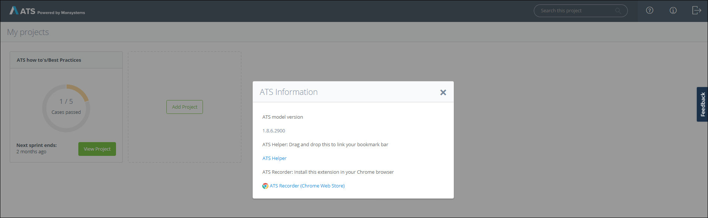
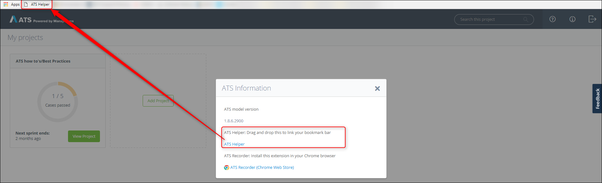
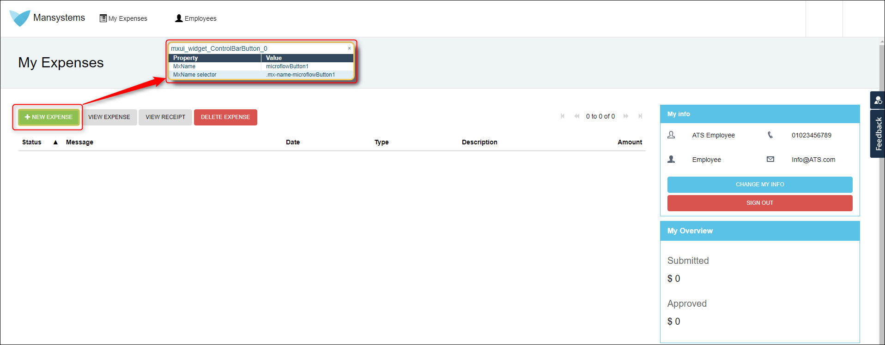
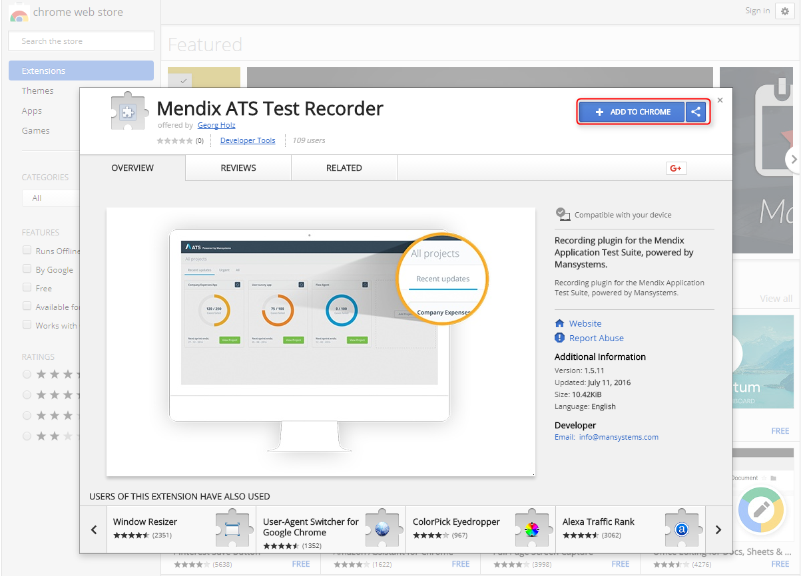

## 1 Introduction

ATS provides two different tools to help build test scripts: the ATS Helper and ATS Recorder. The ATS Helper identifies the mx-name of widgets on the application under test (AUT). The recorder is a function/plugin within ATS that records your manual test steps in the AUT and automatically selects the correct action for each step.

**This how-to will teach you  how to do the following:**

* Install the ATS Helper
* Install the [ATS Recorder](/ats/refguide/rg-version-1/recorder)

## 2 Prerequisites
Before starting this how-to, make sure you have the following prerequisites in place:

*  ATS
*  Mendix app

  {}
  Both the ATS Helper and the ATS Recorder only work on a Mendix app.
  {}

*  Google Chrome Browser

  {}
  Both the ATS Helper and the ATS Recorder only function in [Google Chrome](https://www.google.com/chrome/browser/). 
  {}

{}

## 3 Installing the ATS Helper

To install the ATS Helper, follow these steps:

1.  Open ATS and click the information icon in the top-right corner of the screen:

    

    This opens the **ATS Information** dialog box:
   
    

2.	Drag the ATS Helper to your bookmark bar to link it there:

    

To use the ATS Helper, select the bookmark, press <kbd>Ctrl</kbd>, and hover over a widget. The ATS Helper will show the information of that widget.

{}
The ATS Helper only works on standalone widgets.
{}

See [How to Create a Test Case](create-a-test-case) for more information on how to use the ATS Helper.

## 4 Installing the ATS Recorder

To install the ATS Recorder, follow these steps:

1.	Open ATS and click the information icon in the top-right corner of the screen:

    
    
    This opens the **ATS Information** dialog box:
    
    

2.	Click the **ATS Recorder (Chrome Web Store)** link to go to the Chrome Web Store.
3.  Click **ADD TO CHROME** to add the ATS Recorder extension:

    

See [How to Create a Test Case](create-a-test-case) for more information on how to use the ATS Helper.
