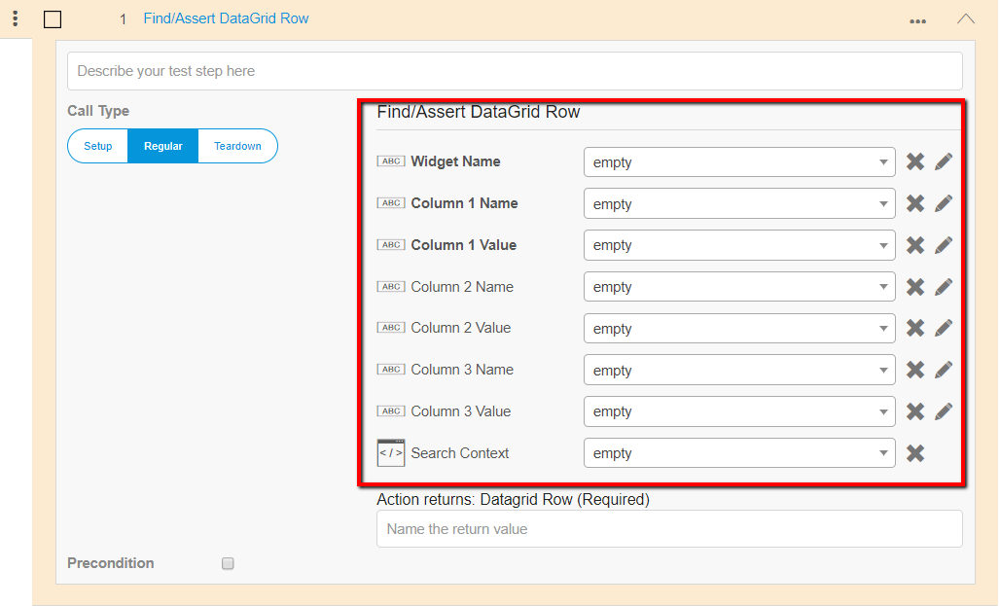
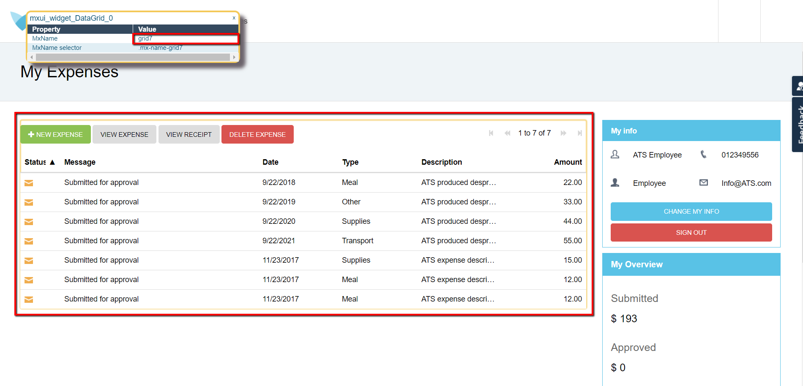
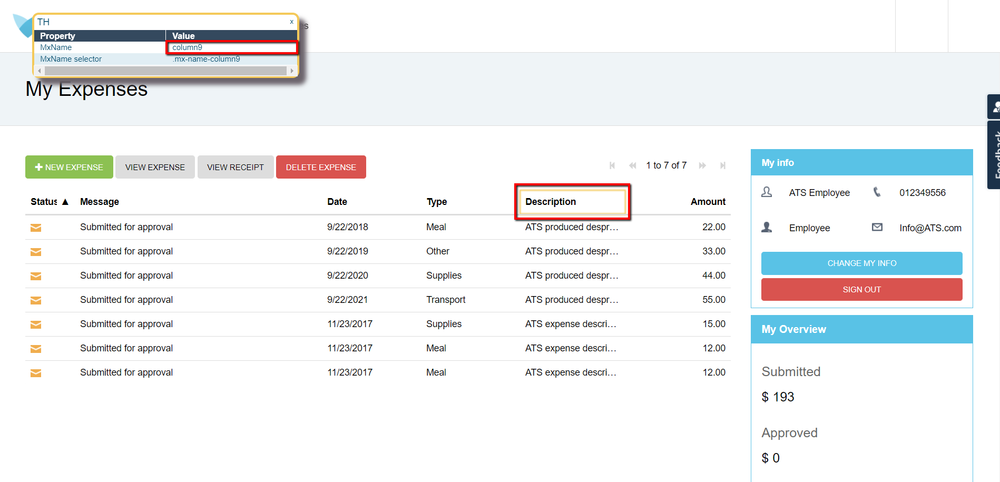
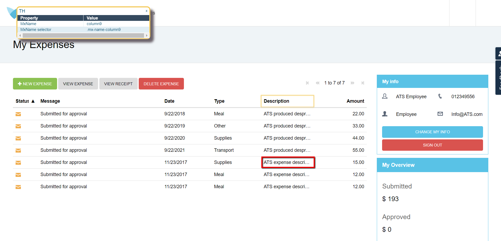
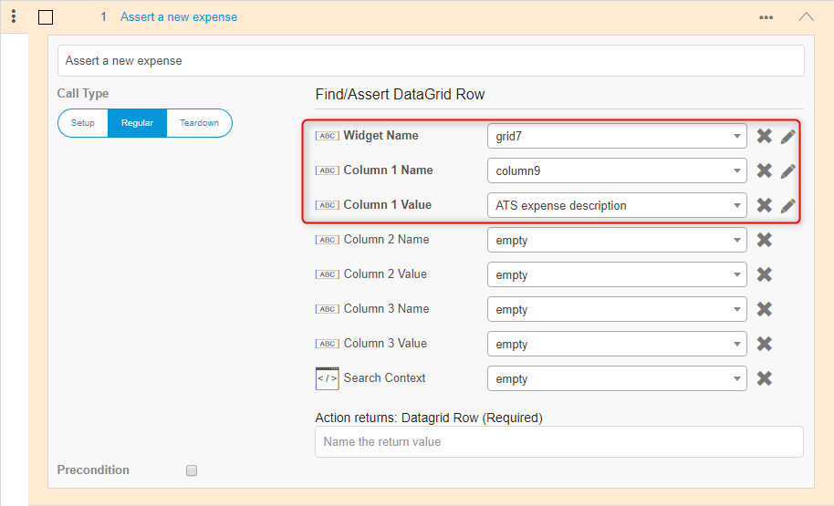
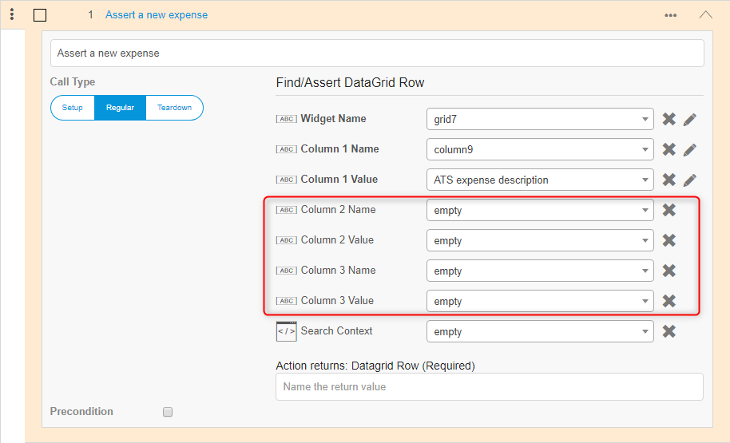
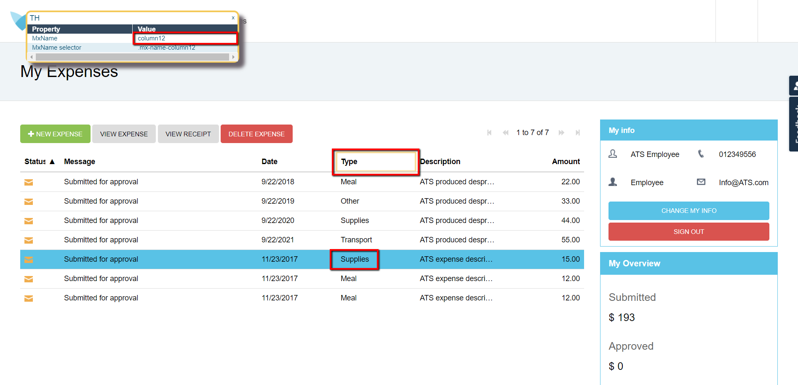
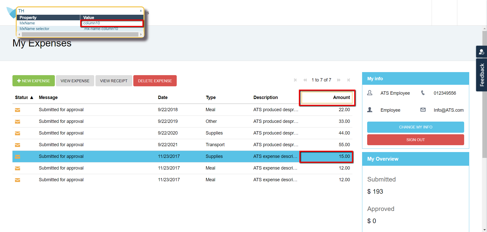
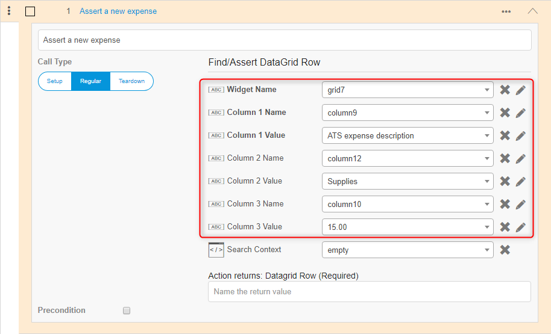
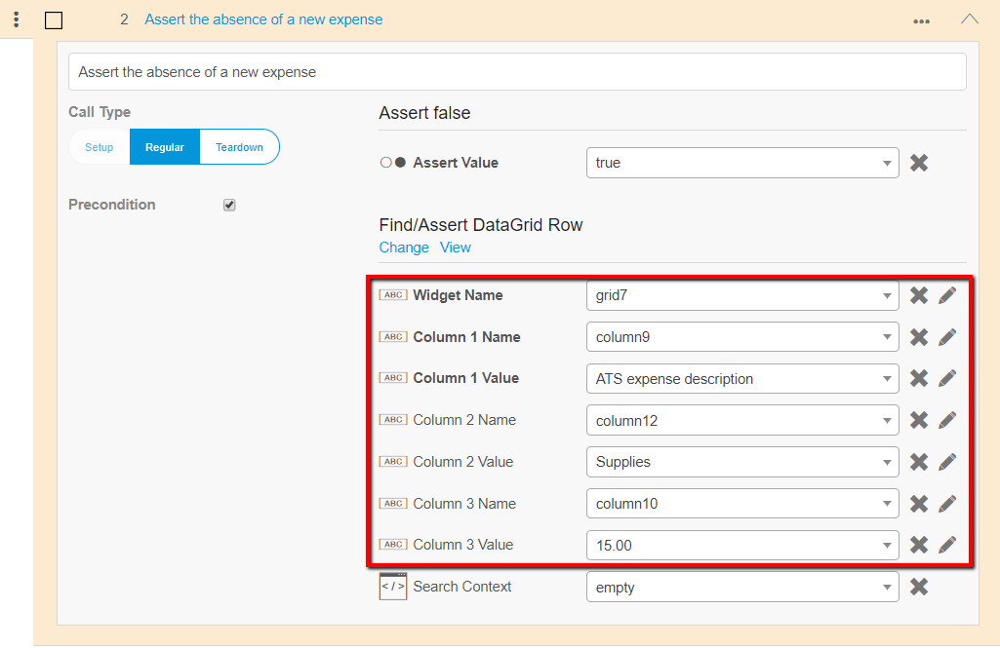

## 1 Introduction 

Asserting a row of a data grid is very useful in automated testing, as you should check an added, edited or deleted row in your test case. 

In ATS you can assert rows in a data grid With the [Find/Assert DataGrid Row](../../refguide/rg-version-1/findassert-datagrid-row.md) action. As the action has many input parameters this how to explains how-to use the action. 

**This how-to will teach you how to do the following**

* Assert data grid rows

## 2 Prerequisites

Before starting this how-to, make sure you have completed the following prerequisite:

* Read [How to Create a Test Case](create-a-test-case-2)

## 3 Asserting Data Grid Columns

This how to uses the datagrid of the Company Epxenses app as an example:

After adding a new expense in the company expenses app, a new row with that expense is created in the data grid. The **Find/Assert DataGrid Row** action in ATS can assert this row. This action has eight input parameters:

The first three input parameters are in bold, the other five are not in bold. Bold indicated that ATS needs those input parameters to run the action successfully. These are thus required input parameters, the others are optional.

### 3.1 Adding Required Input Parameters 

#### Widget name

In **Widget Name** you have to add the mx-name of the datagrid:

#### Column 1 Name

In **Column 1 Name** you have to add the mx-name of the column you want to assert. In this example that is the description column:

#### Column 1 Value

In **Column 1 Value** you have to add the value of the column you want to assert:

Filling the data in the **Find/Assert DataGrid Row** action, results in the following action:

### 3.2 Adding Optional Input Parameters

As there could be more rows with the same description, ATS can assert the wrong item. To make sure ATS asserts the correct row you can add two more column names and column values:

#### Column 2

In **Column 2 Name** you have to add the mx-name of the column. In **Column 2 Value** you have to add the value of the column you want to assert:

#### Column 3

In **Column 3 Name** you have to add the mx-name of the column. In **Column 3 Value** you have to add the value of the column you want to assert:

Filling the data in the **Find/Assert DataGrid Row** action, results in the following action:

When running this action ATS asserts the presence of the row with all three values.

When asserting for the absence of that row after deleting it, you can add the same data as precondition:

## 4 Next Up

You now learned how to assert datagrid rows with ATS. The next how-to is [How to Increase Recorder and Helper Coverage](increase-recorder-helper-coverage-2). You find an overview of all the how-tos and the structure on the [ATS 2 How-to's](ht-version-2) page. We advise you to follow the predefined structure.
