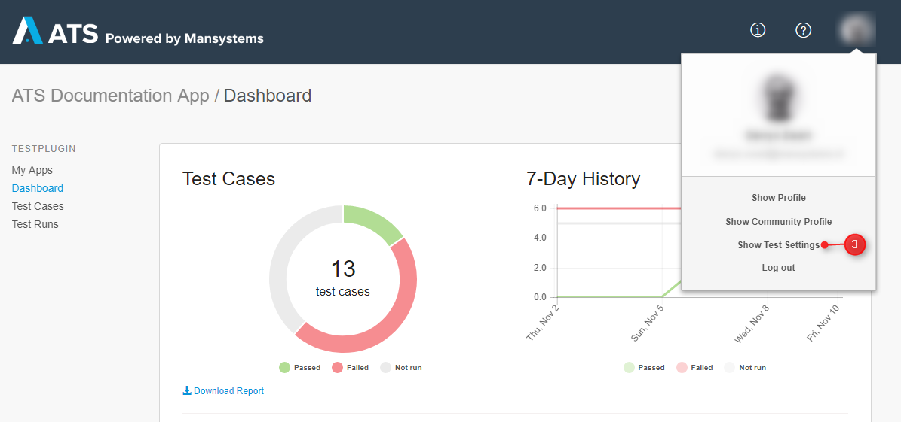
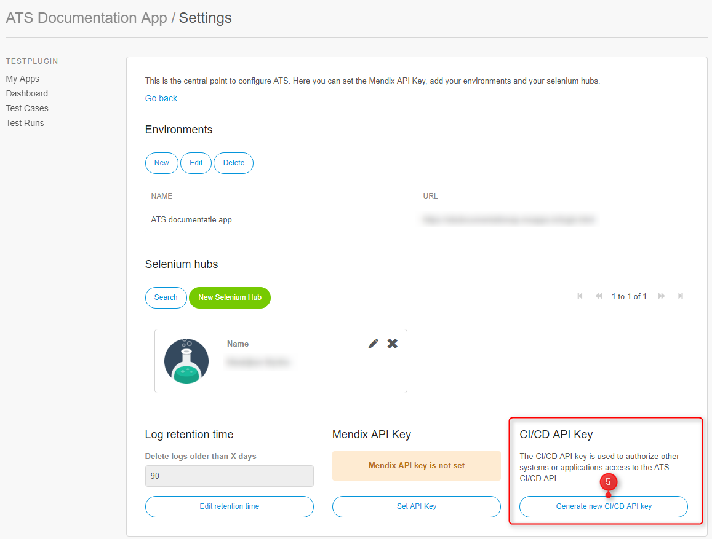
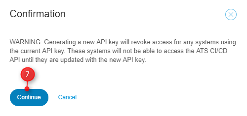
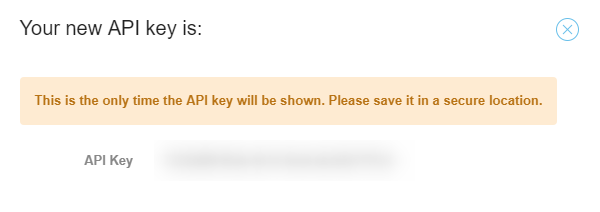
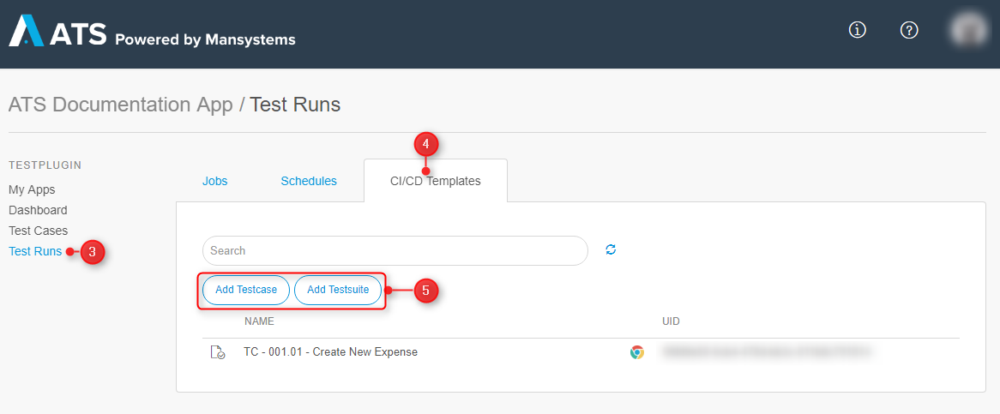
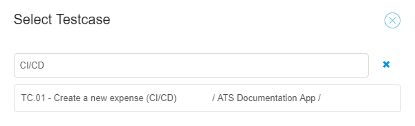
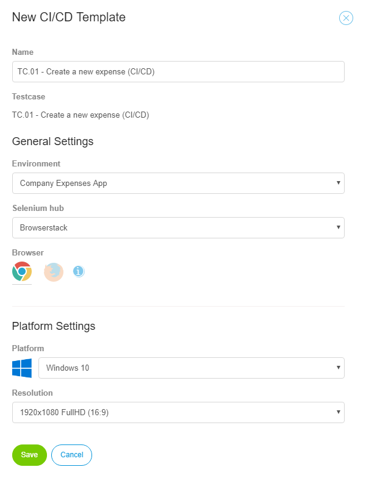
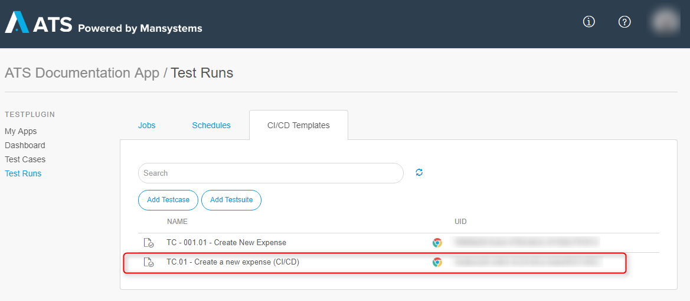
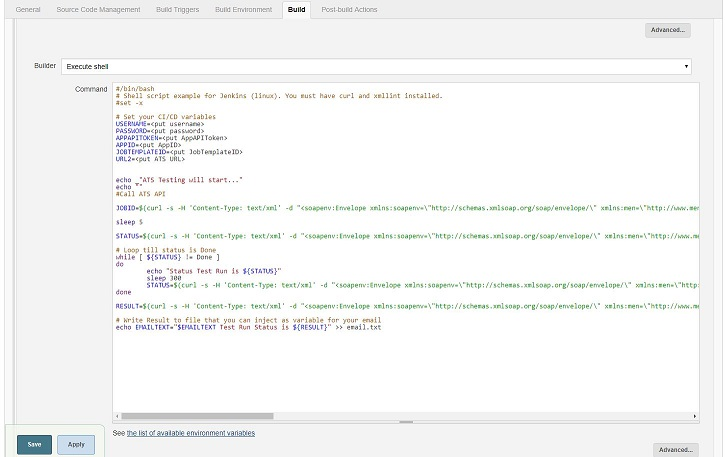

## 1 Introduction

This how-to explains the basics of a CI/CD pipeline, how ATS fits in and an example is shown on how-to implement ATS into your CI/CD pipeline in Jenkins.

 **This how-to will teach you how to do the following:**

* Understand the basics of a CI/CD pipeline
* Prepare your test case in ATS for CI/CD
* Implement your ATS test case into your CI/CD pipeline in Jenkins

## 2 Prerequisites

Before starting this how-to, make sure you have completed the following prerequisites:

* Complete [How to Get Started](getting-started-2)
* Complete [How to Create a Test Case](create-a-test-case-2)
* Complete Mendix Rapid App Developer course

## 3 CI/CD Basics

In this chapter the three components of CI/CD are described. There are two possible combinations:
* Continuous Integration and Continuous Delivery
* Continuous Integration and Continuous Deployment

The difference is in the final phase either manually deploy to the customer or use Continuous Deployment to do it automatically.

### 3.1 Continuous Integration

Developers practicing continuous integration merge their changes back to the main branch as often as possible. The developer's changes are validated by creating a build and running automated tests against the build. By doing so, you avoid the integration hell that usually happens when people wait for release day to merge their changes into the release branch.

Continuous integration puts a great emphasis on testing automation to check that the application is not broken whenever new commits are integrated into the main branch.

### 3.2 Continuous Delivery

Continuous delivery is an extension of continuous integration. Continuous delivery focuses on making sure that you can release new changes to your customers in a quick and sustainable way. This means that on top of having automated your testing, you also have automated your release process and you can deploy your application at any point in time by clicking on a button.

In theory, with continuous delivery, you can decide to release daily, weekly, fortnightly, or whatever suits your business requirements. However, if you want to get the full benefit of continuous delivery, you should deploy to production as early as possible to make sure that you release small batches, that are easy to troubleshoot in case of a problem.

### 3.3 Continuous Deployment

Continuous deployment goes one step further than continuous delivery. With this practice, every change that passes all stages of your production pipeline is released to your customers. There's no human intervention, and only a failed test will prevent a new change to be deployed to production.

Continuous deployment is an excellent way to accelerate the feedback loop with your customers and take pressure off the team as there isn't a Release Day anymore. Developers can focus on building software, and they see their work go live minutes after they've finished working on it.

### 3.4 Conclusion

The CI/CD process ensures that everything committed is tested and deployed. An example:
A Mendix developer commits a change into his team server branch. The branch is then automatically deployed into the test environment and tested. If the tests passes, the branch is deployed into the acceptance environment and also tested. You can even use Continuous Deployment to directly deploy to production and perform a regression test.

## 4 ATS and CI/CD

ATS can do the testing of your Mendix app in the CI/CD pipeline. In ATS 2.0 a CI/CD API is added, so that customers can access their test cases or test suites from outside ATS. This way you can use a CI/CD tool to execute your test cases and test suites in ATS and retrieve the results. To access those specific test cases and test suites you must generate a CI/CD API key. This chapter explains how to generate a CI/CD API key for accessing ATS and how to generate a CI/CD template for a test case or test suite. The CI/CD template is a pre-configured test case or test suite with a set run configuration which can be fired from a CI/CD pipeline.

### 4.1 CI/CD Access API

To generate a CI/CD API key follow these steps:

1. Login to ATS 2.0.
2. Open up the app you want to access for CI/CD.
3. Inside your app open the profile menu and click **Show Test Settings**.



4. On the **Settings** page you find the **CI/CD API Key** section.
5. Click **Generate new CI/CD API key**. You need this to get access to ATS in your CI/CD tool.



6. A **confirmation** dialog box appears that warns you that an existing CI/CD API key will become invalid once you generate a new one.
7. Click **Continu**.



8. The **Your new API key:** dialog box appears. 

{}

This is the only time ATS shows the API. Write it down in a secure place.

{}

9. Make sure you wrote down the API key. Now close the dialog box. 



Keep your API key at hand, you need it later on. 

You now generated the CI/CD API key, you need this to gain access to your app in ATS. Next, the CI/CD template is explained.

### 4.2 CI/CD Template

To create a CI/CD template follow these steps:

1. Login to ATS 2.0.
2. Open up the app in which you find your test case or test suite.
3. Inside your app click on the **Test Runs** navigation item.
4. Click the **CI/CD Templates** tab.
5. Click either **Add Testcase** or **Add Testsuite** depending on what you want to execute.



6. The **Select Testcase** dialog box opens. Where you select your test case.

 

7. After selecting your test case the **New CI/CD Template** dialog box opens.  Here you select your run configuration and click **Save**.

 

8. After clicking **Save** the CI/CD template for test case appears with a unique ID.

 

Keep the unique ID at hand for later on.

You now created a CI/CD template which you can execute using a CI/CD pipeline.

### 4.3 CI/CD Web Service User

The CI/CD in ATS is using a webservice with authentication. Please use the standard username which is ATSAPIUser and the standard password which is ATSAPIUser.

## 5 Configure ATS in Your Pipeline (Example)

Using the CI/CD API key and the unique ID of the CI/CD template you can execute a test case from your CI/CD pipeline. In this chapter, you find an example for Jenkins.

## 5.1 Prerequisites

* Have some Jenkins experience
* Know how to configure CI/CD in ATS:
  * Configure a CI/CD Template in ATS
  * Create the CI/CD API key in ATS
  * Find your AppID in Mendix Sprintr

## 5.2 Adding an Extra Step in Jenkins

This is only an example for Jenkins on Linux in shell scripting and can be written in another scripting language of your choice like for example Powershell (for Windows) or Groovy.

* Make sure that curl and xmllint are installed on your Linux server.
* In your Jenkins project, add a build step of type Execute shell and use the following shell script. 



```
#/bin/bash
# Shell script example for Jenkins (linux). You must have curl and xmllint installed.
#set -x

# Set your CI/CD variables
USERNAME=ATSAPIUser
PASSWORD=ATSAPIUser
APPAPITOKEN=<put AppAPIToken>
APPID=<put AppID>
JOBTEMPLATEID=<put JobTemplateID>
URL2=<put ATS URL>


echo _"ATS Testing will start..."
echo ""
#Call ATS API

JOBID=$(curl -s -H 'Content-Type: text/xml' -d "<soapenv:Envelope xmlns:soapenv=\"http://schemas.xmlsoap.org/soap/envelope/\" xmlns:men=\"http://www.mendix.com/\"><soapenv:Header><men:authentication><username>$USERNAME</username><password>$PASSWORD</password></men:authentication></soapenv:Header><soapenv:Body><men:RunJob><TestRun><AppAPIToken>$APPAPITOKEN</AppAPIToken><AppID>$APPID</AppID><JobTemplateID>$JOBTEMPLATEID</JobTemplateID></TestRun></men:RunJob></soapenv:Body></soapenv:Envelope>" ${URL2}/ws/RunJob -X POST |xmllint --xpath "string(//JobID)" -)

sleep 5

STATUS=$(curl -s -H 'Content-Type: text/xml' -d "<soapenv:Envelope xmlns:soapenv=\"http://schemas.xmlsoap.org/soap/envelope/\" xmlns:men=\"http://www.mendix.com/\"><soapenv:Header><men:authentication><username>$USERNAME</username><password>$PASSWORD</password></men:authentication></soapenv:Header><soapenv:Body><men:GetTestRun><TestRun><AppAPIToken>$APPAPITOKEN</AppAPIToken><JobID>$JOBID</JobID><AppID>$APPID</AppID></TestRun></men:GetTestRun></soapenv:Body></soapenv:Envelope>" ${URL2}/ws/GetJobStatus -X POST |xmllint --xpath "string(//ExecutionStatus)" -)

# Loop till status is Done
while [ ${STATUS} != Done ]
do
        echo "Status Test Run is ${STATUS}"
        sleep 300
        STATUS=$(curl -s -H 'Content-Type: text/xml' -d "<soapenv:Envelope xmlns:soapenv=\"http://schemas.xmlsoap.org/soap/envelope/\" xmlns:men=\"http://www.mendix.com/\"><soapenv:Header><men:authentication><username>$USERNAME</username><password>$PASSWORD</password></men:authentication></soapenv:Header><soapenv:Body><men:GetTestRun><TestRun><AppAPIToken>$APPAPITOKEN</AppAPIToken><JobID>$JOBID</JobID><AppID>$APPID</AppID></TestRun></men:GetTestRun></soapenv:Body></soapenv:Envelope>" ${URL2}/ws/GetJobStatus -X POST |xmllint --xpath "string(//ExecutionStatus)" -)
done

RESULT=$(curl -s -H 'Content-Type: text/xml' -d "<soapenv:Envelope xmlns:soapenv=\"http://schemas.xmlsoap.org/soap/envelope/\" xmlns:men=\"http://www.mendix.com/\"><soapenv:Header><men:authentication><username>$USERNAME</username><password>$PASSWORD</password></men:authentication></soapenv:Header><soapenv:Body><men:GetTestRun><TestRun><AppAPIToken>$APPAPITOKEN</AppAPIToken><JobID>$JOBID</JobID><AppID>$APPID</AppID></TestRun></men:GetTestRun></soapenv:Body></soapenv:Envelope>" ${URL2}/ws/GetJobStatus -X POST |xmllint --xpath "string(//ExecutionResult)" -)

# Write Result to file that you can inject as variable for your email
echo EMAILTEXT="Test Run Status is ${RESULT}" >> email.txt
```
The last API call results in a "Passed" or "Failed", you can email this result or for example use the outcome in a conditional step for continuing deploying on different environments or failing this build. 
