## 1 Introduction

This how-to explains how to create an Unsupported Widget action for the Radio Buttons widget. In a standard situation, the first step is checking if ATS supports the widget. 

The how-to assumes that you must build your own action.

The how-to applies to all widgets like the radio button widget, which means that, if you must click a child element based on text, you can follow this how-to. Keep in mind that it might need some adjustments according to the widget!

**This how-to will teach you how to do the following:**

* Approach a radio button option that ATS must click
* Create the custom action to click the radio button option

## 2 Prerequisites

Before starting this how-to, make sure you have completed the following prerequisite:
 
* Read [General](custom-action-general-2)

## 3 Defining the User Approach

First you define the user approach and how you interact with the widget. Since you are creating an Unsupported Widget action, how you find the widget isn’t important. What is importnat is how you interact with it.

To define the user approach, select an option by clicking the radio button that contains the text. 

Ths is no radio button selected:

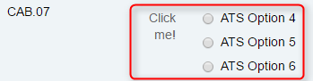

This is a radio button selected:

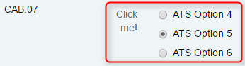

The radio button is an input element with the type radio.

## 4 Creating the Action Structure

In the previous step, you wrote down the user approach for the radio buttons widget. Now you will create this approach in ATS with actions. 

To create the action structure, follow these steps:

1.  Check the parent element, which is always the element with `mx-name` when creating an unsupported widget action. If the widget does not have `mx-name`, look for the highest `div` element that is still referencing the widget. The parent element of the radio button looks like this in the debugger:

    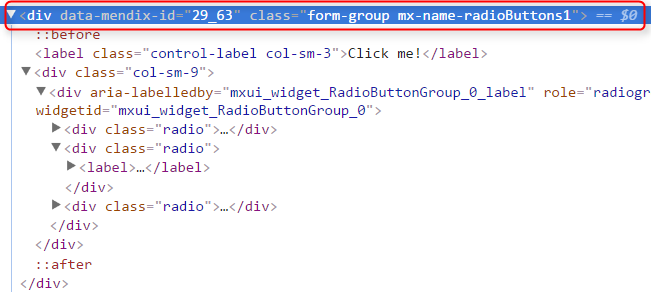

    The debugger creates the border around the selected element in the app:

    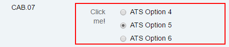

2.  Inside the parent element, you can see different child elements. One of these child elements has the class name `radio`, and inside each radio element, you will find a `label` element that contains the `input` element (radio button):

    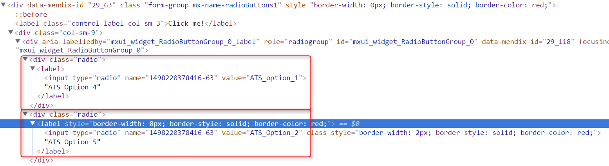

3.  The `label` element displays the text, and the `input` element is the radio button. You can see this if you select either of them in the debugger.

    This is the label element:

    

    This is the input element:

    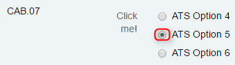

    When you create a custom action for an unsupported widget action, you must use the [*Find Widget Child Node*](/ats/refguide/rg-version-1/find-widget-child-node) action. This action is a combination of the [*Find/Assert Widget*](/ats/refguide/rg-version-1/findassert-widget) and [*Find Element by Sizzle*](/ats/refguide/rg-version-1/find-element-by-sizzle) actions, combining the best of both. It is an official Mendix action, it has all the internal processes, and it uses a CSS/jQuery selector to find the child, which makes it flexible. The selector for finding the input element is an input. You use this selector in the *Find Widget Child Node* action to find an input element inside the text box widget.

4.  Each radio button is inside a `div` element with the class name `.radio`. Inside this element, there is a `label` element that contains a text value. Finally, there is an `input` element inside the `label` element. The selector looks like this: `.radio label:contains() input`. Using the entire path makes your selector more accurate, in case there are other radio buttons widgets being used. You use this selector in the *Find Widget Child Node* action to find the right input element inside a label element within the radio button widget.

    However, before you start creating the action, you must know if ATS can find the input element within the radio buttons widget. Use the debugger to simulate what ATS does. Since the *Find Widget Child Node* action uses `mx-name` to find the parent, you also must use the `mx-name` in your code.

5.  Use jQuery to find out if ATS can find the element. Enter the following code in the console of the debugger: `$( ‘.mx-name-radioButtons1 .radio label:contains(“ATS Option 5”) input’ )`.

    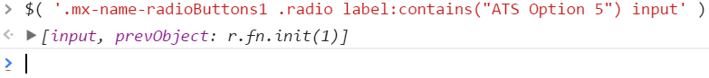

    It can happen that the debugger does not return an element. Check if jQuery is available and if you constructed the code in the correct manner. When you enter a selector in ATS, don’t use `$( ‘….’ )` or `jQuery( ‘…..’ )`.

    The action user must enter the text they want ATS to click. You need a variable selector to achieve this. You create a variable selector by using the [*Concatenate String*](/ats/refguide/rg-version-1/concatenate-string) action. This action combines the different input strings into one string. The *Concatenate String* action does not add spaces. You need to add spaces yourself.

6. Add the *Concatenate String* action. Leave the **String 2** input parameter empty! You connect an action input parameter here later.

7.  Enter this selector: `.radio label:contains("") input`, give a proper test step description, and describe the output:

    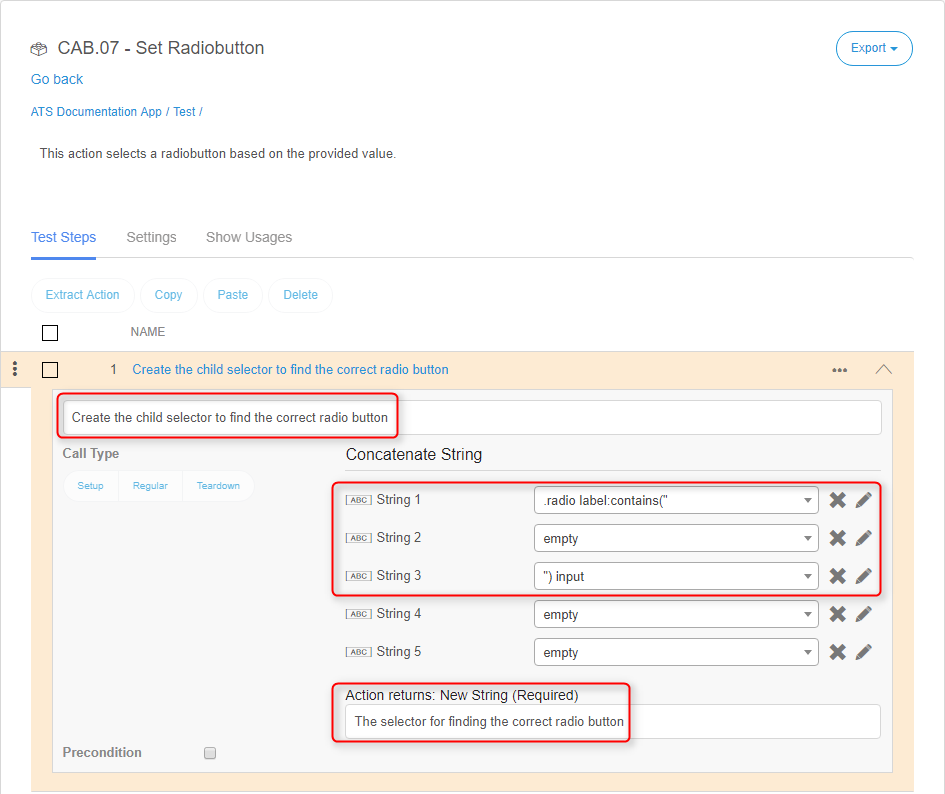

8.  Add the *Find Widget Child Node* action to your action. Connect the output string from step 1 to the child node selector input parameter. Then, enter the test step description and output description:

    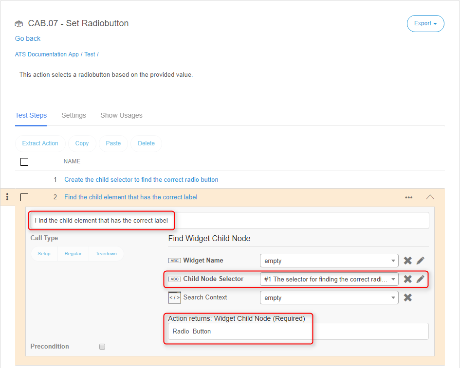

9.  ATS must click the found radio button. You need to add the [*Click/Doubleclick*](/ats/refguide/rg-version-1/clickdoubleclick) action. Connect the radio button from step 2 and give a description of the test step:

    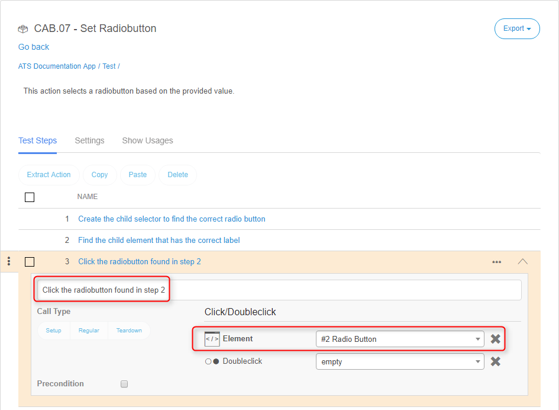

## 5 Action Parameters

Next, you need to add the action input parameters.

* Widget Name
* Value
* Search Context

{}
Keep the [guidelines for creating a custom action](guidelines-custom-action-2) in mind while creating action parameters. 
{}

To add the action parameters, follow these steps:

1.  Configure the **Widget Name** input parameter like this:

    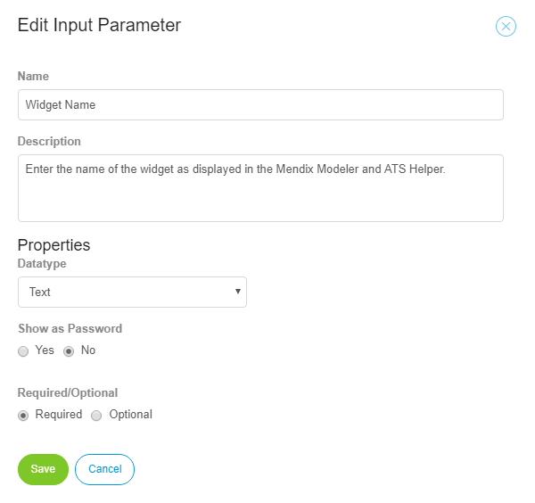

2.  Configure the **Value** input parameter like this:

    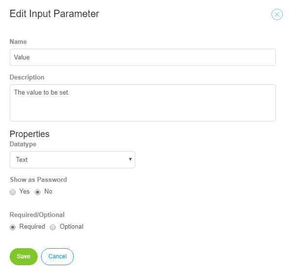

3.  Configure the **Search Context** parameter like this:

    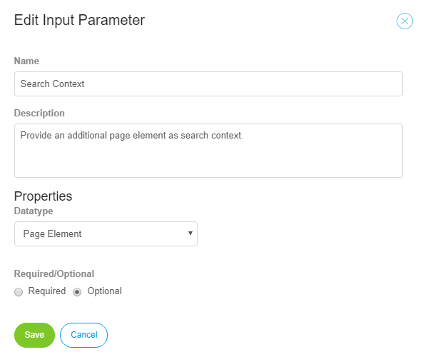

    For this custom action, you do not need an output parameter.

4.  Connect the input parameters to the correct actions. Start with the **Value** input parameter. You connect this input parameter to the Concatenate String action:

    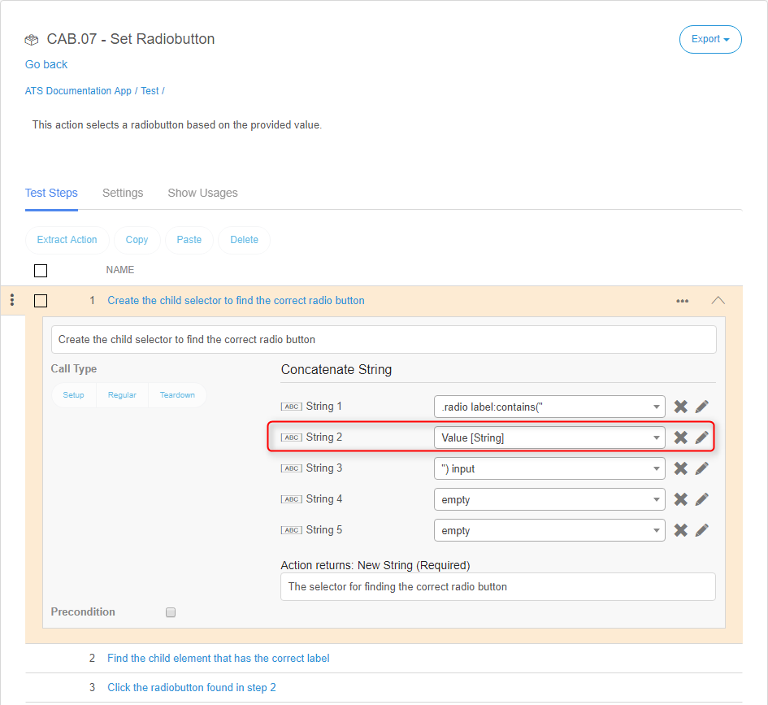

5.  The last input parameters you connect are the **Widget Name** and **Search Context** input parameters for the Find Widget Child Node action:

    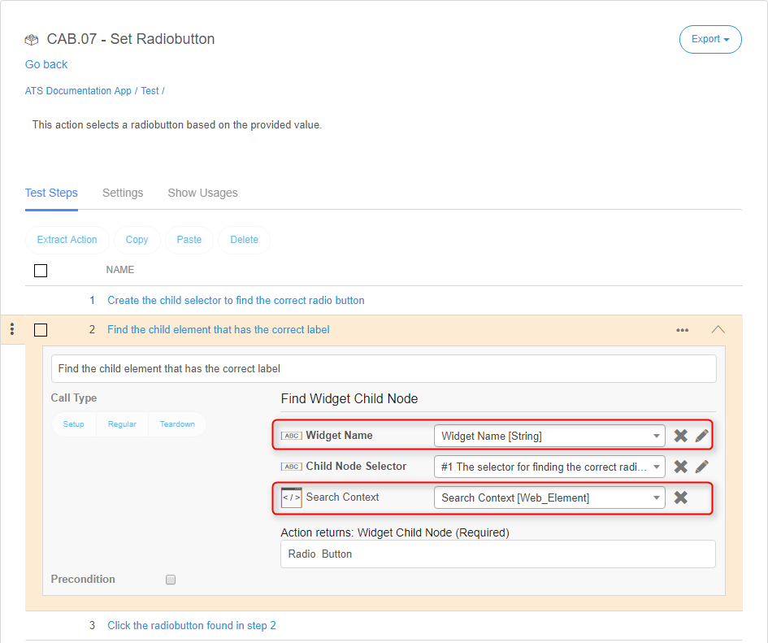

There is no need to add logic to this custom action. It only involves clicking a radio button.

## 6 Final Check

Now check for the following:

*  Use of the ATS naming convention for parameters
*  A clear description of test steps, input parameters, output parameters, and action returns
*  Interpunction usage in pieces of code (if used)
*  Use of data types on the different parameters to avoid errors

After checking these items, you can run the test case that uses this action.

Congratulations! You have created your own custom action for the Mendix radio button widget.

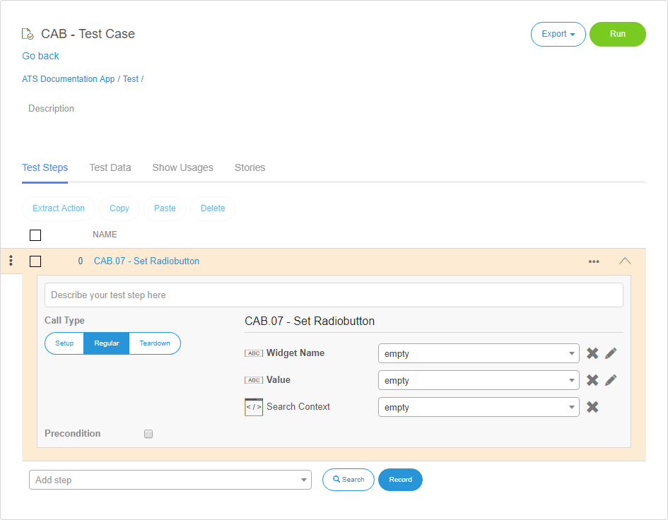
