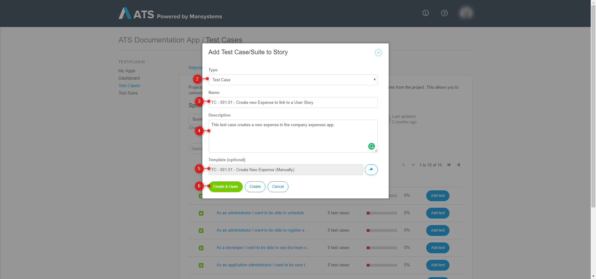

## 1 Introduction

Mendix ATS is a testing tool designed for automated testing of Mendix applications. With your automated tests, you want to test functionalities of the application. Descriptions of those functionalities are in your User Stories. As you want to test those functionalities, ATS has the ability to retrieve User Stories from the Mendix Developer Portal project. In ATS you can link the retrieved User Stories to test cases and test suites. This is useful for you and your team to see what can be tested automatically and which functionalities are covered by a test case. Additionally linking user stories to test cases and test suites is useful for stakeholders. By linking them, you can show that the functionalities build in the sprint are tested.

**This how-to will teach you how to do the following**

* Set the Mendix API key
* Retrieve User Stories in ATS
* Link test cases/test suites to User Stories
* Link User Stories to test cases/test suites

## 2 Prerequisites

Before starting this how-to, make sure you have completed the following prerequisite:

* Read [How to Get Started](getting-started-2)
* Read [How to Create a Test Case](create-a-test-case-2)

## 3 Set the Mendix API Key

The following steps describe how you can set your Mendix API Key in ATS:

1. Go to ATS and login.
2. Open the app where you want to add the Mendix API Key.
3. Inside your app click the profile menu and click **Show Test Settings**.

{} **Show Test Settings** is only present if you have SCRUM Master rights in the Mendix Developer Portal project {}

4. On the **Settings** page click **Set API Key**.

Clicking **Set API Key** opens the **Mendix API Key** Dialog:

5. To retrieve your Mendix API Key open the project in the Developer Portal and click **API Keys**.
6. Click **Create API Key**
7. Enter an API Key name in the **API key name** field and click Generate API Key. 
8. Copy the API Key and paste it into the **Mendix API Key** field in ATS.
9. Click **Save**:

You have set the Mendix API Key. ATS can now retrieve the User Stories from the Mendix Developer Portal project.

## 4 Retrieve User Stories in ATS

The following steps explain how to retrieve user stories from the Mendix Developer Portal project in ATS:

1. Open your project in ATS and go to **Test Cases**.
2. Click the **Stories** tab.
3. Click the **Refresh button** to retrieve the User Stories from the Developer Portal:

If you filled in a correct Mendix API Key you can now see the User Stories in ATS:

## 5 Linking Test Cases/Test Suites to User Stories

In this example, I link a test case to a user story. Follow the same steps to link a test suite to a user story.

The following steps describe how to link a test case to a user story:

1. Open your project in ATS and go to **Test Cases**.
2. Click the **Stories** tab.
3. Search for the user story you want to link to a test case.
4. Click **Add test**:

Clicking **Add test** opens the **Select item** Dialog box:

In the **Add Test Case/Suite to Story** Dialog you can select to create a new test case or use an existing test case. See below for the explanation of both.

### 5.1 Connecting a New Test Case to a User Story

1. In the **Select item** Dialog box click **Create new test case**.

    

2. Set the type to **Test Case**.
3. Enter a name in the **Name** field. Use the predefined naming structure.
4. Enter a description in the **Description** field. 
5. Use the **Template** referenceSelector in case you have a test case that you want to use as a template. ATS copies all the test steps of the template to the new test case.
    * To add a template click the arrow icon. This opens the **Select item** Dialog box.
    * In the Dialog search and select the test case you want to add as template and click **Select**.

    
    
6. Click **Create & Open** to create and open your test case. This is useful if you want to edit your test case. Click **Create** to create the test case, but not open it:

Clicking **Create & Open** or **Create** links the test case to the user story:

To see the added test case double-click the Story name. This opens the **Edit Story** page. This page shows the added test case:

On the **Edit Story** page you can do the following:
* Add a new test case in the same way as described above by clicking **Add test** (1). 
* Go to the **Test Case Details** page and edit the test case by clicking **Edit** (2).
* Remove the linked test case by clicking **Remove** (3).

### 5.2 Linking an Existing Test Case to a User Story

1. In the **Select Item** Dialog search and select the test case you want to link to the Story.
2. Click **Select**:

Clicking **Add selected** links the test case to the user story. As this test case ran successfully, the **Succes** is 100%:

To see the added test case double-click the Story name. This opens the **Edit Story** page. This page shows the added test case:

On the **Edit Story** page you can do the following:
* Add a new test case in the same way as described above by clicking **Add test** (1). 
* Go to the **Test Case Details** page and edit the test case by clicking **Edit** (2).
* Remove the linked test case by clicking **Remove** (3).

## 6 Linking User Stories to Test Cases

In this example, I link a user story to an existing test case. Follow the same steps to link a user story to a test suite.

To link an existing test case to a user story you should have created a test case.

To link an existing test case to a user story follow these steps:

1. Open your project in ATS, open the **Test Cases** menu item and open the test case to which you want to link a user story.
2. Go to the **Stories** tab.
3. Click **Link new story**:

Clicking **Link new story** opens the **Link Story** Dialog:

4. Search and select the user story you want to add to the test case.
5. Click **Add selected**:

Clicking **Add selected** links the story to the test case:

You can go to the **Edit story** page by clicking **Open story**. You can unlink a story by clicking **Unlink selected story**.

You can now link test cases to stories and link stories to test cases.

## 7 Next Up

You now learned how to link user stories to your test cases. The next how-to is [Use ATS in Combination with CI/CD](ats-and-ci-cd-2). You find an overview of all the how-tos and the structure on the [ATS 2 How-to's](ht-version-2) page. We advise you to follow the predefined structure.
