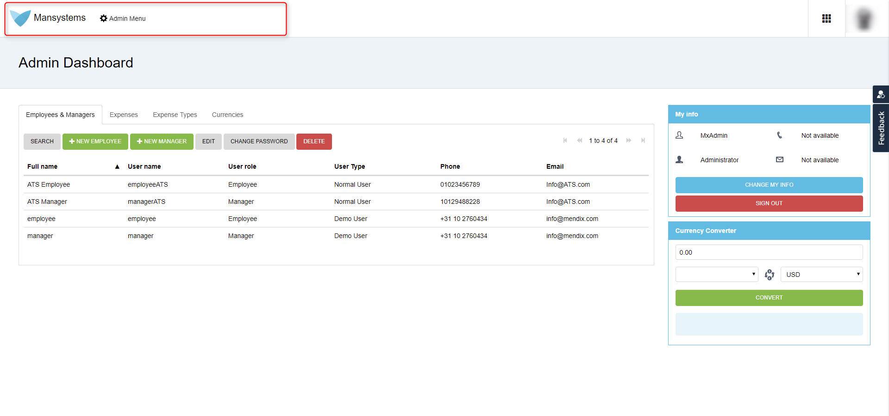
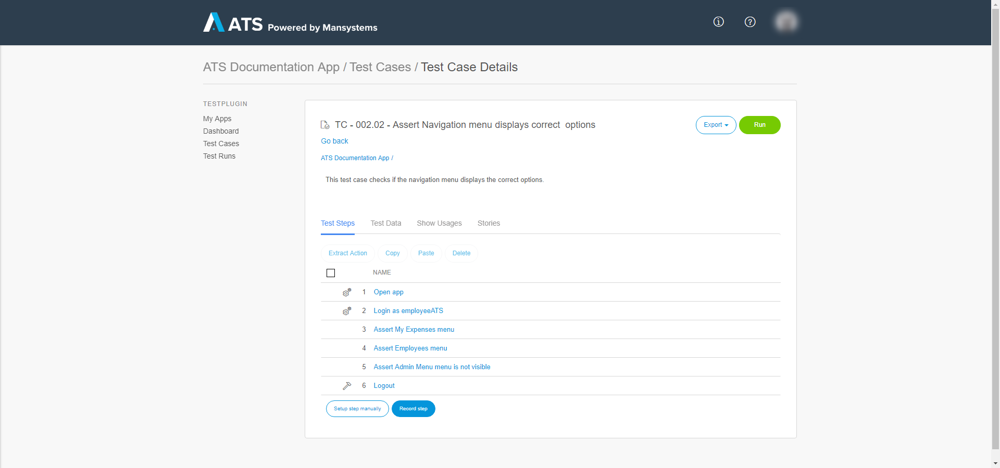
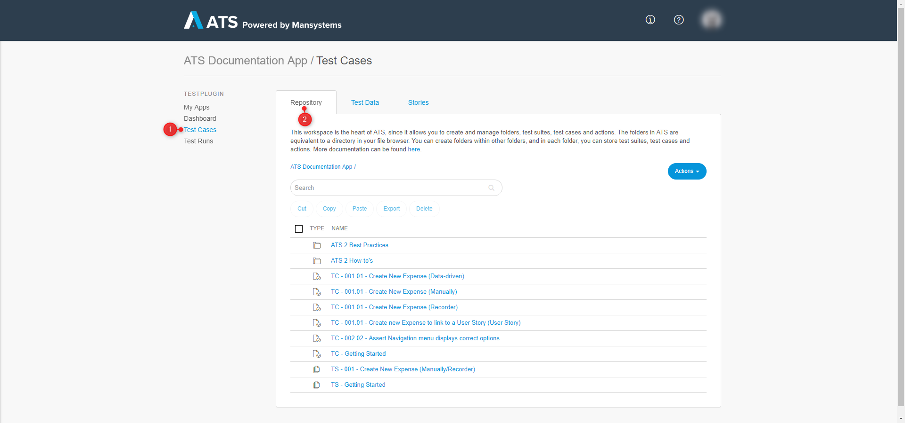
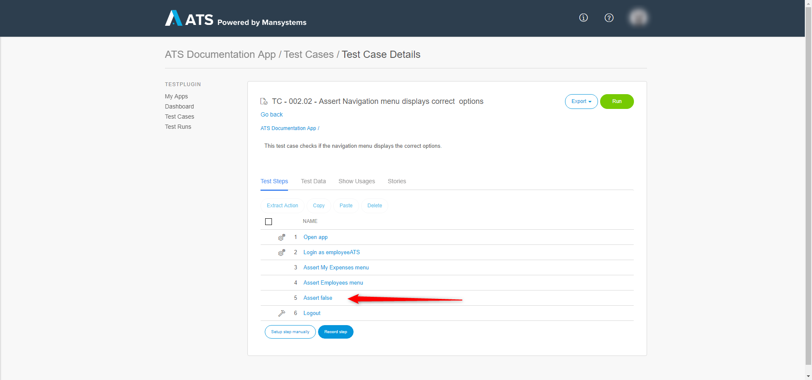
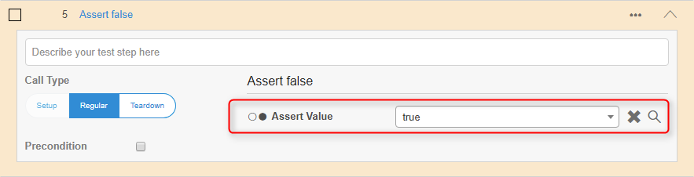
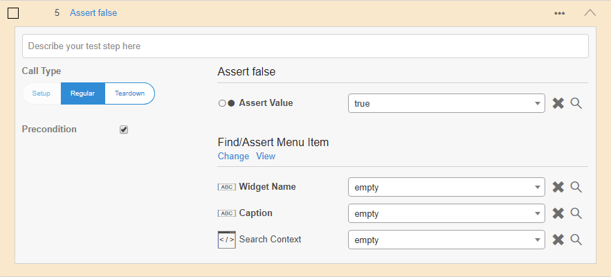
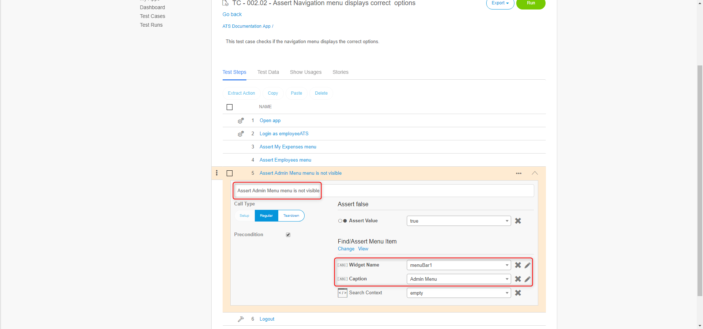
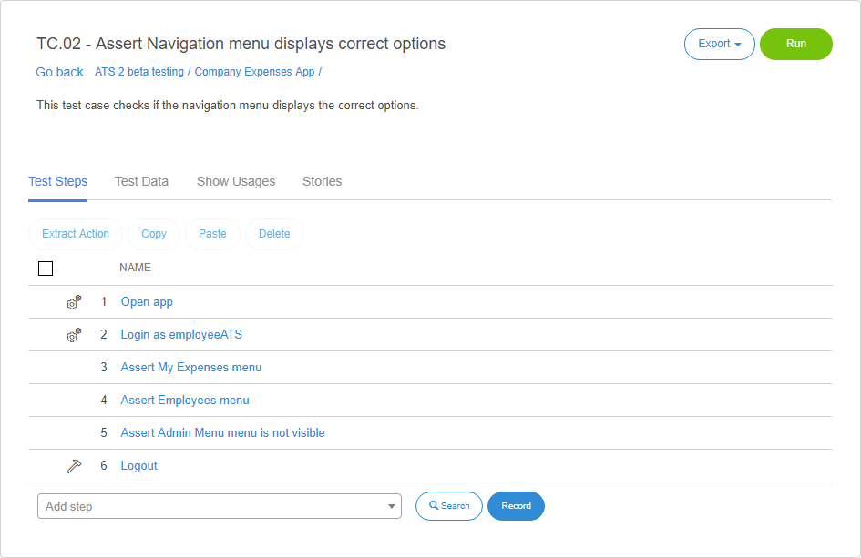

## 1 Introduction

This how-to explains how to create a negative test case in ATS. It uses the [Company Expenses](https://appstore.home.mendix.com/link/app/240/) app as an example.

ATS is a functional testing tool that asserts, finds, and sets widgets in a Mendix app. For this scenario, you do not want to know that a widget is present, but that a widget is not present.

The Click Menu Item action clicks a menu item based on the caption. In most situations, you test to make sure it is present, but sometimes you must test to check it is not present.

For example, when an employee logs in to the Company Expenses app, the admin menu must not be visible. When an administrator logs in, the admin menu must be visible. 

To test this, you log in as an employee and assert that you do not see the admin menu. You can automate negative tests in ATS.

This is the navigation menu for an employee:

This is the navigation menu for an administrator:

**This how-to will teach you how to do the following**

* Create a negative test case

## 2 Prerequisites

Before starting this how-to, make sure you have completed the following prerequisite:

* Complete [How to Create a Test Case](create-a-test-case-2)

## 3 Creating a Negative Test Case

The test case used in this how-to is already created. It asserts that the navigation menu displays the correct items. Next, you add a step to check that it does not display the **Admin Menu** item.

This is the navigation menu:

This is the test case:

1. Open your app in ATS and go to the **Test Cases** menu item.
2.  Click the **Repository** tab:

  

3. Select the test case to add the negative test step.
4. Add the Assert False action where you want to place the negative test step:

5. Set the **Assert Value** parameter of the Assert False action to **True**:

6.  Add the action needed to search for the menu item as a **Precondition**. Check the precondition box and add the [Find/Assert Menu Item](/ats/refguide/rg-version-1/findassert-menu-item) action:

  

7.  Enter the information needed to find the **Admin Menu** as an administrator to verify it is not visible as an employee. Also, enter a proper description.

  

These are the inner-workings:

* If ATS can find the **Admin Menu**, the precondition passes and the Assert False action fails, which ensures that the entire test step fails
* If ATS cannot find the **Admin Menu**, the precondition fails and the Assert False action is not executed, which ensures that the test case result is "passed"

Resulting in a test case fail if the menu item is found and a test case pass if it is not found. 

You can use this method for a lot of different things. 

_The finished test case_

You now know how to create a negative test case.
