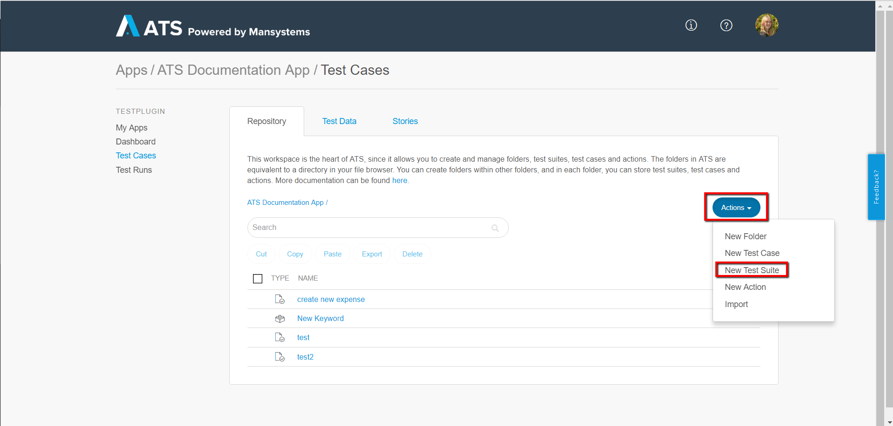
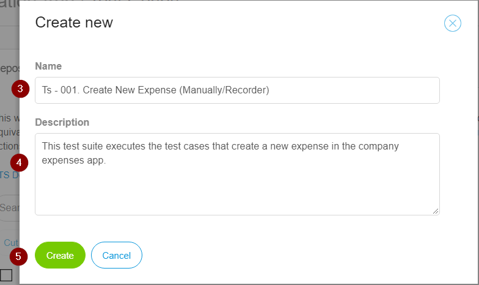
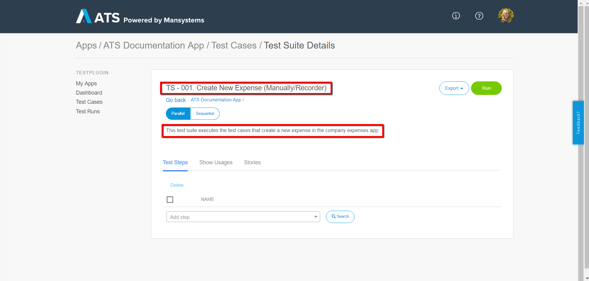
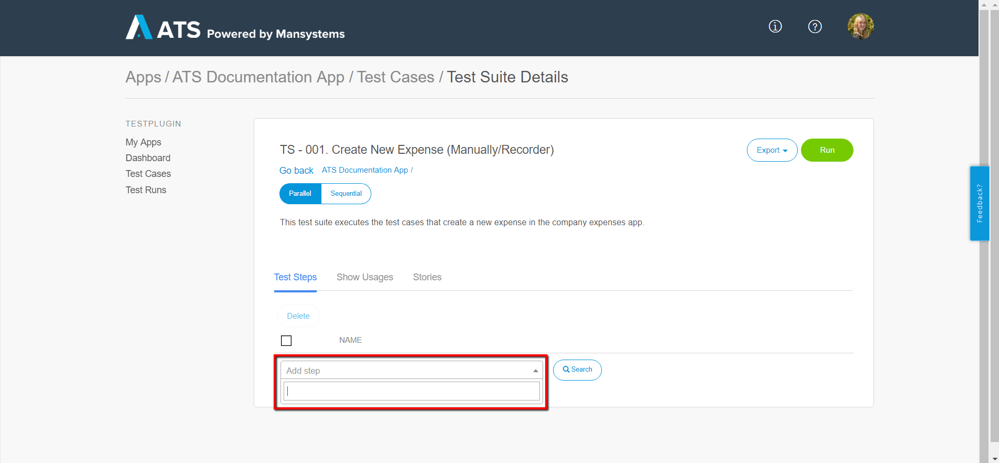
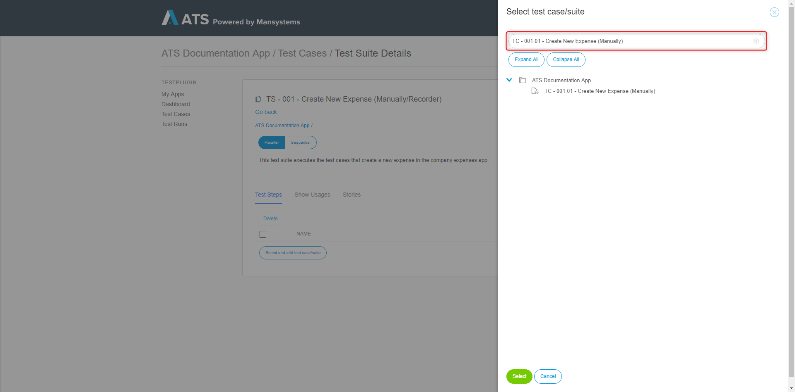
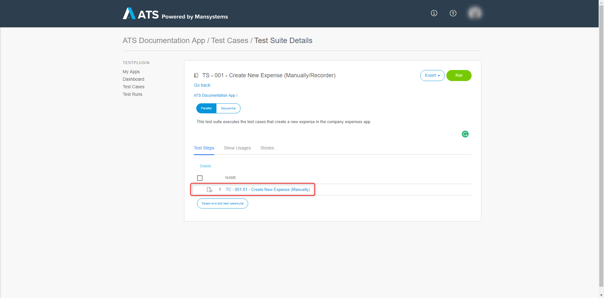
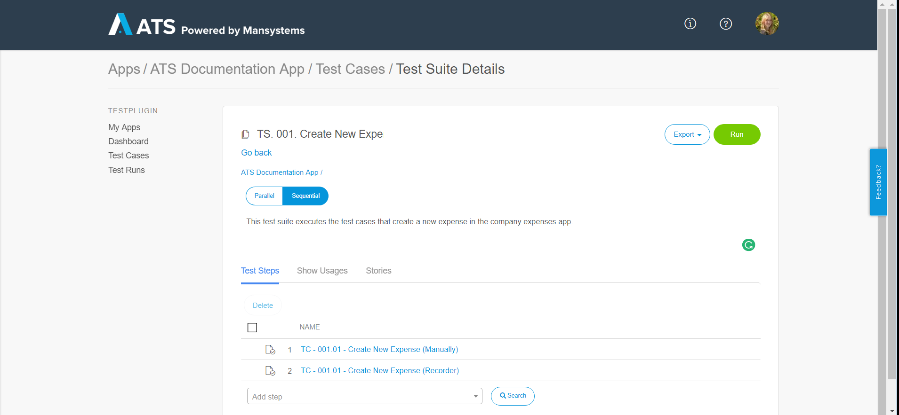

## 1 Introduction

A test suite enables the user to execute test cases and test suites in a specific order. You can add test steps to your test suite and link a test case or another test suite to that test step. ATS executes the test steps in the same way as a test case.

This how-to uses the Company Expenses app as an example. You will create a test suite and add the test cases you created in [How to Create a Test Case](create-a-test-case-2). If you don't have them anymore, create two new test cases without any test steps to walk through this how-to. 

**This how-to will teach you how to do the following:**

* Create a test suite
* Add test cases and test suites to a test suite

## 2 Prerequisites

Before starting this how-to, make sure you have completed the following prerequisites:

* Complete [How to Get Started](getting-started-2)
* Complete [How to Create a Test Case](create-a-test-case-2)

## 3 Create a Test Suite

To create a test suite, follow these steps:

1.  Open your project in ATS and go to **Test Cases**.
2.  Click **Action** dropdown and select **New Test Suite**.
    
    

    Clicking the **New Test Suite** button opens the **Create new** dialog box:
    
    

3.  Enter a name in the **Name** field (for example, *TS - 001. Create New Expense (Manually/Recorder)*) It is advisable to use a predefined naming structure.
4.  Enter a description in the **Description** field (for example, *This test suite executes the test cases that create a new expense in the company expenses app.*) It is advisable to give each test suite a description of what it does.
6.  Click **Create**.
    
    

The **Test Suite** page opens after you click **Create**. ATS displays the **Name** and **Description** on the Test Suite page. The **Test Suite** page looks like the **Test Case** page, but with fewer tabs:
    

    
## 4 Add Test Cases and Test Suites to a Test Suite

To add a test case or another test suite to a test suite, follow these steps:

1.  Click **Add step** on the **Test Suite** page. This opens a dropdown with an input area.
    
    

2.  In the input area enter the name or a part of the name of a test suite or test case you want to add. ATS will search for you in the database for test suites and test cases with that name. Note that the test case or test suite you want to add already need to exist.

  

3. Click the test case/test suite you want to add and ATS will add it to the test suite. 
    
    

Repeat this process for the Recorder test case to complete your test suite.

{}
You can add as many test cases and test suites as you want. 
{}
