## 1 Introduction

This how-to explains the basics of creating a custom action. You must complete this how-to before proceeding with [How to Create Custom Actions](create-custom-actions-2).

**This how-to will teach you how to do the following:**

* Create a custom action
* Add parameters
* Connect parameters

## 2 Prerequisites

Before starting this how-to, make sure you have completed the following prerequisites:

* Have a general knowledge of ATS
* Read [How to Get Started](getting-started-2)
* Read [How to Create a Test Case](create-a-test-case-2)
* Read [Guidelines for Creating a Custom Action](../../bestpractices-2/guidelines-custom-action-2)

## 3 Creating a Custom Action

The following sections describe how to create a custom action. There are two options for creating a custom action:

* Click the **Actions** drop-down menu in the **Repository** and select **New Action**
* Use the **Extract Action** button

### 3.1 Option 1 – Using the Add Item Button in the Repository

1. Open your app in ATS and go to **Test Cases**.
2. Click the **Actions** drop-down menu in the **Repository** tab.
3.  Select **New Action**:
    
    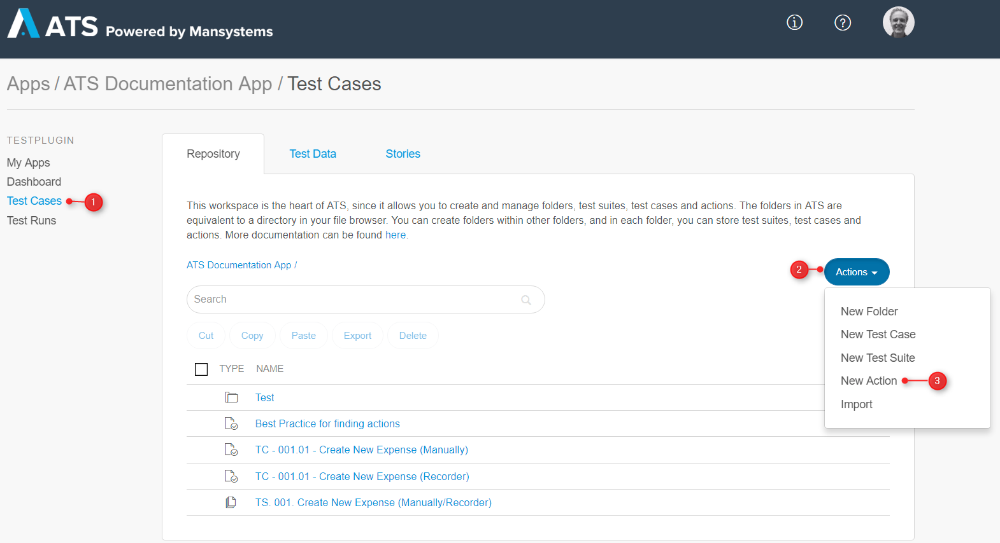

    This opens the **Create new** dialog box:
    
    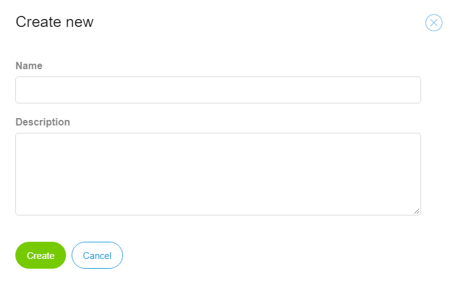

4. Enter a name in the **Name** field (for example, *Set Drop-Down*). It is advisable to use a name that describes what the action does.
5. Enter a description in the **Description** field (for example, *This action sets the drop-down menu to a specific value*). It is advisable to give each action a detailed description of what it does.
6.  Click **Create**:
    
    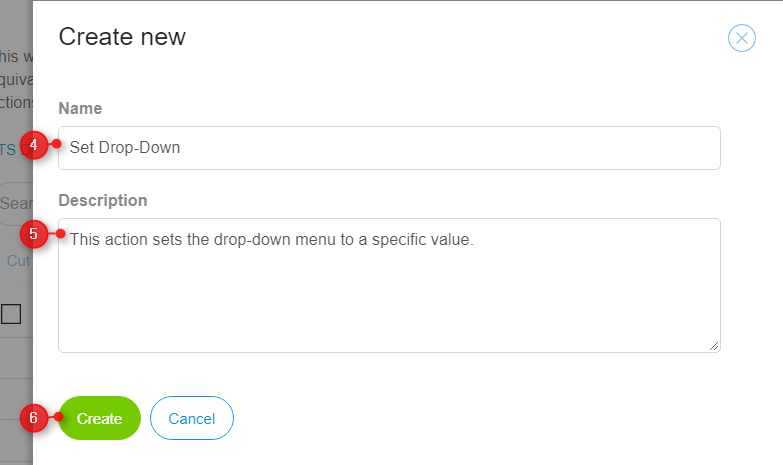

You have now created a custom action from the repository.

### 3.2 Option 2 – Using the Extract Action Button

To use the **Extract Action** button, follow these steps:

1. Open your app in ATS and go to **Test Cases**.
2. Select a test case or action and open it.
3. Select the test steps you want to combine in a custom action by clicking the check box in front of the step.
4.  Click **Extract Action**:
    
    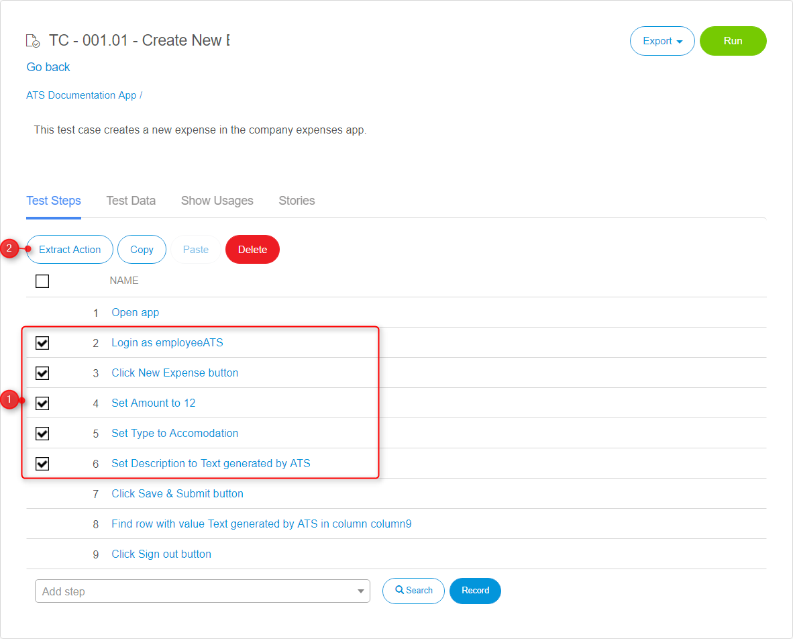

    This opens the **Action - Set Details** dialog box.
5. Enter a name in the **Name** field (for example, *Set Drop-Down*).
6. Enter a description in the **Description** field (for example, *This action sets the drop-down menu to a specific value*).
7.  Click **Close**:
    
    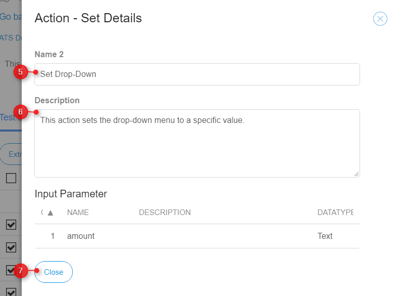

8.  Select the newly created action and click **Open**:
    
    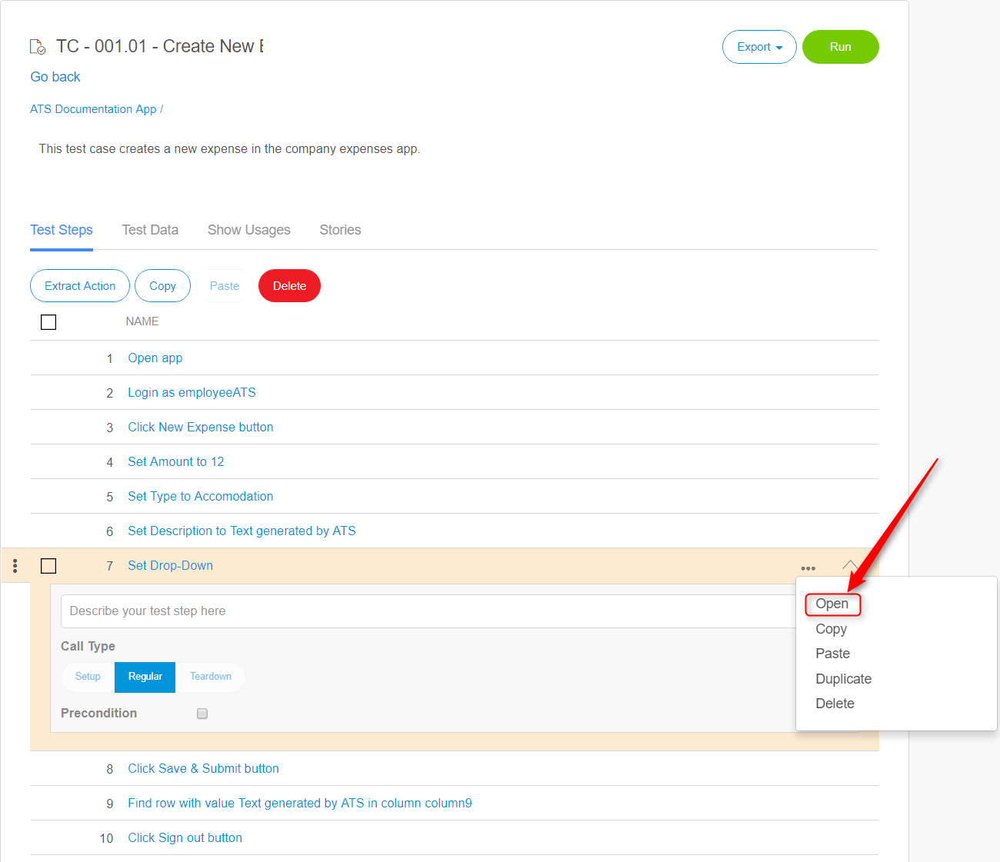

Both ways open the **Action Details** page. This page works the same as the **Test Case Details** page. You add test steps by clicking **Setup step manually** or by clicking **Record step**.

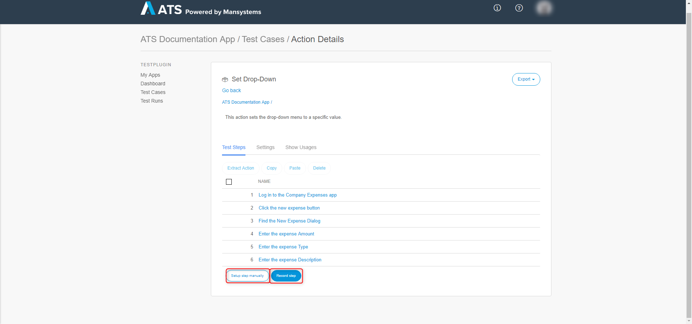

## 4 Adding Parameters

To add parameters to your custom action, follow these steps:

1. Go to the **Action Details** page of your action.
2.  Click the **Settings** tab:
    
    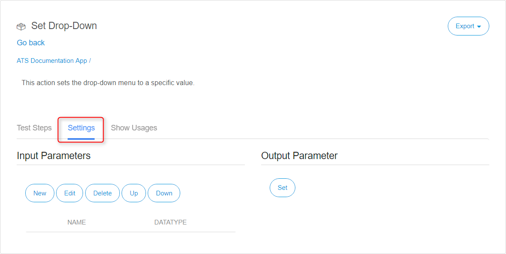

3. Follow the steps in the sections below for adding input and output parameters.

### 4.1 Adding Input Parameters

To add input parameters, follow these steps:

1.  Click **New**:
    
    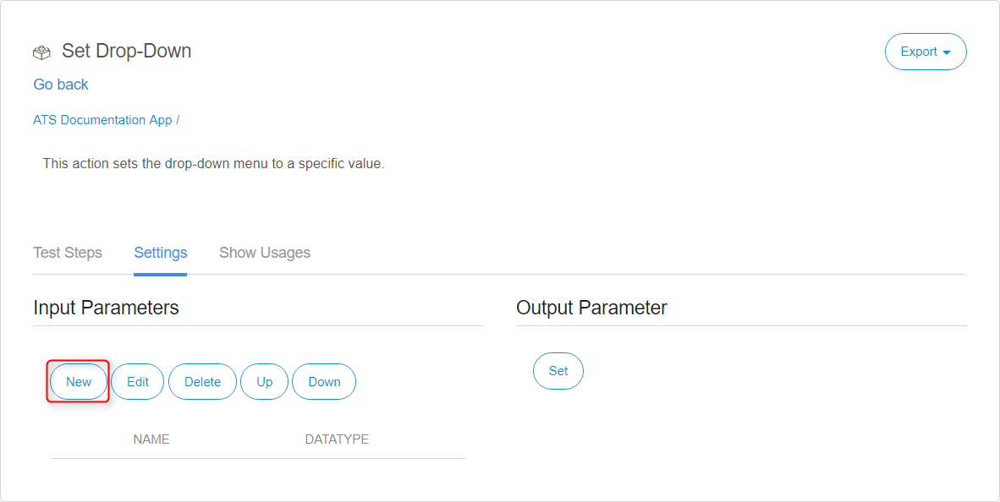

    This will open the **Edit Input Parameter** dialog box.

2.  Enter a name in the **Name** field (for example, *Widget Name*). Use the ATS naming convention.
3.  Enter a description in the **Description** field (for example, *Enter the name of the widget*). Note that you should make sure everybody understands what information they must enter.  
4.  Select a data type from the **Datatype** drop-down menu (for example, **Text**).
5.  Select a **Show as Password** option. This makes the parameter field unreadable. The default setting is **No**.
6.  Select a **Required/Optional** option. For example, the **Widget Name** parameter is always required, otherwise the action does not work.
7.  Click **Save**:
    
    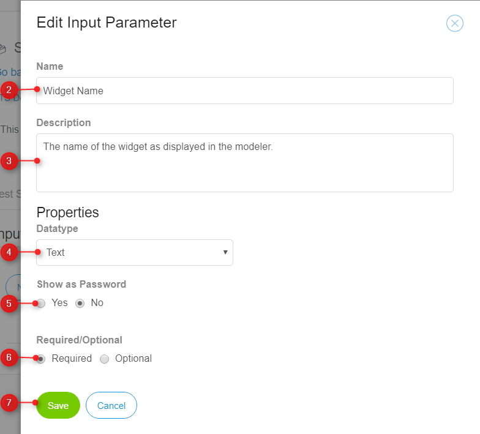

You can add as many input parameters as you need, but remember to keep the action simple.

### 4.2 Adding an Output Parameter

To add an output parameter, follow these steps:

1.  Click **Set**:
    
    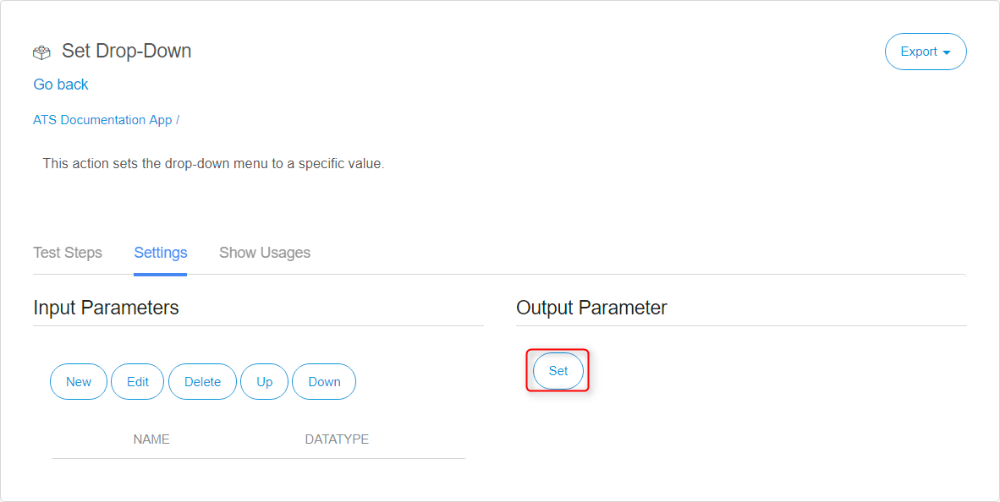

    This opens the different **Output Parameter** fields.

2. Enter a name in the **Name** field (for example, *Element*). The user must know what the action returns, so be clear in the name that you enter.  
3. Enter a description in the **Description** field. Use this field to give a more detailed description of what is returned.
4. Select a data type from the **Datatype** drop-down menu (for example, *Page Element*).
5.  Select a **Required/Optional** option. Only use **Optional** if the action still works when nothing is returned.
    
    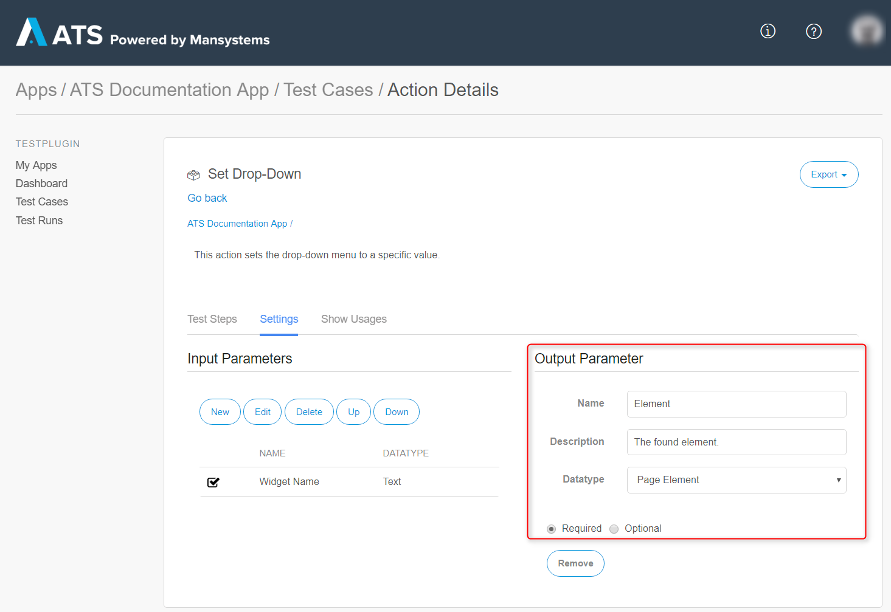

6. The **Output Parameter** requires additional steps. Go to the **Test Steps** tab and click **Add**.
7.  Add the [Find/Assert Widget](/ats/refguide/rg-version-1/findassert-widget) action and the [Set Return Value](/ats/refguide/rg-version-1/set-return-value) action.
    
    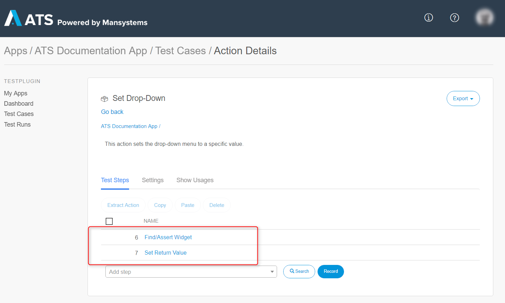

8.  For ATS to return the outcome of a test step as an **Output Parameter**, it needs to know what it must return. ATS returns the **Value** connected to the **Set Return Value** action. Now, connect the outcome of test step 1 to the **Set Return Value** action.
    
    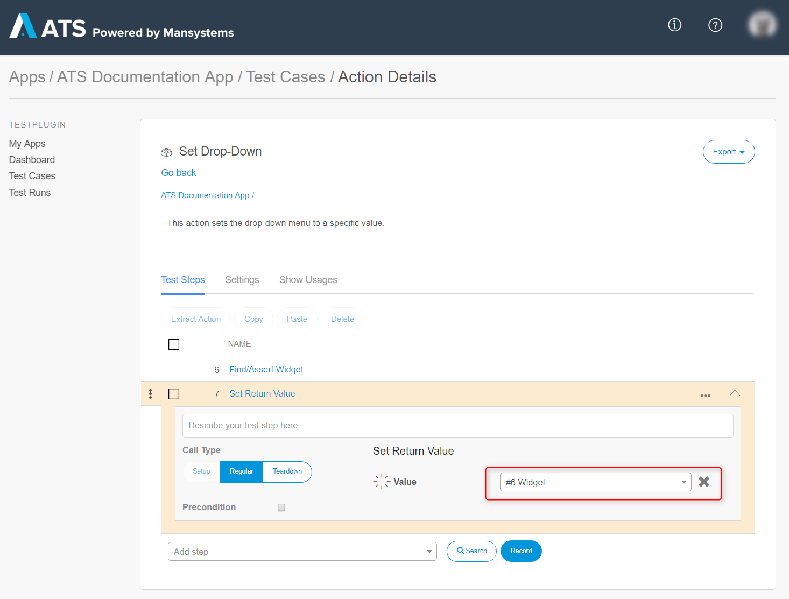

    Make sure the data type of the **Output Parameter** corresponds with data type of the connected outcome.
    
    ATS will the outcome of test step 1.

## 5 Connecting the Input Parameters

To connect the input parameter, follow these steps:

1.  Select the test step to which you want to connect an input parameter.
2.  Open the parameter drop-down menu.
3.  Select the input parameter you want to connect.
    
    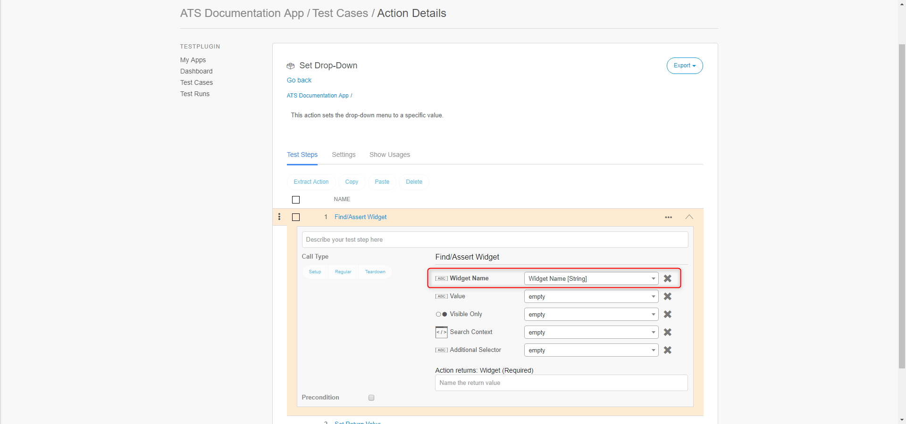
