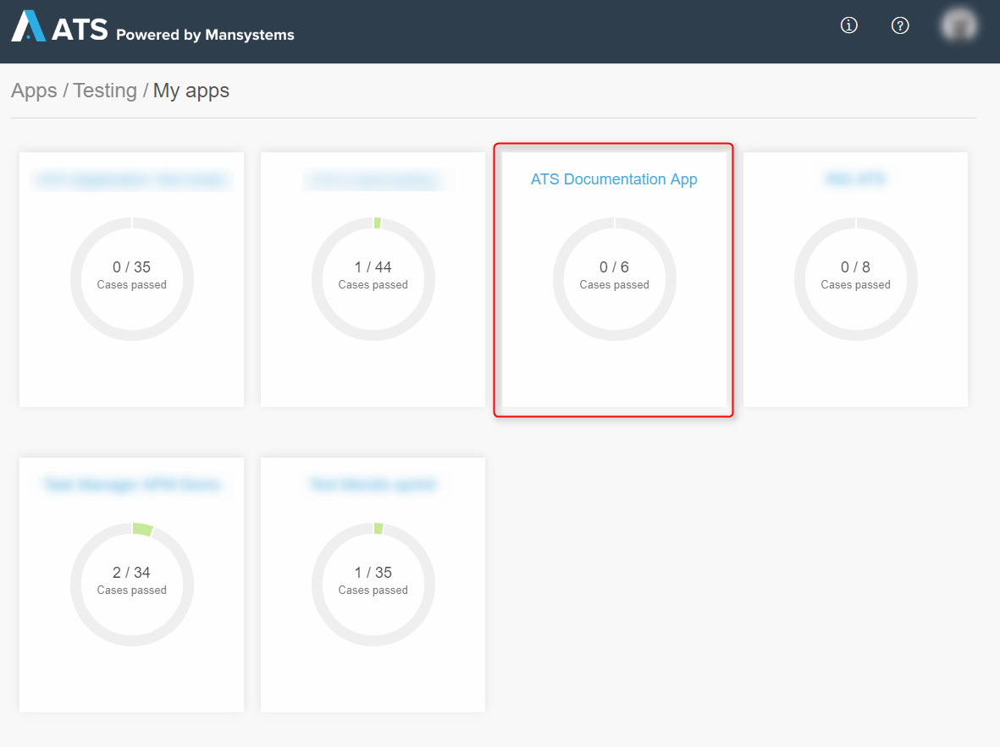
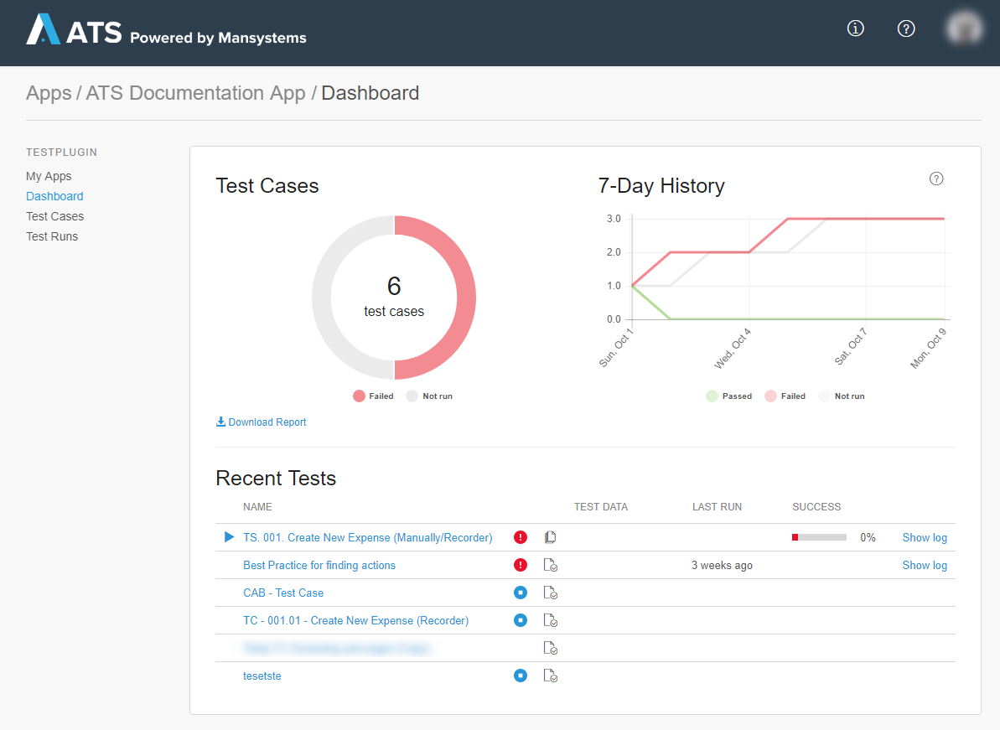
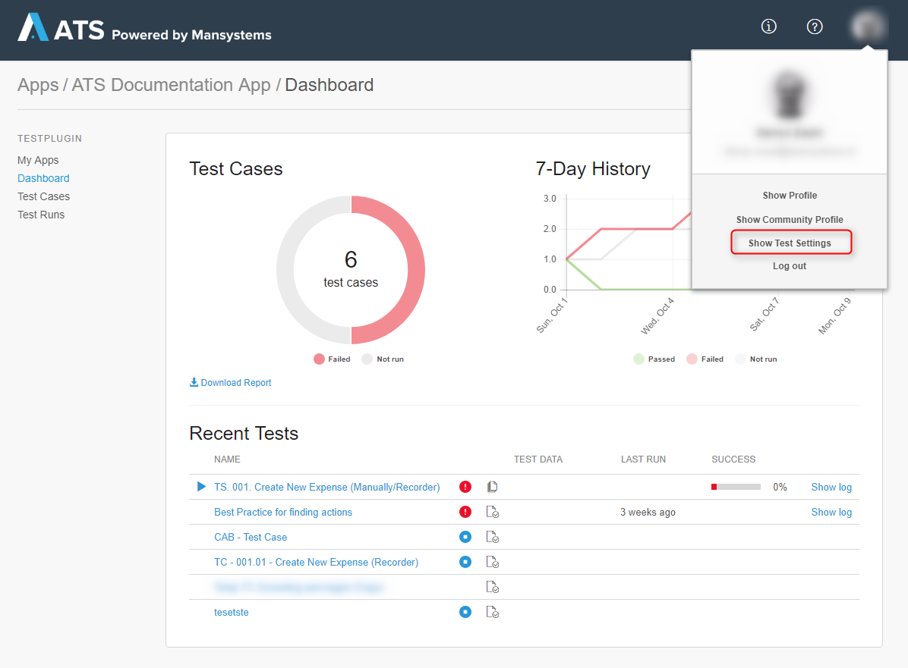
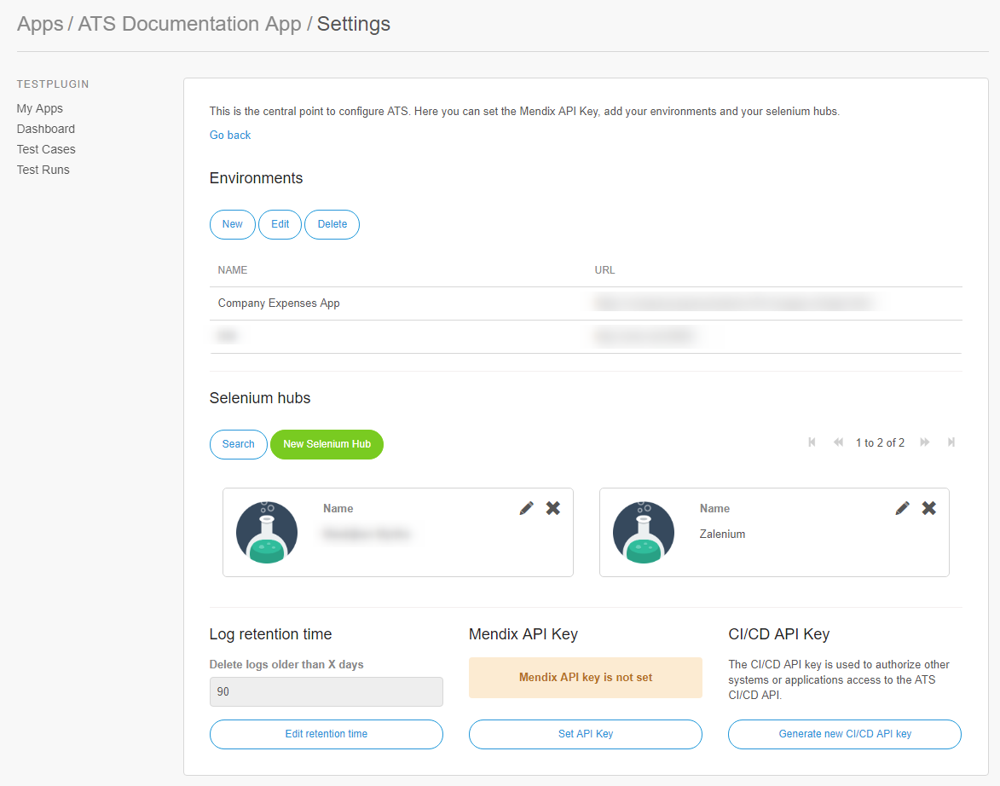
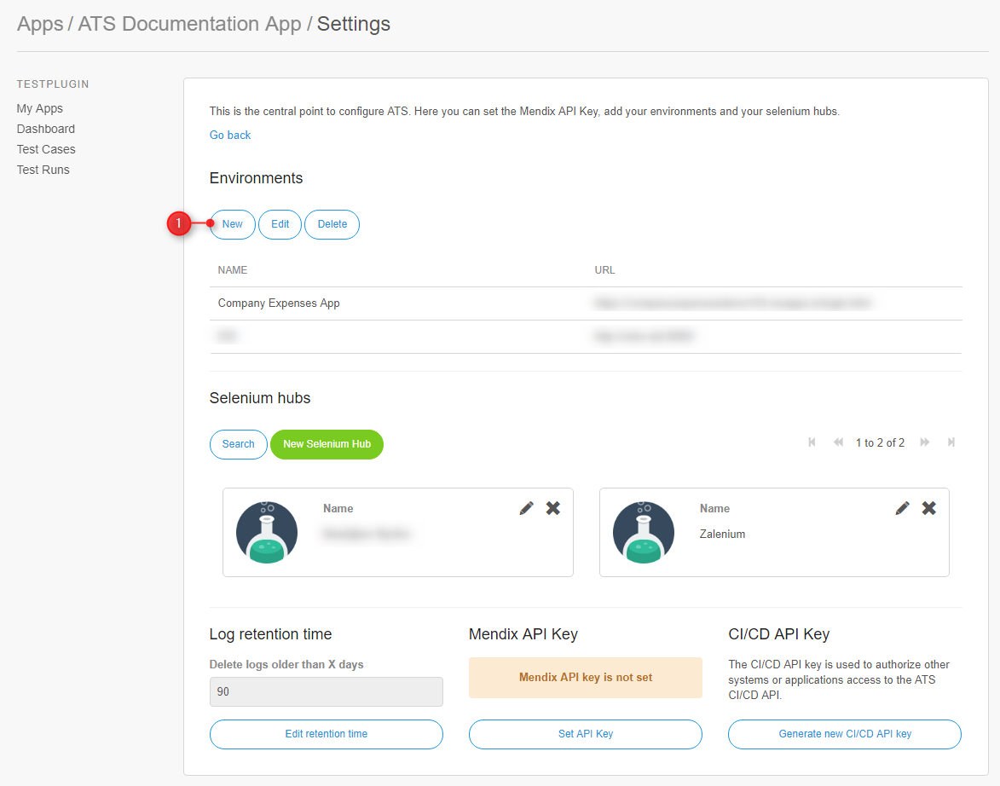
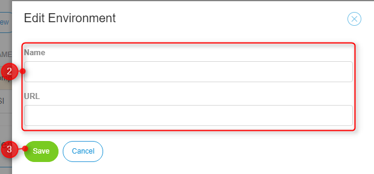
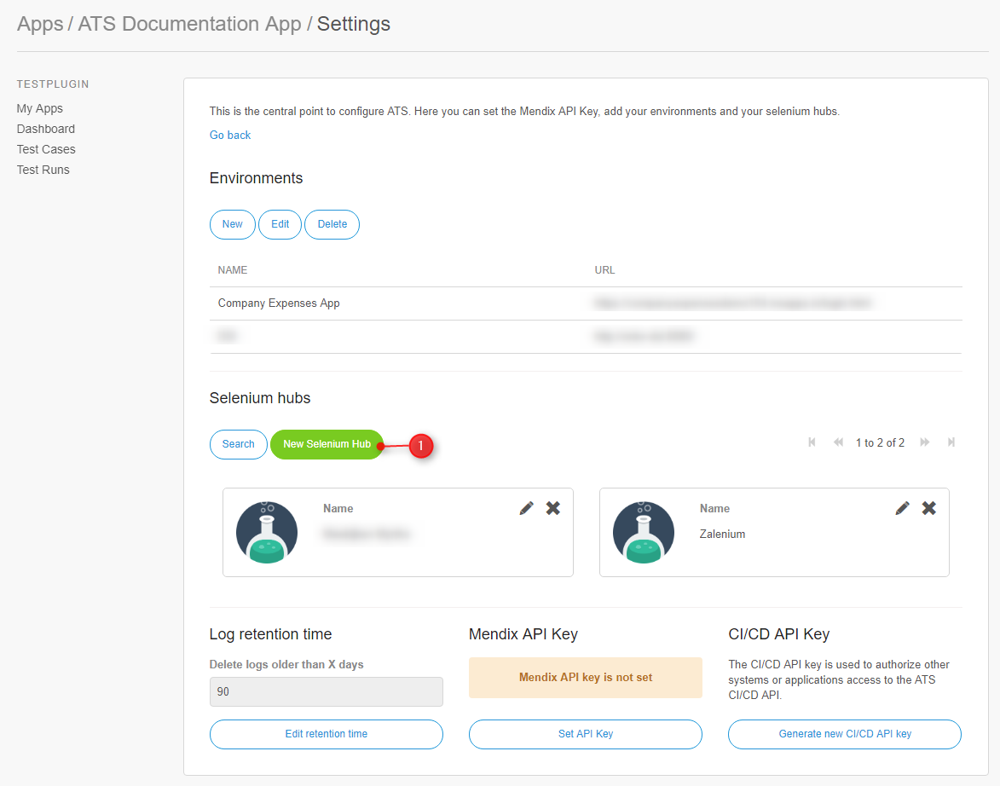
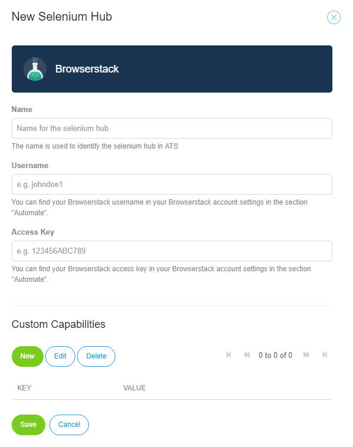
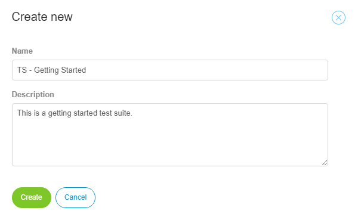

## 1 Introduction

This how-to describes the initial steps for automatically testing your applications using the Application Test Suite (ATS). Links to other how-to's and the ATS reference guide are included for more detailed information on steps and functions.

**This how-to will teach you how to do the following:**

* Configure your App
* Create a test case
* Create a test suite

## 2 Prerequisites

Before starting with this how-to, make sure you have the following prerequisites in place:

* ATS account
* Your ATS instance
* An application under test (AUT)
* Selenium hub (for more information on the Selenium options, see [ATS Deployment](/ats/general/deployment))

## 3 Configuring Your App

When you log in to ATS, you see the **My Apps** page. An app is a folder in which all the data related to a specific application is saved and managed. You must click your app to gain access to the **test settings**.

1. Open your app inside ATS. This opens the **Dashboard** page.

2. Open the profile menu and click **Show Test Settings**.

You are now on the **Settings** page. Here you add environments and selenium hubs.

{}

Only the App admin and SCRUM master have the rights to edit the settings. You set the roles in sprintr.

{}

### 3.1 Environments

At **Environments** you see a list of test applications that have been configured for the current app. Users can run tests on the listed environments. You can edit, create, and delete applications by clicking the buttons in the top bar.

To add a new environment, follow these steps:

1. Click **New** under **Environments**, which opens the **Environment** dialog box.

2.  Set the following parameters:

 | Field | Description |
 | :--- | :--- |
 | **Name** | The name of the application. Using the name of the application is advised.
 | **URL** | The URL of the actual Mendix application to test.

3. Click **Save** to save the settings.

### 3.2 Selenium Tab

At **Selenium hubs**, you see a list of the Selenium hubs configured for this app. Users can run tests on the listed hubs. You can create, edit, and delete Selenium hubs by clicking the buttons in the top bar.

To add a new Selenium hub, follow these steps:

1. Click **New Selenium Hub** under **Selenium hubs**.

      

      This opens the **Select Provider** dialog box. Here you select one of the three supported selenium providers or a custom selenium hub. ATS creates the URL needed to access your selenium provider when you select a supported selenium provider. When you select custom, you must provide the URL yourself. 

2. Click the provider you use.

2.  Set the following parameters:

      | Field | Description |
      | :--- | :--- |
      | **Name** | The name of the Selenium hub. You can give it any name. |
      | **Username** | The username of your selenium provider account. This can be different from your login name. |
      | **Access Key** | The access key for your selenium provider account. |
      | **Custom Capabilities** | Can be used to set the Selenium desired capabilities. |

3. Click **Save** to save the settings.

## 4 Test Cases

The **Test Cases** menu is where you access the repositoy, test data and user stories.

![](attachments/getting-started-2/

The **Test Cases** menu has three tabs: 

| Tab | Description |
| --- | --- |
| **Repository** | Here you create and store all your test cases, test suites, and custom actions. It is the ATS filing system, the heart of ATS. |
| **Test Data** | Where you can create folders, actions, and enumerations.  |
| **Stories** | Where you can access the sprints of your app. |

In this how-to, only the **Repository** tab is described. 

### 4.1 Creating a Test Case

To create a test case, follow these steps:

1. On the **Repository** tab, click **Actions** and click **New Test Case** in the drop-down. This opens the **Create new** dialog box.
2. Enter a name for your test case. Since you are likely to create multiple test cases and test suites, using a predefined naming structure is advised.
3. Enter a clear description for your test case. In case others may need to know what your test case does, use a template to make sure all aspects of the case are described clearly.
4. Click **Create**.

 or exports a PDF report or your test case.

 and ATS recorder (Record). In this how-to, we only describe how to use the ATS recorder.

Before you start adding test steps, add the following tools:

1. Click the **I-icon** in the top right corner of the screen, which opens, the **ATS Information** dialog box.
2. Drag and drop the **ATS helper** link to your bookmark bar.
3. To use the recorder function, you need to have the Google Chrome browser installed on your system and install the ATS Recorder Chrome plugin. The ATS recorder only works in Chrome.
4. Install the ATS recorder extension in your Chrome browser.

![](attachments/getting-started-2/

#### 4.2.1 Record – Using the Recorder Function

With the ATS Recorder plugin installed, you can start a recording session at anytime.

To use the recorder function, follow these steps:

1. Click **Record** while inside a test case in ATS, which opens the **Recording Session** page. On this page you can manage your recording session.
2. You can now open the Mendix application you want to test in another tab of the browser and start testing the application manually. The test steps you take are recorded in the recording session.
3.  Click **Save** to save your test steps.

.

#### 5.2.2 Test Data Tab

In this tab, you can connect your data sets to a test case. Use the arrow to select the data set you need and click **Save**. A new menu will appear in which you can see the data set fields that are available to select. You can also use this menu to check if you selected the correct data set.

{}

If you do not use the data set, make sure to disconnect it. ATS will remember where you selected the data set fields as input, so if you reconnect the data set, ATS will automatically set the correct input.

{}

#### 5.2.3 Show Usages Tab

This tab shows you the actions used in this test case and the test suites that are using this test case. Use this screen to verify that if you make a change to a custom action, it does not affect another test case or test suite.

#### 5.2.4 Stories Tab

This tab displays the user stories that are connected to your test case, the test cases within that story, and the success rate of the user story.

### 5.3 Creating a Test Suite

To create a test suite, follow these steps:

1. Click **Add Test** and select **Test Suite** in the drop-down menu. The page **Create new** will open.
2. Enter a name for your test suite. Since you are likely to create multiple test cases and test suites, using a predefined naming structure is advised.
3. Enter a clear description for your test suite. Others may need to know what your test suite does. It might be handy to use a template to make sure all aspects of the suite are present.

      

4. Click **Create**. 
5. The **Test Suite** page looks similar to the **Test Case** page, but with fewer options. The **Test Suite** page also displays the following buttons:

      * **Run** – takes you to the **Run configuration** screen
      * **Quickrun** – immediately executes a test suite with the last set of run configurations (use this option to check your test case while building)
      * **Export** – exports the test suite as a XML file (this file can be uploaded into another ATS environment)

#### 5.3.1 Test Cases/Suites Tab

Here you can see all the steps that are in your test suite. Each step is either a test suite or a test step.

Clicking **Add** adds a test case to your test suite. Enter a clear description for this step and **Search** for a test case you want to add to your test suite. You can **Create a new Test Case** if you want to add a complete new test case to your test suite.

#### 5.3.2 Show Usages Tab

This tab shows you all the **Test Cases used by this Test Suite**, all the **Test Suites used by this Test Suite**, and the **Test Suites using this Test Suite**. Use this screen to make sure that if you make a change, it does not affect other test cases or test suites.

#### 5.3.3 Stories Tab

This tab displays the user stories that are connected to your test suite, the test cases within that story, and the success rate of the user story. You can **Open**, **Unlink**, or **Link** a user story to your test suite.

## 6 Run Configuration

When you click **Run** in the upper-right corner of your test case, the **Select Run Configuration** page will open.

Here, you can select your AUT and Selenium hub for ATS to use.

| Field | Description |
| --- | --- |
| **Application** | Select the app you want to test. |
| **Selenium Hub** | Select the Selenium Hub you want to use to execute the test case. |
| **Browser** | Select the browser that the Selenium Hub uses to execute the test case. Please note that these are the supported browsers. | 

Now click **Run** again in the upper-right corner to execute the test case against the provided parameters. For more information on the run configuration, see [Run Configuration](/ats/refguide/rg-version-1/test-run).

## 7 Result

When you click **Run**, the **Monitoring / Results** page will open.

Once your test case is executed, the result is shown here. For more information on results, see [Monitoring](/ats/refguide/rg-version-1/monitoring).

You have now finished the getting started guide for ATS. Please check the [how-to's](ht-version-1) and [best practices](/ats/bestpractices/bp-version-1/bp-version-1) for more information.

Good luck testing your Mendix app with ATS!
