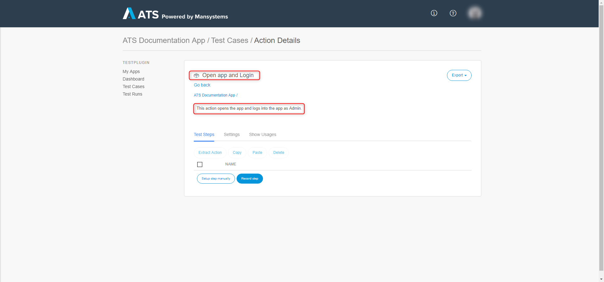
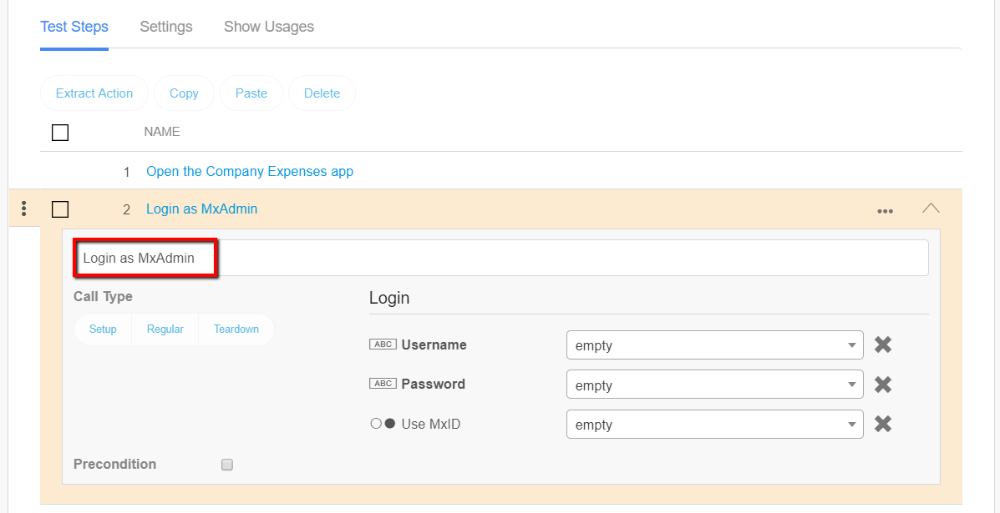
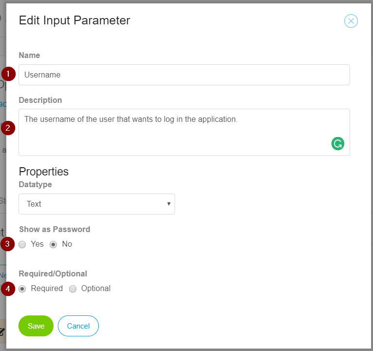
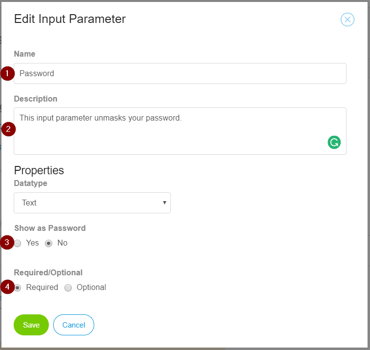
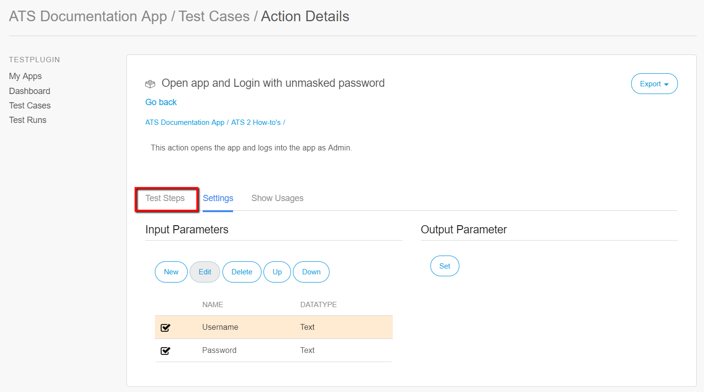
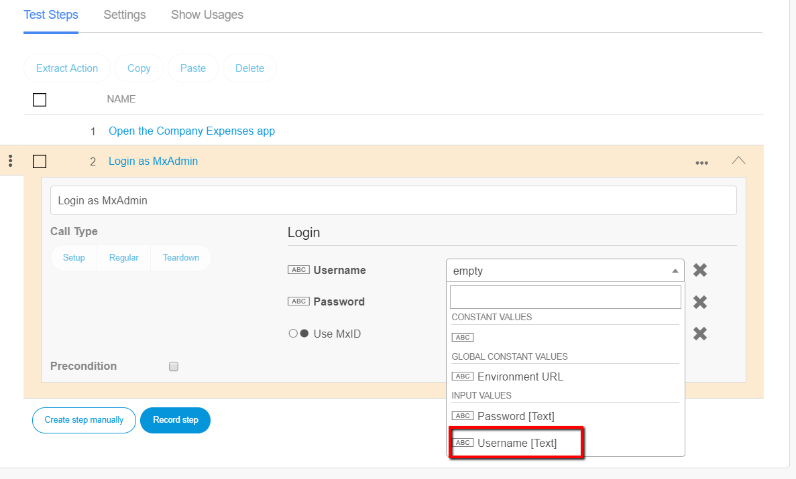
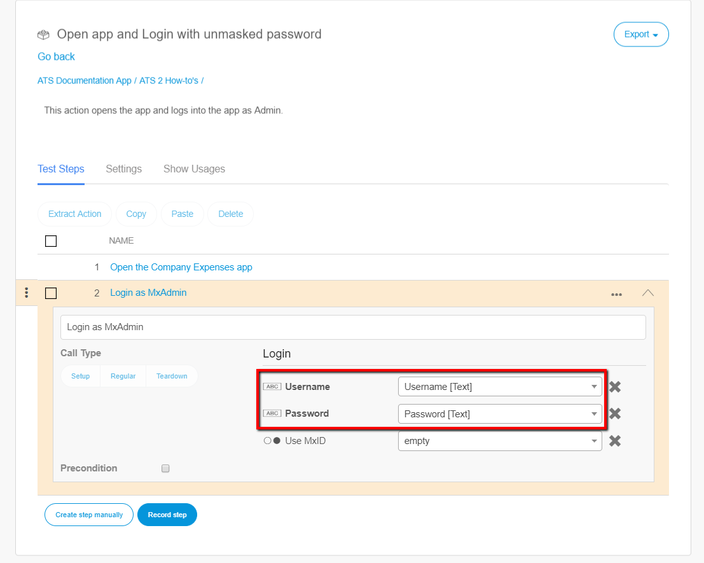
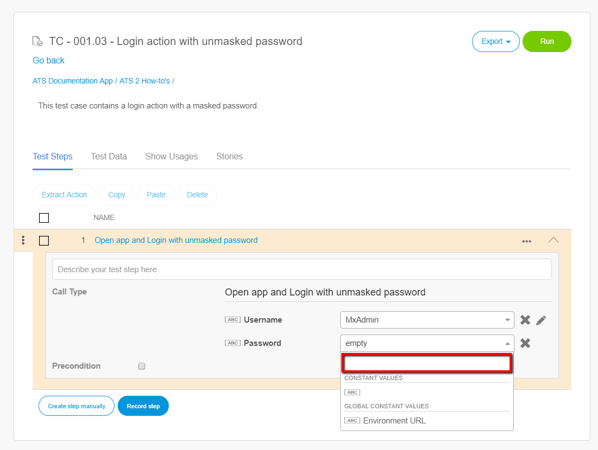
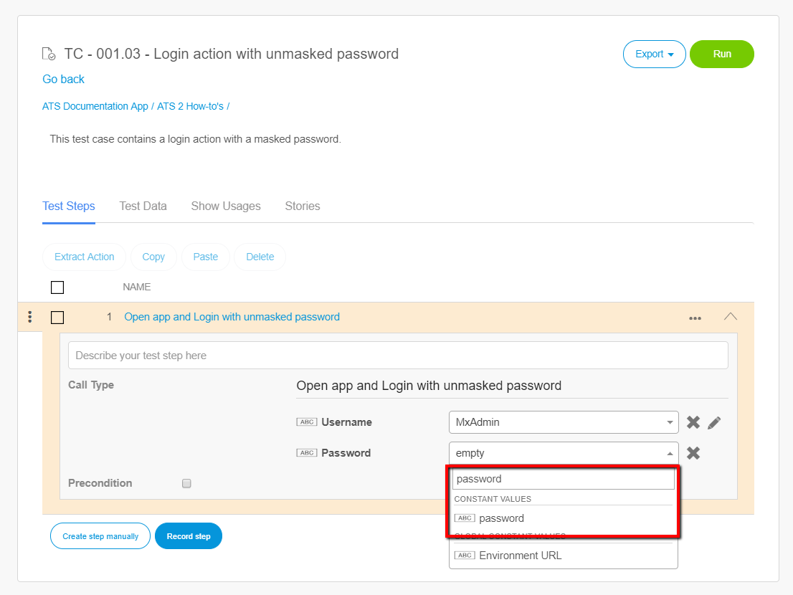
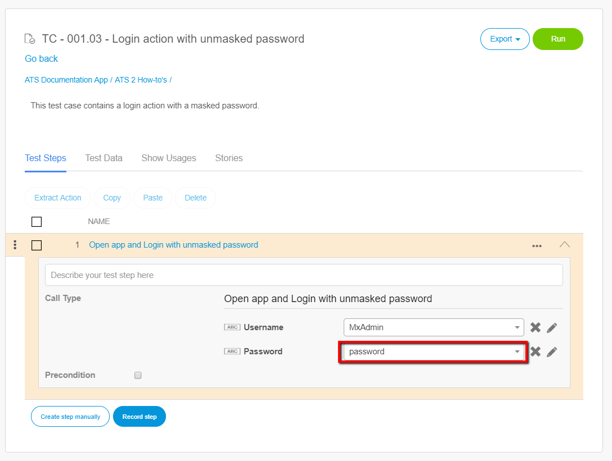

## 1 Introduction

To test your application you need to open the application and log in. For this, you need to enter a username and a password in the **Login** action. Your password will automatically be encrypted to anonymize data. But you might not want to have your login password masked. ATS has the functionality that makes unmasking your password possible. This how-to explains how to do that.

**This how-to will teach you how to do the following**

* Unmask your password

## 2 Prerequisites

Before starting with this how-to, make sure you have the following prerequisites in place:

* Complete [How to Create a Test Case](create-a-test-case-2)
* Understand [How to Create a custom action](custom-action-general-2)

## 3 Unmasking Your Password

The following steps explain how to unmask your password:

1. Open your app in ATS and go to the **Test Cases** menu item.
2. Click the **Repository** tab.
3.  Click the **Actions** dropdown and click **New Action**.

    

    Clicking **New Action** opens the **Create new** dialog box:

     

4. Enter a name in the **Name** field (for example, Open app and Login)     
5. Enter a description in the **Description** field (for example, This action opens the app and logs into the app as Admin.)
6.  Click **Create**:

    

    This opens the **Action Details** page. ATS displays the **Name** and **Description** on this page.

    

7. Add the **Open application** action.
8. Enter a description of the test step. Also set the **Application URL** input parameter to **Environment URL** below **Global constant values**.
9. Add the **Login** action.
10. Enter a description of the test step.

    

11. Click the **Settings** tab.
12. Add a new input parameter by clicking **New** below Input Parameters.

    

    Clicking **New** opens the **Edit Input Parameter** dialog box:

    

13. Enter **Username** in the **Name** field. This field represents the name you have to link to the input parameter **Username** in you test step. So, using the same names makes it easier to connect the parameter to the correct input parameter.
14. Enter a description in the **Description** field. Give a clear description of the parameter (For example, This input parameter unmasks your password.)
15.  Click **Save**

16. Enter **Password** in the **Name** field. This field represents the name you have to link to the input parameter **Password** in your test step. So, using the same names makes it easier to connect the parameter to the correct input parameter. 
17. Enter a description in the **Description** field. Give a clear description of the parameter (For example, This input parameter unmasks your password.)
18. Make sure that **Show as password** is set to **No**.
19. Click **Save**

    

20. Click the **Test Step** tab and open the **Login** action.

21. Click the dropdown of the **Username** input parameter.
22. Select **Username [String]** below **Input values**.

23. Click the dropdown of the **Password** input parameter.
24. Select **Password [String]** below **Input values**.

    

To check that your password is unmasked follow these steps:

1. Open your app, click the **Test Cases** menu item and click the **Repository** tab.
2.  Create a new Test Case and add the **Open app and Login** action.
3.  Click the **drop-down** next to the **Password** input parameter. 

    Clicking the **drop-down** opens the input field:
    

    

4. Enter the password in the **Password** field.
5.  Select the **Constant value**.

    

After selecting the constant value, the entered password represent the **Password** input parameter of your test step instead of five aterisks:

You can now unmask you password using ATS. You can use these steps as well to mask data in ATS.

## 4 Next Up

You now learned how to unmask your password in a login action. The next how-to is [Upload a File in Your App Using ATS](upload-file-using-ats-2). You find an overview of all the how-tos and the structure on the [ATS 2 How-to's](ht-version-2) page. We advise you to follow the predefined structure.
