## 1 Introduction

To test your application you need to open the application and log in. For this, you need to enter a username and a password in the **Login** action. In that case, your password will be visible in the Test Cases in which you use the **Login** action. But you might not want to have your login password visible. In ATS there is a functionality that makes masking your password possible. This how-to explains how to do that.

**This how-to will teach you how to do the following**

* Mask your password

## 2 Prerequisites

Before starting with this how-to, make sure you have the following prerequisites in place:

* Complete [How to Create a Test Case](create-a-test-case-2)

## 3 Mask your password

The following steps explain how to mask your password:

1. Open your app in ATS and go to the **Test Cases** menu item.
2. Click the **Repository** tab.
3. Click the **Actions** dropdown and click **New Action**.

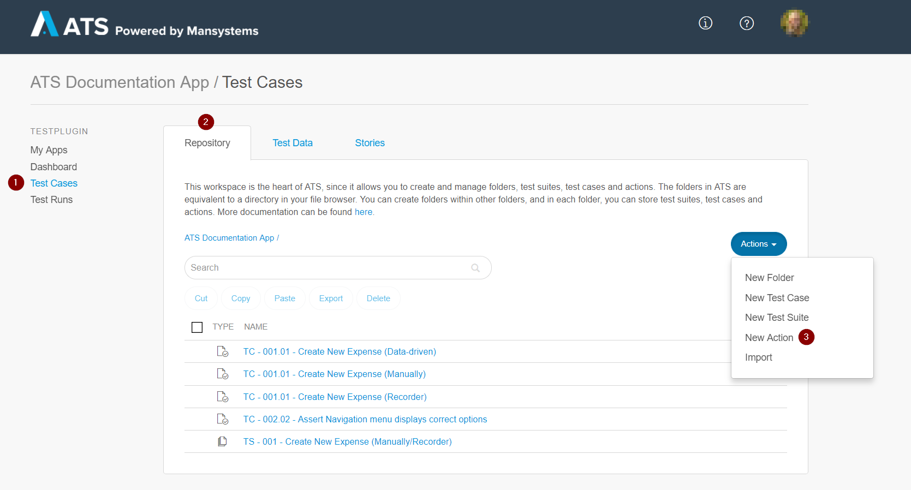

Clicking **New Action** opens the **Create new** dialog box:

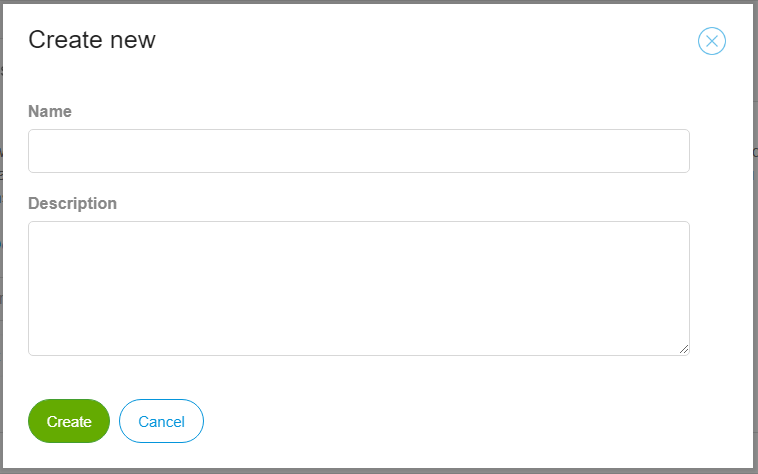 

4. Enter a name in the **Name** field (for example, Open app and Login)     
5. Enter a description in the **Description** field (for example, This action opens the app and logs into the app as Admin.)
6.  Click **Create**:

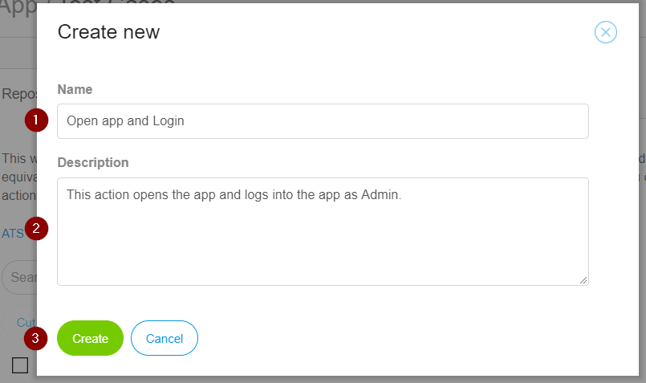

This opens the **Action Details** page. ATS displays the **Name** and **Description** on this page.

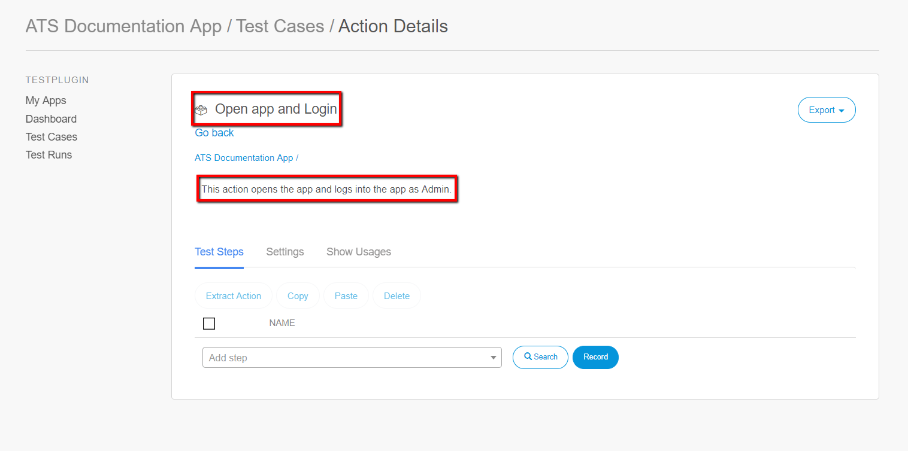

7. Add the **Open application** action.
8. Enter a description of the test step. Also set the **Application URL** input parameter to **Environment URL** below **Global constant values**.
9. Add the **Login** action.
10. Enter a description of the test step and enter the username in the **Username** input parameter.

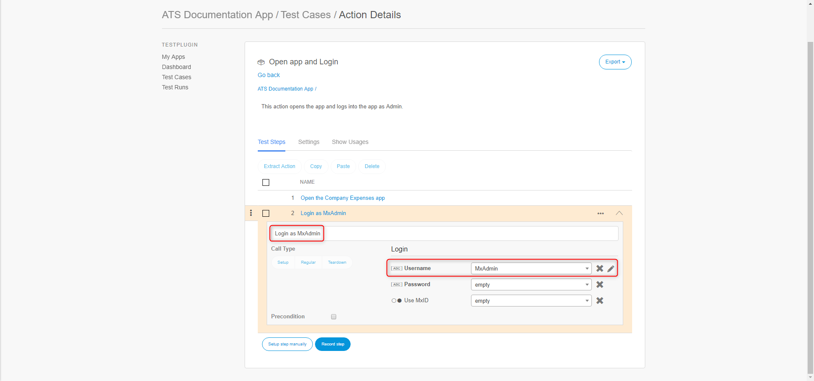

11. Click the **Settings** tab.
12. Add a new input parameter by clicking **New** below Input Parameters.

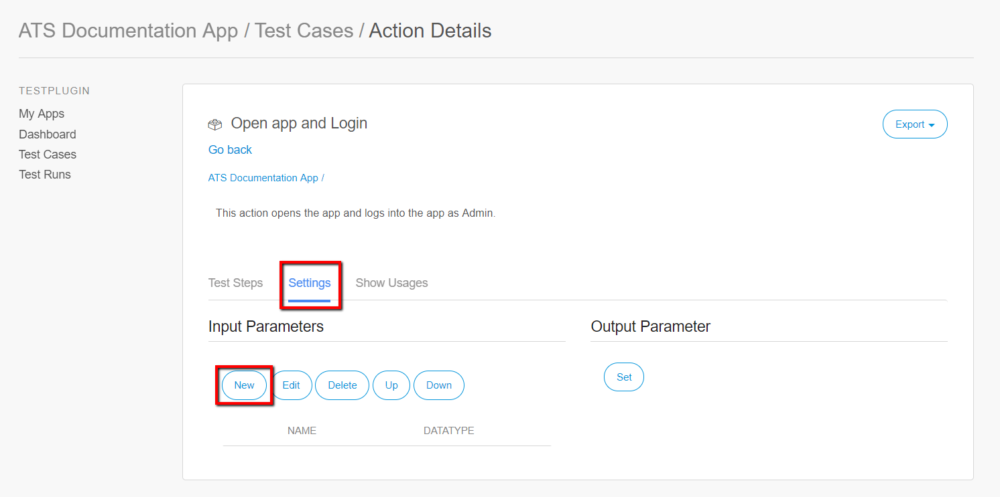

Clicking **New** opens the **Edit Input Parameter** dialog box:

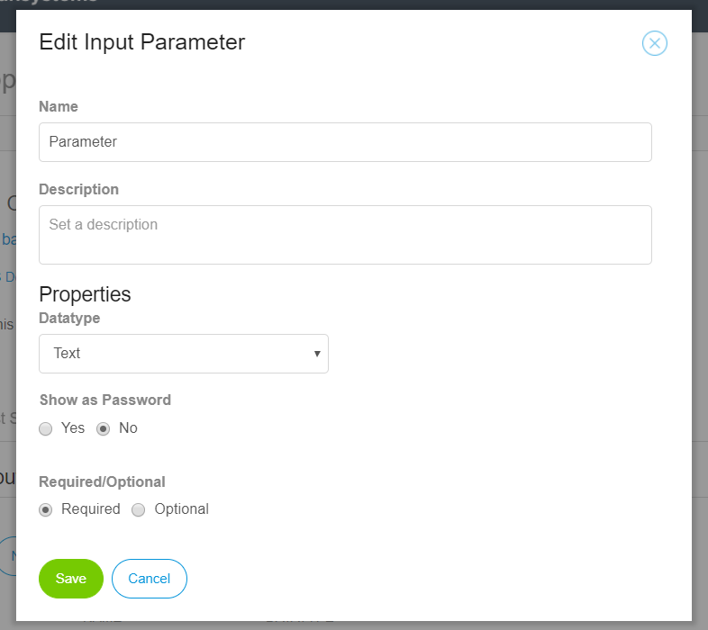

13. Enter **Password** in the **Name** field. This field represents the name you have to link to the input parameter **Password** in your test step. So, using the same names makes it easier to connect the parameter to the correct input parameter. 
14. Enter a description in the **Description** field. Give a clear description of the parameter (For example, This input parameter masks your password.)
15. Set **Show as Password** to **Yes**.
16. Click **Save**

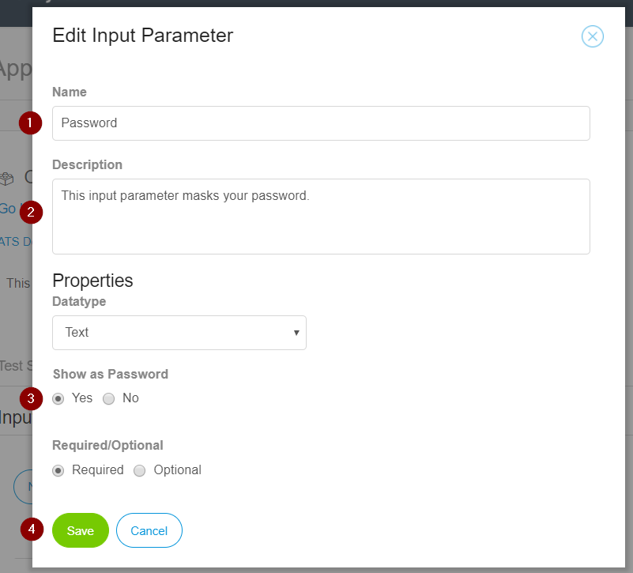

17. Click the **Test Step** tab and open the **Login** action.
18. Click the dropdown of the **Password** input parameter.
19. Select **Password [String]** below **Input values**.

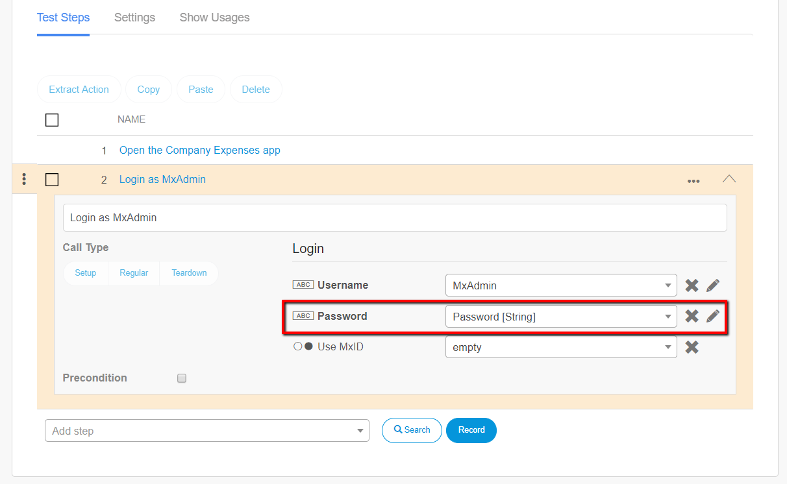

To check that your password is masked follow these steps:

1. Open your app, click the **Test Cases** menu item and click the **Repository** tab.
2. Create a new Test Case and add the **Open app and Login** action.

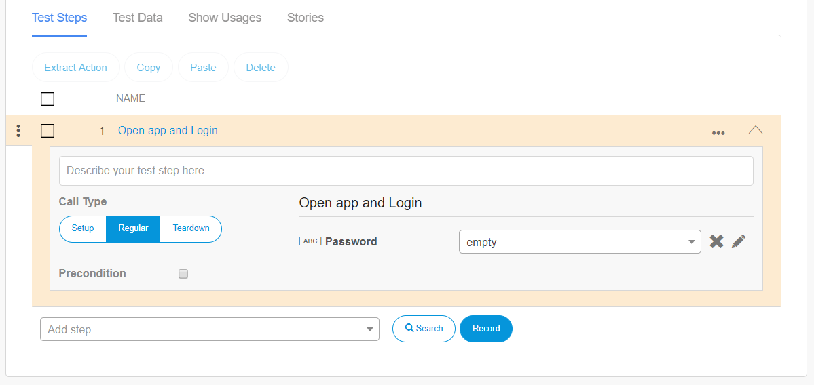

3. Click the **Edit icon** next to the **Password** input parameter. 

Clicking the **Edit icon** opens the **Edit Input Value** dialog:

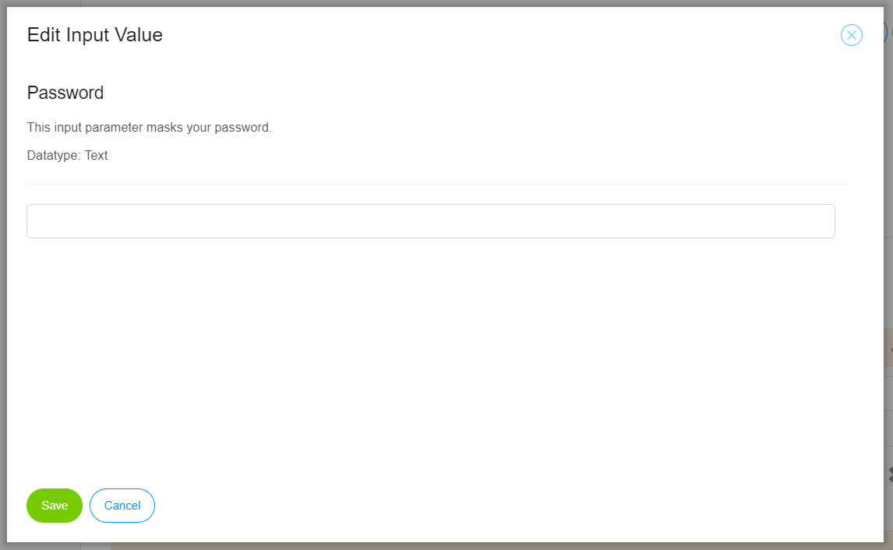

4. Enter the password in the **Password** field. Due to the parameter settings, bullets represent the password you enter.
5. Click **Save**.

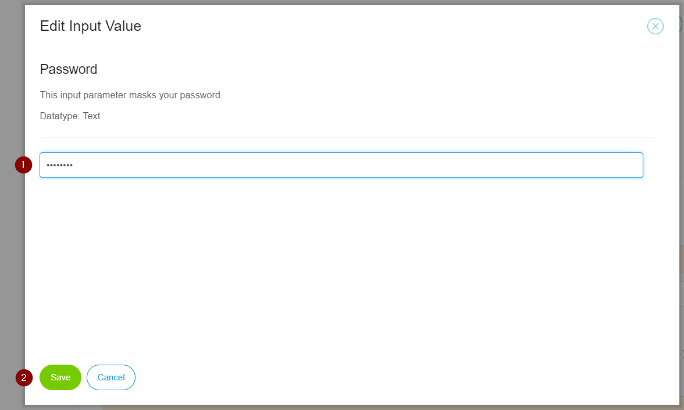

After clicking **Save** five asterisks represent your password in the test step:

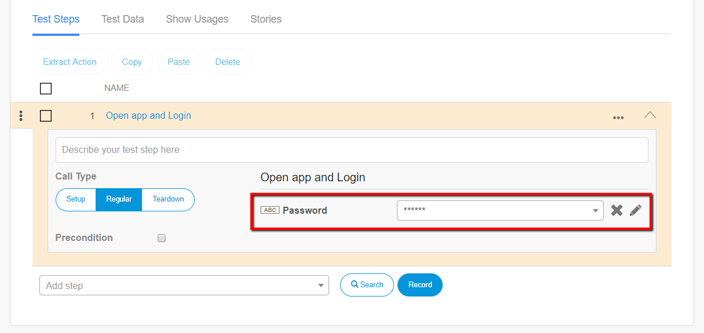

You can now mask you password using ATS. 