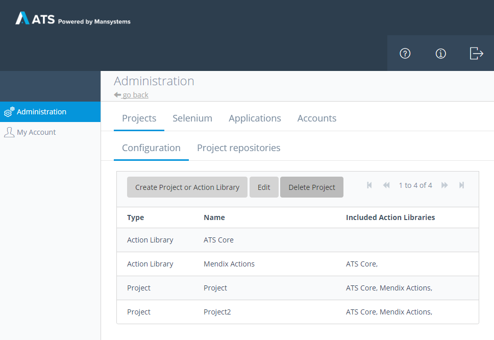
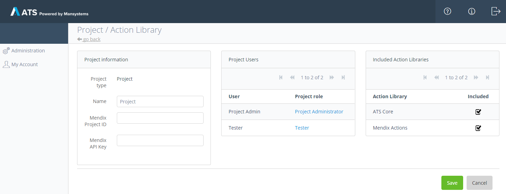
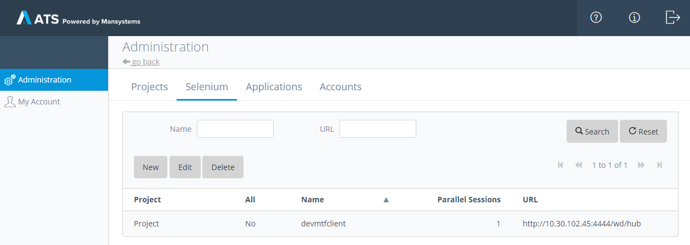
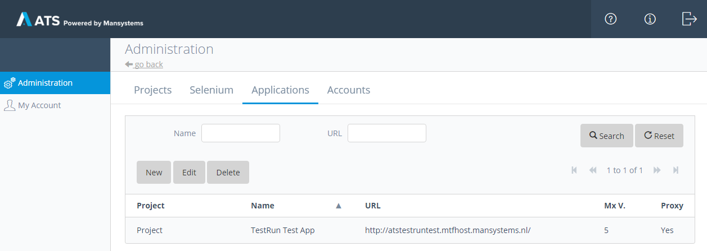
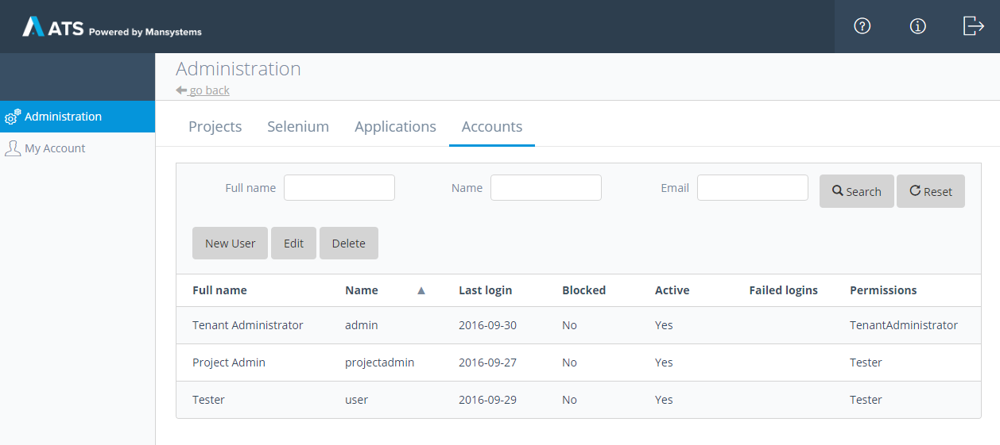
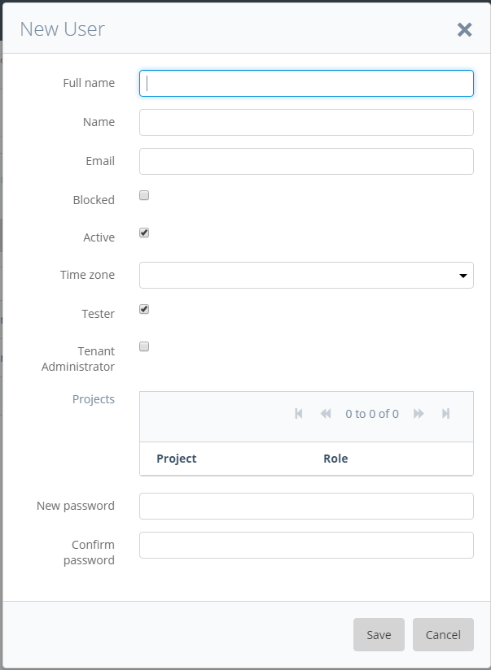

As an administrator in the ATS, you have access to additional functionality:

*   Manage Projects system wide
*   Create new user/administrator accounts
*   Configure Selenium hubs for all projects
*   Change Recorder configuration

## Manage Projects

When you log in as an administrator the _Projects_ page is shown:

On this page you can see all the projects that exist on this ATS instance. Here you can create new _Projects_ and _Action Libraries_. Also as an admin user you have the rights to delete projects and libraries from the system. When creating a new library you can choose to _Include by default in new projects_ , so this library is included by default in any project that is created on the system. For more information on project/library creation see the ReferenceGuide_Projects page of the reference guide.

{}

When creating a new library on the _Projects_ page, the created library is empty at first and you can import action libraries into it or include available libraries.

{}

### Create or Edit a Project/Action Library

If you create a new Project/Action Library or you want to edit an existing one, the following page will open:

You can edit the name, the Mendix Project ID and the Mendix API key. Furthermore you can add users to the project by selecting the appropriate user roles.

You can also add existing Action Libraries.

## Add Selenium Configurations

As an admin user you can configure Selenium hubs as you normally would. For more information, see [SeleniumHub](configuration).

Additionally, as an administrator, you can assign a Selenium hub to a specific project, or you can make the hub available for all projects on the ATS instance. You can do this by creating a new Selenium hub or editing an existing one.

## Add Applications

As an admin user, you can add and configure applications to test.

For more information, see [Configure Test Applications](configuration#configure-test-applications).

## Create Accounts

On the _Accounts_ page you can create new users and administrators for the system. Administrators only have access to the administration part of ATS. They can see test cases and test results, but they can't create new test cases or run them.

When editing accounts you can set accounts to inactive or block them, which will both deactivate the account.

It doesn't matter if you create an administrator or a normal user, as the options described below are the same for both:

Field | Description
--- | ---
Full Name | The full name of the user.
Name | The name the user logs in with.
Email | The e-mail address of the user.
Blocked | Mark the account as unblocked/blocked.
Active | Set the account to active/inactive.
Time Zone | Set the timezone the user works in.
Tester | Adds the tester user role.
Tenant Administrator | Adds the tenant administrator role.
Password | The initial password of the user (which should be changed by the user when logging in).

## Recorder Config

Admin users have access to the _Recorder Config_ page where recorder setting can be changed.

{}

Recorder settings should not be changed under normal circumstances

{}
