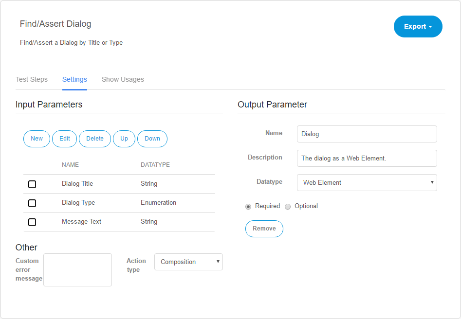

## Action

Actions perform tasks, for example, entering text in a texbox widget. They work like building blocks for test cases. A test case executes the test steps containing actions. An action can contain multiple actions.

Unlike a test case, an action cannot run on its own.

In ATS you create a new action by going to **Test Cases** in the navigation menu and clicking **New Action** in the **Actions** dropdown in the **Repository** tab. A dialog box opens where you give your action a name and an optional description. After you created a new action, click its name and the **Action Details** page opens.

Another way to create a new action is to extract an action out of test steps from a test case. For more information on how to extract an action, see the section "Extract Action, Copy, Paste, Delete" of the [Test Case reference](test-case).

## Action Details

In the upper left corner of the **Action Details** page you find the name and the description of the action. To change them, click them and edit the text. ATS saves the changes automatically.

In the upper right corner of the page, you find the Export dropdown, where you can **export** the action definition. This creates an XML file, which you can import into another ATS project.

### Test Steps

Test steps describe the actions that ATS performs. You add new test steps by searching an action in the **Add step** box.

Another way of adding test steps to a test case is to use the recorder by clicking **Record**. For more information, read the [recorder chapter](recorder) of this reference guide.

The test step details open by clicking the test step description. For more information, read the [Test Step](test-step) section of this reference guide.

### Settings

Under the settings tab, you set the **Input parameters** and **Output parameter** of the action. These optional parameters pass values to the action or return the outcome of an action.

#### Input Parameters

An input parameter is a value, that you use inside your action. The input parameter is shown as an [Action parameter](test-step#action-parameter) of a test step. An action can have multiple optional or required input parameters, but only one output parameter.

The following table describes the buttons under Input parameters:

| Button label | Description |
| --- | --- |
| New | Creates a new input parameter. It opens a dialog box, where you give the input parameter a name, an optional description and set the input parameter properties. |
| Edit | Opens the edit dialog box for a selected input parameter. |
| Delete | Deletes a selected input parameter. |
| Up | Swaps the order of the selected input parameter with the input parameter above. |
| Down | Swaps the order of the selected input parameter with the input parameter below. |

To create a new input parameter, click the **New** button below Input parameters. This opens a dialog box, where you give the input parameter a name and an optional description.

Under properties you find extra settings for the input parameter:

| Property name | Description |
| --- | --- |
| Datatype | The specified datatype of the input parameter. |
| Show as password | If set to yes, ATS displays the value of the input parameter as asterisks.  |
| Required/Optional | If set to _required_, the user must set the input parameter in the test step details. Otherwise, ATS does not execute the action. |

#### Output Parameter

An output parameter is the outcome of an action. Each action has a maximum of one output parameter. ATS uses output parameters to make the outcome of an action available to other actions or test steps.

To set an output parameter click the **Set** button under Output Parameter.

The following input fields appear:

| Name | Description |
| --- | --- |
| Name | The name for the output parameter. |
| Description | An optional description for the output parameter. |
| Datatype | The datatype of the output parameter. |

To pass the outcome of your action to the output parameter, you must use the _Set return value_ action in your test case. ATS uses the input value of the _Set return value_ action as the output parameter of the current action.

If you want to remove the output parameter from your action you must click **Remove**.

### Show Usages

The Show Usages tab gives an overview of all other actions used in the current action. Besides that, it also shows other actions and test cases that use the current action.

