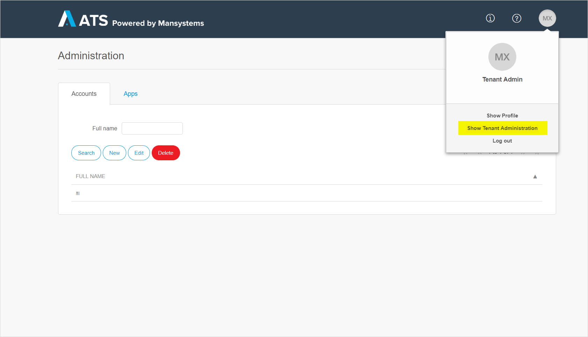
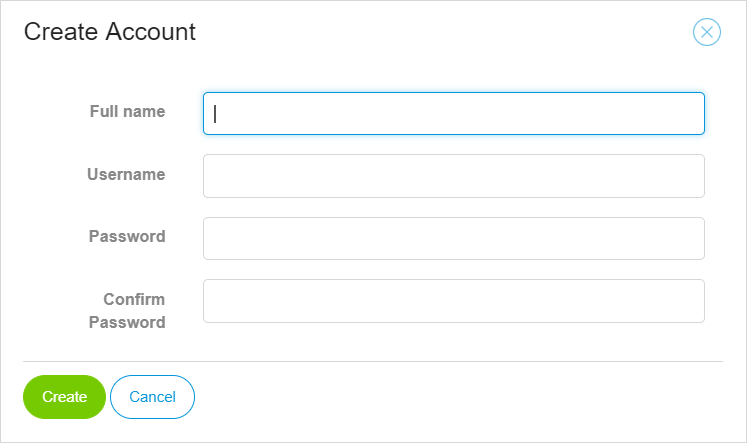
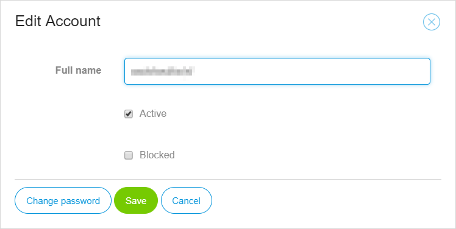
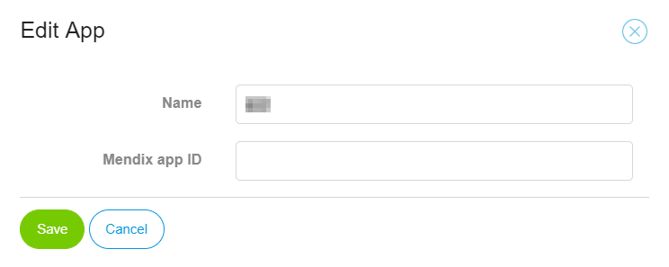

{}

Tenant administration is a feature which is only available in the On-Premise version of ATS.

{}

## 1 Introduction

A tenant administrator is a user role which is used in on-premises instances of ATS. The tenant administrator is able to create and edit accounts and apps. 

As a tenant administrator in ATS, you have access to the following additional functionality:

*   Managing apps system-wide
*   Creating new user accounts

When you are logged in as a tenant administrator, you can access the tenant administration page from your profile menu:

Each ATS instance comes with a single tenant administration account with the following credentials: 

* **Username**: tenantadmin
* **Password**: 1

We advise that you change the password for the tenant administrator account as soon as you log in for the first time.

## 2 Managing Accounts

On the **Accounts** tab, you can manage the accounts for this ATS instance. 

## 3 Creating Accounts

Field | Description
--- | ---
Full Name | The full name of the user as displayed in ATS.
Name | The name the user logs in with, which must be unique.
Password | The initial password of the user (which should be changed by the user when logging in).
Confirm Password | Must match the **Password**.

{}

When a new account is created, the user's for all apps will be set according to the specified **Default app role** for each app.

{}

## 4 Editing Accounts

A tenant administrator can change the full name of an account and the password. It is not possible to change the username of an account.

When editing accounts, you can set accounts to inactive or block them, which will deactivate the account. 

{}

When a user attempts to log in with an incorrect password a certain number of times in a certain amount of time, according to Mendix regulations, that account will be marked as blocked by the system. As a tenant administrator, you can unblock accounts by toggling the **Blocked** check box.

{}

## 5 Managing Apps

On the **Apps** tab, you can see all the apps that exist on this ATS instance. Here you can create new apps and edit existing ones. When you click **New**/ **Edit**, the following page will open:

You can enter/edit the name and the Mendix app ID. The name is used in the **My apps** page. The Mendix app ID is used to retrieve information from the Mendix Developer Portal (for example, user stories), which are needed for certain ATS features. You can leave the Mendix app ID empty if you do not plan to use these features.

{}

When creating a new app, you will be assigned as an administrator for this app. All other users will have no access to the app. Go to the newly created app's **App settings** to manage access to it.

{}

