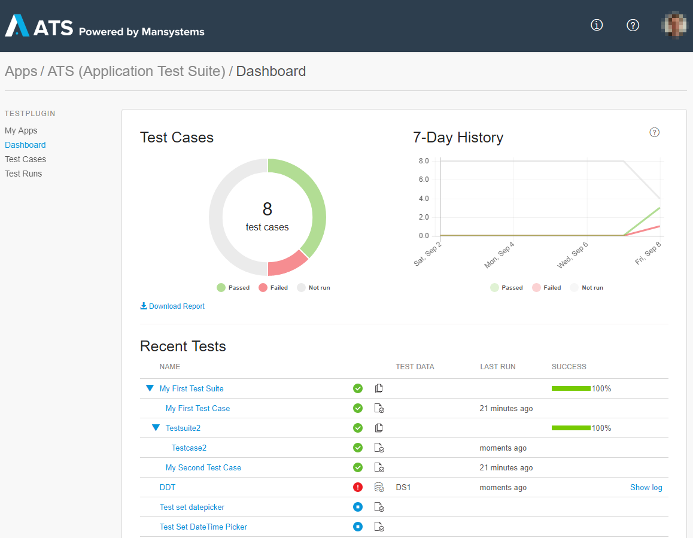
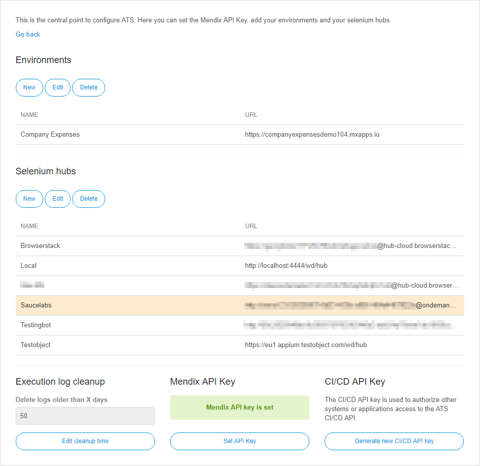
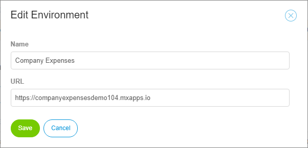
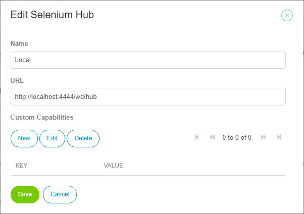

## 1 Dashboard

The dashboard is where you find all information about the results of your tests. It is split into two parts: **Current Status and 7-Day History** infographics and the **Recent Tests** result tree. 

### 1.1 Infographics

Infographics are the first thing you see when you open your app in ATS. These charts show you the current status and the states of the past seven days of your tests. They include the results of all your test cases. Data-driven tests are counted as a single test case. 

For the **7-Day History**, a snapshot of the current test states is taken every day at 23:59 UTC.

### 1.2 Report

To generate a PDF report of the status of your tests, click **Download Report**. A dialog will open allowing you to select between two reporting options with regards to the items being included in the report: *All* and *Selected*. If you chose *All*, then all test suites and test cases will be included in the report. If you chose *Selected*, then you can add one or more test cases, test suites or folders that you want to be part of the report. Note that, adding a test suite or a folder will recursively add all nested test suites and test cases.

When you are happy with your selection or have chosen *All* you can proceed with the reporting process by clicking *Generate*. This will open a second dialog where you will get a summary infographics, similar to the one that you see on the *Dashboard*. At this point you can download the report by clicking *Download*. You can cancel the process at any point by clicking the *X* button. Note that the *7-day history* infographic will only be included in the PDF report when you choose *All*.

### 1.3 Recent Tests

Under **Recent Tests**, you can find detailed information about the status of all your test cases and test suites. You can see the duration since the latest run, its result, and the success rate (for test suites). The success rate is calculated using the results of all the containing test cases. For data-driven tests, the data set is displayed in the **test data** column.

The results of your tests are displayed as icons. The following table explaines the meanings of those icons:

| Icon | Meaning |
| ---- | ------- |
|| Passed – the test was executed successfully. |
|| Failed – the test has failed. |
|| Canceled – the test was canceled by a user before finishing. |
|| Skipped – the execution of this test was skipped or it hasen't been run yet. |

The following three icons exist for test cases, test suites, and data-driven test cases:

| Icon                                     | Meaning    |
| ---------------------------------------- | ---------- |
| | Test case  |
| | Test suite |
|| Data-driven Test case|

To open the latest execution log, click **Show Log**. When you click the **name of a test case/test suite**, the edit page opens. 

## 2 Permissions

There are two roles in ATS, which are assigned to the user by the system itself. These are described below.

### 2.1 Tester

The **Tester** role is assigned to a user when they have at least one Team Server project licensed in ATS. A tester has access to all the data and actions that are neccessary for writing and executing tests in ATS.

### 2.2 App Admin

The **App Admin** role is assigned to a user when they have the app settings permission of the Team Server project in the Developer Portal. The app settings permission is by default part of the SCRUM Master role in the Developer Portal. An App Admin also has access to the test settings page described in the next section.

## 3 Settings

Settings is the central point for configuring ATS. You can set the Mendix API Key, add your deployments, and add your Selenium hubs. You can also find an overview of all the testers and administrators of your app. 

{}

Only App Admins can access the settings. Testers can only use the available deployments and Selenium hubs.

{}

### 3.1 Environments

Under **Environments**, you add the different environment URLs that you use for the current app. The user selects one of these to use in their test case. ATS executes the test case/test suite against that environment.

You edit, create, and delete the applications by clicking the buttons in the top bar:

When you create a new application, set the following parameters:

| Field | Description                              |
| ----- | ---------------------------------------- |
| Name  | The name of the application.             |
| URL   | The URL under which the Mendix application to test is running. |

### 3.2 Selenium Hubs

Under **Selenium Hubs**, you add the different Selenium hubs that you use for the current app. The users run the tests on the listed hubs. To add a new Selenium hub, click **New** in the top menu:

In the **Edit Selenium Hub** dialog box, set the following parameters:

| Field               | Description                              |
| ------------------- | ---------------------------------------- |
| Name                | The name of the Selenium hub.            |
| URL                 | The URL of the Selenium server.          |
| Custom Capabilities1 | Sets the Selenium DesiredCapabilities (for more information, see [Class DesiredCapabilities](https://seleniumhq.github.io/selenium/docs/api/java/org/openqa/selenium/remote/DesiredCapabilities.html)). |

ATS automatically retrieves the parallel test session limit from the Selenium hub. This limit is updated every 15 minutes. If ATS is not able to get the limit from the Selenium hub, it is set to one single test execution at a time.  

{}
Starting with ATS verson 2.0, ATS capabilites override custom capabilities.
{}

### 3.3 Execution Log Cleanup

ATS automatically deletes execution logs that are older than 90 days. Here you can change for how many days ATS keeps the execution logs. ATS keeps the execution logs at least for one day.

### 3.4 Mendix API Key

The Mendix API Key is used to synchronize stories between the Developer Portal and ATS.

You must set this key, otherwise you cannot use your user stories in ATS. Be aware that after you have set the Mendix API key, you won't be able to see it again. You can only set a new API key.

For information on where to find the API keys of your Mendix app, see [Authentication](https://docs.mendix.com/apidocs-mxsdk/apidocs/authentication.html).

### 3.5 CI/CD API Key

The CI/CD API key is used to allow other systems or applications access to the ATS CI/CD API. Generating a new API key revokes access for any systems using the old API key. These systems are not able to access the ATS CI/CD API until they are updated with the new API key. Make sure to save the displayed API key in a secure place, as you cannot view it again in ATS. 

For more information about the CI/CD API, see [CI/CD API](cicd-api).
