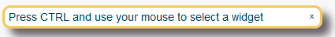

## 1 Introduction

The **ATS Helper** is an inspection tool. It provides the information needed to create test steps in your test cases or actions. With the ATS helper you identify widgets in the running application. It determines the `mx-name` of a widget and saves you from diving into the HTML source code or the application model.

## 2 Installation

You install the **ATS Helper** by creating a bookmark in your browser. This bookmark loads the latest version of the ATS helper from ATS and starts it.

Follow these steps to set the bookmark:

1. Open your ATS instance in the browser
1. Login with your account
1. Open the information dialog by clicking  in the upper right corner of the screen
1. Find the link that says *ATS Helper*

1. Create a browser bookmark for this link with one of these methods:
   1. Drag and drop the link to your browser's bookmark bar
   1. Right-click the link and select *Add bookmark for this link*

### 2.1 Compatibility

The ATS Helper works in _Firefox_, _Chrome_, _Edge_ and _Internet Explorer 11_.

## 3 Usage

### 3.1 Starting the ATS Helper

Use the ATS Helper within the application under test. Follow these steps to load the helper in your application:

1. Open your application
1. Click the *ATS Helper* bookmark that you created before.

The following dialog pops up on top of your application's UI:

### 3.2 Inspecting widgets

To inspect a widget, keep your <kbd>Ctrl</kbd> key pressed and move your mouse cursor to a UI element.

The ATS helper highlight the selected widget with a yellow border. The ATS Helper dialog shows you the `Mx Name` as well as the Mx Name Selector properties.

If you release the <kbd>Ctrl</kbd>, the widget remains selected.

The properties shown by the ATS Helper are:

| Property        | Description                              |
| --------------- | ---------------------------------------- |
| MxName          | The name of the widget. Required input for many actions |
| MxName Selector | The full CSS selector for the widget. Used for advanced test steps or custom actions. |

### 3.3 Moving and Closing

You can drag and drop this dialog with your mouse. To close the helper press the *x* icon in the top right corner.
