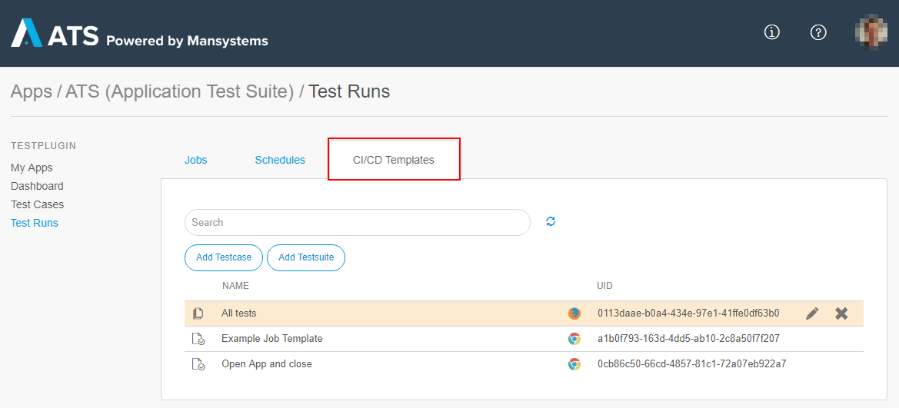
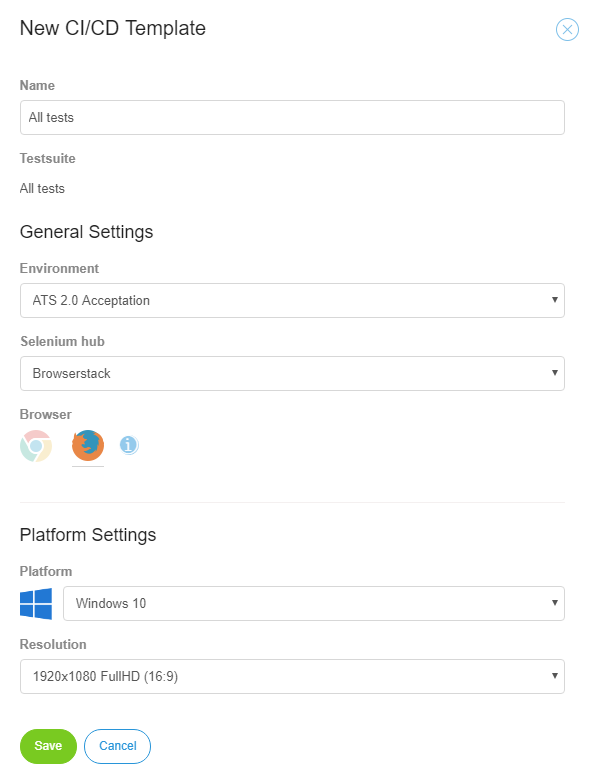

## 1 CI/CD API

With the CI/CD API you easily integrate ATS into your automated deployment workflow. You run a test according to predefined templates or you could retrieve the status of already finished tests. To use the CI/CD API you need a special webservice user, which ATS uses for authentication. For more information on how to integrate ATS into your CI/CD workflow read the [How-To ATS CI/CD](../howtos-2/use-CI-CD-api).

## 2 CI/CD Templates

CI/CD Templates are predefined configurations for a remote job run. The remote job run is triggered via the run job web service. Every CI/CD Template consists of the job configuration, an associated test case or test suite, and a generated unique ID. This ID identifies the CI/CD template. An overview of all the existing CI/CD Templates is found on the **CI/CD Templates tab** on the Test Runs page.



| Name | Description |
|------|-------------|
| Type Icon | Test case, test suite. |
| Name | Test case name, test suite name, or custom name. |
| Browser | Firefox, Chrome. |
| UID | The ID that identifies the CI/CD Template. |

You can add new CI/CD Templates by clicking **Add Testcase** or **Add Testsuite**. A dialog box will open where you select the test case or test suite for the CI/CD Template. After that, the **New CI/CD Template** dialog box opens.



Configure the following options in the **New CI/CD Template** dialog box:

| Name | Description |
|------|-------------|
| Name | By default, the name of the test case/test suite. Customizable. |
| Environment | The environment to test. |
| Selenium Hub | The Selenium hub where the test is executed. |
| Browser | The browser that is used for the test: Firefox or Chrome.|

For supported Selenium hubs, like Browserstack, further options are available. For more details, see [Supported Selenium Hub Provider](supported-selenium-hub-provider).

## 3 API

The ATS CI/CD API is based on the SOAP webservice protocol. Currently there are two services available, **Run Job** and **Get Job Status**. The following sections show the structures of the request-and-response messages of these services.

### 3.1 Run Job

#### 3.1.1 URL

```
https://ats100.mendixcloud.com/ws/RunJob
```

#### 3.1.2 Request

You must include the following information in the request:

| Name | Description |
| --- | --- |
| username | The username of the web service user. |
| password | The password of the web service user. |
| AppAPIToken | The key for the CI/CD API. Generated on the **Test Settings** page. |
| AppID | The ID of your Mendix app. |
| JobTemplateID | The unique ID of the CI/CD Template. |

##### 3.1.2.1 Example

```
<soapenv:Envelope xmlns:soapenv="http://schemas.xmlsoap.org/soap/envelope/" xmlns:men="http://www.mendix.com/">
  <soap:Header>
    <tns:authentication>
      <username>exampleUser</username>
      <password>examplePassword</password>
    </tns:authentication>
  </soap:Header>
  <soap:Body>
    <tns:RunJob>
      <TestRun>
        <AppAPIToken>exampleString</AppAPIToken>
        <AppID>exampleString</AppID>
        <JobTemplateID>exampleString</JobTemplateID>
      </TestRun>
    </tns:RunJob>
  </soap:Body>
</soapenv:Envelope>
```

#### 3.1.3 Response

The following table shows the data contained in the response of the Run Job service:

| Name | Description |
| --- | --- |
| Started | True if the test has already started. Otherwise, false.  |
| ErrorMessage | Contains the error message if the test failed to start. Empty if the test started succesfully. |
| JobID | The unique ID of the job. This ID is used to retrieve the result of the test with the **Get Job Status** service. |

##### 3.1.3.1 Example

```
<soapenv:Envelope xmlns:soapenv="http://schemas.xmlsoap.org/soap/envelope/" xmlns:men="http://www.mendix.com/">
  <soap:Body>
    <tns:RunJobResponse>
      <RunJob>
        <Started>false</Started>
        <ErrorMessage>exampleString</ErrorMessage>
        <JobID>exampleString</JobID>
      </RunJob>
    </tns:RunJobResponse>
  </soap:Body>
</soapenv:Envelope>
```

### 3.2 Get Job Status

#### 3.2.1 URL

```
https://ats100-test.mendixcloud.com/ws/GetJobStatus
```

#### 3.2.2 Request

You must include the following information in the request:

| Name | Description |
| --- | --- |
| username | The user name of the web service user. |
| password | The password of the web service user. |
| AppAPIToken | The key for the CI/CD API. Generated on the **Test Settings** page. |
| JobID | The unique ID of the job returned by the Run Job service. |
| AppID | The ID of your Mendix app. |

##### 3.2.2.1 Example

```
<soapenv:Envelope xmlns:soapenv="http://schemas.xmlsoap.org/soap/envelope/" xmlns:men="http://www.mendix.com/">
  <soap:Header>
    <tns:authentication>
      <username>exampleUser</username>
      <password>examplePassword</password>
    </tns:authentication>
  </soap:Header>
  <soap:Body>
    <tns:GetTestRun>
      <TestRun>
        <AppAPIToken>exampleString</AppAPIToken>
        <JobID>exampleString</JobID>
        <AppID>exampleString</AppID>
      </TestRun>
    </tns:GetTestRun>
  </soap:Body>
</soapenv:Envelope>
```

#### 3.2.3 Response

The following table shows the data contained in the response of the **Get Job Status** service:

| Name | Description |
| --- | --- |
| ExecutionStatus| Status of the execution: **Running** or **Queued**. |
| ExecutionResult| Contains the error message if the test failed to start. Empty if the test started succesfully. |
| JobID | The unique ID of the job. This ID is used to retrieve the result of the test with the Get Job Status service. |

##### 3.2.3.1 Example

```
<soapenv:Envelope xmlns:soapenv="http://schemas.xmlsoap.org/soap/envelope/" xmlns:men="http://www.mendix.com/">
  <soap:Body>
    <tns:GetTestRunResponse>
      <TestRun>
        <ExecutionStatus>[key]</ExecutionStatus>
        <ExecutionResult>[key]</ExecutionResult>
        <ErrorMessage>exampleString</ErrorMessage>
      </TestRun>
    </tns:GetTestRunResponse>
  </soap:Body>
</soapenv:Envelope>
```
