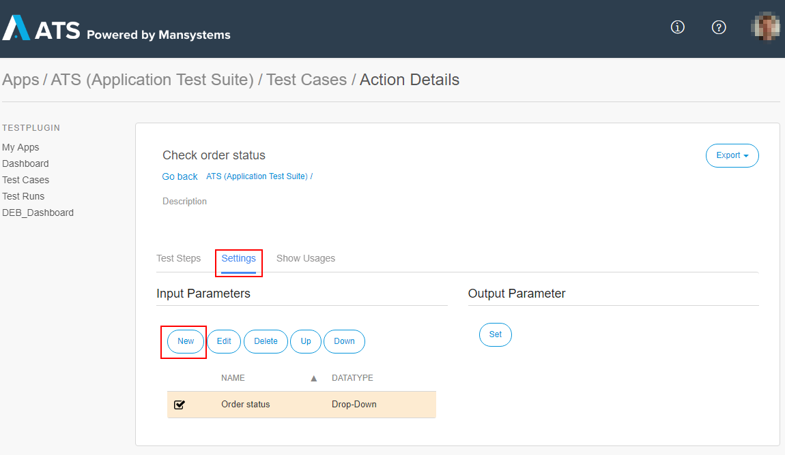
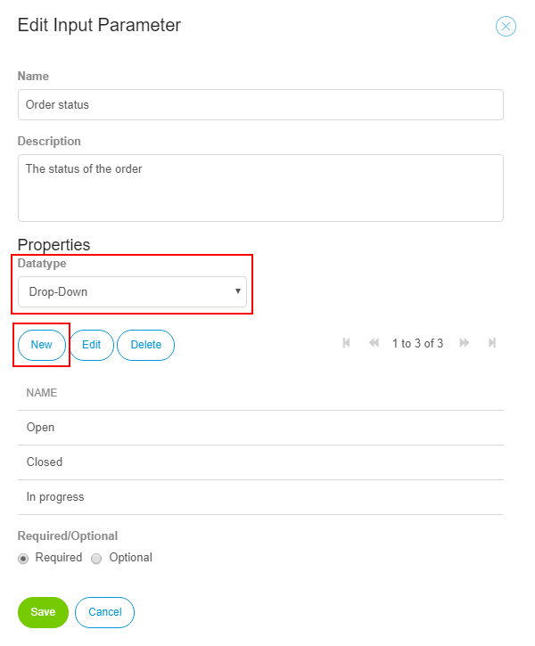

## Drop-Down

A **Drop-Down** defines a list of options for an action input parameter. This means that you can only choose from the provided options. For example, the status of an order can be _Open_, _Closed_, _In progress_.

Under the settings tab of your action, you can edit the input and output parameters.

After clicking **New** under *Input Parameters* the **Edit Input Parameter** dialog box opens. Here you set the datatype of the input parameter to Drop-down and add new options to the drop-down by clicking **New**. Note that drop-down values must be unique, you cannot add two values with the same name.

If you now add the action to a test case, you must choose from the list of drop-down values you have specified as input for the action. The Drop-Down options are always interpreted as text.