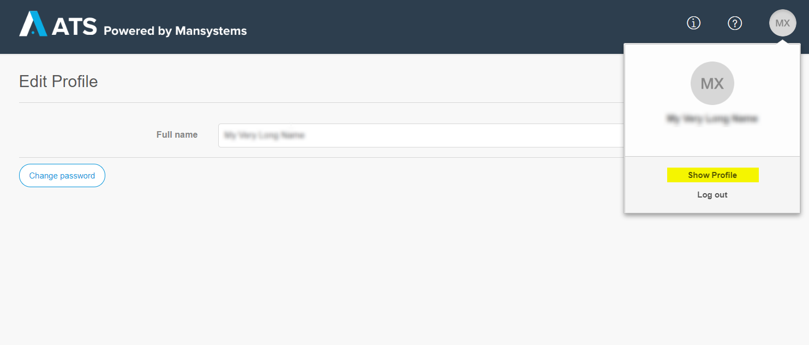

Local accounts, i.e. those created by the tenant administrator can access and change their profile information via the _Edit Profile_ page.
To open this page click on your profile photo and then on _Show Profile_.

From the _Edit profile_ a user can change their _Full name_ and _Password_. 

To change your _Full name_ type into the text box. The change is automatically saved. The _Full name _ is displayed in various places in the app, e.g. in the test run history. This is not the user name which is used to log in.

To change your password click on_Change password_ then enter your new password and click _Change_.
In order to change your password you have to be able to log in first. If you have problems logging in, contact your tenant administrator.

