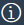
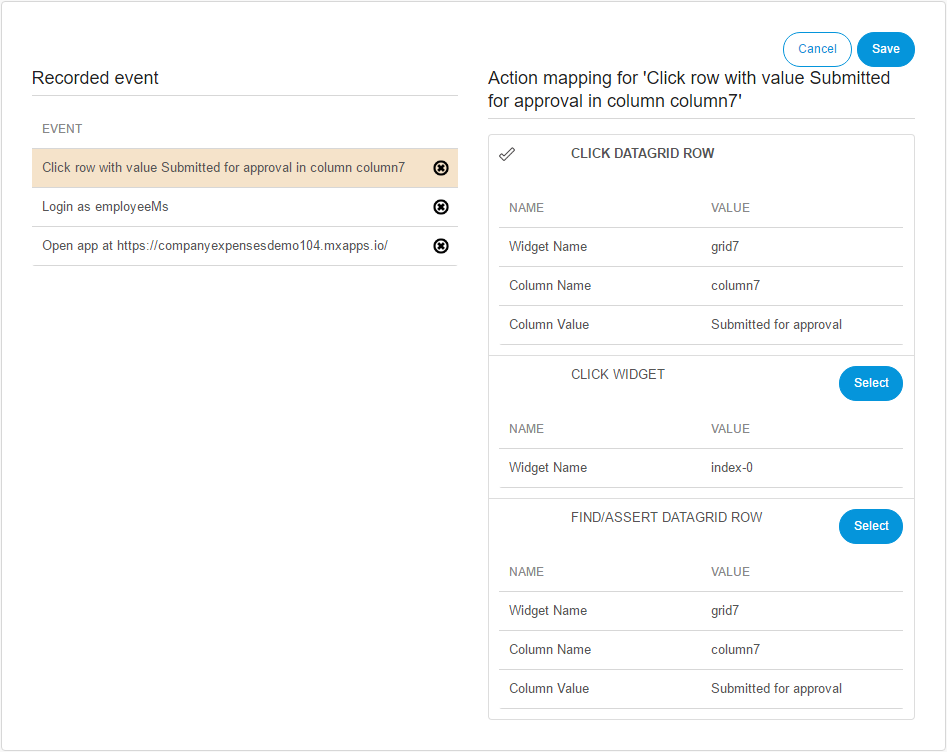

## Recorder

The recorder is a function/plugin within ATS which records the actions behind your test steps during testing an application. When you press **Save**, ATS adds the recorded steps to your test case.

{}

To use the recorder function you must have the Google Chrome browser installed on your system and install the _ATS Recorder_ Chrome plugin.

{}

To install the Chrome ATS Recorder plugin click the   button in the top right corner. Clicking the ATS Recorder link leads you to the Chrome webstore, where you can add the plugin to your browser.

With the _ATS Recorder_ plugin installed, you can start a recording session at any time by clicking the **Record** button inside a test case or an action.
You open the Mendix application you want to test in another tab of the browser and start testing the application, walk through the app manually and ATS records all the steps.

_Open recording session with 3 recorded test steps_

Some recorded test steps offer you several actions to choose from. In the example above you can choose one of the following actions:

* the click the datagrid row
* click the whole widget
* find/assert the datagrid row by the column value.

To change the selected action click on the recorded test step under _Recorded Events_. Then press **Select** on the right-hand side of the action you want.

Current limitations on recording:

* Clicking the datagrid search button is only recorded on Mendix >=5.19
* Multi-selection in grids via CTRL + click is not recorded
* Switching between browser tabs/windows is not recorded
* Assertions are not recorded yet
* Generating nice descriptions with labels only works if you use the label function in Mendix