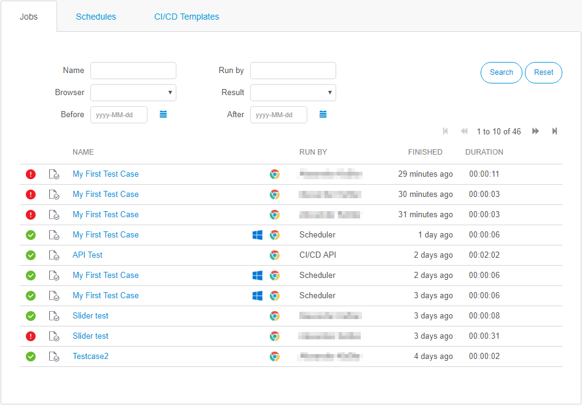
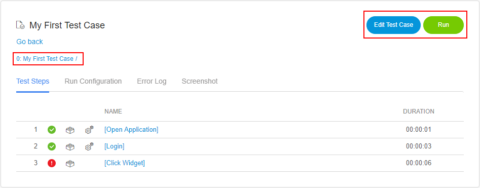
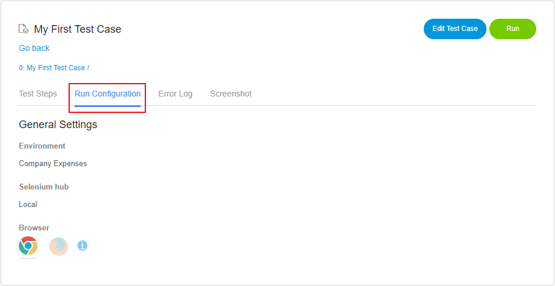
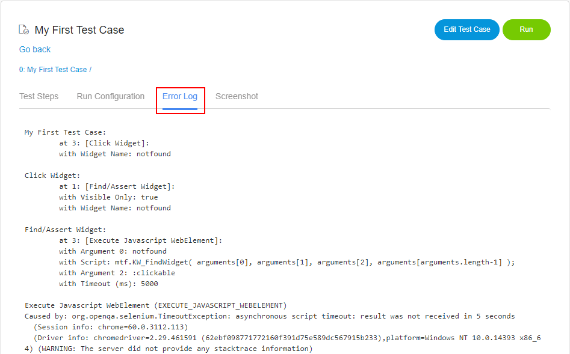
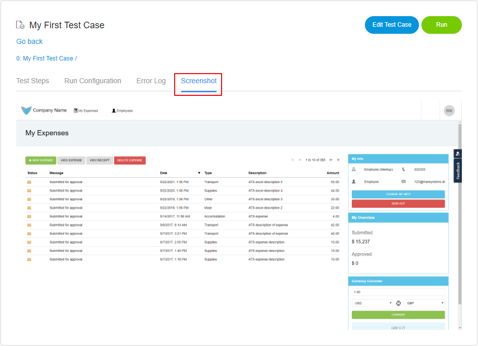

## 1 Introduction

Under **Results**, you find all the running and executed tests from your app. The tests are sorted based on the finishing date.

The first column shows the status or the result of a test. The following list explains all the different icons:

*  Queued – the test is waiting for a free running slot on the Selenium hub:

    

*  Running – the test is currently running:

    

*  Passed – the test has passed:

    

*  Failed – the test has failed:

    

*  Canceled – the test was canceled by an user:

    

*  Skipped – the test was skipped; this happens if a test step has not met the set precondition:

    

The second column shows the type of the test. The following list explains all the different icons:

*  Test case:

    

*  Test suite:

     

*  Data-driven test case:

    

The duration column is formatted as followed: `HH:MM:SS`.

You can search the most recent tests via the following:

* Result
* Name
* Browser
* After date
* Before date
* Run by

## 2 Result Log

When you click your test case, the **Result log** opens. The result log shows detailed information about the results of a test. It contains the results of all the test steps, the run configuration, and, if a step failed, screenshots of that step. The results are updated every time a step has finished its execution.

If the test was not successful, you can check the error log for more information.

### 2.1 Test Steps

Under **Test steps**, you will find the result, start time, and the duration of every step of your test.

Drill down deeper into the log by clicking the name of the test step. You can always go back to a parent step by clicking its name in the breadcrumbs:

### 2.2 Actions

On the top-right of the screen, you will find the **Edit** and **Run** buttons:

* **Edit** – opens the corresponding test case/test suite
* **Run** – opens the **Job Configuration** page, where you can edit the run configuration and re-run the test

### 2.3 Run Configuration

The **Run Configuration** tab shows the configuration with which the test was executed. It shows the name of the environment, the Selenium hub, and the icon of the browser.

### 2.4 Error Log

The **Error Log** shows detailed information about a failed test step.

### 2.5 Screenshots

All the screenshots ATS takes during the test run are available under **Screenshots**. Screenshots are only taken if a test step fails.

