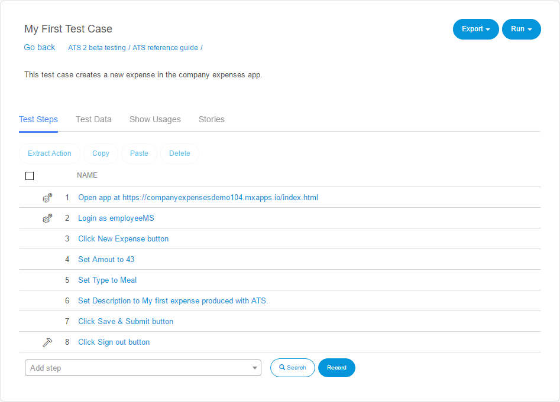
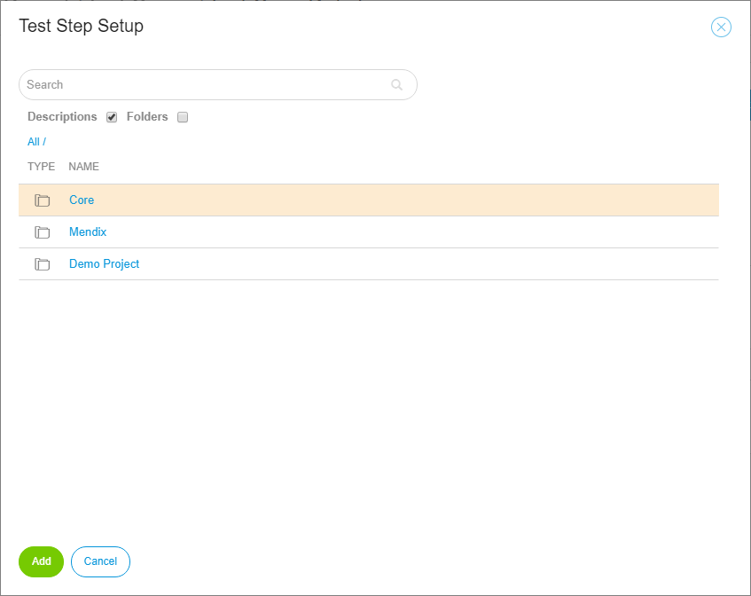

## Test Case

A **test case** is a set of [test steps](test-steps) which exercise a particular program path or verify compliance with a specific need. The point of running the test is to check if your app is fully functional. For example, whether a user can perform a certain task in your app or not.

In ATS you create a new Test Case by clicking **New Test Case** in the **Actions** dropdown in the repository.
A dialog box opens where you give your test case a name and an optional description. After you created a new test case, click its name and the **Test Case Details** page  opens.

### Test Case Details

In the top left corner of the **Test Case Details** page, you find the name and the description of the test case. You can click these fields and make changes to them, ATS saves these changes automatically.

in the top right corner of the screen, you find the **Export** and **Run** dropdowns:

#### Export

| Name                   | Description                              |
| ---------------------- | ---------------------------------------- |
|Export Test Definition | Creates an XML representation of your test case, you can import this into another app. |
| Export Documentation | Creates a PDF document, which contains all the test steps of your test case and their parameters. |

#### Run

| Name                   | Description                              |
| ---------------------- | ---------------------------------------- |
| Run                    | If the test case has been executed before, it runs with the configuration of the previous run. Otherwise the [run configuration](test-run) page opens. |
| Edit Run Configuration | Opens the [run configuration](test-run) page. |

### Test Steps

Test steps describe the actions, the test case performs. You add new test steps by searching an action in the **Add step** box. For a more detailed search, you use the **Test Step Setup** dialog box by clicking . A dialog box opens where you search for a specific action or you explore all available actions inside ATS and your current project .

After you have found the desired action, you add it to your test case as test step by **selecting** it and clicking **add**.

Another way of adding test steps to a test case is to use the recorder by clicking **Record**. For more information, read the [recorder chapter](recorder) of this reference guide.

The details of a test step opens by clicking the test step. For more information, read the [Test Step](test-step) section of this reference guide.

You add a new step above or below an existing test step, by clicking **Add above** or **Add below**. The buttons appear if you hover your mouse over an existing test step.

#### Extract Action, Copy, Paste, Delete

You can **Copy/Paste** or **Delete** one or more test steps at a time by checking the box in front of the test step. **Extract Action** combines the selected test steps to a new ATS action. This action becomes available for all test cases.

#### Drag & Drop

If you move your mouse over an existing test step, the drag and drop handle appears. By clicking and holding it you can move the test step to the new position.

#### Setup & Teardown Icons

Test steps have three different call types : setup, regular and teardown. ATS marks the steps that have the setup or teardown call type with the corresponding icon:

| Icon                                     | Meaning  |
| ---------------------------------------- | -------- |
|  | Setup    |
|        | Teardown |

 Read the [Test Step section](test-step) for more information about the call types of test steps.

### Test data

Under the test data tab, you set a master data set for your test case. You can now link the fields of the master data set to your test steps. Note that the test case runs a separate session for **every** record in the master data set. Read the [Data Driven Testing](test-data) for more information on how to use Data Sets in your test cases.

### Show Usages

The **Show Usages** tab gives an overview of all the actions used in your test case. It also gives an overview of all the test suites using your test case.

### Stories

Under **Stories** you add a user story to your test case. This tab displays the connected stories, the test cases within that story and the success rate of the user story.

* **Open story**:  Opens the linked user story.
* **Unlink selected story**: This removes the link between test case and user story.
* **Link new story**: Links an existing story to the test case.