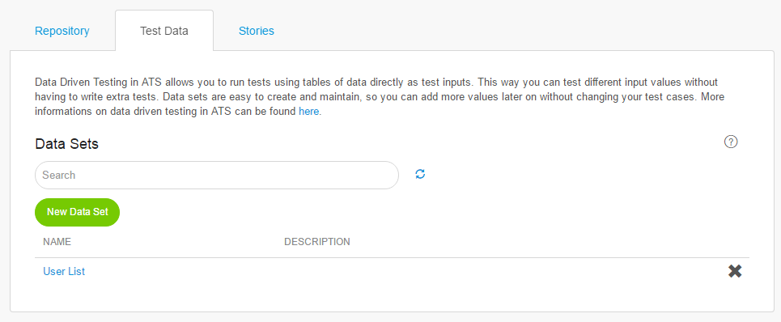
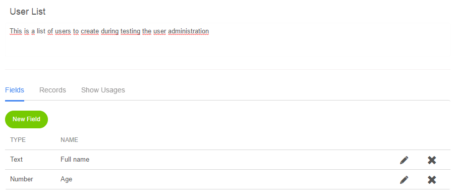
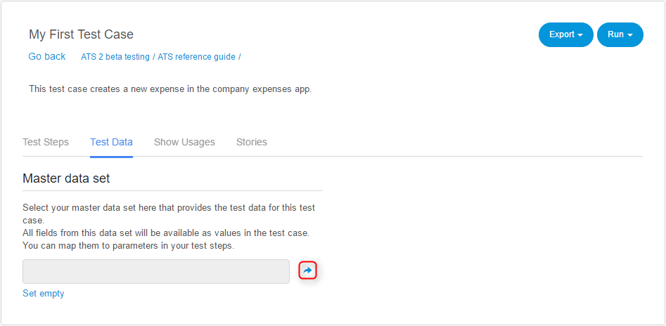

## Data Driven Testing

Data Driven Testing in ATS allows you to run tests using tables of data as direct test input. This way you test different input values without having to write extra tests.
Data sets are easy to create and maintain, so you can add more values later on without changing your test cases.

You can access the **Test Data** tab from the **Test Cases** page. Here you create a data set by clicking **New Data Set**. A dialog box opens, where you give the data set a name and an optional description.

Data sets consist of one or more fields and records. You can think of fields as columns in a table. Corresponding to that, records are the rows in a table and represent the values of a field.

Fields can have following data types: _Text_ or _Number_.

| Name   | Description                              |
| ------ | ---------------------------------------- |
| Field  | A column of a table for specific data, for example username. |
| Record | A row in a data table containing a _Text_ or _Number_ value. |

## Using Test Data in Test Cases

To use your data sets in test cases you need to select a *Master data set* under the *Test Data* tab inside a test case. Click the arrow to open the **Select Data Set** dialog box.

You can only select one master data set at a time per test case. Your selected data set affects which fields you can use as parameters in your selected test case. You can only choose fields that are in the selected master data set. On execution, ATS picks the corresponding record values for each field.

{}

If you connect a data set with a test case, ATS executes a session for each record row in the data set. For example, if there are three rows, ATS executes three sessions.

{}

## Importing/Exporting data sets

When creating/editing a data set you choose the _Create/Update fields from file_ option to provide a template Excel file. You create or update fields and records of your data set using this Excel file. ATS recognizes the first row of the Excel sheet as the field names. ATS considers all extra rows as records and also uses them to determine the field datatype.











When importing data from Excel, ATS tries to convert data that doesn't match the expected data type. In case a conversion is not possible (e.g. from a string to an integer) the resulting value is empty. Always check your data after import to ensure all data was completely imported.



You export a data set to Excel by clicking the __Export to Excel__ button.

## Exporting a Test Case

When exporting a test case that has a data set assigned to it, ATS also exports that connection. ATS automatically looks for the same data set when importing that test case. If no such data set exists yet, ATS connects it when created.

### Error Types

There are 2 error types that can occur when setting a data set:

#### Missing fields

Shows fields that are not in the selected master data set that are currently used in the test case.

#### Incompatible datatypes**

Shows parameters that need a different data type than the datatype of the field.

ATS lists test step and parameter for each error, for easy identification.