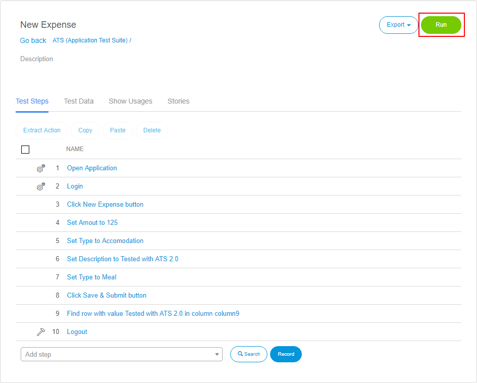
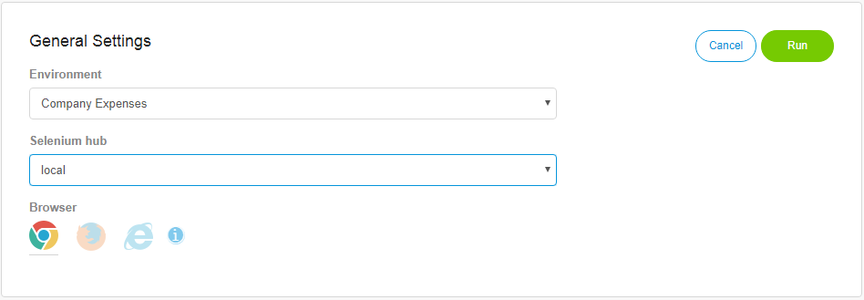
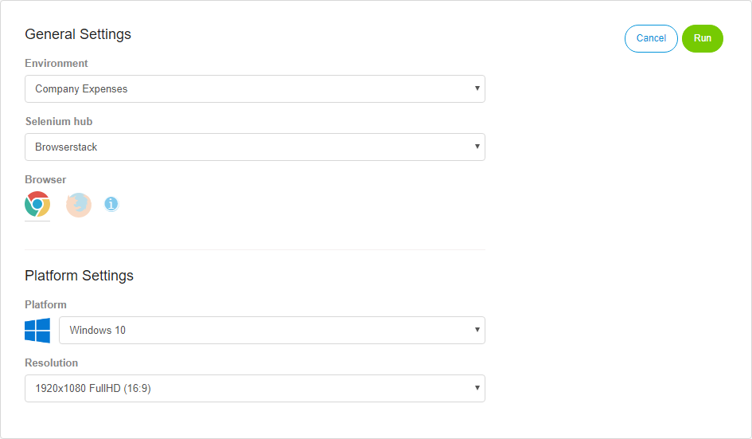

## Job Configuration

To run an existing test, you must open the test case or test suite by clicking its name in the repository or click the  **Play** button displayed in the test case.

The test case (or test suite) details page opens. On this page, you see all the test steps and for the test suite the containing test case of your test. If you want to execute your test case, click **Run**.

The _Job Configuration_ page opens. On this page, you set the job configuration for the test case (or test suite) you want to execute. For every test run, a new job is created.

If you selected a selenium hub from a supported selenium hub provider (TestingBot,SauceLabs or Browserstack), you get access to the operating system and screen resolution selection.

The following options are available:

### Environment

The environment on which ATS executes the test case.

### Selenium Hub

The Selenium hub ATS uses to execute the test case.

### Browser

The browser ATS uses to execute the test case in. The browser version is set automatically by ATS. For supported selenium hub providers, ATS sets following browser versions:

* Firefox: Version 45
* Chrome: Version 53 (Windows XP: Version 49)

### Platform Settings

{}

These options are only available for supported Selenium hubs.

{}

### Platform

{}

This option is only available for supported Selenium hubs.

{}

If you have selected a selenium hub from a supported selenium hub provider (TestingBot, SauceLabs or Browserstack), you get access to the platform settings. Here you can set the operating system, on which the test case is executed.

If you want to read more about the different supported operating system, read the [Supported selenium hub provider section](supported-selenium-hub-provider) of this documentation.

### Resolution

{}

This option is only available for supported Selenium hubs.

{}

With this option, you specify the screen resolution for your test run. A list of all supported screen resolutions found in the [Supported selenium hub provider section](supported-selenium-hub-provider) of this documentation.

After you set the run configuration, you execute the test case by clicking _Run_ or you schedule the test case by clicking _Schedule_.
If you want to know more about scheduling test cases in ATS, visit the [Scheduling section](scheduling).