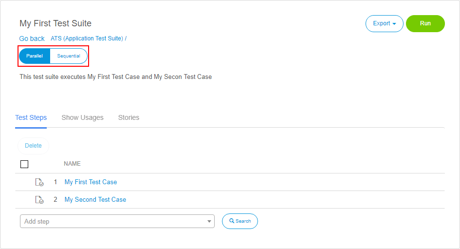
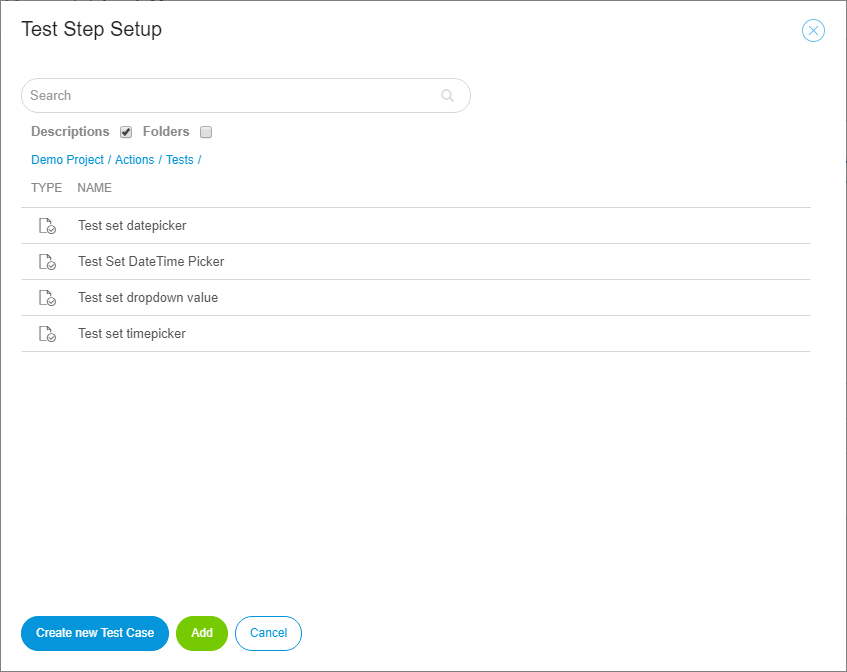

## 1 Introduction

A test suite is a set of test cases or other test suites. ATS uses test suites to execute a collection of test cases and/or suites in a sequence or parallel.

In ATS, you create a new test suite by clicking **New Test Suite** in the **Actions** drop-down menu in the repository. A dialog box will open where you give your test suite a name and an optional description. After you create a new test suite, the **Test Suite Details** page opens.

## 2 Test Suite Details

In the top-left corner of the **Test Suite Details** page, you find the name and the description of the test case.  To change them, click them and edit the text. ATS saves the changes automatically.

With the **Parallel/Sequential**, you can change the run behavior of the test suite. If set to **Parallel**, ATS tries to run all the containing tests of your test suite in parallel. This is limited through the concurrency limit of your Selenium hub. With the switch set to **Sequential**, the tests run in succession.

In the top right corner of the page, you find the **Export** and **Run** buttons, which are described below.

## 3 Export

Click **Export** to export a test definition, which means creating an XML representation of your test suite that you can import into another app.

## 4 Run

Clicking **Run** will open the [Run Configuration](test-run) page, where you edit the run configuration. If the test suite was run before, the prior configuration is copied.

### 4.1 Test Steps

Under **Test Steps**, you can find all the test cases and test suites that are used in the current test suite. Add a new test case or test suite by searching for it in the **Add step** dialog box.

For a more detailed search, use the **Test Step Setup** dialog box by clicking this **Search** button:

There you search for the desired test case or test suite in your project. You can also navigate through your project and explore all the available tests in it.

Add a new step above or below an existing test step by clicking **Add above** or **Add below**. The buttons appear when you hover your mouse pointer over an existing test step.

#### 4.1.1 Delete

To delete a test step in a test suite, click this icon on the right side of the test step:

You can delete multiple test steps at once by marking them with the check box and clicking **Delete**.

#### 4.1.1 Drag and Drop

When you move your mouse over an existing test step, the drag-and-drop handle appears. By clicking and holding it, you can move the test step to the new position.

### 4.2 Show Usages

The **Show Usages** tab gives an overview of all the test cases and test suites used in your test suite. Besides that, it also shows the other test suites that the test suite is used by.

### 4.3 Stories

Under **Stories**, you add user stories to your test suite. This tab displays the connected stories, the number of test cases within that story, and the success rate of the user story.

The following buttons exist:

* **Open story** – opens the linked user story
* **Unlink selected story** – removes the link between the test suite and user story
* **Link new story** – links an existing story to the test suite
