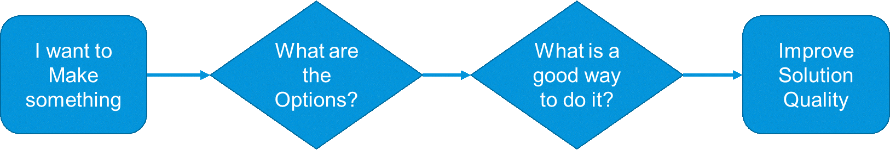
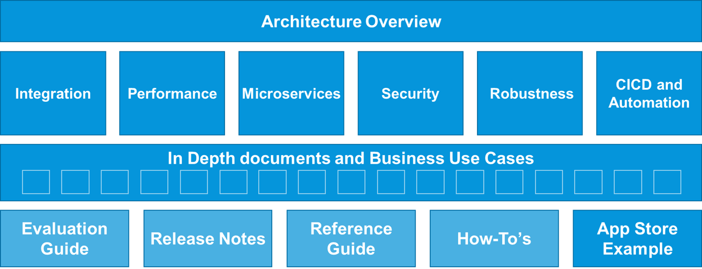
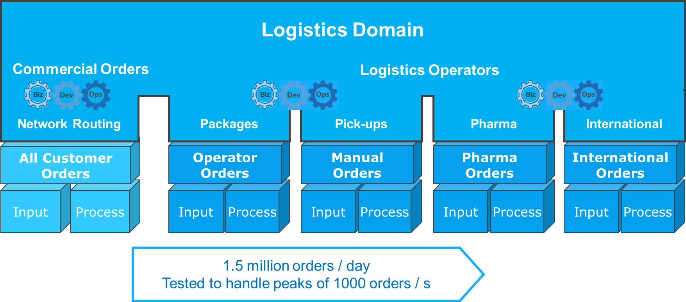
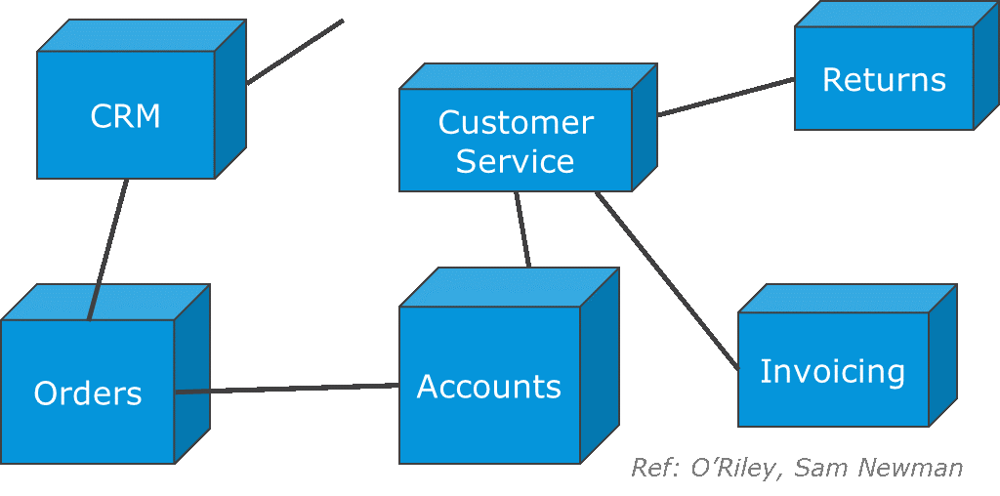
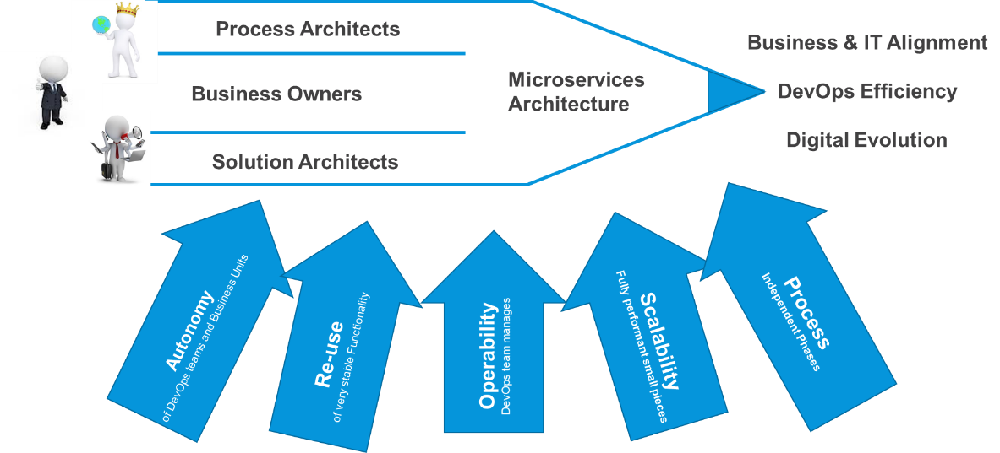
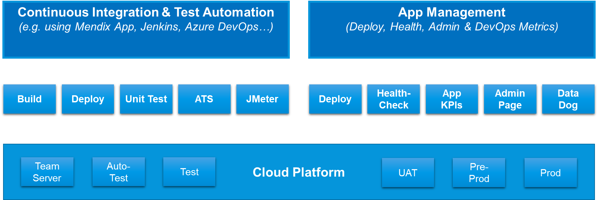
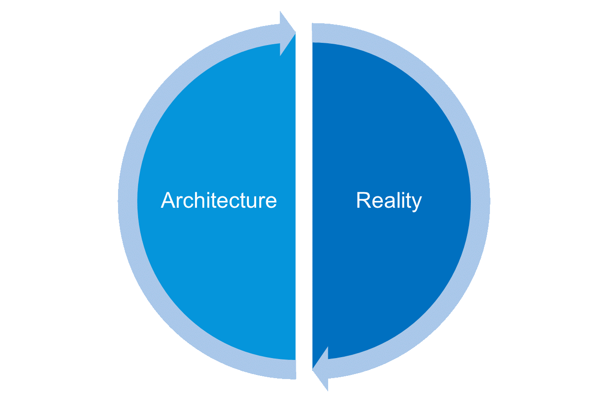

{}
The Mendix Architecture Best Practices were written for [Mendx version 7](/releasenotes/studio-pro/7). They will be updated for Mendix 8 and future versions as necessary.
{}

## 1 Introduction

Mendix is optimized for the easiest and fastest way to develop and maintain apps that fulfill business functions. As the scope of your apps grows larger, architecture becomes more important. At that point, you should leverage best practices in this area.

The Mendix architecture best practices complements the following sections in the Mendix Evaluation Guide:

* [Data Management](https://www.mendix.com/evaluation-guide/app-capabilities/data-management)
* [Integration](https://www.mendix.com/evaluation-guide/app-capabilities/integration)
* [Deployment](https://www.mendix.com/evaluation-guide/app-capabilities/deployment)
* [DevOps](https://www.mendix.com/evaluation-guide/app-lifecycle/devops)
* [Architecture](https://www.mendix.com/evaluation-guide/enterprise-capabilities/architecture-intro)
* [Security](https://www.mendix.com/evaluation-guide/enterprise-capabilities/security)

{}[**EXPLAIN WHY THESE BEST PRACTICES WILL BE VALUABLE**]{}

Mendix best practices around architecture will be valuable for architects, designers, business developers, and more technical developers that work on Mendix app projects. The best practices address common areas where the quality of Mendix solutions can improve by using this information or using the examples in the App Store.

{}[**ADD LINK TO APP STORE WHEN AVAILABLE ABOVE; EXPLAIN DIAGRAM**]{}

## 2 Architecture Best Practices Structure

This diagram presents an overview of the structure of the Architecture Best Practices documentation:

For each subject there is an overview document, and below that, there are a number of in-depth descriptions and business use cases. Some of these documents link to a module in the App Store that demonstrates example modelling reflecting the theory.

{}[**ADD LINK TO APP STORE WHEN AVAILABLE ABOVE**]{}

## 3 Architecture Subjects

The Mendix Architecture Best Practices will cover the architecture subjects described below.

### 3.1 Integration

One of the most important parts of architecture is integration. All business apps need to integrate with people, things, other systems, and operational tools to be useful.

Integration is really the glue that holds the pieces together, and since there are so many different systems, businesses, technologies, and organizations, integration is a hard subject to nail down.

The best thing to have with integration is an open mind while thinking functionally, talking with stakeholders and experts, and considering error scenarios. Then you can develop an overall solution design that makes integration as easy and as clearly defined as possible.

Systems depend on each other – that is part of life. But dependencies can be made smaller and more explicit as well as more functionally easy to understand. This helps to make building, operating, and maintaining a solution easier.

The diagram below shows the most commonly used Mendix integration pattern. These are synchronous services, mostly using REST, which is extremely easy. However, files, queues, Kafka, RPC, and many other technologies are possible.

{}[**ADD LINK TO SECTION BELOW WHEN AVAILABLE**]{}

For more details on Integrating apps with each other and other systems, things, and devices as well as monitoring, see the [Integration Best Practices](integration/integration-overview).

### 3.2 Performance

Sometimes the functional and/or technical architecture has to be adapted to the fact that there is a very high volume of users or messages and/or high requirements for availability.

For most apps created in Mendix so far, such issues have had a relatively low impact. The app is modeled, it is tested and performs well, so it is just deployed for happy users. In some cases, when something is slow, it is fixed by simple modelling changes.

As volume increases, a specialization of architecture is developing that focuses on optimizing both the architecture and the implementation in order to support large volumes and maintain fast response times.

This may require more planning, technical expertise, testing, tuning, and monitoring in production for what is often the core or most critical system for an enterprise. The primary concern here may not be the speed of feature development, but building systems that perform well, are easy to monitor and maintain, and have great recovery features should something still go wrong.

This diagram shows a real example of a logistics supplier that is using Biz-DevOps teams aligned with business areas to build high performance apps that are tested to handle 1000 orders per second. Performance testing and tuning is part of the process, and good architecture and operation decisions keep this business-critical solution stable.

In the scenario above, most of the processing is straight-through processing, so the dashboard app is there for human overviews, exceptions, and configuration. The **Input** apps provide a buffer for peaks and enable handling deployments more easily. Finally, the **Process** apps are optimized to do their work as efficiently as possible.

### 3.3 Microservices

Microservices is a popular way of building IT solutions. It helps you to avoid building monoliths and SOA-layered architectures, where dependencies tend to get out of control. Instead, you can make functional autonomous components that cooperate to fulfill business functions. This suits Mendix very well, as is further described in [Mendix Microservices](microservices/mendix-microservices).

This diagram shows how microservices are more functional in encapsulating a business process and cooperating via business events to the point that they are "actors" themselves in a business process:

There is often no need to separate technical and functional architecture. Instead, you should work on one single solution model. The most "techie" considerations are increasingly abstracted away by low-code and other cloud-based solutions. What is left are more functional decisions.

This diagram shows how business stakeholders, process owners, and Solution Architects cooperate towards the best microservices architecture while taking autonomy, reuse, processes, operability, and scalability into consideration:

The IT architecture of the future will not separate technical from functional architecture. Instead, it will work with one single solution model that is understood by all stakeholders, who will then take the business organization, delivery organization, technology, and business processes into consideration. 

Architecture needs to have a level of flexibility as more information is made available during the realization of a solution. This could involve refactoring an app or splitting an app into smaller parts based on the real knowledge gained from the actual end-users.

The [Microservices Best Practices](microservices/microservices-overview) will dive into these exciting developments.

### 3.4 Security

Security architecture inovlves making sure no one can penetrate, destroy, disrupt, or in any way interfere with the normal business operations of an IT system that we build and operate.

This subject is increasingly important. It is in constant evolution as technology providers get better at defending themselves and malicious parties get better at breaking the same systems.

Mendix has good certification for security.

{}[**NEED MORE CONTENT FROM JASPER/BART**]{}

The following security areas are generally considered for best practices: 

* Infrastructure security
	* For example, at the cloud level and for deployments
* Integration security
	* Focusing on secure service calls (for example, via SSL, secure queueing, or SSH File Transfer Protocol (SFTP) for files)
* App security
	* Usually at the user level
	* Focusing on user authentication, authorization, and single-sign on (SSO)
	* Microflow and data authorization, usually at the role level, to make sure the user does not perform actions they are not allowed to

### 3.5 Robustness

For simple apps and systems, Mendix has all the required monitoring available in the [Mendix Developer Portal](/developerportal/operate/). For virtual private cloud (VPC) solutions integrated with Mendix, monitoring capabilities would be provided by the third-party providing the infrastructure.

This diagram presents the primary and out-of-the-box monitoring that is available in the Mendix Developer Portal:

Beyond that, teams are constantly improving their monitoring capabilities. As you build more and more apps and some of these form a part of a microservices system, there are reasons to start evolving the monitoring of your solution. The first step for [Mendix Cloud](/developerportal/deploy/mendix-cloud-deploy) customers is to dedicate one app to monitoring and controlling the other app by using the open [Deploy API](/apidocs-mxsdk/apidocs/deploy-api) for Mendix Cloud.

{}[**VERIFY THAT ABOVE API IS CORRECT TO LINK TO**]{}

Some users build a log integration component or connect to a central one. For more professional apps and enterprise-level stability requirements, it is common to have a central monitoring solution such as [Data Dog](https://www.datadoghq.com/).

For VPC and on-premises deployments, there is no Mendix Developer Portal monitoring available. In these  cases, an app-management or central-monitoring solution is highly desirable. That is because the customer in this scenario is responsible for their monitoring. The setup of log integration and central monitoring is largely the role of the customer's central IT, while Mendix connects to the tools and protocols proscribed.

For details on the benefits that can be achieved by using native Mendix technology or by connecting to professional tooling, see [Robusntess](robustness/robustness-overview).

### 3.6 CI/CD & Automation

Mendix provides some continuous integration out-of-the-box:

* Consistency checks between the UI, logic, and database are automatically done by the Desktop Modeler 
* Consistency checks against other developers' work are automatically done by Team Server

These checks are the same for all Mendix users, because that is part of your app model and is a result of the acceleration that Mendix provides for building good-quality solutions. Some of the testing needed for other solutions (for example, Java solutions) is not needed for Mendix.

Mendix provides one-click deployments for [Mendix Cloud](/developerportal/deploy/mendix-cloud-deploy), [SAP Cloud Platform](/developerportal/deploy/sap-cloud-platform), [IBM Cloud](/developerportal/deploy/ibm-cloud), and [Siemens MindSphere](/developerportal/deploy/deploying-to-mindsphere). In addition, Mendix provides the [UnitTesting](https://appstore.home.mendix.com/link/app/390/) module in the App Store for testing microflows and [Application Test Suite](/ats/howtos/ht-version-2/install-ats-helper-recorder-2) to automatically test UX functions.

But the scope for automation never ends. It is always possible to automate more, and Mendix provides all the required APIs to set up automated testing and deployments. This diagram shows the two areas where teams are constantly increasing automation:

* Continuous integration and test automation, often run nightly
* App management and deployment automation, used for UAT and PRD deployments and the management of apps after deployment

This is an area that is evolving very quickly and many companies are making significant investments. There is not one single way to do CI/CD and test automation, because the focus on automation shifts depending on the customer and solution. Some partners build automation from a Mendix app, some from Jenkins, some others from GitLab CI. Some do mostly test automation, while others focus on deployment automation.

The most important thing is to take a clear look at your testing needs as well as the benefits and costs, and then make the right decisions on what to automate, what to centralize, what to localiz, and what to continue doing manually via the easy-to-use Mendix Developer Portal.

For more information, see the [CICD](https://www.mendix.com/evaluation-guide/app-lifecycle/cicd) section in the *Mendix Platform Evaluation Guide*.

## 4 Summary

Architecture is a wide subject area, so the Mendix Architecture Best Practices will cover the areas where we see the most interest in advice and information. These best practices are living documents and may be subject to change based on our experience and user feedback.

The weather never looks (exactly) the same on any two days of your life, so it is important to both look for what is similar and what is different when you work towards the best solution for your challenges.

In accordance with Agile methodology, you should continuously measure and verify your assumptions based on real information as a solution is being created or managed. That means as reality changes, you should fine-tune your architecture.

As your architecture is improved, you can improve the quality and value of IT solutions for all the teams building, managing, and using the IT solution.

Ultimately, Mendix is there to support you both with technology and consulting. We provide architecture workshops where we think along with you on any area related to making the next generation IT with Mendix.

{}[**ADD DIAGRAM ABOUT ARCHITECTURE WORKSHOP WITH CONTACT EMAIL ADDRESS**]{}

## 5 Read More

* [Architecture Overview](architecture-overview)
