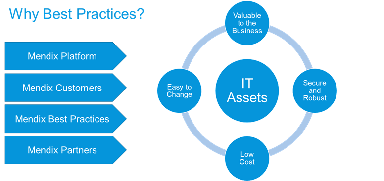
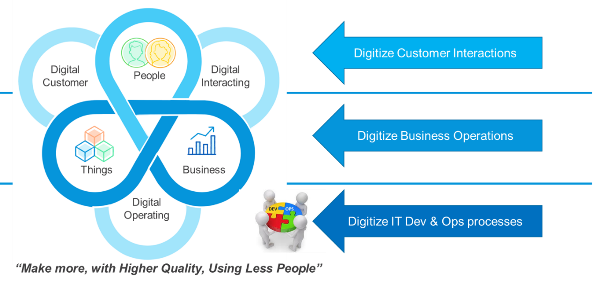
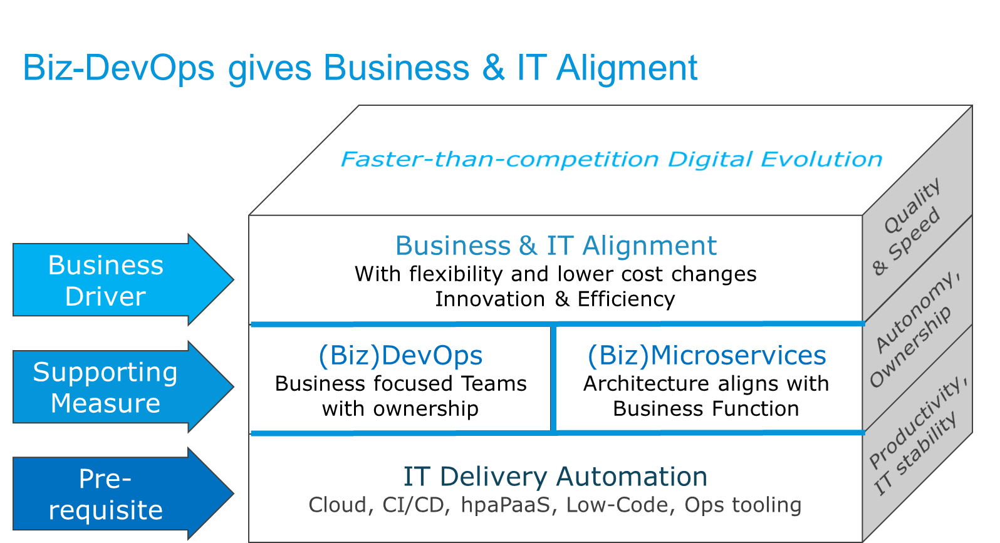

## 1 Why Best Practices on Architecture?

IT architecture is about making valuable things with technology, and the Mendix Platform is a key enabler for achieving this goal. Organizations that use the Mendix Platform and the [Mendix partners](https://www.mendix.com/solution-providers/) that help them to realize their goals can use the Architecture Best Practices to make sure their IT assets meet the following goals:

* Valuable for the business
* Easy to deliver and maintain
* Secure, stable, and robust in production
* All the above at a reasonable cost

## 2 Current IT Trends

There are several IT trends converging recently, and Agile, DevOps, microservices, cloud, and automation are at the center of the evolution. As the diagram below presents, areas such as SOA (functional architecture), Agile (methodology), and cloud (infrastructure) are merging into one coherent movement of enterprise DevOps with automation, microservices, and an Agile mindset.

	
This evolution makes sense when the IT teams, methodology, organization, infrastructure, and technical components are all related to each other. For optimal results, the overall strategy should be beneficial for all these elements.

Good architecture, technology, and organization should deliver digital transformation to all levels of an organization, from customer interactions to business operations. This should happen all the way down to the digital transformation of IT delivery, of which cloud, low-code, CI/CD, microservices, and DevOps are all a part. As this diagram presents, this all leads to organizations being able to make work with higher quality than ever before:

## 3 Business & IT Alignment

Enterprise DevOps will enable better business and IT alignment, which is at the heart of what Mendix is trying to provide. When users that innovate in IT and users who know how the business runs can cooperate more closely, they will iterate towards better architecture, increased digitization, and more value added to the business.

The prerequisite for this entire evolution is delivery automation in IT and IT infrastructure. As a cloud and low-code platform, Mendix enables BizDevOps to the point that small cross-functional teams no longer need database administrators and infrastructure experts. Such teams can own the entire lifecycle of the apps they build, be more functional, and thus align more closely with the business.

The diagram below shows how we have entered a new era of IT evolution, enabled by the automation around IT infrastructure (cloud) and IT development (low-code platforms like Mendix). This automation makes it possible for small business-focused teams to evolve new IT components all the way from design to operations with little or minimal support from an Ops department. It also makes the cost of managing more components negligeable, enabling teams to build smaller functional components (microservices), which in turn allows teams and business units to be autonomous and evolve a lot faster. As a result, the business and IT can cooperate a lot more closely and easily than before, and automation, digitization, collaboration, and other efficiency-enhancing developments can be accelerated. This will put some organizations who adopt this new paradigm ahead of the ones that do not.

Automation in infrastructure for apps also means that managing more components no longer adds significant cost. A double-sized cloud container costs approximately twice as much. This means that building smaller functional microservices is possible. 

You can adapt the size of apps to what is most efficient to maintain. Microservices can be quite large when using low-code, so the app architecture will often align with how the business sees the world.

All of this means that we are leaving behind the era when the development, operations, and business are separated by a trench of conflicting objectives. The DevOps teams and the functionally-oriented apps can align with the business they are supposed to support.

### 4 Architecture Areas

In Mendix, we separate the following three levels of architecture:

* **Enterprise architecture** is strategic and involves policy, positioning, portfolios, technology selection, and guidelines
* **Solution architecture** is tactical and works on the program level to solve business problems using one or many systems and technologies
* **System architecture** is the architecture of one functional unit within a solution normally using one technology such as Mendix
	* In microservices architecture, there may be one large app to start with that is later split up, but it is still considered one “system” by other teams within the company

These are other more generic areas of architecture that are frequently referred to:

* **Technical architecture** typically refers to the selection of technology, the infrastructure that it runs on, and how it is deployed and provisioned; as more things move to the cloud, technical architecture is being divided into two new areas:
	* Cloud architects are planning and designing cloud infrastructure, which components to use, and how connectivity towards data centers and between clouds should happen
	* Engineering is becoming increasingly important for automating as much as possible in IT delivery and maintenance in line with the DevOps paradigm
* **Security architecture** relates to everything around security in functional and technical ways (for example, active directory, SSO, SSL, and SAML)

Mendix enables building great apps with little technical understanding, but as scope, complexity, criticality, and volumes grow, there is an increased need for good architecture, sound integration, and skilled technical resources on an app project.

### 4.1 Mendix & Architecture

Mendix has made the subject of architecture a lot easier by reducing the number of factors to consider during the development process (for example, how to make the UI, logic, and databases work together). In addition, Mendix simplifies the infrastructure and deployment considerations.

However, there is still some architecture work necessary so that you can get the best apps working together to serve the business in a secure and robust way that performs well. Mendix has a very strong base in innovation apps and business differentiating systems (for more information, see the [What Can I Build?](https://www.mendix.com/evaluation-guide/what-can-i-build) section in the *Mendix Platform Evaluation Guide* as well as Gartner's [Pace-Layered Application Strategy and IT Organizational Design](https://www.gartner.com/binaries/content/assets/events/keywords/applications/apn30/pace-layered-applications-research-report.pdf)). 

But as many customers have discovered while employing the speed, productivity, and flexibility of the platform, Mendix can be used for company "heavy-lifting" as well. When your company starts using Mendix for core systems and high-volume situations, it becomes more important to consider the architecture in order to optimize the solution and make sure it meets requirements for volume and robustness.

### 4.2 When Do I Need the Real Architects?

As the solution, scope, volume, and criticality of a system increases, there is an increased need to have strong technical people on the team and professional architects to help in creating the best solution.

This diagram shows that as solutions grow larger, the team implementing the solution needs to add more technical and senior resources in order to architect, design, build, and roll out the solution correctly:

The larger and more important the solution, the more thinking and architecture needs to go into it. There may also be more reasons to test and tune the system after functional realization, in addition to requirements for professional monitoring.
