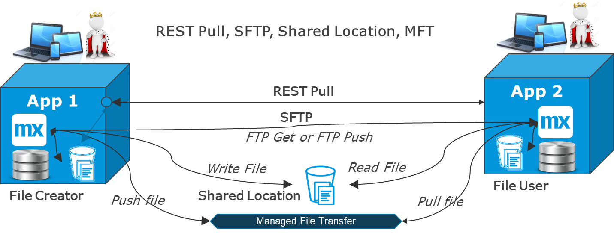
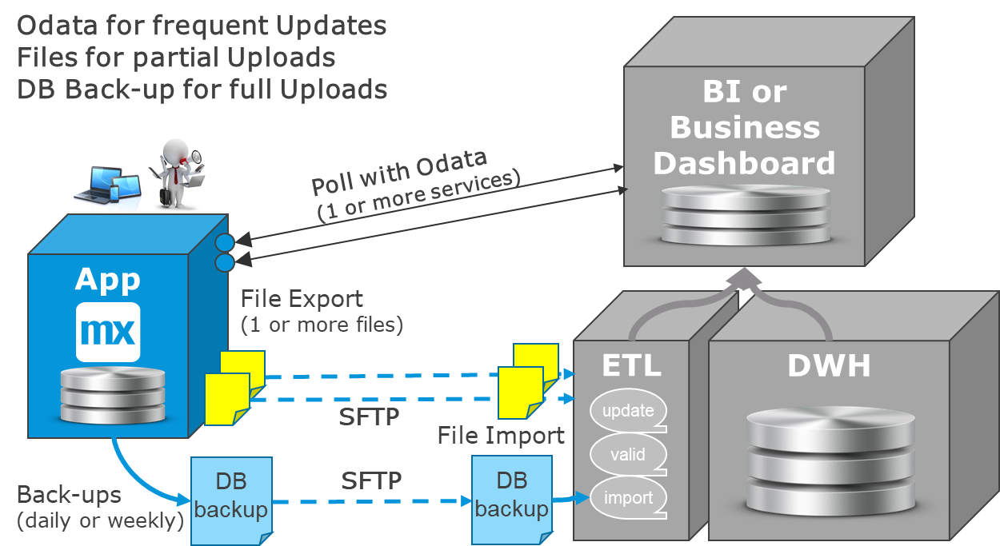

## 1 Introduction

Batch integration is still relevant for many business processes that are periodic or when a lot of data needs to be transferred. It is useful to understand that not all batch processing happens via files, but batch processing remains the most common option for extracting, moving, and importing files.

{}[**EXPLAIN DIAGRAM**]{}

Often for a Mendix app to be built, there is already a file available from other systems. The task then is to transport it to the app via a REST service for smaller files or FTP for larger files and then import it.

In other cases, a Mendix app is used as a master data system for reference data like drivers of vehicles, addresses, products, shop opening hours, or BI statistics that help fine-tune processes. It makes sense in many microservices architectures to separate the maintenance of reference data from the operational use of the same data. This referential data or statistical data is often better to update periodically, and a file export towards one or more other systems is a good solution. The integration solution would then consist of two parts: the [file integration](#file-integration) and the [export-impor](#export-import).

File integration is also used for content distribution, such as manuals, images, and 3D models of products. When a Mendix app is a provider of this type of information (for example, in a customer portal), it can make sense to use the app's internal file storage and move files there ahead of the customer interaction in order to make the customer access to these files as fast as possible. In addition, files that are frequently accessed should be cached. Finally, REST for small files and SFTP for large files is recommended

ETL tools are often used to keep DWH solutions updated. They can perform the entire operation of extracting, moving, validating, transforming, and updating the destination. For legacy systems, they can do direct database access or use files as input. When Mendix integrates with ETL, these are the preferred methods:

* Exporting the file for periodic dumps
* Using OData for more frequent and smaller updates
* Using the Mendix datbase backup file

## 2 File Integration & Transfer {#file-integration}

File integration is highly relevant for many implementations, especially when it comes to images and PDFs (for example, marketing or instruction manuals). Files are also used to extract data from one app and later import it into another app, and of course for backup-and-restore.

Each Mendix app has a dedicated file storage area where it writes files to by default. This is also where the Mendix app log file is located by default. The size of this area is large enough to handle most regular file management and can be extended if there are special needs to quickly access and show a large number of files.

Depending on the size of the file, urgency, and network situation, the app that need to use a file can read a file from a remote location or copy the file to a folder first. This diagram presents these two options with some additional flavors:

The diagram above follows these steps:

1. Call the source app via REST to request the specific file.
2. Read and write fthe iles to a shared file location or drive.
3. Move the file via SFTP, which can be either push or pull. This requires the [SFTP](https://appstore.home.mendix.com/link/app/107256/) App Store module as well as a Java action.
4. Using an ESB or a Manager-File-Transfer (MFT) solution usually requires FTP, where the file is pushed to MFT and pulled from there by subscribers.

In simple instances and smaller files, a REST call is enough. Considering other interfaces probably use of REST, it is recommended as the first choice. But if there are a lot of files and/or heavy files, it is better to either use a shared location and/or move the files using SFTP, for example.

For many-to-many file transfers, MFT can be an option. At a small scale, this function can even be built as a Mendix microservice specializing in this.

## 3 Batch Processing, Export & Import {#export-import}

Even in real time, file integration and batch processing remain relevant. Batch processing runs a large set of data at a certain moment. For example, interfaces towards data warehousing (DWH) and business intelligence (BI) are often bulk- and/or snapshot-oriented. The same is true for initial loads of systems or the distribution of reference data.

Other business processes remain periodic. For example, salary payments, interest calculations, and even monitoring solutions typically have an agent that batches up some data before sending events with many records in order to save on processing power.

These use cases are best implemented in batch-oriented interfaces, mostly using files. This means that batch processing, export, and import will stay important in the future.

One advantage of batch processing is that systems are decoupled, which means the export and import can run at different times. The interface can be re-run and/or use a workflow for handling errors. Another advantage is that processing bulk is more CPU-efficient and can often be done at night, when other loads are lower.

Files can be read remotely or copied back to the app file space first. This should be based on how close the apps are on the network as well as on the size of the data and any other restrictions that may exist.

The most common format is [CSV](csv) import and export, which also works well with Excel integration. The [Excel Importer](https://appstore.home.mendix.com/link/app/72/) module in the Mendix App Store is a popular and useful module.

When there are text fields in the data, there should be more complex field separators than commas. In addition, you can see fixed-length fields in to-and-from legacy systems. Such a scenario requires building a microflow to read the data correctly using character position.

This diagram shows the three main steps of batch processing – export, move, and import file:

Batch processing can involve all three steps, or it may only be related to an export or import. There are extract-transform-load (ETL) solutions that can perform all three steps and add data mapping in the middle.

## 4 Integration to DWH & BI {#int}

DWH and BI solutions often have some kind of ETL solution that allows the DWH team to stage data, compare new data with existing data, do validation and transformation, and finally update the core tables of the DWH solution. The staging area of DWH solutions often follow the data model of the source system.

This diagram presents the three most used methods for such a solution: OData, Files or DB back-up:

Exporting certain tables or parts of the data is often required, and ETL/DWH combines this with a lot of other data inside the DWH. In that case, a file interface is a good choice, as it is simple to build and rarely changes, and there is full decoupling of the solutions. This means that technically the systems are not directly connected, and functionally there is an agreed format in the middle that can usually stay stable.

OData is a better choice if the requirement is to collect data close to real-time. This may resemble a BI solution, business dashboard, or something that uses statistical data in real-time to fine-tune processes. For example, BI can poll every 5 minutes for changes (for more information, see the [Database Integration & OData](service-integration#db-odata) section of *Service Integration*). This requires the BI solution to have a direct link to the app. In addition, to avoid database changes in the Mendix app impacting the contracts, using a database view in Mendix is recommended.

Some DWH solutions want *all* the data from an app. In some cases, there are complex relations between the objects with several many-to-many relations that need to be intact when arriving in the DWH. This may require many files or OData connections, while the DWH still has complexity in re-storing the consistency of the data. If this is required, the ETL/DWH solution can use the Mendix database backup of the app, which will contain all data with all relations fully intact. Naturally, with sensitive data, you must trust the DWH team to have the same security level that the app itself provides.
