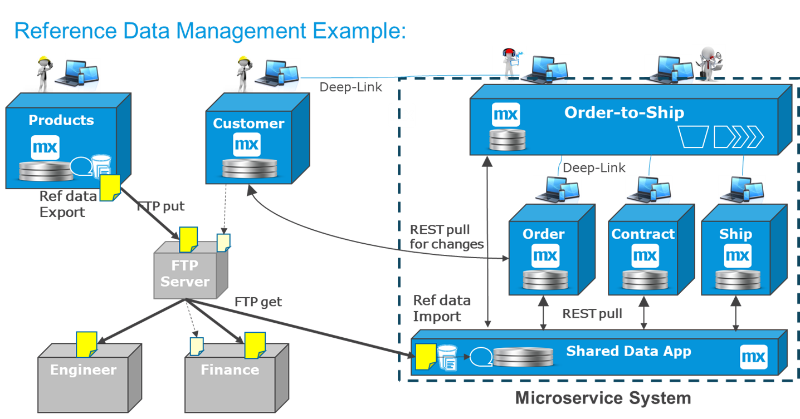
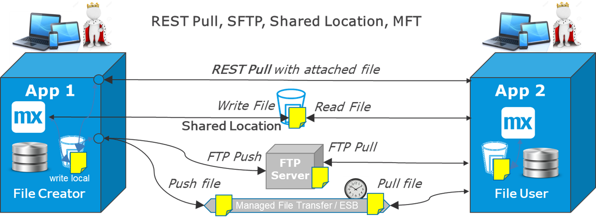
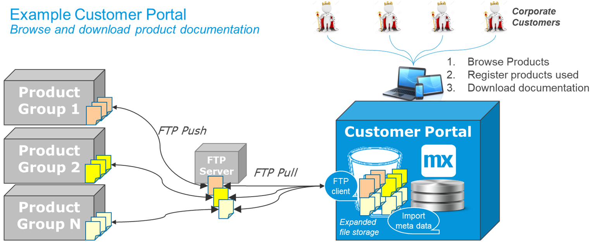

## 1 Introduction

Batch integration is relevant for business processes that are periodic or when a lot of data needs to be transferred. The diagram below illustrates the three main steps involved in batch integration:

1. Extract a set of data (for example, into a file).
2. Move the data.
3. Import the data.

## 2 Using Batch Processing

There are significant reasons and use-cases for when batching processing is a good choice and when it is not.

### 2.1 Reasons to Use Batch Processing

These are the main reasons to go for batch-oriented integration:

* **Periodic business process** – When a business process is periodic, the correct way to process the integration is to work on a snapshot of the data. In that case, batch processing is the best way to work. These are other important considerations:
	* Many financial processes are periodic, such as salary payments, interest calculations, and invoicing.
	* Reference data (for example, products, drivers, employees) should be shared with operational systems only at certain times.
	* Backups and other operational processes are typically done at night.
* **Processing advantage** – There is a processing advantage when working in batch. The initiation of an event or service call has a cost in processing power, so it is much more efficient to extract, move, and import a million records in one go than it is to initiate 1 million separate events or service calls. The advantage becomes relevant at around 50,000 records, and significant above 500,000 records.
* **Night-time processing** – To combine the two reasons above, with batch processing, some heavier processing can be moved to the night to save on CPU cycles during the day. This means you may require a less expensive infrastructure. This can also improve response times for end-users during the day.
* **Decoupling** – Batch integration is decoupled, which means the following factors occur:
	* The export and import can happen at different times. In fact, the import can be done several times if required. 
	* There is a clearly defined file format that has been agreed on. The means that two systems can be very far from and virtually unaware of each other, and they will still integrate well. Often in a Mendix app project, the developer only knows there is a file of reference data they need to import, while the origin of the file may be unclear or irrelevant.

### 2.1 Reasons to Avoid Batch Processing

There are two main reasons not to go for batch-oriented integration: 

* **Real-time processing** – Because we are moving more towards a real-time world, processes that used to be periodic are becoming real-time. For example, invoicing was previously almost always monthly. Nowadays, invoicing is frequently done in real-time, when an order is confirmed or a delivery is completed.
* **Complicated error handling** – Imagine if 5 records out of 1 million fail to import. In that case, there is a need to inform the source about this, or correct the file, or have a human workflow in the destination to manage these errors.

## 3 Reference Data Examples with Mendix

Many organizations use Mendix to manage reference and master data as microservices that each have a functional area of responsibility:

* Reference data that is semi-static (for example, vehicles, drivers, addresses, products, shop opening hours)
* Business intelligence statistical information that is turned into reference data to fine-tune processes
* Master data (for example, customers) that changes in real-time while being used in several processes across the enterprise

There area three typical examples where Mendix plays a role in master and reference data use-cases:

* **Global reference data apps** – These apps typically share data periodically as files. This is because there are many subscribers that need to work on the same reference data set. For example, ordering, engineering, and financing all need to be aware of the same products for the order-to-cash process to work properly.
* **Local shared data apps** – These apps are typical for microservices systems consisting of 3–10 apps, and they manage the import and distribution of reference data within that cluster of apps. Other apps can poll for differences instead of all importing a full set of data. The human workflow can define the shared data and manage issues in import/export. The shared data app can also provide a combined view of data for the rest of the world (for more information, see [Central Data](central-data).
* **Global master data apps** – An example of this type of app is a central customer app. Such apps often need to share both in real-time for operational processes (for details, see [Service Integration](service-integration)) as well as via files (for example, to ERP solutions) to prepare for invoicing later.

This diagram shows an example for managing shared product and customer data across Mendix apps and other systems (such as, engineering and finance systems):

In the diagram's example, you can see the following factors at work:

* New or changed product definitions should only be shared at decisive moments, so the business process is periodic and all three down-stream systems need to have the data at the same time (meaning, this is a perfect case for batch integration with files). New data will only be shared at night, when no ordering occurs, and only some nights when marketing, sales, and engineering agree it can be released. An FTP server (or any other file-transfer management system) acts as a central point of contact for the files.
* A **Customer** master data app is outside in an order-to-cash cluster to serve other areas as well. It can be reached via a deep link to create new customers when required, and this data is transferred almost directly to be able to place orders against it. 
* The order-to-ship process is complex, so it has been broken up into the following microservices:
	* A dashboard for SSO and overviews
	* One separate app for each phase: **Order**, **Contract**, and **Ship**
	* A **Shared Data App** to manage all shared data
* As the **Shared Data App** is importing the product reference data file, it marks all products that change as updated. That is so the other apps can subscribe to those changes via a REST call, thereby minimizing the need for processing and allowing the other apps to be ignorant as to how the product data is distributed globally.

## 4 File Integration and Management {#file-integration}

File integration is important for the following cases:

* Batch integration, as decribed above
* Sharing content files, such as PDFs, photos, images, manuals, brochures, binaries, and 3D models
* Logging and backups

### 4.1 Mendix File Storage

Each Mendix app has a dedicated file storage area, where it writes files to by default. This is also where the Mendix app log file is located by default. The size of this area is large enough to handle most regular file management. Also, when importing a file, it is practical to copy the file to this local area first before processing it.

In rare cases, the file space can be extended by filing a Mendix Support request. This could occur if the purpose of the Mendix app is to help distribute files like manuals, documents, or pictures. For more information, see [Example – Manuals for Product Support](#example) below.

### 4.2 File Transfer Options

The diagram below presents the different options for sharing or transfering files between two apps. In almost all cases, the source app creates the file locally first, after which it is transferred. The exception is when a shared folder location is available, in which case both apps can write and read from the same folder.

These are the five options displayed in the diagram:

* **Source app creates file locally** – The destination app calls the source app with REST or SOAP to get the file as an attachment in a JSON or XML message. This is efficient for files smaller than approximatelly 5–10 MB.
* **Source app writes the file directly in a shared folder** – At the end of the process, the file is renamed to the target name. The destination app will be able to read the file as soon as it is renamed to the agreed name.
* **Move the file via FTP or SFTP** – This requires an FTP server to be available. The source app pushes the file to an FTP server, which stores it locally until one or more subscribers can pick it up using FTP get. For more information, see the [SFTP](https://appstore.home.mendix.com/link/app/107256/) connector available in the Mendix App Store.
* **Special tools or an ESB** – A special tool may be available for more file management solutions, or an ESB can be adapted to handle the transfer. Typically, the source app pushes the file to this solution, which in turn creates a copy per destination in another folder, accessible only to one subscriber each. This managed file transfer (MFT) solution verifies that files are picked up and processed within agreed timeframes, and it can raise alarms when this is not the case.

In larger organizations the file and batch process management can be quite elaborate. There is often a central scheduling solutions that expect files at certain times, and that orchestrates the moving of files and the export and import of the files and any errors that occur in this process.

### 4.3 Example – Manuals for Product Support {#example}

In the example visualized in the diagram below, the customer can browse all products, register usage of specific products, and download information and documentation related to these products. In this case, file management is at the core of the solution.

In this example, you can see the following process at work:

1. The departments that own the product groups will send files with information to the **Customer Portal** (for example, product sheets with metadata, manuals, pictures, and 3D models). Updates are periodic, so batch processing is a good way to handle updates.
2. The Mendix **Customer Portal** app will poll for new product files and move them to the expanded internal file storage area, registering in the database some file metadata, and linking files to products or product groups.
3. The app imports some of the files with product metadata, to be searchable in the app and directly readable.
4. Corporate customers can browse all products and related marketing information. They can also register a list of products that they use, download related manuals and documentation, and receive alerts when documents are updated. PDFs, Excel files, and other common format files can be read directly in the Mendix app's UI.

## 5 Export & Import {#export-import}

Batch processing runs a large set of data at a certain moment. For example, interfaces towards data warehousing (DWH) and business intelligence (BI) typically require a large export of data, and later, a large import of the same data.

This diagram shows the three main steps of batch processing: exporting, moving, and importing a file:

Typically, the extraction happens at a different time from the import. The moving of the file can be done separatelly as well, but often the destination app polls a location for a file. When the file appears, it copies the file and triggers the import.

Users frequently import and export files of various formats with the Mendix Platform, and the level of skills required depends on the format of the file. For unusual file formats, a more technical developer is recommended, while for common formats, these processes are available more or less out of the box.

The most common file format is [CSV](csv) import and export. This also works well with Excel integration. The [Excel Importer](https://appstore.home.mendix.com/link/app/72/) module in the Mendix App Store is very frequently used. When there are text fields in the data, the text can contain a comma, so there should be more complex field separators to be sure it works correctly.

If there is a large amount of data to import, the best practice is to use a process queue to write to. This prevents the entire dataset from being in memory at the same time. For more information, see the section [Using Internal Queues](event-integration#internal-queues) in *Event-Based Integration* as well as the [Export, Import & Batch Processing](export-import-batch) use case.

## 6 ETL, DWH & BI Integration {#int}

ETL tools are used to keep DWH and data lakes updated. They can perform the entire operation of extracting, moving, validating, transforming, and updating the destination. For legacy systems, they can use direct database access or use files as input. When Mendix integrates with ETL or BI, these are the preferred methods:

* Exporting a file for periodic dumps of specific data
* Using OData for more frequent and smaller updates
* Using the Mendix database backup file, if all data with the relations is required

This diagram presents the three most used methods for such a solution, which involve OData, files, or a database backup:

Mendix recommends using either files or OData and to restrict the amount of data that is shared. This also limits dependencies. BI and DWH should have a specific purpose with gathering the data, and minimizing the retrieval to this purpose will create the simplest overall solution.

These are further factors to consider:

* **OData** – OData is positioned to collect smaller data chunks more close to real-time. This is typically useful for BI solutions or business dashboards (for details, see the [Database Integration & OData](service-integration#db-odata) section of *Service Integration*). This requires the BI solution to have a direct link to the app. In addition, if the Mendix data model of the monitored data object changes, it will often require the BI solution to update the retrieval as well.
* **Files** – Files is the most decoupled option to share data with BI, ETL, and DWH. There could be several files with different data and functional IDs that link objects together. If this option is possible, it is recommended.
* **Databse backup** – When a DWH wants almost all the data, when the domain model is complex, or when there are several important many-to-many relations, then a database dump is available as the best option. An ETL solution will be directly depending on the Mendix data model, creating a tight coupling that forces the ETL solution to change with every new Mendix app release. To handle this dependency, ETL solutions have a staging area where raw data is imported, so they can actually adopt even after changes occur, when errors are discovered.

## 7 Summary

Even as the world moves towards real-time, batch integration provides more efficient processing and the ability to move processing to a time of day when the app instance is less busy. It also provides decoupling for business processes that are periodic in nature.

Batch processing is required in almost all enterprises, and Mendix support this very well, with an internal scheduler as well as good export and import functionality. Mendix apps have an internal file storage area and can also move or get files using a central FTP server or another managed file transfer solution available in the company.
