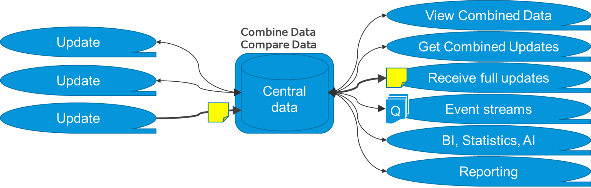
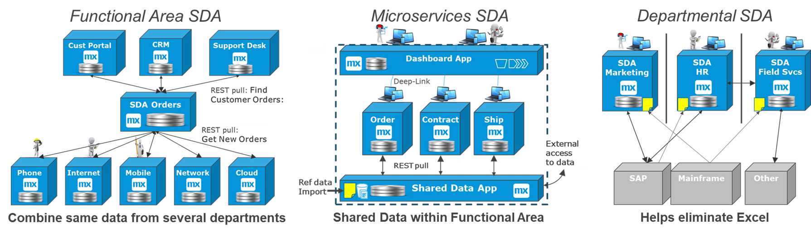
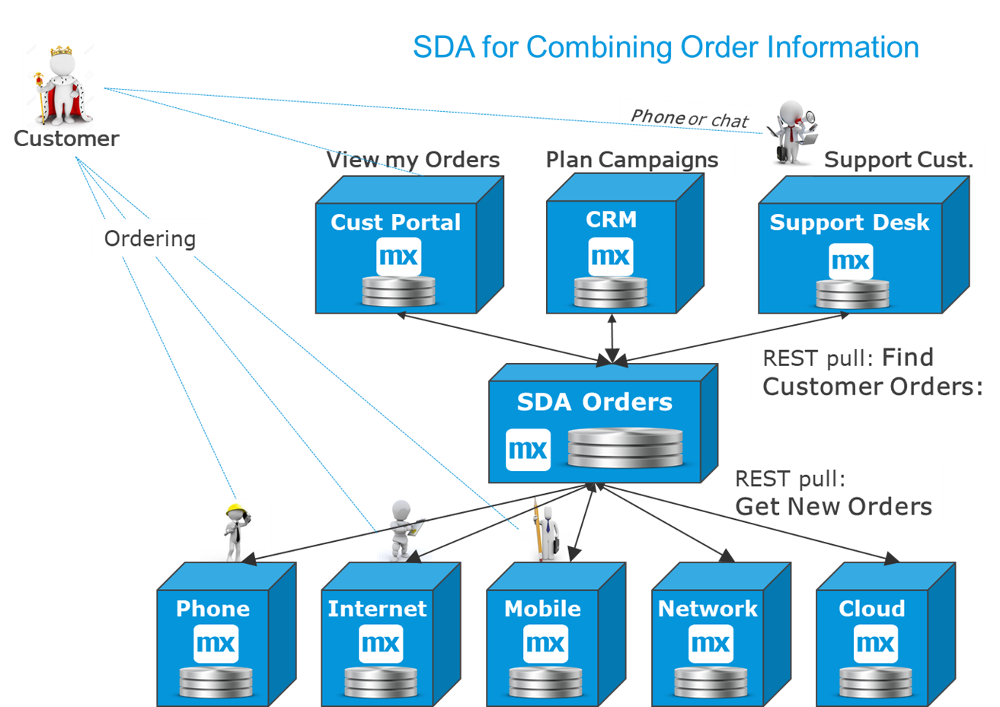
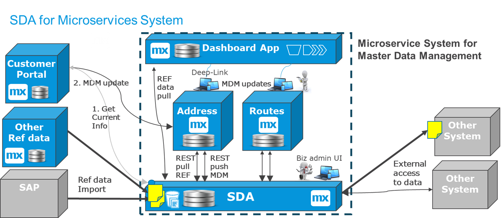
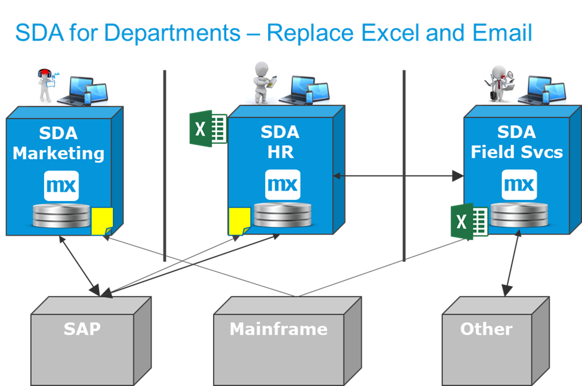
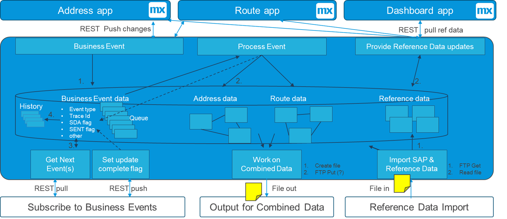
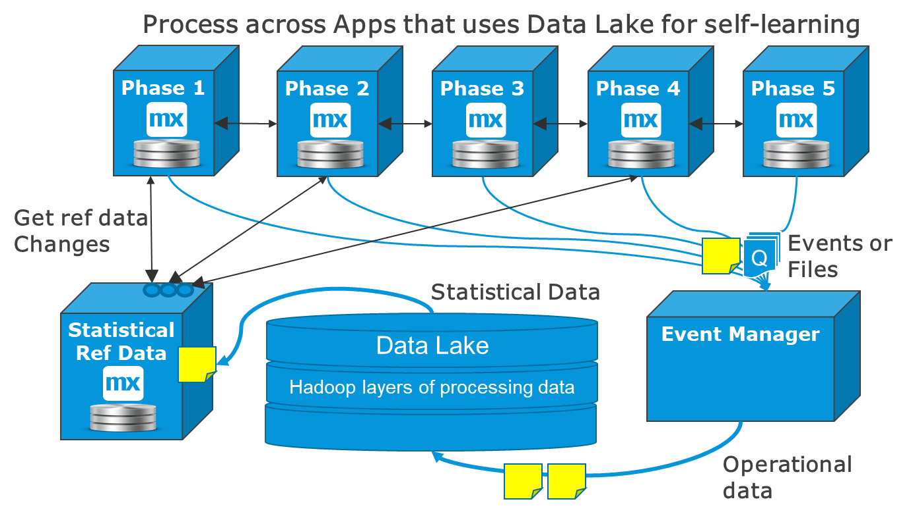

## 1 Introduction

The central data pattern is an integration pattern that stores a combined set of data in order to redistribute it to other systems. It has an API, some logic, a database, and some UX for configuration and error management. This pattern involves a system or a Mendix app who purpose is to facilitate integration solutions that are hard to do as services, events, or files.

Data warehouses (DWH) and data lakes provide an enterprise-scale version this pattern. But even when there is a central DWH, the central data pattern is still useful for small, local, or departmental integration needs. When microservices replace a large monolith, there is often a good reason to have both a dashboard app for login as well as a shared data app (for details, see the [Typical Central Data Patterns](#tcdp) section below).

### 1.1 Using Central Data Integration

The central data pattern reflects the ability to do the following:

* Combine data from many sources and provide it in various formats to other systems
* Compare incoming data with the data that was shared before

This diagram displays some typical ways to use the data:

With a [shared data app](#sda), you can typically do the following:

* View combined data using real-time services
* Poll for combined updates (rather than polling many systems)
* Receive files or batches (for example, of the day’s updates)
* Process the data and streaming a new combination of data on to the next queue or Kafka
* Enable business intelligence and statistics
* Report on all kinds of data (for example, financial, business, and operational)

The basic reason for a central data pattern is that it is better to specialize one app to combine data from different sources and with different formats than to build that logic into several apps that need the combination. 

A small local app could be used to collect orders or tickets from a number of systems and enable searching for orders or tickets globally. For more information, see the [Example – Orders SDA](#example-sda-order) section below.

### 1.2 Typical Central Data Patterns {#tcdp}

These are a few of the main ways the central data pattern is used:

* **Shared data apps (SDA)** – An SDA solution combines data from different processes and is used in operational processes. It is a combination of an operational data store (ODS) and integration app. It usually combines shared data within a microservices system or department, or it may collect the same type of data from several departments.
	* For more information, see the [Shared Data App (SDA)](#sda) section below
* **DWH & data lakes** – A DWH is used for combining all types of data from the entire organization and providing data for statistics, reporting, and business intelligence (BI). Data lakes are an evolution of DWH solutions to use Hadoop-style solutions and provide statistical data to operational systems in order to support self-learning, AI, and the tuning of automated processes.
	* For details, see the [Operational & DWH Data](#owd) section below
* **BI solutions** – BI solutions collect data to provide insight into processes and trends. They can collect bulk data from DWH and data lake solutions, while refining it in real-time with information from Operational apps and systems
	* For more information, see the [Integration to DWH & BI](batch-integration#int) section of *Batch Integration*
* **Extract-transform-load (ETL)** – ETL is usually used for integration towards DWH solutions or for data transition tasks during the go-live of bnew large solutions. ETL solutions are professional integration frameworks, doing the "integration app" part of the SDA at an enterprise level. They compare new data with previous loads, and they are beneficial for very large data volumes and large files. For more information, see the [Integration to DWH & BI](batch-integration#int) section of *Batch Integration*

## 2 Shared Data Apps (SDA) {#sda}

The sections below explain the most important considerations for using an SDA solution.

### 2.1 When to Consider an SDA
 
SDAs can be very useful on the following levels:

* **Functional Area level** – for combining that same type of data (for example, orders from different departments)
* **Microservice system level** – for supporting 3–10 apps that form a system
* **Departmental level** – for supporting important and shared data within a deparment.
* **Referenca data management** – for more information, see [Batch Integration](batch-integration)

The diagram below shows an overview of the first three of these levels:

These are the microservice versions of the central data pattern. Any combinations of data that have a larger scope than what has been described should make use of a central data lake or DWH, which most organizations will already have available. 

If there is already a central DWH and an ETL solution available within your organization, you may wonder why you should use a Mendix SDA. The answer is that local Mendix SDA solutions provide a flexible local alternative with fewer dependencies, because of the following factors:

* Conway's law means that teams will (or should) design systems that align with organizational structures
* Microservice architectures strive for autonomous functional parts 

A Mendix SDA will be part of the microservices landscape, where you break the enterprise problem down into smaller pieces and allow local tribes of Mendix developers to also use the central data integration pattern. These are the advatages of this approach:

* A team can use the same technology and deployment stream, which is organizationally easier to manage
* Building an SDA in low-code means it is easy to build, configure, and maintain
* It is functionally autonomous, becase the scope of the SDA should never become very large

### 2.2 When Not to Create an SDA 

Mendix SDA solutions will not replace an enterprise DWH, compete with Kafka for massive event streams, or compete with ETL for managing massive data files and data transitions. A Mendix SDA will only provide a local flexible option that can actually make DWH and ETL solutions simpler (for example, by collecting data from a functional area before sending it on to enterprise-level aggregation).

For many microservices systems, there is little need to work on a combined data set, or the functional area is very small. In such cases, typically the dashboard app takes responsibility for the reference data import for the cluster, and no SDA is required.

If a business app already has 90% of some combined information, it  makes sense to add the missing 10% and make it act as the SDA, instead of creating another app and copying a lot of data.

If the integration problems can be easily solved without collecting data in an SDA (meaning, end-users are given the combinations of data they need in a snappy UX), then an SDA may also not be needed.

### 2.3 What Does an SDA Do?

These are the typical responsibilities of an SDA:

* Act as a local operational data store and combine data
* Act as an integration app or adapter and provide services, files, or events for external system to retrieve data
* Perform reference data management by importing files with reference data or manually setting look-up values used across a microservices system
* Perform batch processing, export, and import while not disturbing the UX with heavy loads, in turn allowing neighboring microservices to poll the SDA for updates
* Perform exception handling for all the above areas

### 2.4 Example – Orders SDA {#example-sda-order}

In the diagram below, there are many business lines with different ordering systems, and a customer may order products from several different business lines. At the same time, there are three different systems that need to search between the entire set of orders and present overviews of orders across business lines.

In this scenario, the decision was made to specialize a microservice for the following tasks:

* Collecting all relevant orders 
* Providing good views and searches on the total set of orders for various purposes

With this design, you avoid the **Customer Portal**, as the **CRM** and **Support Desk** apps have to integrate with the ordering systems of many different business lines. This is not suitable for ETL or DWH, because you want it to be real-time and flexible with a specific functional scope. It is also not suitable for an ESB, because you are storing data long-term, and you are combining data objects in a relational format in the domain model.

### 2.5 Example - Microservices SDA

This diagram shows a microservices SDA, in this case for a master data management system built using Mendix:

Starting from the top-left corner, you allow the driver end-users to view the **Address** and **Routes** information overviews. You let the SDA provide this service from optimized materialized views, in order to handle a relatively high volume. You also allow end-users to add certain information on top of the address and route information. This will be less frequent, and you will allow these source-data updates to go to the **Address** app in the cluster, where the correct validation is done in real-time.

At the core of the microservices system, there are people working on updating and managing the address and route information. Most of the time short workflows are used, and for every save in the master data apps, the data is pushed to the SDA to keep it up-to-date. When certain workflows are longer (for example, planning a new area), the new data is only submitted to the SDA at the very end of the workflow. This could also be a pull action, but REST push was selected to make sure the SDA is always 100% up-to-date. This also means that the SDA has to be up-and-running for work to be submitted.

The SDA also imports other Reference data from SAP and other sources, comparing with the old data, it sets a flag on all records that changed and allows the other apps to swiftly get those changes via REST pull services. There is also a Business administrator UI on the SDA to manage these flows and any errors that may occur, also manually managing some internal reference data when required.

In turn, reference data flows up from the SDA to the other apps, while master data only flows down toward the SDA. Data flows of the same data type going in two directions area avoided, because those can lead to conflicts.

For all the external systems to access the data, the SDA is the only access point. This off-loads the MDM apps from the external load. It also ensures that the team owning this cluster also owns how the data from **Address** and **Routes** is combined as well as how it is accessed, providing a unified view of the data across the enterprise.

### 2.6 Departmental SDAs

Within many departments of large organizations, there are plenty of systems that hold different parts of the truth. End-users might work in 15 systems over the day, where the integration of data is poor and people use Excel or similar tools to handle  data and processes. 

The Mendix Platform is often used to solve this problem by creating departmental SDAs or portals because of the following factors:

* Mendix provides a secure alternative to Excel sheets for managing business and operational data
* Mendix provides a better way to collaborate across a process than sending emails (with many in CCed recipients)
* Where there are old legacy or ERP systems with data that is hard to reach or change, Mendix makes it possible to extract such data and allow end-users to work on it before sending it on

This diagram presents a schematic view of how departmental portals or SDAs can help make the business management of data much more systematic and professional:

### 2.3 What Does an SDA Store?

The SDA can typically store the following:

* Operational data in a relational data format
* An event stream from a microservices system (as in, a list of transactions in order)
* Imported or locally-created reference data for further processing by the other apps

The relational data can be stored both in a normalized form as well as in a "flattened-out" materialized view that serves a specific purpose (for example, to provide high-volume access to a specific set of frequently requested data).

SDAs can also support a "local" event stream from updates in the microservices system or updates from a set of ordering systems. These can be treated as business events or transactions, and they are often stored in an [internal process queue](event-integration#internal-queues).

This diagram below gives a schematic view of how this can take place, using the example above with **Address** and **Routes** apps as master data management apps that are pushing changes down to the SDA:

The SDA receives business events into one single internal process queue, in order to process them in the same order as they happened. A scheduled process event takes the next event and transforms it into the data model of the SDA, which is very similar to the data model of the **Address** and **Routes** apps, thus minimizing functional errors in this step. Should a functional error still occur, a human workflow is required to solve the issue. This typically only happens at a new release when testing has been insufficient.

Next, the SDA flag is set, and the other systems that subscribe to the same events can start retrieving them from the same queue. When all the subscribers have noted success, the successfully processed messages are moved to a transaction history queue. If transformation is required in the SDA, an additional outbound queue is created for each different event stream.

The lower-middle part of the diagram shows how processing on the entire data set now can be done within an app, directly on the combined dataset in the same domain model. If there was no SDA, this processing may require thousands of service calls to both the **Address** and **Routes** apps, which would consume a lot more CPU and take a lot longer to finish.

The right-side of the diagram shows how the SDA is often used to import reference data and provide it to other apps locally. If the reference data comes as a file with all the data in it, the SDA compares and makes sure to set the update flag only on records that have changed. This makes the impact smaller on other apps that are retrieving the data (for example, via REST services).
	
## 3 Separating Operational Data from Statistical Data {#owd}

It is good to keep operational data flows separate from the statistical data that comes from data lakes and DWH. That is because there are different time requirements and needs for accuracy. 

Making a data lake double as an operational data store does not work well, due to the following factors: 

* There is simply too much data to combine if it is done at the enterprise level
* All the data is collected with different timestamps, so any combination will never show the exact situation at any point in time

### 3.1 Statistical Data in Operational Processes

Data lakes provide a great way to gather statistical and trend-oriented data that can be used in self-learning systems. It is recommended to have a reference data app between any DWH and the direct use of these statistics, in order to avoid direct dependencies from operational systems to the data lake or event warehouse.

This diagram presents how an event manager collects events, which then go to a data lake, which in turn produces statistical data that is fed back into a highly automated delivery process, allowing for savings and fine-tuning of the process:

The example here is about deliveries to homes. Knowing how and when recipients are answering their doors over time one can change the delivery patterns. This is statistical data from the data lake solution that rarely changes, as it is not operational data. The statistical information is first processed by the **Statistical Reference Data** app (belonging to the delivery stream), so that it is suitable for the business rules in the automated apps above.

### 3.2 Enterprise Concerns & Local Concerns

The other reason to keep operational data separate from DWH solutions is that operational processes change often, and different business units need flexibility and autonomy from each other. Even if it seems like two use cases need the same data, they may have very different needs when it comes to data models, functionality, and flexibility.

If different business use cases are difficult to combine using one component, it can be much more effcient to have different SDA microservices covering each with a reasonable scope, in order to retain flexibility and maintainability. 

Data lakes and DWH solutions are large, enterprise-wide, generic, incredibly complex, and quite far from the people that work in the business. This set of attributes makes them inefficient for use in operational processes. The data flows through the system slowly, and it is often enough to update every month in a report. All the business units share the DWH, so changing things takes time. A DWH is in a way a "necessary" monolith.

## 5 Summary

Mendix will not replace the need for DWH solutions, ETL, or high-volume data-streaming platforms. However, in a flexible microservices architecture landscape, there is often a benefit to creating small and local SDAs. This makes integration easier by removing Excel and shadow IT, and by providing an easier, more flexible overall solution to various business problems.
