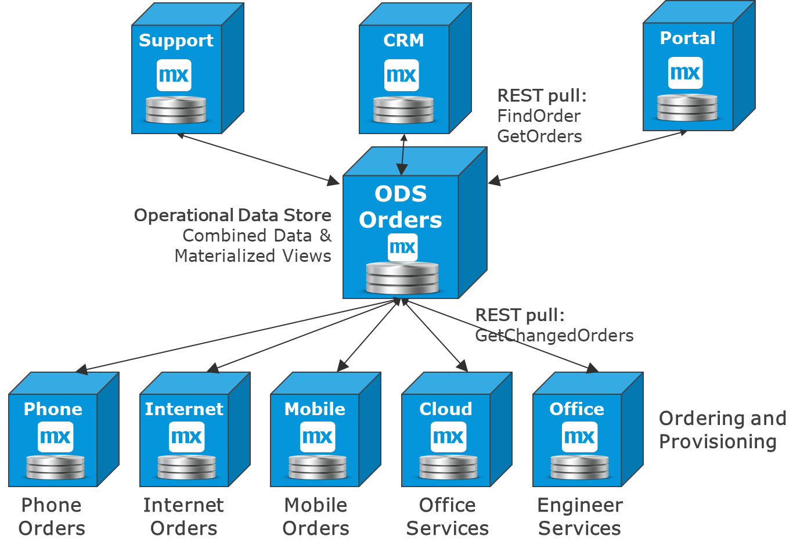

## 1 Introduction

The central data pattern is the integration pattern that stores data in motion. It is called an integration pattern because its purpose is integration from one place to another.

The central data pattern reflects the ability to do the following:

* Combine data from many sources and provide it on in various formats
* Compare new incoming data with the data that was shared before

This diagram displays some typical ways to use the data:

* Viewing combined data using real-time services
* Polling for combined updates (rather than polling many systems)
* Receiving files or batches (for example, of the day’s updates)
* Processing the data and streaming a new combination of data on to the next queue or Kafka
* Business intelligence and statistics that can be used for machine learning and AI
* Reporting of all kinds (for example, financial, business, and operational)

For many scenarios, it is better to specialize a system to handle subscriptions and combine data from different sources with different formats than to build it.

A typical use-case is if a company has 10 business lines with all different ordering systems, but only one single support desk that needs to see them all. A small local app could be used that collects orders or tickets from a number of systems and enables easily searching them. A full data warehouse (DWH) could also be used for enterprise reporting.

## 2 Typical Central Data Patterns

These are a few of the main ways the central data pattern is used:

* **Operational data store (ODS)** – This combines the same type of data from different processes and is used in operational processes
	* For details, see the [Operational Data Stores (ODS)](#ods) section below
* **DWH** – This is used for combining all types of data from the company and providing data for statistics, reporting, and business intelligence (BI)
	* For details, see the [Operational & Data Warehouse Data](#owd) section below
* **Data lakes** – These have been popular recently as a Hadoop-style DWH good for statistics, reporting, and BI
	* Data Lakes should not provide operational data, since the time stamp of combined data may be different
	* For details, see the [Operational & Data Warehouse Data](#owd) section below
* **BI solutions** – These extract data from a DWH or data lake, for example
	* This is often statistical data for management overviews, machine learning, or AI, or it is used to fine-tune processes in smart Mendix apps
	* For more information, see the [Integration to DWH & BI](batch-file-integration#int) section of *Batch File Integration*
* **Extract-transform-load (ETL) solutions** – These are usually used for integration towards DWH solutions
	* They are beneficial for massive data volumes and can compare new data with previous loads 
	* For more information, see the [Integration to DWH & BI](batch-file-integration#int) section of *Batch File Integration*

## 3 Operational Data Stores (ODS)  {#ods}

If the integration layer in the middle stores and combines business data before re-distributing it to other parties, it is a central data integration pattern, often referred to as an ODS.

Mendix apps are often used for ODS solutions, since it is easy to integrate to several disparate systems, store the data, and manage any errors in the integration by creating a human workflow for it.

In this diagram, there are many business lines with different ordering systems, but there are also three different systems that need to search between the entire set of orders and give overviews of the current orders across business lines:

The decision was made to specialize a microservice for the following tasks:

* Collecting all relevant orders 
* Provoiding good views and searches on the total set of orders

ODS solutions are supposed to combine data, but if they try to do too many things, they become slow to change and manage. It is wise to have a limited area of scope for an ODS.

You should create another ODS when it gets difficult to provide flexibility for more than one purpose. For example, an orders ODS can send overview ordering information to a customer ODS, which means they can both evolve autonomously.

## 4 Operational & Data Warehouse Data {#owd}

It is good to keep operational data flows separate from statistical, BI, and DWH data unless you are using statistics or historical data as reference data in operational flows. The only patterns that should provide operational data are the [ODS pattern](#ods) and, in some cases, ETL solutions used operationally.

Data lakes have been popular as an enterprise-wide Hadoop-style DWH solution that attempts to double as an enterprise-wide ODS. However, it is an almost impossible undertaking to make this work nicely. Snapshot-type data used for statistics makes for a slow and unreliable source of operational information.

A DWH per definition does not store operational data. Time-stamp differences in the incoming data and the methods used to merge it means that DWH cannot be used as a reliable data source. However, on the other side of the DWH, you can get statistical data, metrics, reports, and snapshots of previous moments in time that can be used in operational processes to fine-tune them.

An example use case is a home delivery system in which you keep track of whether the recipients are answering their doors over time. You can then decide to change the delivery pattern based on this information. If a recipient is rarely home, that is statistical data from the DWH solution that may rarely change, but it can be used as reference data for routing delivery services. This pattern will evolve more with IoT, and when combined with AI, will be developed into machine-learning patterns.

This diagram presents a number of apps in a process that shares business events with an event manager that knows the status of each process:

The event manager shares all the data with a data lake (or DWH), which processes the data into various data collections. One of those collections is sent to a Mendix app that manages that reference data and provides it back to three of the apps that “learn” from the past results.

## 5 Small ODS & Large DWH

The other reason to keep operational data separate from DWH solutions is that operational processes change often, and different business units need flexibility and autonomy from each other. Even if it seems like two use cases need the same data, they may have very different needs when it comes to data models and functionality.

If different use cases become difficult to easily combine, it may be better to have different ODS microservices covering each a reasonable scope in order to retain flexibility and maintainability. ODS solutions are better as microservices than as behemoths.

However, data lakes and DWH solutions are large, enterprise-wide, generic, incredibly complex, and quite far from the people that work in the business. This set of attributes makes them inefficient for use in operational processes. The data flows through the system slowly, and it is often enough to update every month in a report. All the business units share the DWH, so changing things takes time. A DWH is in a way a "necessary" monolith.

## 6 Mendix for ODS

An ODS solution is similar to a legacy adapter or an integration app, in that it can collect and store data from one or more systems and provide the data in a format that is easier to use or that is combined with data from other places.

Mendix is a good choice for ODS solutions because of its strong integration capabilities, UX for managing data and errors, and REST services that are easy to create and maintain for providing the data. There is no Mendix customer that has tried to use Mendix for DWH, because that is for other technologies to handle.
