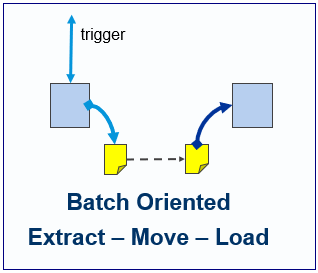
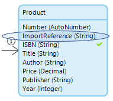
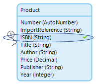
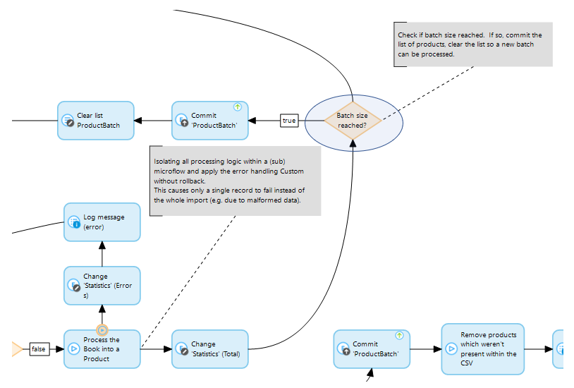
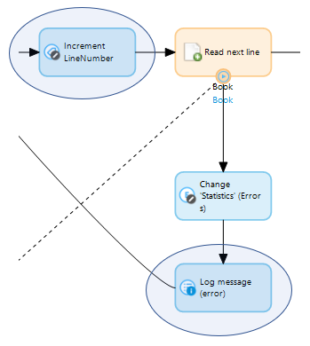

{}[**Needs thorough review**]{}

{}[**Structure is unclear for where this doc is located - what is exact relation to parent doc?**]{}

## 1 Introduction

{}[**ADD LINK WHEN AVAILABLE BELOW AND UPDATE TEXT AS NECESSARY**]{}

This integration pattern has been implemented in an App Store module that can be downloaded from the **Best Practices** section as **Integration Pattern: File Import (CSV)**.

Importing by file using the CSV format is widely used to import larger volumes of reference data. It is both a simple and popular format to exchange data between systems, and it is often also supported by (old) legacy systems.

{}[**EXPLAIN IMAGE; UX-UPDATE IMAGE**]{}

### 1.1 When & Why to Use This Case

The following conditions should be considered for using CSV as a format for transferring data:

* When the structure is relatively flat and can be formatted as a table
* 	For nested structures, XML can be easier (but as a workaround, nested structures can be assembled as multiple CSV files)
* If there is a large volume of data (for example, 1M+ records)
* It is supported by a broad range of systems (from Excel, Access to

{}[**LAST SENTENCE IS INCOMPLETE**]{}

### 1.2 How We Built This Project

{}[**UNCLEAR: "project" = "App Store module"? AND WHAT IS THE "reference case"?**]{}

The project is fully self-contained. It contains all the tests and data, and it should be ready to use.

The reference case shows the following scenario’s:

{}[**UNCLEAR: "having"?**]{}

* Import having create or update
* Import having create, update, or delete

## 2 Do’s

* Keep track of which records are imported in your current run
	* This way, it is easy to determine which records have been deleted since the previous import
	* Reference implementation: **Product.ImportReference**, which is set to a string determined at the beginning of an import

	

* Use an intermediate format (non-persistent entity) to read lines from the CSV
	* This introduces a loose coupling between the read structure and the functional domain model
	* Reference implementation: the **Book** entity reflects the CSV structure while the **Product** entity is entity used in the application’s logic

	

* Use a functional key to uniquely identify an object
	* This can be used to determine if an object is new or should be updated
	* Reference implementation: the attribute **Product.ISBN** is used as the functional key

	

* Apply unique validation on the functional key

  * Reference implementation: the attribute **Product.ISBN** has unique validation
* Commit the imported lines in batches and find the correct batch size for example, 20,000)
	* This optimizes database activity and memory consumption
	* Reference implementation: the **CSV_ImportBooks** microflow contains a list of    Products **(ProductBatch**) that will be committed and cleared for each 20,000 imported Products

	

* Print the progression in the log.
	* Reference implementation: within the `CSV_\*` microflows, progression is printed in the logs every 20,000 lines

	

* In case of an error, logging should contain information to obtain the invalid source data (for example, a line number)
	* This helps in troubleshooting data quality or processing issues
	* Reference implementation: within the `CSV_\*` microflows, the line number is     incremented after each read line, and an error is printed if processing caused an error

	
