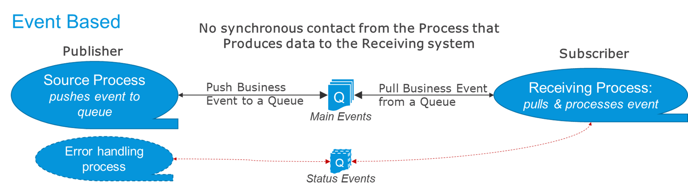
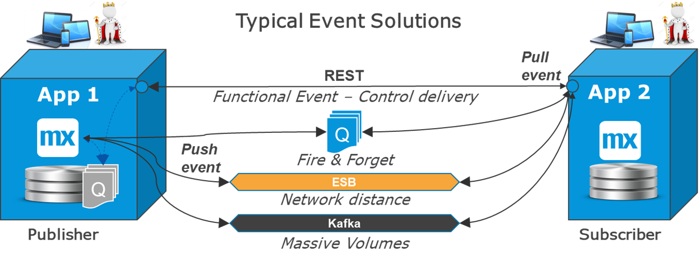
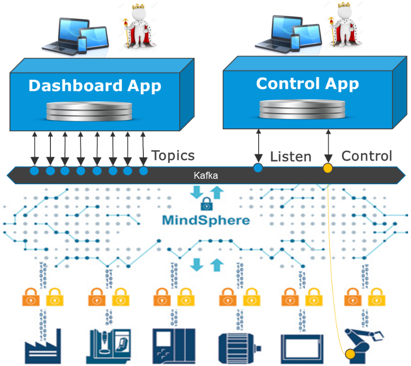

## 1 Introduction

At the moment, event-driven architectures are making their return into the mainstream of integration. This follows an increased interest in and focus on, for example, IoT solutions, distributed networks of actors, and central monitoring. Several solution providers are promoting new paradigms for managing large, distributed, high-volume event driven architectures.

The main characteristic for event-driven trends is that the process that produces events or data does not communicate directly to the target system. Rather, it creates an “event” message that is put on a queue for asynchronous delivery. This means that the triggering process will not know directly if the message arrives or if there were errors in the delivery.

The diagram below presents the basic characteristic of most event-based solutions, which is that the process creating the event is not directly connected to the process that uses it:

## 2 Types of Event-Driven Integration

There are many types of event-driven integration. The main differentiators are functional or infrastructure-oriented, which determines the most appropriate queue management.

This below shows the six queuing options available when integrating with Mendix: 

The internal queues and input app require only Mendix technology, while external queues, ESBs, and Kafka require an adapter and external infrastructure.

The queue that is used depends on the situation, and Mendix supports all the options:

* **Internal Mendix queue inside the sending app** – This is the simplest solution. It allows for the sending process in app 1 to finish, even if the target system is not up. A synchronous call is used to pick up events from the source app.
* **Internal Mendix queue in the receiving app** –  This allows for the quick reception of many messages without processing them all at once. Accordingly, this means that peaks in volume have less effect on the receiving app.
* **For very high volumes, a Mendix input app can be used as a queue** – This liberates the receiving app from the peak loads in an even better way. Additionally, it allows the receiving app to be redeployed easily without effecting the message flow.
* **External queues like Rabbit MQ can be used in distributed architectures** – A queue management system handles transport over network borders and longer distances, but it requires an extra element of maintenance.
* **ESB and message brokers can act as queues with additional mapping and routing** – ESBs also do synchronous calls and can push messages forward. If there is an ESB available and it is centrally recommended, then it is a good option.
* **Kafka** – This queue option is the newest and originated at LinkedIn to distribute user posts between nodes and collect user metrics. For distributed, high-volume, resilient, many-to-many solutions, Kafka is the clear choice.

## 3 Reasons to Go Event-Driven

Always consider a synchronous request–reply as the standard option for integration, because it is the simplest and most robust way to integrate when you want to make sure that the data or event arrives safely in the destination. This means that it is easier to think about and easier to manage errors that way.

There are some clear cases where event-driven integration is preferred:

* If it is truly a one-way communication (meaning, the source of the data/event expects no answer back, and the destination always accepts all messages)
* There is a very high volume (as in, > 1000 messages per second could mean that request reply becomes less efficient)
* You can afford to lose a message or two (as occurs with stock tickers, IoT, and logging messages), thus you are looking for trends or having the next message overwrite the previous one
* Geographical distances or network issues makes direct communication impossible or unstable
	* If guaranteed delivery is required in this case, it is recommended to use a state engine in the middle, or use an asynchronous request–reply (as in, have a two-way event-driven communication)
* Where there are many publishers and many subscribers, that should be as fast as possible in the same shape on hundreds of servers around the world or employ user metrics in the same use case (LinkedIn created Kafka to solve this problem)

{}[**ABOVE LINE ABOUT "user metrics" IS UNCLEAR**]{}

In the diagram below, some typical event use cases are shown. Note that Kafka is also a great choice for fire-and-forget, and network distances and ESBs can also handle large volumes.

The internal queue provides the best control over delivery of business events in a one-to-one situation, because it only has two parts involved. However, this is not suited for massive volumes or if the two systems are hard to connect via a network.

## 4 Event Streams, IoT, Logging & Metrics

### 4.1 One-Way Communication

The key to event-streams is that they (often) only flow in one direction. A device leaving metrics in an IoT system does not expect an immediate answer to the data it ships. Additionally, there could be very many devices that are geographically distributed and shipping a lot of data. Request–reply is neither needed nor practical for inbound IoT, but for commanding a drone or other device, for example, it is highly recommended.

IoT, AI, and big-data integration is only the beginning of an expected explosion of new IT that will be built alongside the current IT landscape. In the coming years, Mendix and Siemens will invest heavily in this area.

### 4.2 IoT, MindSphere, Kafka

IoT, Kafka, and other event-based architecture will play an important role in the coming years. Mendix is working to incorporate Kafka into the platform, and a seamless integration with MindSphere was recently set up.

Mendix will in these cases usually work as the dashboard for event streams and sometimes as the control center for devices and other connected items.

This diagram gives a schematic view of a potential Mendix integration where one app provides a dashboard and the other one is used to control a robot:

This integration is many-to-many and largely event-driven. Using Kafka can be a relevant option if the Mendix app is located far away from the MindSphere implementation.

## 5 State Engines & Event Managers

Some processes are very high-volume and 99% straight-through processing and involve systemsm, factories, or teams that are far apart geographically. Sometimes, the real world does not exactly resemble the IT image, there are many exceptions, and objects may be moved back or forward in the process. As an example, consider a supply-chain or industrial process where orders, cases, or packages flow through a number of stages.

When one or more of the above factors are true, it is common to avoid a REST pull (which is functionally the most simple) or process orchestration and start considering a queuing system or event-streaming service like Kafka.

When one stage of the process finishes, the system pushes the event to a queue of some kind (for more information, see [Using Queues with Mendix](#queues) below). The systems are now decoupled, but what is lost in these situations is the overview of where each order or case is located:

* The phase-1 system is unaware if the phase-2 system actually received the message
* The phase-2 system is not aware that phase-1 system sent a message if the message is lost on the way.

For example, packages sent by a postal service sometimes take longer than anticipated to be delivered, and the sender needs to find out where the package is or even alert the customer that the package is delayed.

In such a situation, there is almost always an event manager that collects events from a large number of systems, devices, and scanners that are part of the process and then puts together what the status is. This is the basis for the “track & trace” functionality and allows for raising alerts when certain conditions occur.

## 6 Using Queues with Mendix {#queues}

Mendix itself does not currently provide an external queue management system. However, many users use internal queues, which works just as well or even better for most event-based business application solutions.

An advantage with internal Mendix queues is that there is only one technology. There is no external place to look for errors, so it is easier to manage. In addition, there is no external dependency when deploying, so it can be easier to maintain.

In the App Store, there is an [Process Queue](https://appstore.home.mendix.com/link/app/393/) module available that is used by many customers both as an out-bound queue and an inbound queue. The advantage of this is that there is no external technology to deploy and manage. The limitation with internal queues is that, in the end, a request–reply or file system is required to move the event. This is only a limitation if there are large geographical distances or many subscribers and publishers.

There are plans to provide Kafka as a queueing system for Mendix “under the hood." This is anticipated to be a great addition in the IoT sector and in DevOps management.

Many customers also use Mendix with external queues like Rabbit MQ, IBM MQ, and HornetQ. In the Mendix App Store, there are connectors to most standard queue managers on the market. A limitation can be the queue size or the time-to live, which is often limited. In really high-volume situations, customers can use a Mendix input app as a queue, which would have almost indefinite depth and no limits on time-to-live.

This is a summary regarding queues for Mendix users:s

* Mendix supports most available queue management systems
* Most Mendix projects use synchronous interfaces with an update-flag or an internal Mendix process queue for event-driven handling
* If a company has a message standard like ESB or external queues, Mendix connects easily with these systems (sometimes by using an module from the Mendix App store)
* With IoT, 5G, and increased measurements and metrics within IT, Mendix sees Kafka as an important technology for high-volume, many-to-many event-stream processing, and there is already a Mendix [Kafka connector](https://appstore.home.mendix.com/link/app/67994/) available in the App store
