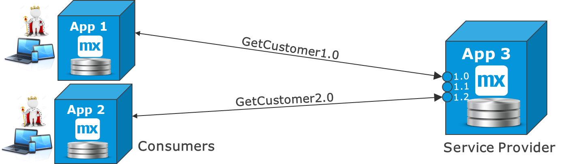
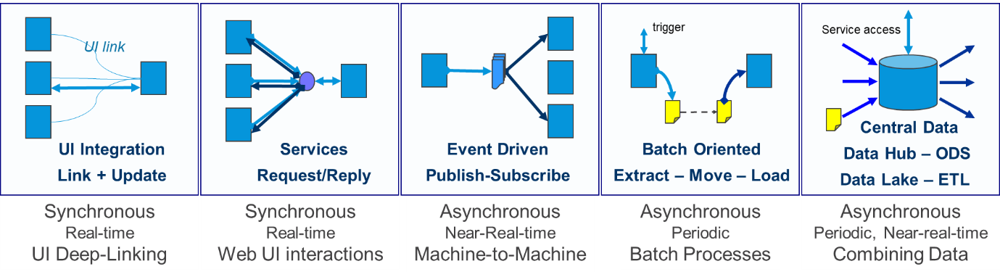

## 1 Introduction

Integration is something you will always need, but it is often the most difficult part of implementations. This is partly because the variation in patterns is so large, and partly because there are unavoidable dependencies on other components and teams (who may not be able to easily help with the integration).

## 2 Dependencies

Integration means dependencies, and we have to learn to live with them. The sections below describe some common dependencies and scenarios.

### 2.1 Team Dependencies

Even in a seemingly fully decoupled situation where an app is supposed to receive a file and import it, it could happen that because you are implementing a new business function, there is a field you need that is not in that file. That means you are dependent on another team to make an update in the file export program.

### 2.2 Good Services for the Purpose & Avoiding Loops

In another scenario, you want to show which customers are impacted when a ship with hundreds of containers is stranded in a port. There are services providing the right data, but they are not good for your purpose.

If you have to retrieve all the containers, call a separate service for each of them that will give you the shipment, and then call another service for each shipment to find the company that ordered it, your system will not perform well.

Ideally, you should ask the sub-system to create a new service optimized for this new business function. If that system is old and impossible to touch, it could make sense to create a new microservice/integration dashboard app that has the single purpose of providing this data. This app will import data from the source systems and keep it up to date by polling for changes. It will be a simle app for the business to use that will make real-time calls to the integration app and provide sub-second responses.

### 2.3 Scoping Integration Early & Implementing Late

Because integration is an external dependency, it makes sense to scope out the required integration early. This will allow for teams to have the maximum time to provide updated services or files before the go-live date. While waiting, users can use mock services and/or files, and then connect to the final version towards the end of the project.

### 2.4 Request-Reply Decoupling

Decoupling for real-time request-reply interfaces just means there is a point in the middle that is forwarding requests, so the systems are still not independent. Both the service provider and consumer must be up and running for the interface to work.

### 2.6 Asynchronous Decoupling

Decoupling for asynchronous interfaces or files is a clearer scenario. This is because one side of the interface finalizes its work at one time and the other system receives information or data later.

### 2.7 Functional Dependencies

{}[**UNCLEAR WHAT "both cases above" EXACTLY REFERS TO BELOW - PLEASE CLARIFY**]{}

However, in both cases above, there is a functional dependency that cannot be removed and that you have to worked with through new and more frequent releases of other apps. If changing a file format or message format, every user using that service or file must be informed.

### 2.8 Service Versioning 

The standard way to handle service versioning is via the following steps:

1. Provide two separate endpoints for each service version.
2. Preferably, insert the service version in the service endpoint name (so that users are not mistaken when using it).
3. Allow consumers to migrate within a certain time limit.

{}[**DIAGRAM NEEDS EXPLANATION?**]{}

### 2.9 Consumer-Oriented Services

The best practice is to *not* make services that are too large and generic. This will help in security and limiting dependencies, because each app will get a service adequate for what it needs. Not more and not less.

## 3 Minimize Integration

The overall solution of one-to-many apps working together should always be designed to include the functional components and interfaces that require the least integration. In turn, this means the solution design should include the least complicated integration.

That will make the overall solution easier to build and maintain, and it will simplify the dependencies between apps. This means that even deciding which microservices and apps to build should incorporate integration analysis.

### 3.1 Learn to Work with Dependencies

Apps working together are dependent on each other – that is part of the business process and cannot be avoided. Trying to eliminate a functional dependency between two apps via a technical solution is not recommended, because that will usually create other functional issues with more complex error-handling. 

In an example use case, you are sending data from app A to app B. You may put these apps on a queue in between in an asynchronous event, which would seem to eliminate an online dependency from a synchronous request-reply. But in fact, the error-handling will become  more difficult, since neither app will be aware of the entire travel path of the event. Furthermore, if something goes wrong in the middle of the path, nobody is properly notified. A better solution is often to poll from app B to app A and get all recently updated records. The app that needs the data is in control of the entire interface, and error-handling is confined to one single place.

In this use case, the development dependency is almost eliminated. However, the runtime situation is less optimal with the events than with request-reply. 

Still, there are many use cases when events make more sense. For example, in real event streams from logging or metrics, the data should only flow one way, and a message can be lost without breaking the business.

There are also technical reasons to go for events. For example, in situations with very high volume, distributed infrastructure, poor network connectivity, or many-to-many situations, events should be considered. To guarantee delivery, you can make asynchronous request-replies, or use a state/process engine to monitor all the events in a large supply chain process.

### 3.2 Keep It Simple

Event-driven integration will increase drastically in the future. For example, LinkedIn is already using Kafka to distribute posts, metrics, and user statistics. Siemens and the rest of the world are bracing for the era of IoT, when almost all devices will be connected.

But this event-driven trend does not change what already works well for normal business apps. A regular app developer who is integrating a few systems for regular business processes should keep it as simple as possible.

That usually means implementing request-reply using, for example, REST over Http(s). This allows for control in case of the non-delivery of information or events, which should be managed for normal business processes.

## 4 Overall Recommendations

Apps should act as actors in a business process. They typically do different things, and often they have different views of the data.

In an example scenario where a customer portal, sales funnel, support, and operations all have product and customer data, they will likely have very different views of the data. This is good, because they specialize in their specific tasks. When the specialization is local, you should allow for smaller interfaces, and thereby more autonomous services.

Here are some basic recommendations that Mendix endorses:

* Seek the overall solution that minimizes integration, because integration is complexity and it creates dependencies in releases and operations
* Do not start from the solution – instead, think functionally first, define what is really needed, and consider more than one technical solution option
* Use explicit contracts that only transfer the data required, which will make dependencies smaller and shelter apps from each other’s data models
* Use request-reply when possible for easier error-handling 
* Do not be afraid of copying data from one app to another, because that will increase processing speed and remove online dependencies – but, you should only copy the data that is required, to limit dependencies
* Consider consumer-specific contracts if a service is not truly generic and stable, because they augment autonomy and flexibility in releases

Continue reading about specific scenarios for integration in [Integration Examples](integration-examples).

## 5 Thinking *Functionally* First {#functionally}

The most important thing for good solutions is to choose the right integration option from a lot of possibilities. These best practices will present an overview of integration methods and typical use cases. The first best practice is to have an open mind regarding integration requirements. This means thinking about what the integration really needs to accomplish and consider more than one option for the solution.

In the days of SOA layers, a central ESB would take care of a lot of integration functionality, such as transformation, routing, re-tries, queueing, and even combining services. In the modern era of microservices, you should aim for "dumb pipes and smart endpoints," which means you should almost always put transformation into the app itself. This also means that within a close cluster of apps, you should do all the integration directly, leaving for larger enterprises a thin API management layer or a message broker for communications between departments, networks, and geographies.

In turn, this means interface functionality starts inside one app and ends inside another system, so a Mendix developer needs to think through the entire interaction functionally and technically. The best practice is to think functionally first. Then, the different technical options should be compared to see which one has the fewest errors to manage and is the easiest to maintain through separate deployments of the apps being integrated.

For example, a data replication can be identified as functionally asynchonous, meaning, the process creating the business event with data does not have to be directly aware when the second app receives the information. In this case, the simplest and most stable implementation is to use the [Process Queue](https://appstore.home.mendix.com/link/app/393/) module available from the Mendix App Store in the first app. Then, you would implement a synchronous REST call from the second app to the first app, picking up the next message.

## 6 Best Practices for Integration Design

* Think before you integrate. There is a chance that a simpler approach can make the app a lot easier to build, test, deploy and manage in production.
* List all the planned integration early, and maintain the list through the project.
* Think about how you can make the overall integration simple (for example, by choosing the right apps or microservices). Integration that is too much and too complex is a sign that apps should be merged or that the functional division is sub-optimal.
* Start addressing external teams for integration dependencies early. If the other teams need to make changes to make your app work, those needs to be identified immediately.
* If there are existing external services, make sure they are adequate. For example, you should avoid all types of loops on services, because they tend to make apps slow. If your source app can collect information internally with SQL, that is more efficient and the integration will be faster. 
* Design the integration well. Consider what triggers the interface, who needs what data and when, and whether you can cache the data (by storing a local copy).
* Plan for what functional errors can occur and how to manage them.
* Consider how to minimize the overall integration complexity.
* Analyze which integration use case applies and which technical options are available. Use these [Integration](integration-overview) Best Practices as references!
* Make a conscious choice about why one method is chosen over another.

## 7 Basic Solution Categories

For most of the integration related to Mendix, there are five basic solution categories that are almost always used. Sometimes just one is used, and sometimes a combination is used:

* [Service Integration](service-integration) – This is otherwise known as remote procedure call (RPC) integration. This category uses request and reply, and it almost always synchronous. The request-reply interfaces with REST and SOAP. There is also database integration with OData and SQL, business event and process integration, process orchestration, integration apps, and distributed ESBs.
* [UI Integration](ui-integration) – This solution category includes, for example, using a deep link from the UI of one app to open the UI of another app (either in the same browser tab or another tab). It also includes website, content management system, and content delivery network integration.
* [Event-Based Integration](event-integration) – This category usually does not have a response, and it is used to distribute data at large scales or large distances, or simply distribute data in a decoupled way. Event-driven integration can involve IoT, metrics, and social media, as well as state engines and event management.
* [Batch Integration](batch-integration) – This category includes exporting, moving, and importing files as well as file integration.
* [Central Data](central-data) – This category uses a pattern where data is landed and combined in a central place before it is distributed. This could be, for example, an operational data store (ODS); extract, transform, load (ETL); business intelligence (BI); or data lake solution.
* [Integration Layers](integration-layers) – This category involves ESB, internal and external API management, and other gateways.

## 8 Overview of Use Cases & Solution Options

Plotting functional use cases against basic methods of integration allows you to see there are several common options available. That is good, because integration needs to be flexible in a solution for the architect to select the best option for a specific situation. 

For example, you may choose not to change an old system, which leads you to choose another option than you would if you were building two new apps. This means that you may choose the less ideal way to integrate in order not to change an old system. In the scenario that you were building two new apps, you would make another choice.

As another example, when integrating to SaaS solutions and older systems, there may only be one option available. Such a scenario will determine which integration to use, rather than these guidelines. 

The table below presents use cases that you can reference  for more detail. The table uses the following symbols:

| Symbol | Meaning |
| --- | --- |
|  | Indicates the common or preferred use of the method. In some of cases (for example, "Integration with IoT solutions"), the solution will require several methods, so several of these symbols are used. |
|  | Indicates possible use in some cases. |

| Use Case | UI Integration | RPC / Services | Events / Queues | Export, Import, Batch | Central Data |
| --- | --- | --- | --- | --- | --- |
| SSO, AD & Identity integration |  |  | | | |
| Import & Distribute Reference Data | |  |  |  |  |
| View & Search Data in Another System  |  |  | | | |
| Use & Refer to Data in Another System | |  | | |  |
| [Process Int.](process-integration) (cont. workflow) |  |  |  | | |
| [Export, Import & Batch Processing](export-import-batch) | |  |  |  |  |
| Update Data in Master App |  |  |  | | |
| Distribute Master & Transactional Data | |  |  |  |  |
| Int. with BI & Reporting | |  |  |  |  |
| Mobile Int. & Offline | |  |  | | |
| CMS & CDN Int. |  |  | | | |
| Process Orch. & State Engines | |  |  | |  |
| Int. with Ops & Monitoring |  |  |  |  |  |
| Int. with IoT Solutions | |  |  |  |  |
| Int. with AI & Machine Learning | |  |  | |  |

For more details, see [Integration Examples](integration-examples).
